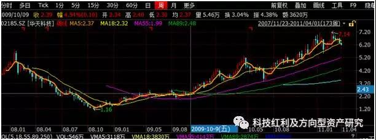
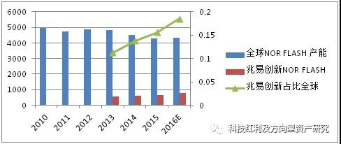
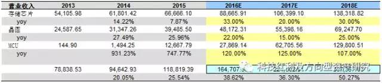

中国半导体产业的思考

《随笔：中国半导体产业的思考》系列报告，是一个独立自主、完整、开放、兼容的对产业之研究思想、研究方法的思考，也是**对于全球和中国半导体产业发展历史、现状、未来的总结、归纳、分析和趋势预判等的综合体现**。

随笔的研究思想来源于”科技红利”，有效研发投入、研发转换系数、压强系数、科技企业扩张的路径等等都体现于《科技红利大时代》。
<!-- TOC -->

- [【1】本轮涨价开启8年一遇的景气周期](#1本轮涨价开启8年一遇的景气周期)
    - [1、第一张图：半导体硅片需求和供给的2016-2017年剪刀差](#1第一张图半导体硅片需求和供给的2016-2017年剪刀差)
    - [2、第二张图：半导体硅片价格2016年筑底回升](#2第二张图半导体硅片价格2016年筑底回升)
    - [3、硅片涨价初期为啥晶圆制造前端环节最先受益，2009-2011年的半导体小阳春启示](#3硅片涨价初期为啥晶圆制造前端环节最先受益2009-2011年的半导体小阳春启示)
    - [4、涨价！开启行业8年一遇的景气周期](#4涨价开启行业8年一遇的景气周期)
- [【2】涨价谁最受益?谁受损?](#2涨价谁最受益谁受损)
    - [1、国家战略：中国大陆12寸半导体晶圆大扩张，刺激硅片需求和供给2016-2017剪刀差开口持续扩大](#1国家战略中国大陆12寸半导体晶圆大扩张刺激硅片需求和供给2016-2017剪刀差开口持续扩大)
    - [2、回答投资者几个提问，为啥2017年投资半导体前端制造环节，2018年投资后端制造?](#2回答投资者几个提问为啥2017年投资半导体前端制造环节2018年投资后端制造)
    - [3、半导体硅片涨价受益品种传导路径](#3半导体硅片涨价受益品种传导路径)
    - [4、半导体硅片涨价受益品种，看好存储器、晶圆前端制造、易耗品，回避消费级芯片](#4半导体硅片涨价受益品种看好存储器晶圆前端制造易耗品回避消费级芯片)
- [【3】存储器是涨价最大赢家](#3存储器是涨价最大赢家)
- [【4】买在当下！兆易创新！](#4买在当下兆易创新)
- [【5】痛则通之！2017年最确定的投资机会就是存储器](#5痛则通之2017年最确定的投资机会就是存储器)
- [【6】布局一季报](#6布局一季报)
- [【7】涨价！趋势的力量](#7涨价趋势的力量)
- [【8】涨价趋势第一弹，兆易创新年报全面解析，超预期，亮点多多](#8涨价趋势第一弹兆易创新年报全面解析超预期亮点多多)
- [【9】半导体Super Cycle和硅含量提升驱使 涨价浪潮蔓延 从存储器到被动元器件](#9半导体super-cycle和硅含量提升驱使-涨价浪潮蔓延-从存储器到被动元器件)
- [【10】从蓝思科技到兆易创新](#10从蓝思科技到兆易创新)
- [【11】兆易创新龙抬头、全球存储Q1全面超产业预期！](#11兆易创新龙抬头全球存储q1全面超产业预期)
- [【12】数据！数据！半导体super cycle Q2继续高歌猛进](#12数据数据半导体super-cycle-q2继续高歌猛进)
- [【13】Q2旺季准备期=硅片缺口创历史+存储芯片配销模式延续](#13q2旺季准备期硅片缺口创历史存储芯片配销模式延续)
- [【14】面对涨价：兆易创新>旺宏>华邦电](#14面对涨价兆易创新旺宏华邦电)
- [【15】两岸最夯细分产业-NOR FLASH，供需缺口继续加速放大](#15两岸最夯细分产业-nor-flash供需缺口继续加速放大)
- [【16】下一个方向！2017-2020年第四次全球半导体硅含量提升](#16下一个方向2017-2020年第四次全球半导体硅含量提升)
- [【17】全球半导体格局大变迁 存储器或将取代逻辑 占比全球第一](#17全球半导体格局大变迁-存储器或将取代逻辑-占比全球第一)
- [【18】预付款+配给制度，剪刀差缺口到2020年](#18预付款配给制度剪刀差缺口到2020年)
- [【19】传导图，势不可挡](#19传导图势不可挡)
- [【20】2018年存储高景气持续，编码型存储器>DRAM>NAND](#202018年存储高景气持续编码型存储器dramnand)
    - [【21】超级周期 愈演愈烈](#21超级周期-愈演愈烈)
    - [【22】18Q1存储淡季不淡，编码型与DRAM全年续旺可期](#2218q1存储淡季不淡编码型与dram全年续旺可期)
    - [【23】物联网爆发之核芯——MCU 存储模块（1）](#23物联网爆发之核芯mcu-存储模块1)
    - [【24】物联网爆发之核芯——MCU+存储模块（2）](#24物联网爆发之核芯mcu存储模块2)
    - [【25】18Q1季报进一步瞻显随笔核心逻辑](#2518q1季报进一步瞻显随笔核心逻辑)
    - [【26】第二次大投入快速推进](#26第二次大投入快速推进)
    - [【27】中国芯的黄金买点](#27中国芯的黄金买点)
    - [【28】NOR FLASH传统市场之V型反转（1）](#28nor-flash传统市场之v型反转1)
    - [【29】NOR FLASH传统市场之V型反转（2）](#29nor-flash传统市场之v型反转2)
    - [【30】台湾省产业分析 存储器Vs消费级  晶圆前端Vs后端](#30台湾省产业分析-存储器vs消费级--晶圆前端vs后端)
    - [【31】亚马逊介入交换机，网络变革Vs新赛道](#31亚马逊介入交换机网络变革vs新赛道)
    - [【32】物联网之智能零售0-1崛起](#32物联网之智能零售0-1崛起)
    - [【33】中国大陆是主推力，存储器芯片是主抓手](#33中国大陆是主推力存储器芯片是主抓手)
    - [【34】物联网之最大应用领域之一智慧工厂的崛起](#34物联网之最大应用领域之一智慧工厂的崛起)
    - [【35】寻找中国芯之细分龙头](#35寻找中国芯之细分龙头)
    - [【36】18Q2存储器淡季不淡，Super Cycle进行时](#3618q2存储器淡季不淡super-cycle进行时)
    - [【37】AI提升生态圈之硅含量](#37ai提升生态圈之硅含量)
    - [【38】现金流与硅周期](#38现金流与硅周期)
    - [【39】科技立国之道，以正视听](#39科技立国之道以正视听)
    - [【40】AI芯片群雄逐鹿](#40ai芯片群雄逐鹿)
    - [【41】中国大陆成为全球半导体市场的主导力量](#41中国大陆成为全球半导体市场的主导力量)
    - [【42】一场长达十五年的赛跑](#42一场长达十五年的赛跑)
    - [【43】回避消费级进入深水区，中国大陆公司逆势增长显著](#43回避消费级进入深水区中国大陆公司逆势增长显著)
    - [【44】存储器-国之重器重在空间巨大与安全危机，静待国产三箭齐发](#44存储器-国之重器重在空间巨大与安全危机静待国产三箭齐发)
    - [【45】第四次硅周期+硅片剪刀差，存储器话语权提升成为新周期抓手](#45第四次硅周期硅片剪刀差存储器话语权提升成为新周期抓手)
    - [【46】摩尔定律失效 寡头垄断，DRAM厂商迎来惜售涨价的超景气市况](#46摩尔定律失效-寡头垄断dram厂商迎来惜售涨价的超景气市况)
    - [【47】云计算+AI驱动DRAM之主力，智能驾驶+手机为持续成长护航](#47云计算ai驱动dram之主力智能驾驶手机为持续成长护航)
    - [【48】破局15万亿](#48破局15万亿)
    - [【1】](#1)
    - [【50】最坏的时间已过，Q2环比改善，下半年反转](#50最坏的时间已过q2环比改善下半年反转)
    - [【51】唯有中国市场方是全球芯片的源动力](#51唯有中国市场方是全球芯片的源动力)
    - [【1】](#1-1)
    - [【1】](#1-2)
    - [【1】](#1-3)
    - [【1】](#1-4)
    - [【1】](#1-5)
    - [【1】](#1-6)
    - [【1】](#1-7)
    - [【1】](#1-8)
    - [【1】](#1-9)
    - [【1】](#1-10)
    - [【1】](#1-11)
    - [【1】](#1-12)
    - [【1】](#1-13)
    - [【1】](#1-14)
    - [【1】](#1-15)
    - [【1】](#1-16)
    - [引用说明](#引用说明)

<!-- /TOC -->

# 【1】本轮涨价开启8年一遇的景气周期

关于中国半导体产业的发展，我们的独立研究的思考一直都未停止，在此以随笔的形式和大家进行分享。关于本轮半导体涨价核心原因，我们全市场独家提出了“硅片需求和供给2016-2017年剪刀差”，本轮涨价将开启至少是行业8年一遇的景气周期。
 
正文：
## 1、第一张图：半导体硅片需求和供给的2016-2017年剪刀差
本轮半导体硅片涨价的最核心的因子是什么？
第一张图是，半导体硅片需求和供给增速2016-2017年剪刀差形成：
1）2008-2011年，全球半导体硅片需求和供给的关系基本是同方向运行，这是半导体行业景气时期
2）2012-2013年，需求和供给是反向关系，呈现的是供给不断上行，需求不断下行。
3）2013-2015年，需求和供给同方向运行，这是一个短暂的行业小周期。
4）2016年，需求和供给曲线，自从2008年以来，第一次出现剪刀差。这就是2017年以来半导体硅片涨价的核心因子。

 

**半导体硅片需求和供给剪刀差一旦形成，我们认为涨价将至少将贯穿一年以上！**

半导体硅片需求和供给的关系，以本人目前的学习和工作经历，个人很难追溯2008年以前行业所发生的具体情况。当硅片2017年1月份第一次涨价的时候，我们能够敏感的察觉这是行业及其特殊的情况，是因为硅片涨价很久没有出现了，在以往学习和工作的成长经历的记忆中，似乎硅片一直都在降价。所以我们在1月份的科技红利大时代系列报告中，我们提出半导体行业三个要素：涨价、汽车、快速提升压强系数。
即使提出了半导体行业涨价的要素，但是针对硅片涨价的及其特殊情况，我犹豫了，这种犹豫更多是出于研究工作的严谨性、审慎性原则，我们不能够拍脑袋的去吹大炮。当然，我们也可以依据行业的新闻事件，去总结涨价原因的123等等，作为毕业于微电子学专业、华为研发出身，我更倾向于找到问题的真正本质。还好，此刻我们找到了硅片需求和供给关系2016-2017年剪刀差图，可以自豪的说，这一定是我们独家特制。
本人曾经为大基金做过全球半导体行业的深度分析，清楚的知道目前中国半导体集成电路行业已经是中国科技不得不寻求突破的“上甘岭”，我们希望通过自己的积极分享，特别是科技红利思想，能够为中国科技研究做一点有意义的事情。
 
## 2、第二张图：半导体硅片价格2016年筑底回升

第二张图，硅片平均价格趋势，2008-2009年价格在1.397—1.401， 2005年的最低点0.691，我们认为2017年3季度硅片价格有可能回归到1附近，2018年有可能回到2007-2008年的峰值区间。

我们认为硅片价格会回到2007-2008年的峰值水平，最关键原因在于国家大基金为代表的中国资本在半导体12寸晶圆领域的大投资，这是国家战略，而全球大规模硅片生产产能又基本垄断在日本等国外巨头手里，在上海新昇半导体没有批量出货之前，涨价将不可避免。
在硅片平均价格趋势图中，我们认为，硅片持续涨价，含无疑问最受益的就是硅片厂商，目前中国大陆的上海新昇半导体（上海新阳）预计2017年能够实现小批量供给。
 
## 3、硅片涨价初期为啥晶圆制造前端环节最先受益，2009-2011年的半导体小阳春启示

2009—2011年随着硅片需求和供给的提升，使得硅片价格指数企稳上行，带来了一波半导体行业的小阳春。

2009—2011年苹果开启智能手机的时代，进而带动半导体行业景气回升，使得半导体硅片需求和供给呈现明显的扩张，半导体硅片价格从0.992提升到1.095,。
 
结合半导体板块收入和业绩，2009-2010年因为下游智能手机需求拉动，半导体硅片需求和供给快速回升，使得半导体硅片价格企稳回升，同期A股半导体板块单季度收入和净利润同比下滑增速从2009年一季度的-28.27%、-141.76%，缓慢回升到2009年2季度的-12.39%、-40.76%。
当三季度硅片价格再次回升，半导体板块2009年三季度，收入下滑增速缩小到-3.35%，而三季度的净利润增速转正为18.26%。到2009年第四季度，板块收入同比增速转正并大幅度体现了行业景气需求，增速达到61.13%，四季度净利润同比增速达到275.11%。

2010-2011年，半导体硅片价格从1.035进一步涨价到1.095，这也是半导体板块收入和净利润增速保持高速增长的时期。这一时期A股有许多大牛股来自半导体板块，比如当年的封测龙头华天科技。

2011年后，半导体硅片价格无法持续上行，回落到2012年的0.963的时候，2011年半导体板块收入和净利润增速下滑，并在2011年三季度，净利润同比增速由正转负，-20.20%，2011年四季度，半导体板块收入同比增速由正转负，-21.61%，净利润下滑增速扩大到-60.35%。

2009-2011年，因为半导体硅片需求和供给的景气回升，使得硅片价格企稳回升，造就了2009-2011年A股半导体板块的小阳春。半导体板块典型的行业强周期特征，这种强周期特征从根本上而言，就是来自半导体硅片需求和供给的关系，并体现在半导体硅片价格指数。
 
投资半导体板块，必须清楚的理解半导体行业的自身属性。当硅片涨价传导到半导体晶圆制造环节中，前端和后端都会受益，但是受益的时间和路径程度不一。我们以2010年的半导体后端制造环节的封测龙头华天科技进行说明。

2009-2011年，我们分季度对比华天科技和半导体板块的收入同比，在2009—2010年，硅片价格指数开始企稳回升的时期，华天科技的收入同比表现强于板块，在2010-2011年，硅片价格指数上行到高点后，相比较半导体板块，华天科技的收入呈现明显快速下滑。

净利润同比看，华天科技和半导体板块同比基本比较符合，作为当时的封测龙头，2009-2010年，公司强烈受益于半导体硅片价格指数的回升，同样也非常敏感于硅片价格指数的回落。

在半导体硅片价格的价格上涨，当硅片涨价传导到半导体晶圆制造环节中，前端和后端都会受益，但是受益的时间和路径程度不一。我们认为，在涨价的初期，硅片涨价最先传导到前端制造环节，再依次传导到后端制造的封装和测试环节。
下图是华天科技2009年1月份-2011年4月份的股价走势（周线）：

我们可以清晰看到，2009年1-3月，股价跟随着当时硅片涨价有一波小幅度上扬，在3-10月，股价基本处于盘整，直到10月后股价开始拉升，也就是2009年4季度公司业绩开始释放出来。

2009年10月股价一路上行到2011年1月的最高点，2011年1季度公司收入14.69%，净利润同比3.05%。半导体硅片涨价所带来的行业小阳春基本完全消化，公司业绩拐点出现，随后股价一路下行。

还需要进一步说明的，2017年下游智能手机需求和2009-2011年智能手机才开始的情况不一样。
我们认为在2017年半导体晶圆前端制造环节最为受益，2018年后端封测制造环节才会开始充分受益。
 
## 4、涨价！开启行业8年一遇的景气周期

涨价！涨价！涨价！2017年最大的问题不仅仅是需求，更是因为没有库存。和2009-2011年的小阳春比较，本轮硅片的需求和供给关系2016-2017年剪刀差带来的半导体行业涨价浪潮，至少是8年一遇的景气行情。  

2016-2017年半导体硅片价格有望回升到1附近，2018年有望回升到2007-2008年的峰值水平1.4附近（1.397—1.401）。

驱动硅片价格上行的驱动力就是半导体硅片需求和供给2016-2017年剪刀差的形成。

# 【2】涨价谁最受益?谁受损?

关于中国半导体产业的发展，我们的独立研究的思考一直都未停止，在此我们和大家分享我们的理解，关于涨价谁会受益？谁会受损？
中国大陆新增12寸晶圆产能的扩张刺激硅片需求和供给2016-2017年剪刀差的持续扩张，半导体硅片涨价对半导体晶圆的价格传导，引发行业晶圆产能降阶抢夺，我们本节分析了半导体硅片涨价受益品种的路径传导图，我们看好存储器、晶圆前端制造、易耗品，回避消费级芯片。
 
正文：
 
## 1、国家战略：中国大陆12寸半导体晶圆大扩张，刺激硅片需求和供给2016-2017剪刀差开口持续扩大

根据半导体硅片需求和供给2016-2017剪刀差图，在2015-2016年，全球硅片产能进行整合保持平稳供给，并没有出现明显的供给收缩，但是在中国国家大基金为代表的国家战略下，12寸晶圆厂大规模建设，形成了对12寸硅片的新增需求，在2016年四季度开始形成硅片供给和需求的剪刀差。
中国大陆目前12寸产能在31万片/月，主要集中海外巨头手里，大陆本土产商中芯国际12寸产能仅占比10%不到。

2017-2018年中国大陆预计新增12寸产能89.5万片/月，是现有产能的288%。其中大陆产商，武汉新芯、长江存储、合肥长鑫、晋华集成、中芯国际等合计产能是75.5万片/月，占比2017-2018年新增产能的84.3%。

2018-2019年中国大陆预计新增12寸产能22万片/月。

预计，2017-2018年中国大陆12寸晶圆产能超过1400万片每年，2018-2019年预计超过1700万片每年。

在上海新昇半导体2018年下半年形成大规模出货之前，全球硅片产能供给是平稳的。中国大陆12寸半导体晶圆激增的产能直接刺激12寸半导体硅片的需求，我们预计半导体硅片需求和供给2016-2017年剪刀差开口在2017-2018年将加快扩大，随着2018年年底上海新昇半导体大规模产能的释放，半导体硅片的供给增速才有追平需求增速的可能。

## 2、回答投资者几个提问，为啥2017年投资半导体前端制造环节，2018年投资后端制造?

前文说了，当硅片涨价传导到半导体晶圆制造环节中，前端和后端都会受益，但是受益的时间和路径程度不一。我们认为，根据硅片需求和供给2016-2017年剪刀差，2017年硅片价格预计在0.797—0.917区间逐步上行，半导体前端在这一时期是最为充分受益的。当硅片价格在1.0-1.1以上，半导体后端制造环节才会受益。按照目前硅片价格趋势看，最快在2017年4季度，最迟在2018年3月，硅片价格会上行到1.0以上。也就是说，半导体封测制造厂商的投资布局最快在2017年四季度，最迟在2018年1季度。

前文谈到2017年半导体晶圆前端制造环节最为受益于硅片涨价，2018年才是后端制造环节充分受益，请大家先记住这个观点，如果有兴趣的朋友，可以参考上图2009-2011年硅片涨价从0.991反弹到1.096，回朔2010-2011年的A股半导体小阳春，比如当时的封测龙头华天科技股价走势（周线）：

2009年前三个季度，因为业绩没有体现硅片涨价趋势所带来的行业景气，股价盘整了将近10个月，到10月第一周股价1.97元开始启动，一路上涨到2011年2月的7.14元。如果从业绩角度看，2009年第四季度开始释放业绩，驱动股价上行。

或许简单粗暴的说，当台积电等晶圆代工产商，在面临原材料成本硅片不断涨价的趋势下，您觉得它会如何将不断上涨的成本进行转嫁？全球半导体前端制造环节有几家公司？后端制造又有多少家？产业议价能力一样吗？后端封测产商，能够提前先于台积电、中芯国际等前端产商而分享涨价的景气吗？除非后端封测产商，它的工艺制程是当时全球领先，并且稀缺的制程。
 
在上文论述中，有朋友问，为啥选择华天科技而不是长电科技？说明一下，因为2009-2011年长电科技并不出众，还只是一个乡镇企业，研发、生产、资金实力存在瓶颈，所以当时市场选择华天科技作为龙头。
还有朋友问，为啥华天科技和半导体板块指数收入和业绩同步，为啥现在就不是同步？因为2009-2011年，A股市场半导体板块，没有芯片设计公司，没有前段环节制造，现在电子化学品龙头上海新阳，是在2011年7月上市的。所以，当时半导体板块指数应该相当于后端制造指数。
 
## 3、半导体硅片涨价受益品种传导路径

本节部分，我们重点探讨硅片、晶圆前端制造环节，什么品种最为受益。后端制造环节我们后面有缘再讨论。请参考下图：硅片涨价受益品种路径传导

1）半导体硅片涨价传导金属硅涨价
中国大陆2017-2019年12寸晶圆的大规模建设，刺激了2016年12月硅片厂商第一次涨价预期，2017年2月传导到硅片上游，带动硅片原材料金属硅的涨价。

2）半导体硅片涨价传导到半导体前端晶圆制造环节
2016年三季度开始，3D NAND大容量存储器高阶规格升级造成涨价，引发了对台积电等12寸晶圆厂产能开始出现抢夺，12寸晶圆厂产能的饱和又正反馈使得3D NAND存储器价格具有进一步持续上行的条件。请记住，2016年硅片第一次涨价的时候，晶圆厂还没有开始涨价。直到2017年2月12寸硅片第二次涨价，12寸晶圆厂才开始提出涨价。也就是说，2017年硅片厂商第二次涨价+晶圆厂的第一次涨价，开始加剧硅片供给和需求2016-2017年剪刀差的开口扩大。
2017年2月11号，台积电股东大会上确认半导体晶圆开始涨价格。2017年1季度全球半导体晶圆合约价平均涨幅约达10%，20纳米以下先进制程的半导体晶圆更是直接大涨10美元。
 
3）硅片涨价引发半导体晶圆制造的降阶抢夺产能
12寸晶圆涨价使得许多IC芯片厂商开始降阶，回归8寸规格，而8寸晶圆目前主要是FLASH和指纹识别，真正导致8寸晶圆供需关系失衡主要是通用型芯片NOR FLASH涨价引发的晶圆产能抢夺。智能手机采用OLED屏幕刺激NOR FLASH新增需求的形成，出现第一次涨价。进一步刺激NOR FLASH持续涨价是美光等产商退出市场，使得下游终端手机厂商开始进行供应链的新的抢夺，截止到2017年3月，AMOLED用途的NOR FLASH涨价超过30%。我们认为NOR FLASH的涨价将伴随硅片整个涨价周期，持续到2018年，虽然有许多人会说，智能手机的AMOLED所带来的需求只有几个亿美金而已，对于企业又能够带来多少EPS？但是，请记住，硅片需求和供给关系的2016-2017年剪刀差，新增量需求的丁点变量，对于剪刀差开口的扩大，不是简单的线性关系！因为AMOLED形成需求和供给关系构成一个新的完整全闭环。
8寸晶圆产能在NOR两次涨价以及新增需求刺激，使得部分8寸芯片厂商开始再次降阶6寸，并且在6寸规格形成晶圆前端环节的涨价传导环节的终点闭环，倒逼着原来占据6寸产能的LED 驱动IC芯片开始在3月进行提价。
 
本轮硅片涨价，不是2009-2011年的小阳春，它真正本质原因在于硅片需求和供给关系2016-2017年剪刀差形成。本轮硅片涨价所引发整个半导体产业链意义深远，很难去估量对行业所带来的巨变，因为这个剪刀差形成的时间周期从2008年以来，酝酿时间长达8年，并且从硅片涨价到传导半导体晶圆厂，从12寸蔓延到6寸，时间周期仅有3个月，剪刀差的开口扩张速率上行迅猛。
 
## 4、半导体硅片涨价受益品种，看好存储器、晶圆前端制造、易耗品，回避消费级芯片

本轮半导体硅片需求和供给关系2016-2017年剪刀差，所引发的行业涨价最受益的品种依次为：

1）NOR FLASH存储器芯片设计产商：受益于需求周期+涨价周期+新增晶圆产能建设周期

需求周期，智能手机AMOLED新增需求和供给形成完整全闭环，并且贯穿2017-2018年整个涨价周期；存储器产商从消费级市场切入汽车+工业级市场，构成第二个新增需求和供给的全闭环，汽车市场非常像2009-2010年智能手机开始普及的时候。

涨价周期，硅片涨价引发的晶圆产能紧张进而涨价，使得存储器缺货紧张，并形成涨价需求。同时晶圆制造成本的涨价可以传导消费级芯片厂商和终端手机厂商，涨价周期贯穿于本轮硅片涨价周期。

2017年1季度NOR FLASH连续调涨，首次涨幅超15%；DRAM与NAND FLASH涨价更早，自16年Q2开始， 16年平均合约价累计涨幅超过50%；“2017年DRAM协议价已经突破了近18个月新高，17年仅1个月4Gb DDR4涨价18%；17一季度， DRAM与NAND FLASH再次涨价10%。
新增产能建设周期，大陆12寸晶圆大规模扩张，2017-2018年预计产能新增89.5万片每月，其中三大存储器产商：长江存储、合肥长鑫、福建晋华合计产能占比75%。新增存储器产能，非常有利于存储器芯片设计产商的成本转嫁，以及需求扩张。
受益标的：兆易创新、台湾旺宏、华邦等。
 
2）12寸硅片产商：受益于需求周期+涨价周期+新增晶圆产能建设周期
需求周期，大陆12寸晶圆产能大扩张，使得需求和供给闭环。
涨价周期，12寸晶圆产能紧张造成12寸硅片涨价，12寸晶圆产能紧张引发半导体晶圆降阶8寸，8寸降阶6寸，进一步诱发8寸/6寸半导体硅片的涨价传导。我们预计最迟2017年2季度，8寸硅片涨价。涨价周期形成完整闭环。
新增晶圆产能建设周期，涨价周期预计结束于2018年上海新昇大规模化生产，以及中国大陆12寸晶圆大规模扩张结束，涨价幅度取决于中国大陆12寸晶圆建设周期的进度。
收益标的：上海新阳（上海新昇），台湾环球晶圆等
 
3）半导体晶圆代工厂商：受益于涨价周期+新增晶圆产能建设周期
需求周期，汽车、工业级以及NOR FLASH新增需求还处于需求提升时期，还没有完成进入到类似智能终端需求大爆发的时期，所以需求和供给没有形成完整闭环，半闭环。
涨价周期，原材料硅片涨价的成本传导，12寸晶圆涨价，并通过晶圆产能降阶抢夺，引发8寸/6寸晶圆涨价。
新增晶圆产能建设周期，涨价周期结束于中国大陆12寸晶圆大规模扩张结束，涨价幅度取决于下游终端市场需求。
受益标的：中芯国际、台积电等。
 
4）硅片制造/晶圆前端制造所需的易耗品，比如光刻胶等电子化学品：受益于新增晶圆产能建设周期
涨价周期，晶圆涨价引发易耗品需求提升的涨价可能预期。
新增产能建设周期，形成新增需求，并且需求和供给形成闭环，涨价周期和需求周期同步，预计结束于大陆12寸晶圆厂大规模扩张结束。
受益标的：上海新阳、南大光电（北京科华）等。
 
5）硅片和晶圆制造环节相关设备和配套：新增晶硅片/圆产能建设周期
受益于新增产能扩张形成的需求周期，结束于大陆12寸晶圆厂大规模扩张结束。受益标的：北方华创、菲利华等。
 
6）LED 驱动IC：
LED芯片涨价能够覆盖驱动IC涨价，对冲6寸晶圆制造成本提升。涨价周期时间取决于LED芯片涨价，因为没有需求周期，个人预计涨价时间不会超过2017年。受益标的：士兰微等。
 
本轮涨价特别注意受损品种：各类消费级芯片厂商，理由两个：  
第一，晶圆制造成本上行无法有效传导下游终端手机厂商，无法形成有效完整闭环。  
第二，通用型芯片比如NOR FLASH涨价将进一步侵蚀利润。  
满足这两个条件的芯片厂商，提请投资者注意回避。  

# 【3】存储器是涨价最大赢家

上一节我们探讨了中国大陆新增12寸晶圆产能的扩张刺激硅片需求和供给2016-2017年剪刀差的持续扩张，半导体硅片涨价对半导体晶圆的价格传导，引发行业晶圆产能降阶抢夺，重点分析了半导体硅片涨价受益品种的路径传导图，我们看好存储器、晶圆前端制造、易耗品，回避消费级芯片。

评判本轮涨价品种谁是最大赢家，需要从需求周期、涨价周期和中国大陆12寸晶圆新增产能建设周期进行综合评估。在半导体涨价引发的行业机会中，存储器、晶圆前段制造、电子化学易耗品、包括设备都会受益，但是我们认为，在受益涨价周期和新增12寸晶圆产能建设周期的同时，更重要的是考察受益品种的新增量需求周期，特别是能够满足需求和供给完整全闭环的需求周期，其更具有穿越周期的生命力，毕竟涨价周期和大陆12寸晶圆新增产能建设周期是有周期结束的一天。满足这个的条件的是NOR FLASH存储器芯片。

正文：

NOR FLASH存储器景气受益将贯穿2017-2018年整个涨价周期；硅片涨价引发的晶圆制造成本可以传导消费级芯片厂商和终端手机厂商，涨价周期贯穿于本轮硅片涨价周期，涨价幅度取决于AMOLED以及汽车市场的新增量需求缺口。
上一节谈到，存储器受益于本轮半导体涨价的需求周期有两个，第一个是AMOLED智能手机新增需求和供给形成完整全闭环，并且贯穿2017-2018年整个涨价周期；NORFLASH存储器产商从消费级市场切入汽车+工业级市场，构成第二个新增需求和供给的全闭环，汽车市场非常像2009-2010年智能手机开始普及的时候。本节部分我们先重点探讨第一个需求和供给全闭环：AMOLED智能手机所带来的NOR  FLASH新增量需求周期，后面我们有时间再探讨第二个全闭环：汽车+工业级市场所带来的新增量需求。
 
## 1、供给端分析1：全球NOR  FLASH存储器供给处于历史最低水位

在过去五年全球NOR FLASH一直在进行产能收缩，全球NOR FLASH产能维持在43-45亿颗。2015-2016年处于历史最低水位区间，2016年3季度，根据台湾华邦预计，2017年NOR Flash市场供不应求的情况仍然严重，扣除重复下单的情况，估计市场缺口约20%。

中国大陆NOR FLASH龙头兆易创新，过去三年产能在5.4—8.05亿颗，逐年上升，占比全球市场份额从11.24%提高到18.51%。

分产品类型看，低容量的NORFLASH（包括1/2/4/8/16/32Mb）产能，过去五年呈现不同程度的下滑趋势：
1Mb产品，复合下滑增速-18.1%；2Mb产品复合下滑-8.3%；4Mb复合下滑-9.2%；8Mb产品复合下滑-11.2%；16Mb复合下滑-14.1%；32Mb产品复合下滑-7.7%。

过去五年，高容量产品（包括64M/128M/256M/512M/1G/2G）产能呈现小幅的提升：64Mb复合增速0.7%；128Mb产品复合增速5.6%；256Mb产品复合增速5.3%；512M复合增速5.5%；1Gb复合增速3.7%。

总体而言，全球NOR  FLASH产能在历史最低水位，特别是低容量的NOR FLASH（包括1/2/4/8/16/32Mb）全球产能只有13.75亿颗，只有2010年产能的51%。

## 2、供给端分析2：美光退出加剧全球NOR  FLASH市场供给再次收缩
美光占据全球NOR FLASH份额在20%，近期已经对其主要客户发出明确的退出NOR市场的通知，倒逼原有下游终端客户厂商加快调整供应链，我们预计华为等国内终端手机厂商在二季度就必须做出新的选择。

美光的退出将直接导致2017-2018年全球NOR  FLASH产能供给大比例收缩，导致全球需求和供给的缺口持续扩大。
 
## 3、需求端分析1： AMOLED智能手机引发8M和16M NOR FLASH需求缺口扩张，2017-2018年需求缺口在22%、73%

上一节谈到，存储器受益于本轮半导体涨价的需求周期有两个，第一个是智能手机AMOLED新增需求和供给形成完整全闭环，并且贯穿2017-2018年整个涨价周期；存储器产商从消费级市场切入汽车+工业级市场，构成第二个新增需求和供给的全闭环，汽车市场非常像2009-2010年智能手机开始普及的时候。本节部分我们重点探讨AMOLED所带来的NOR  FLASH新增量需求周期，后面我们探讨汽车+工业级市场所带来的新增量需求。

新增量需求是我们在研究科技行业的时候最为关注的变量因子。根据HIS、Witsview报告，2016-2017年AMLOED手机占比21%、28%的渗透率计算，预计三星2017 年出货 4.8 亿片 AMOLED 智能手机，至少需求 4.8 亿颗 NOR FLASH。我们预计到2018年，随着AMOLED智能手机渗透率持续提升，预计需求6.8 亿颗 NOR FLASH。到2020年，预计全球因为AMOLED智能手机带来的NOR FLASH新增量需求在13.7亿颗每年。

根据Witsview报告，NOR Flash 应用在 AMOLED 面板上的功能，主要是来记忆状态跟补偿 AMOLED 的电流、亮度，因为AMOLED 面板中的蓝色光会随着使用时间的增加而逐步分解消退，因此要才有 NOR Flash以维持 AMOLED 的持续性。在 Full HD（全高清）的机种中，需要用 8Mbit 的 NOR Flash 来进行记忆， QHD（1/4高清）的机种，要用到 16Mbit NOR Flash 产品。
据此我们进一步分析全球8Mb和16MbNOR FLASH产能情况，因为8M和16M主要采用的是90nm制程，全球产能就更加稀缺。
AMOLED智能手机预计带来的8M和16M NORFLASH新增量需求的缺口在2017-2020年将持续扩张，根据我们测算，2017年全球新增的NOR需求还有22%的产能缺口，这和近期台湾NOR FLASH大厂华邦公司预计的20%是符合的。
按照目前全球半导体晶圆制造产能紧张的情况，根据我们测算公式，2017年需求还有22%的产能缺口，那么2018年，全球需求缺口将扩大到73%以上。我们预计到2020年，8M和16M  NOR  FLASH全球需求的产能缺口持续扩大化。

## 4、需求端分析2：三星包圆现有全球产能，本土龙头兆易创新最为受益

8M NOR FLASH全球产能在1.5—1.8亿颗/每年，并且过去三年逐年下滑-15%，兆易创新目前具有的8MNOR FLASH过去三年预计0.5—0.8亿颗/每年，占比全球产能在33-42%。

16M NOR FLASH全球产能在3.42—4.59亿颗/每年，过去三年逐年下滑增速-15%，兆易创新具有的16MNOR FLASH过去三年预计0.5—0.7亿颗/每年，占比全球产能在13-16%。

8M和16M全球产能合计，预计在4.7-5.7亿颗/每年，兆易创新合计预计在0.97—1.34亿颗/每年，兆易创新占比全球比例在20-25%。

8M和16M NOR FLASH新增量需求缺口扩张，使得三星的4.8亿颗新增AMOLED需求基本包圆现有产能，这就是三星从2016年三季度开始抢占

8M和16M NOR FLASH全球产能的原因所在，新增的需求刺激稀缺的全球产能，第一次涨价达到15%，两次涨价涨幅超过30%。本土产商兆易创新占据8M和16M NOR FLASH全球产能的20-25%，将直接受益存储器芯片行业新增需求周期引发的涨价浪潮。
 
## 5、NOR FLASH存储器芯片是AMOLED智能手机的标配品

AMOLED属于电流型发光器件，由于它自发光的特性，与LCD相比，AMOLED具有高对比度、超轻薄、可弯曲等诸多优点。但是亮度均匀性和残像仍然是它目前面临的两个主要难题，要解决这两个问题，除了工艺的改善，就只能采用补偿技术。而智能手机用AMOLED自身随着点亮时间的增加，亮度逐渐衰减，这个问题在工艺上难于完全克服，所以在电路设计上必须通过各种补偿技术来解决。
AMOLED的补偿方法可以分为内部补偿和外部补偿两大类。内部补偿是指在像素内部利用TFT构建的子电路进行补偿的方法，内部补偿的像素结构和驱动方式都较复杂，补偿效果并不明显并且补偿范围偏小，难以解决残像问题。外部补偿通过外部的驱动电路或设备感知像素的电学或光学特性然后进行补偿的方法。外部补偿的方式具有像素结构简单，驱动速度快和补偿范围大的优点，因而外部补偿方法广泛应用于AMOLED手机、TV等。

智能手机应用AMOLED最常见的外部补偿方式是电学补偿，即通过像素内部的TFT将驱动管的I-V特性以及OLED器件的I-V特性读取到外部感应电路，计算需要补偿的驱动电压值并反馈给驱动面板的芯片从而实现补偿。

Column readout作用是监测 TFT I-V 特性变化和均匀性，监测AMOLED均匀性和老化，Imageprocessing LSI作用是根据监测结果计算补偿量，并将补偿量和初始数据整合输出给Data Driver，其中所有数据和补偿量都依据于NOR FLASH交互完成。
NOR FLASH是AMOLED智能手机的必须标配品。
 
为什么国家大基金丁文武先生说“巨大的市场需求是存储器芯片发展的最大动力”？为什么说存储器芯片设计正处于最好的投资时期？读者可能有疑惑为什么市场空间更大的DRAM和NAND  FLASH没有在此分析，请看续文，存储器芯片是中国半导体集成电路产业的痛点。

# 【4】买在当下！兆易创新！

买在当下!这是我们本节的主题，周末的时候小编接到许多朋友电话询问兆易创新，小编只有一句话，兆易创新！买在当下！

本来本节部分主要是想探讨中国半导体产业痛点的问题，因为许多朋友都询问兆易创新，小编只是一个人，很难一一回复，在此我们提前将兆易创新估值和业绩比较，和各位朋友进行分享。关于兆易创新的价值分析，许多朋友也拿着市场上的分析报告问小编，问怎么看，客观说，这挺为难的小编的。小编认为每一个研究员都有自己的判断，具体到兆易创新，有的朋友认为价值210元，有的朋友认为价值237元，都没有关系，关键是研究员的判读只要是建立在独立思考、独立分析的基础上，它就有价值。

也有很多朋友指出小编的文章文字不通顺、还有错别字，图表也不精致，非常谢谢朋友们的细心，小编后面一定努力提高自己做PPT制图能力。熟悉小编的朋友应该知道，小编只是一个人，独立去思考、独立做研究，无论是《科技红利大时代系列》报告，还是我们《中国半导体产业思考：随笔系列》报告，小编都是自己亲力亲为，不假手于他人，只是希望能够将自己独立思考和研究的思想，原滋原味的和朋友们进行分享。

如同《科技红利大时代系列》报告，我们从2016年12月14号开始进行分享，坚定告诉朋友们，从科技红利研究方法出发，消费类电子大白马未来三年到五年迈向千亿市值空间，通过科技红利分析方法，小编告诉朋友们手机平板显示行业第三个2年生命周期的行业景气到来。2017年1月市场开年调仓引发的版块调整，我们坚定的告诉朋友们，春节之前一定是最好的买点，在市场最底部的时候，我们坚定朋友们买入蓝思科技、立讯精密、歌尔股份、信维通信、欧菲光等消费类电子大白马，也坚定提示了环旭电子、合力泰等消费类电子、劲胜精密、联得装备等柔性设备黑马的投资机会。
我们认为2017年TMT科技行业最大的投资机会就在半导体集成电路芯片，半导体集成电路芯片行业最确定的投资机会就在存储器芯片，中国独家唯一的全品类存储器芯片设计龙头，兆易创新！买在当下！

半导体集成电路芯片行业的投资机会，我们认为具有十年的生命周期，远超过智能手机所带来的消费类电子的投资机会。

正文：

本节部分我们重点将朋友们最关心的兆易创新估值和业绩分析进行说明，包括 ISSI 公司在内，兆易创新的具体的成长扩张路径、科技红利方法分析比较等等，我们后续会逐一展开说明。
我们采取横向整体估值、纵向分业务估值对兆易创新进行分析。
 
## 1、国之重器，价值几何—横向整体估值比较：新兆易创新是最便宜的芯片设计公司

我们选取2015-2016年收入在10-30亿规模的电子公司进行估值横向比较，芯片设计公司选择汇顶科技、全志科技；消费类电子选取信维通信。通过横向比较，综合评估兆易创新的估值是贵了？还是便宜了？

根据我们科技红利的分析，预计兆易创新（不考虑ISSI收购）2016-2018年收入规模是16.5亿元、22.4亿元、33.7亿元，按照目前205亿市值计算，2017-2018年对应的PS是9.4、6.8，2018年PS估值低于汇顶科技的8.2倍、和全志科技的PS估值6.6倍相近。

预计兆易创新（不考虑ISSI收购）2016-2018年净利润规模是1.9亿元、3.6亿元、5.6亿元，对应2017-2018年的PE估值是57.3倍、36.5倍，和同类芯片公司比较，2018年PS估值和汇顶科技35.6倍相近，低于全志科技的41.3倍。

兆易创新，2017-2018年的PE、PS估值和同类芯片设计公司比较，估值并非处于明显的估值溢价，综合情况低于市场其他芯片设计公司估值水平。 

从收入规模进行分析新兆易创新（包括ISSI）的估值水平：  

新兆易创新（包括ISSI）预计2015-2018年收入规模是31.2亿、36.8亿、71.8亿、92.9亿。对应市值，按照收购配套融资最大4000万股新增股本计算，目前对应市值在287亿元，2016-2018年对应的PS估值是7.8倍、4.0倍、3.1倍，明显低于同类型芯片设计公司PS估值水平，汇顶科技2016-2018年PS估值是16.1/11/8.2倍，全志科技2016-2018年PS估值是10.4/8.2/6.6倍。**如果选取汇顶科技和全志科技的2017-2018年PS平均估值PS是9.6/7.4倍，2017年新兆易创新市值应该在531.32亿—689.28亿元，2018年新兆易创新市值空间在高看891.84亿元。**

我们选取收入规模相近的消费类白马信维通信进行比较，新兆易创新和信维通信进行PS估值比较，2017-2018年估值相近，**目前新兆易创新的备考市值是287亿，信维通信的市值是340亿，两者市值相差20%**。作为稀缺芯片设计龙头公司，2017-2018年新兆易创新的PS估值4.0/3.1倍，明显低于信维通信的PS估值7.9/5.2倍。即使我们不考虑芯片设计公司的稀缺性，**我们不严谨的参考信维通信的PS估值水平，对兆易创新进行评估，2017年给与兆易创新PS估值7.9倍，那么市值应该在567.22亿元**。
 
从净利润规模进行分析新兆易创新（包括ISSI）的估值水平：  

预计，新兆易创新2016-2018年净利润是2.6亿元、6.6亿元、10亿元，按照备考287亿市值计算，新**兆易创新2017-2018年PE估值是43.7倍、28.6倍**。汇顶科技2017-2018年PE估值是44.4/35.6倍，低于汇顶科技PE估值，全志科技2017-2018年PE估值是**58.6/41.3倍**，明显低于全志科技PE估值。如果我们选取汇顶科技和全志科技2017-2018年的平均估值PE是38.5倍/51.5倍，不考虑存储器芯片设计龙头的溢价，2017-2018年新兆易创新的市值最低应该在385亿—515亿。
 
半导体芯片设计将是未来五年A股TMT科技行业成长性最好的细分领域，从科技红利分析角度，有效研发投入和有效研发产值都将体现出未来高速成长的扩张性，这种高成长性我们更倾向采用PS估值。即使不考虑半导体行业8年第一次景气大年的涨价逻辑，**目前兆易创新综合估值并没有充分体现作为半导体芯片设计龙头的行业地位，新兆易创新是A股最便宜的芯片设计公司，合理市值预计在531—689亿元，2018年最高市值在892亿元，对应合理股价在379.28元—492.14元**。
 
## 2、国之重器，价值几何—纵向分业务估值比较：兆易创新+ISSI分业务收入预测和分步估值

### 2.1、兆易创新（不考虑ISSI）各项业务收入预测和分步估值

我们将兆易创新（不考虑ISSI）各项业务拆分，纵向分别进行预测。  
根据2016年中报，公司总体收入规模增长了34%，其中存储芯片业务同比增长了27%，晶圆业务同比增长了19%，MCU业务同比增长了160%。考虑2016年三季度行业景气开始回升，我们预计2016年总体收入规模16.4亿元，同比增长38%。

2017年考虑因为硅片涨价引发的晶圆产能紧张，以及企业库存紧张惜售的情况，我们下调存储芯片增速为20%，下调晶圆产品增速为15%，MCU产品公司依旧表现高速成长性，这得益于32位MCU取代8位和16位产品渗透率快速提升的行业景气。预计2017年总体收入在22.4亿元。

2018年随着硅片涨价回归到1.0附近，半导体晶圆产能紧张趋于缓解，以及公司库存释放，2018年存储器芯片增长恢复30%增速，晶圆产品恢复25%增速，32位MCU产品充分受益行业渗透率提升的景气周期。我们预计2018年公司总体收入33.7亿元。
 
我们重点分析MCU产品，通过A股相关MCU业务公司进行横向比较：

**兆易创新的MCU业务主要是32位MCU，公司研发了中国本土第一个32位MCU，主要客户市场是工业级和消费级市场。中颖电子、朗科智能、和而泰三家公司主要业务MCU智能控制器，应用市场主要是家电，其产品结构主要是8位、16位为主。**
即使我们不考虑兆易创新MCU作为行业龙头溢价，如果只是考虑2017年收入相近原则进行估值，那么兆易创新MCU业务估值在75亿，如果参考三家公司平均PS估值7.3倍，那么兆易创新MCU业务估值是46亿。
如果我们给与兆易创新MCU行业龙头估值溢价，以及未来三年32位MCU取代8位和16位的渗透率快速提升所带来的高速增长的成长性，给与20%的行业平均估值溢价，那么MCU业务估值区间在55亿—90亿元。
 
扣去MCU业务，考察兆易创新储存器芯片业务（存储芯片+晶圆产品）的业务估值。公司是A股独家存储器芯片设计产商、是中国大陆NOR FLASH存储器芯片设计龙头，市场份额第一。A股并没有类似业务直接的对标标的可以进行比较。我们选取目前A股三家芯片设计公司进行比较：汇顶科技，中国本土指纹识别芯片龙头、全志科技专注音视频编解码芯片设计、富瀚微侧重安防市场视频监控芯片。

如果我们按照收入规模相当原则进行比较，我们可以认为兆易创新（扣除MCU）后的存储器业务估值应该等同于全志科技，考虑中国芯片进口2307亿美金，存储器占比30%，将近700亿美金的国产化替代空间，同时考虑存储器涨价的行业景气大年，我们给与存储器芯片设计龙头估值溢价30-50%，那么兆易创新存储器芯片业务部门估值在169亿—195亿。
 
综上所述，**我们分步法测算兆易创新（不考虑ISSI）存储器业务和MCU业务估值，预计估值在220亿—285亿**。

### 2.2、收购标的ISSI估值分析

市场总是将ISSI称之为中国的赛普拉斯，我们觉得非常不合适，因为两家公司在业务转型上差异很大，我们更倾向于称呼赛普莱斯是中国的ISSI。

即使我们将ISSI公司同类业务可对标公司为赛普拉斯半导体，但是两家业务结构方面仍有差距。2015年ISSI被中国财团私有化后，业务积极调整，采取压强原则聚焦“核心技术护城河延伸—汽车级存储器”，以ADAS为抓手，全面从消费级市场切入汽车和工业市场。目前ISSI产品90%来自嵌入式产品，汽车和工业市场占比超过80%，其中汽车占比超过55%，工业级占比25%，医疗占比10%，消费级市场占比只有10%，2015-2016年整体经营情况良好于赛普拉斯。

赛普拉斯战略转型启动迟缓，汽车+工业级市场占比原来只有30%，2016年通过收购博通IOT物联网部门，2016年，汽车+工业级市场占比提升到51%，其中汽车业务占比是31%，工业级占比是20%，2015-2016年处于亏损状态， 2017年预计有望实现盈利。目前赛普拉斯市值是321亿，2017-2018年美股PE估值是66倍、60.4倍。

如果我们参考赛普拉斯估值，**考虑ISSI公司被中国资本收购后，有望充分受益于中国半导体集成电路国产化进口替代的浪潮，以及结合A股估值相对于美股溢价。同时考虑2017-2018年给与ISSI公司PE估值66/60倍，那么ISSI估值在291亿—320亿**。
 
## 3、新兆易创新，中国独家唯一全品类存储器芯片设计龙头，国之重器，价值几何

综合以上估值分析方法，我们进一步衡量收购ISSI整合后的新兆易创新，作为中国独家唯一的全品类存储器芯片设计龙头，国之重器，价值几何：

兆易创新（不包括ISSI）的存储器芯片业务，我们给与169亿—195亿估值，参考对标是消费级芯片厂商全志科技的市值130亿，估值溢价。MCU业务，我们给与估值区间是55亿—90亿，参考对标是家电智能控制器MCU厂商中颖电子的市值75亿，估值溢价。兆易创新（不包括ISSI）合计估值区间是：224亿—285亿。

ISSI公司，考虑公司充分受益于中国半导体集成电路国产化进口替代的浪潮，我们给与估值291亿—320亿，参考对标是美股赛普拉斯的市值321亿。

不考虑协同性，仅仅将兆易创新+ISSI，估值区间在515亿—605亿。如果我们考虑收购ISSI整合后的新兆易创新，作为目前中国独家唯一全品类存储器芯片设计龙头，以及集成电路芯片的国家战略，并且充分考虑，硅片需求和供给关系2016-2017年剪刀差所引发的半导体涨价浪潮，我们给与新兆易创新618亿—907亿元市值空间，我们预计2017-2018年，新兆易创新将开启千亿市值扩张路径。
  
下一节，我们继续讨论为什么国家大基金丁文武先生说“巨大的市场需求是存储器芯片发展的最大动力”？为什么说存储器芯片设计正处于最好的投资时期？读者可能有疑惑为什么市场空间更大的DRAM和NAND  FLASH没有在此分析，请看续文，存储器芯片是中国半导体集成电路产业的痛点。 

# 【5】痛则通之！2017年最确定的投资机会就是存储器

什么国家大基金丁文武先生说“巨大的市场需求是存储器芯片发展的最大动力”？为什么说存储器芯片设计正处于最好的投资时期？为什么存储器芯片是中国半导体集成电路产业的痛点。本文中我们将采用“科技红利”分析方法进行探讨，半导体集成电路芯片行业“有效研发投入”，2017—2020年将提高5-10倍，这将诞生许多大牛股，朋友们要展开想象力，这是半导体集成电路芯片行业的十年投资生命周期，如果这时候不重视半导体集成电路芯片行业，基本上就算放弃可未来三年五年中国科技股十倍牛股的机会。
 
正文：
 
## 1、半导体集成电路芯片是中国科技产业的“上甘岭”

阅读过我们《科技红利大时代系列》报告的朋友，对于下面这张图应该不会陌生。我们根据新产品研发投入提取“有效研发投入”这一指标，针对通信行业和电子行业进行说明，中国科技企业如何从“工程师红利/工程师红利陷进”跨越到“科技红利”。

在《科技红利大时代系列》报告中，我们谈到通信行业能够跨越“工程师红利陷进”，进入“科技红利”的关键要素是“有效研发投入转换系数”。
“有效研发转换系数”，它是综合考虑行业整体科研投入、专利，高素质教育等数据进行二次算法处理的一个数值。“有效研发转换系数”，也是我们在《科技红利大时代》中认为电子大白马未来3-5年收入规模突破300-500亿元，市值突破千亿规模的信心。

再回到“有效研发投入”这张图，我们可以看到非常清楚，半导体集成电路芯片行业的“有效研发投入”非常低，长时间内几乎没有增长。从本质而言，半导体集成电路芯片的“有效研发投入”是电子行业“有效研发投入转换系数”的最关键要素。

我们将半导体集成电路芯片行业和电子行业的“有效研发投入”进行比较：在1997—2000年，2013—2016年，半导体集成电路芯片和电子行业的“有效研发投入”呈现明显关联关系，这两个时期是中国半导体集成电路芯片产业的两次大投入时期，2013—2016年这一时期，相信不用说大家都很清楚，是国家大基金为代表的中国半导体集成电路领域大扩张。那么1995-2000年的大投入时期，是中国半导体历史上赫赫有名、为中国军工、航天航空半导体建功立勋的“九零工程”。这段历史对于资本市场许多人来说，是陌生的，我们后文会简单探讨。

半导体集成电路芯片行业的“有效研发投入”决定了中国电子科技行业“有效研发投入”，半导体集成电路芯片领域的突破，将直接决定中国电子科技领域“有效研发投入转换系数”的突破。不仅如此，半导体集成电路芯片行业还决定了通信行业能否再上一个新台阶。可以说，半导体集成电路芯片行业是中国科技产业不得不寻求突破的“上甘岭”！
我们需要强调的是，2013—2016年半导体集成电路芯片领域的大投入，才仅仅是大扩张的序章而已，这一次的大投入将远超当年的“九零工程”，我们可以发挥想象力，2014年国家大基金成立而拉开中国半导体集成电路芯片领域第二次大投入序章，将使得“有效研发投入”快速提升，如果提升到电子和通信行业平均水平，那么半导体集成电路行业“有效研发投入”，2017—2020年，将提高5-10倍。这将诞生许多大牛股，朋友们要展开想象力，这是半导体集成电路芯片行业的十年投资生命周期，如果这时候不重视半导体集成电路芯片行业，基本上就算放弃可未来三年五年中国科技股十倍牛股的机会。
 
## 2、存储器是中国半导体集成电路芯片 “痛点”，2017年最确定的投资机会

中国半导体集成电路产值，从2014年3015亿元，增长到2016年的4335亿元，增长了43.7%，同期半导体集成电路进口金额在1.44万亿—1.51万亿（我们按照平均价6.65进行汇兑转换），同期只增长了4.3%。
中国半导体集成电路芯片的自主率非常低，过去三年只维持在20%水平。如果要做到自主率到40%以上，还要提高一倍的成长空间，那么中国半导体集成电路芯片国内产值至少要增加到1万亿以上。

2013-2016年，中国进口半导体存储器金额逐年提升，从2013年占比进口总金额比例的19.96%，提升到2016年占比30%，2016年进口半导体存储器超过680亿美金。2013-2016年，中国半导体集成电路进口金额保持平稳，四年时间下滑-1.8%，而半导体存储器，四年时间增长了47.5%，进口金额从461.7亿元，增长到681.3亿元美金。半导体存储器芯片是中国半导体集成电路的“痛点”。

下图韩国2009—2016年以来对华出口，以及对华出口半导体的情况。2016年，韩国对华出口半导体将近占比对华出口金额的60%，出口金额超过360亿美金，其中绝大部分主要是存储器芯片，占据中国进口存储器芯片680亿美金的52%。

韩国半导体月出口额在2016年7月以前，维持在40-55亿美金左右水平，不过自去年8月起开始大幅度提升，2017年1月份提高到64亿美元，2017年2月提高到65亿美金，同比增长了57%，金额连续第2个月创下历史新高纪录，其中最主要贡献是来自对华的出口。
从出口项目看，2月份韩国DRAM、NAND FLASH等存储器产品出口额达42亿美元、较去年同期增长超过80%，存储器芯片占据出口产品比例超过65%。从出口国别来看，韩国出口至中国的半导体金额达43亿美元、占总体出口比重高达近70%。
 
即使不考虑国家战略，单从经济利益看，每年超过680亿美金的存储器芯片进口，超过4500亿人民币的市场空间，难道我们就甘心将巨大蛋糕拱手让于他人？如果一旦萨德入韩，局势不可预期，存储器如果禁运对中国国防、科技行业的影响是不可估量的，就像当年“巴统组织”对中国国防和高科技领域的封锁一样。这不是危言耸听！

储存器就是一个国家科技战略的命脉，2015年国内紫光集团230亿美元收购美国企业Micron被否，侧面证明美国对存储信息安全的重视程度（Micron是美国本土唯一的存储芯片公司）。从国家战略、内生需求及安全层面出发，存储核心芯片国家战略势在必行。

**国家大基金总经理丁文武先生表示，大基金接下来需要关注三大问题，第一位就是存储器战略。关于中国存储器芯片战略，丁文武先生表示“巨大的市场需求是存储器发展的最大动力，信息安全和产业安全则是实施存储器战略的需求，中国必须发展自己的存储器，也有这个能力，否则永远依赖于人、受制于人。”**
 
**超过每年680亿美金，4500亿人民币**的国内需求市场空间，使得存储器芯片是目前行业最确定的投资机会，以华为终端公司为例，**2016年华为**从韩国采购存储器等半导体产品金额**超过310亿人民币**，存储器芯片最大的市场需求就是国产化。
本轮硅片需求和供给关系2016-2017年剪刀差带来的半导体行业涨价浪潮，至少是8年一遇的景气大年。特别是NOR FLASH存储器，AMOLED带来的NOR FLASH新增量需求和供给形成完整全闭环，硅片涨价引发的晶圆制造成本可以传导消费级芯片厂商和终端手机厂商，涨价潮可以贯穿2017-2018年整个涨价周期。我们认为2017年最确定的投资机会就是存储器芯片！
 
## 3、痛则通之！回溯半导体集成电路芯片第一次大投入的“九零工程”的投资启示

有些人会说，中国在科技领域的国家战略只有象征意义，不具有多少的经济效益，小编觉得说这句话的人是根本不懂中国科技行业发展的历史和意义。当我们今天为华为崛起于全球通信领域欢呼的时候，才能理解2008年党中央将3G通信列入“举国体制十六个重大项目”的意义，当我们今天为阿里巴巴的电商、腾讯的移动互联网时代欢呼的时候，才能理解2010年制定“宽带中国战略”的意义。
我们相信在三年五年之后，我们重新回顾考察中国半导体集成电路芯片、电子制造、通信行业的时候，才能够清晰而深刻的理解2014年国家大基金成立拉开第二次大投入序幕，半导体集成电路十三五规划的重大意义和深远影响。而这些，我们不得不回溯历史上1990—2000年的第一次大投入的“九零工程”。

“九零工程”由“九零八”和“九零九”等系列子工程构成，具体项目请见下表：

半导体集成电路芯片是科技领域的基石！通过“九零工程”中国建立了自己的6寸、8寸硅片和晶圆产线，初步实现半导体集成电路的自主化，对国防军工的意义是重大的，资本市场对于“九零工程”是陌生而遥远，过于抽象。那么，我们可以说的具体一点，神舟飞船等2000年至今以来一系列的国家重大工程项目就是“九零工程”的具体贡献的体现。
我们今天许多耳熟能详的A股半导体公司，我们今天看到许多上市/借壳上市的军工芯片公司，都是在“九零工程”的第一次大投入中开始建设的。
 
1995—2004年，我们可以清晰看到，在半导体集成电路芯片产业第一次大投入的“九零工程”中，“有效研发投入”几乎是从零开始，但是直接有效的刺激了电子、通信行业的“有效研发投入”的快速提升。从另一个角度看，在半导体集成电路领域的投入100元，至少将直接带动相关联的下游行业400-500元的产值，这个经验是匹配于我们“科技红利”的“有效研发投入”这一指标的测算。

90年代的“九零工程”对于半导体集成电路芯片行业自身的影响不仅意义深远，同样经济效益是显著的。熟悉《科技红利大时代系列》报告的朋友，应该清楚，我们认为“有效研发投入产值”的提升将带来收入规模的扩张。我们看到，随着“九零工程”开展，1995—2000年半导体集成电路芯片行业的“有效研发投入产值”提升了200%，2004年随着“九零工程”项目全部完成，2000—2004年行业的“有效研发投入产值”再次提升了253%。

体现在同期上市公司业绩收入：1995—2004年，上市公司整体收入半导体板块增长了13.6倍，分区间看，在1995—2000年大投入时期，收入规模增长了6.31倍，2000—2004年，投入产能释放后，收入规模增长了99.56%。

体现在同期上市公司业绩净利润：1995—2004年，上市公司整体净利润增长了328%，分区间看，在1995—2000年大投入时期，净利润规模增长了305.9%，2000—2004年，投入产能释放后，净利润规模增长了5.51%。

买在当下，参考1995—2004年“九零工程”第一次半导体集成电路芯片行业的大投入，我们认为2017-2020年最确定的投资机会就在当下。用资本市场理解就是**买在投入期，卖在释放期**！

我们用“科技红利”指标叠加上市公司板块业绩会看得更加清晰：
**“有效研发投入产值”和上市公司收入规模增长，正向强相关关系**。

## 4、痛则通之！2014年国家大基金成立开启的第二次大投入序章

### 4.1、投入力度之大，范围之广

2014 年 9 月 24 号，国家大基金成立是具有标志性意义的，我们统计了 2014—2016 年三年以来，中央和各省市合计预期投入的金额规模超过 4650 亿人民币，而 2016 年中国国内半导体集成电路产值也才4300亿，第二次大投入的力度远超过当年的第一次大投入。

本轮大投入参与范围之广，也不是第一次可以相比较的，从中央到地方政府，到全社会各个企业，就如同今天许多上市公司张口闭嘴，言必称集成电路芯片，否则你都不好意思出去见人。
 
### 4.2、科技红利分析第二次大投入，为何就在当下！

我们采用“科技红利”分析方法看第二次大投入，2004年之后，到2014年，中国半导体集成电路芯片行业的“有效研发投入”基本是“零增长”，体现在“有效研发投入产值”上，是快速下滑。而2004—2014年这十年时间，也正是中国半导体集成电路芯片进口快速提升的时期，芯片的进口超过石油，每年2200-2300亿美金进口额，折合人民币是1.5万亿。

2004—2014年的十年时间，中国半导体集成电路芯片产业几乎是“零增长”的“有效研发投入”，不仅严重制约了产业的发展，也严重制约了中国电子制造、通信行业的进一步发展。这一切在2014年得到了改变，国家大基金成立后，2014—2016年，中国半导体集成电路产业开始大比例“有效研发投入”，由2014年的系数1.25，提升到5.63，提升了3.5倍，期间“有效研发投入产值”增长了1.26倍。已经呈现明显的“科技红利”扩张趋势。这一时期，中国国内半导体集成电路产值从3015亿元提升到4335亿元，增长了43.7%。可以说，第二次大投入所初步取得的经济效益是有目共睹的。
 
2014年大基金成立拉开中国半导体集成电路领域的大投入，我们在前面随笔2中有过论述，第二次大投入针对12寸半导体晶圆的大扩张，无论是战略意义还是经济利益，都将超过1995—2004年针对6寸、8寸的第一次大投入。并且第二次大投入，其主攻重点的方向就是存储器芯片，这一中国半导体集成电路芯片产业的最大痛点！

2017-2018年中国大陆预计新增12寸产能89.5万片/月，是现有产能31万片/月的288%。其中大陆产商，武汉新芯、长江存储、合肥长鑫、晋华集成、中芯国际等合计产能是75.5万片/月，占比2017-2018年新增产能的84.3%。

其中中国三大存储器产商，合肥长鑫、长江存储、晋华集成，合计产能是48.5万片/月，占比新增产能的54.2%。

可以说，2017—2020年半导体集成电路芯片领域最大的、最确定的投资机会就是存储器芯片。
 
### 4.3、第二次大投入是党中央十年布局的厚积薄发

中国半导体集成电路芯片领域的2014年开启的第二次大投入是党中央十年布局的厚积薄发，最关键的指标就是高素质的科技人才培养。
高素质科技人才的培养和积累在全球科技产业链中的重要性，在我们《科技红利大时代系列》报告中，我们专门进行了讲述。

回顾当年1999年高考大扩招，不禁感慨唏嘘。十年时间，在中国出生人口低潮的时期，中国政府不能不说是国手布局，通过持续十五年以来高考大扩招，不仅为中国科技行业储备了大量的基础人才，也为中国“工程师红利”向“科技红利”转型打下坚实的二次升级基础。2015年中国高等教育毕业生数量超过美国，这为未来下一阶段的全球科技行业竞争，以及科技行业全球产业链竞争占了先机。

2004年，中国本科招生人数从239万人迅速扩张到2015年的750万人。也正是这一年，2004年，中国加入WTO，也正是这一年，2004年，中国开启研究生招生的大扩招。

2004年，中国研究生毕业生数量是15万人左右，到2015年当年度研究生毕业数量达到55万人左右，研究生占比本科毕业生比例在7%左右。

依稀记得当年研究生扩招，似乎传言是为了解决本科生就业问题，十年后回首，却不尽然。**十年间，中国累计培养的研究生数量达到452万人**，这是中国科技创新，从“工程师红利”向“科技红利”转型的人才资源保证！

2004年中国理工类研究生数量是11.7万，占比研究生总数比例是78.12%，随着扩招，以及加入WTO后对于复合型人才的需求，理工类研究生占比比例维持在60%左右。

十年时间，452万研究生，如果我们按照一级学科电子科学与技术，二级学科微电子学与固体电子学进行预计，半导体集成电路芯片领域研究生占比10-15%，就是45.2—67.8万人，已经基本具备“科技红利”转型的人才基础，这也是中国半导体集成电路芯片产业开启2014—2024年十年大投入、大扩张的最关键生产力。
 
### 4.4、第二次大投入是半导体硅片需求和供给2016—2017年剪刀差的本质驱动力

1995—2004年“九零工程”为代表的中国半导体集成电路领域第一次大投入，实现了中国6寸、8寸硅片和晶圆的独立自主。
2014年国家大基金开启的中国半导体集成电路芯片领域的第二次大投入，重点针对12寸半导体硅片、晶圆国产化自主。这是本轮半导体涨价周期的最核心的本质要素，我们认为行业研究要从表象分析到本质，如果只是过度纠缠于涨价的表象，那是坐井观天。我们从终端下游需求分析，到半导体晶圆全球供需关系分析，进而分析半导体硅片全球需求和供给的关系，独家制作了“半导体硅片需求和供给2016—2017年剪刀差”图，这个剪刀差的形成，历时8年周期形成，它带来的至少是半导体行业8年一遇的景气，请朋友们记住，这一切都源自于2014年国家大基金成立所开启的中国半导体集成电路芯片领域的第二次大投入的序章，它对中国半导体行业，以及延伸中国电子科技制造、通信设备行业的影响将远超当年的第一次大投入的“九零工程”。
这是中国半导体集成电路芯片产业的“超白金时代”！

我们采用“科技红利”分析方法，重点探讨了，中国半导体集成电路芯片行业的“有效研发投入”决定了中国电子科技行业“有效研发投入”，半导体集成电路芯片领域的突破，进而直接决定中国电子科技领域“有效研发投入转换系数”的突破。不仅如此，半导体集成电路芯片行业还决定了通信行业能否再上一个新台阶。我们可以发挥想象力，2014年国家大基金成立而拉开中国半导体集成电路芯片领域第二次大投入序章，将使得“有效研发投入”快速提升，如果提升到电子和通信行业平均水平，那么半导体集成电路行业“有效研发投入”，2017—2020年，将提高5-10倍。这将诞生许多大牛股，朋友们要展开想象力，这是半导体集成电路芯片行业的十年投资生命周期，如果这时候不重视半导体集成电路芯片行业，基本上就算放弃可未来三年五年中国科技股十倍牛股的机会。
 
买在当下！半导体集成电路领域的投资就是买在投入期，卖在释放期。2017年科技行业最景气的投资机会就是半导体集成电路芯片，半导体集成电路芯片领域最大的、最确定性的投资机会就是存储器芯片！敬请您关注续文，布局一季报！

# 【6】布局一季报

数据！数据！本节重点探讨全球半导体产业链、存储器芯片的2017年1季度的行业景气情况，惊喜刚刚开始，布局一季报。

核心数据超过10-11年，8年景气超白金时代到来！全球一季度关键数据，如北美半导体设备厂商销售数据、全球半导体销售产值月度数据来看，半导体行业的景气度超过2008年最好的历史，全面超过了2010-2011年因为苹果为代表的智能手机所带来的行业小阳春！中国12寸晶圆厂的超大规模投入带来的半导体硅片供需剪刀差正在加速涨价！

涨价数据！存储已不可阻挡！自16年上涨50%以后，17Q1NAND涨价34%、DRAM涨价43%，缺口仍在持续扩大。而NOR  FLASH存储器芯片，不仅受益于半导体涨价周期、受益于中国大陆新增12寸晶圆产能建设周期，更重要是受益于AMOLED智能手机/双摄像头新增量需求构成的全闭环景气周期；后续涨价更值得期待！中国独家唯一的全品类存储器芯片设计龙头，兆易创新！买在当下！

公司数据！在我们跟踪到的台湾/美国率先披露的季度以及更为精准的月度数据，已清晰的看到行业景气带来的收入、利润、毛利率的全面景气加速！4月份开始A股进入年报和一季度报的披露期，看好存储器、晶圆前端制造、易耗品、设备等，回避消费级芯片。相关公司请参考我们随笔2中论述。

正文：

## 1、全球半导体产业2017年1季度的景气复苏周期有望超预期

中国半导体产业思考—随笔系列，和大家分享了我们独家观点“半导体硅片供给和需求2016-2017年剪刀差”是本轮半导体涨价的最核心要素，这一剪刀差的形成酝酿8年时间，至少将带来半导体行业8年一遇的景气大年，我们特别提醒朋友，本轮的涨价需要建构在中国半导体集成电路芯片产业2014年开启的第二次大投入的历史背景，无论投资规模之大、范围之广都将远超1990-2000年的“九零工程”。

布局一季报，全球半导体产业2017年1季度的景气复苏周期将有望超越市场的预期！

我们不选用市场最常见的半导体BB值去说明行业的景气情况，相信朋友们应该在许多报告都能够轻易找到。我们和大家分享我们所观察到的一些全球半导体产业的情况，希望能够为大家理解全球半导体产业的景气分析提供最直观的数据。
我们先观察，北美半导体设备厂商的月度的销售额情况：

2016年二季度开始，北美半导体设备厂商销售额首次出现月度收入的8-10%的正增长，2016年10/11月，北美半导体设备厂商月度销售额开始加速，增速提升到20%、25%。在2016年12月至2017年2月，这一增速开始出现井喷加速，2016年12月，北美半导体设备厂商月度销售额达到18.69亿美金，月度同比增速提升到38.51%，2017年2月份，月度销售额达到19.73亿美金，增速超过63.82%，连续两个月度增速超过50%以上的高增长。

这一增速是非常惊人的！2017年1/2月度的销售额，在历史看，已经超过2008年以来的最好的历史，也就是我们前文谈到的2010-2011年因为苹果为代表的智能手机所带来的行业小阳春的18.39亿美金的月度销售额。

如果我们拉长行业历史，2016年12月到2017年1/2月的月度销售额增速，已经接近了1990—2000年，这也是全球第一次科技股网络大泡沫时代。

1990-2000年的第一次科技股网络大泡沫时代，北美半导体设备厂商月度销售额的井喷在1995-2000年，需要再次提醒朋友们的是，这一时期，正是中国半导体集成电路芯片产业第一次大投入的“九零工程”，这就是我们在随笔系列5中对中国半导体集成电路产业的“九零工程”进行重点探讨的理由。

1990-2000年全球第一次科技股网络大泡沫时代，它的形成原因，相信大家并没有过多的分歧，大家更多是对泡沫破裂的原因各有自己的理解，有人会说，泡沫破裂源自美国证监会对于华尔街分析师虚假、欺骗的惩戒；也有如互联网女王曾在美国国会检讨时，自述的因为年轻而被上市公司忽悠；也有人说因为华尔街通过将贝尔公司一分为七家独立上市，这种极度的贪婪也预示着泡沫破裂的到来。我们的理解是，这些都是表象，并不是本质的核心要素，作为研究员，更应该透过股价去看清楚行业的本质。半导体产业是科技股的基石！北美半导体设备厂商月度销售额的高点回落，或许才是1990-2000年全球第一次科技股网络大泡沫破裂的最本质原因。

2000年3月纳斯达克高点回落，同期北美半导体设备厂商销售额17.44亿美金，2000年10月，随着中国“九零工程”最后项目落地，北美半导体设备厂商销售额月度达到历史最高点25.73亿美金，2001—2003年平均月度销售额只有7-8亿美金，**请记住，第一次科技股网络泡沫破裂，您看到的全球半导体投资下滑只是结果的表象，真实的原因是，中国为迎接全球科技产业链转移、为国防军工、航天科技崛起的第一次大投入“九零工程”建设结束了。**

**2014年开启的中国半导体集成电路芯片产业第二次大投入，您认为对全球半导体产业会发生什么变化呢？2017年1/2月份的北美半导体设备厂商月度销售额井喷的增速，还不能够让您吃惊吗？请别忘了，中国半导体集成电路芯片产业第二次大投入真正建设完工，早则在2017年下半年—2018年上半年，晚则在2018年下半年—2019年上半年，这一轮8年难得一遇的“半导体硅片需求和供给2016-2017年剪刀差”所带来的景气，惊喜刚刚开始，布局一季报！**

2016年一季度，北美半导体设备厂商销售额是36.23亿美金，2017年1/2月合计销售额是38.23亿美金。已经超过2016年1季度的销售额。一季报，不值得令人期待吗？！

我们再看看第二组数据，全球半导体销售产值月度数据，2016年8月，全球半导体月度销售值达到280亿美金，同比转正为0.5%，略晚于北美半导体设备厂商月度销售额转正的2016年5月。2016年9/10/11月，月度同比增速维持在5-10%，12月开始超过两位数，达到12%，2017年1/2月，全球半导体月度销售额都超过300亿美金，保持15%以上的增速。

**我们保守预计2017年一季度全球半导体销售额将达到或者超过1000亿美金，超过2016年一季度的789亿美金，首次实现近年来的正增长。**

仁者见仁，结论或许有对错之分，但是独立研究和思考的思想，本质是没有对错的，中国半导体产业思考—随笔系列，小编并不将其定义为正式的报告，是希望以随笔的形式，开放性的和大家进行分享、共同讨论和共同学习，因为这是中国半导体集成电路芯片产业历史上的第二次大投入，因为这“半导体硅片需求和供给2016-2017年剪刀差”的形成历时8年，我们都是第一次经历全球半导体产业格局最大的变化，而这时中国半导体产业最好的超白金时代。

## 2、涨不停的存储器

我们认为2017年TMT科技行业最大的投资机会就在半导体集成电路芯片，半导体集成电路芯片行业最确定的投资机会就是NOR  FLASH存储器芯片。我们在随笔系列2/3/4/5中对于NOR FLASH的全球需求和供给进行大量的分析，本节我们重点探讨一下 NAND 和 DRAM 存储器芯片。

我们先看看 NAND FLASH，在随笔2中我们分析了 NAND 的涨价逻辑，因为智能手机存储器呈现 “ PC 化 ” 趋势，大容量高阶 NAND 取代低容量的低阶 NAND，对于目前智能手机而言，这属于存量替代和升级，只能构建需求和供给的**半闭环**。

我们以典型产品 64Gb NAND  的现货平均价格和合约平均价格进行分析：现货价格和合约价格可以简单理解为这是反映短期和远期的供需情况。

2016年8/9月，64Gb  NAND的合约平均价格是2.32美金，现货平均价格是2.909/2.911美金，现货/合约平均价格的剪刀差缺口超过25%，到2017年1月25号，现货价格达到3.156美金，相比较2016年8月月度环比增长 **8.49%**，合约平均价格月度环比增长了**28.44%**。这充分反映了产业对于64Gb NAND远期的供需剪刀差缺口的极度担忧，这使得产业开始在现货市场以高于当月合约价格的价格开始进行抢货和囤货。

2017年2月24号，现货价格提高到3.536美金，月度环比1月份增长了 12.04%。到2017年3月31号，现货平均价格达到4.142美金，相比较1月的价格，增长了**31.24%**。而2017年1季度现货/合约平均价格的剪刀差缺口维持在8-10%，呈上行趋势。整个2017年一季度NAND涨价上涨了**33.65%**。

在半导体晶圆制造，特别是前端制造环节，没有达到降阶抢夺产能，形成新的平衡以前，NAND  FLASH的涨价不会结束。

我们再看看DRAM的情况，我们以典型产品DDR3 4Gb 512Mx8 1600MHz的合约价格进行分析：

DRAM在2017年6月开始出现月度环比正增长，从12.5美金增长到13.25美金。2016年10月合约价格开始大提价，达到17.5美金，月度环比增长了**20.69%**。2017年1月份，第二次大提价，达到24美金，月度环比增长 **33%**，目前DRAM的合约平均价格超过25.7美金。2017年1季度，DRAM的合约平均价格从18美金增长到3月的25.7美金，一季度涨价增长了 **43%**。

而NOR  FLASH存储器芯片，不仅受益于半导体涨价周期、受益于中国大陆新增12寸晶圆产能建设周期，更重要是受益于AMOLED智能手机/双摄像头新增量需求构成的**全闭环**景气周期。中国独家唯一的全品类存储器芯片设计龙头，兆易创新！买在当下！

## 3、海外映射—中国台湾半导体前后端/存储器产业

中国台湾地区半导体和存储器市场构成一个比较完整的闭环体系，并且台湾上市公司有披露月度数据，这对于我们透过台湾产业，提前去感受全球和中国大陆地区的一季度的情况有帮助的。

我们在随笔系列中，我们观点鲜明指出，当硅片涨价传导到半导体晶圆制造环节中，前端和后端都会受益，但是受益的时间和路径程度不一，前端制造环节相比较后端封测环节，受益的弹性更大。

2016年5月，台湾半导体前端制造环节的月度营收同比首次出现正正增长，2016年7月，后端封测环节才出现正增长。
2016年下半年，前端制造环节月度营收同比增长区间在 **20-40%**，而后端封测环节的增长区间只有 **2-15%** 。

前端制造环节，2017年1月月度营收同比增长**7.46%**，2月月度营收同比增长**19.21%**；后端封测环节，2017年1月月度营收同比增长6.79%，2月月度营收同比增长13.31%。从上图可以清晰看到，2017年1季度，台湾地区的半导体前后端营收同比应该会令人惊喜，这也是台湾地区半导体板块持续大涨的缘由。

买股票买的不仅是行业的景气，更重要的是，谁才是弹性最大。
我们再看看台湾地区半导体存储器产业的月度营收同比趋势：

2016年9月，台湾存储器厂商首次实现月度营收同比正增长，晚于半导体前端制造环节板块的2016年5月。为什么会晚于，请参考我们随笔2中的半导体涨价传导图，这里不进行赘述。

2017年1月份，台湾存储器产业月度营收同比正增长**4.98%**，2月同比正增长**24.39%**，如果累计营收看，2016年全年，台湾存储器累计营收同比增长是下滑-3.79%，下滑大幅度收窄。2017年1/2月累计，同比实现正增长13.77%。

参考半导体涨价传导图以及前文随笔系列关于存储器的讨论，2017年2月开始，随着半导体存储器的涨价，特别是NOR  FLASH存储器需求和供给产能缺口的扩大化，台湾地区存储器产商的营收同比开始加速，超过半导体前端制造和后端封测。

中国台湾地区的半导体前后端产业和存储器的月度营收情况，非常有助于我们提前感受半导体前后端产业，特别是存储器产业的“春江水暖鸭先知”的行业景气热情。同时也是我们随笔系列所讨论的一系列问题的侧面佐证。

## 4、海外映射—中国台湾存储器上市公司

这里我们不再讨论台积电等半导体制造公司的情况，因为其本身就是台湾半导体板块的权重股，我们在此重点探讨2017年半导体集成电路芯片领域最大的、最确定性的投资机会的存储器芯片上市公司，从微观层面去感受全球存储器产业的景气热度、弹性。

旺宏，2017年2月营收是20.14亿新台币，超过2016年同期的16.29亿元，同比增长**23.7%**。2017年1月和2月营收合计为41.99亿元，远超过2016年同期33.12亿元，同比增加**26.8%**。

华邦电，2017年2月合并营收33.51亿元新台币，同比增长4.6%。累计2017年前2个月的营收为新台币67.73亿元，比2016年同期成长**1.7%**。华邦电营收不如旺宏显著的主要原因是去年收购新唐科技合并报表所致。

我们再看看台湾二线公司南亚科，南亚科技2017年2月营收是39.7亿元新台币，同比增长了**18.87%**。2017年1月和2月累计营收是80.37亿元，同比2016年同期增长了**13.25%**。

## 5、海外映射—美光科技，最新财报，涨价带来的业绩弹性，好到爆

美股美光科技，产品线涵盖DRAM、NOR  FLASH、NAND FLASH等等，3月底已经披露了2017第二季度财报，对于全球存储器产业具有很强的指导性。

单季度看，收入实现46.48亿美金，同比增长**58.42%**，收入增速较2017年第一季度财报的18.51%大幅度提速，环比增长**17.08%**。

净利润，2017年第一季度和第二季度，连续两个季度实现净利润扭亏为盈，2017年第二季度财报，单季度净利润**8.98亿美金**。毛利率达到 **36.66%**，净利润率达到 **19.23%** ，均创近年历史新高。

美光所披露最新财报，已经很充分的展现了存储器芯片行业的景气，特别是涨价所带来的业绩弹性，好到爆。

许多朋友询问关于存储器涨价的业绩弹性测算，出于研究的严谨性、合规性，我们暂时不方便披露，有兴趣的朋友可以私下进行交流、探讨。敬请见谅。

4月份开始A股进入年报和一季度报的披露期，买在当下！随笔系列中，我们清晰表明我们的观点，看好存储器、晶圆前端制造、易耗品、设备等，回避消费级芯片。相关公司请参考我们随笔2中论述。

2017年科技行业最景气的投资机会就是半导体集成电路芯片，半导体集成电路芯片领域最大的、最确定性的投资机会就是存储器芯片！国之重器，兆易创新，买在当下。

一季度还有可以关注半导体分立器件龙头杨杰科技，具体分析请参考我们《科技红利大时代系列5—稳中求胜，爆发在即》。

# 【7】涨价！趋势的力量

涨价！涨价！涨价！半导体存储器涨价引发的趋势的力量，进而带来的业绩弹性的力量！随笔系列中，我们一直告诉大家的是，2017年半导体涨价中，受益最大、最确定的投资机会就是存储器，存储器领域最具有弹性的就是NOR FLASH。买入存储器，买入NOR FLASH存储器，回避消费级。

本节，我们重点探讨半导体存储器涨价所形成的趋势的力量，如何影响着半导体板块以及上市公司。
凡事具有两面性，半导体存储器涨价的趋势的力量既有受益的公司，比如三星公司和美光科技，受益于半导体存储器涨价，业绩及其具有弹性，好到爆。同样的，也有一些消费级公司受损于半导体存储器涨价。
投资买的就是行业景气，行业景气就是趋势，趋势的力量不可逆！我们通过对比分析台湾消费级芯片板块、全志科技、汇顶科技、创维数字、力源信息等公司，探讨了半导体存储器涨价所形成的趋势的力量，趋势的力量不可逆，我们的观点更加清晰而坚定，2017年科技行业最景气的投资机会就是半导体集成电路芯片，半导体集成电路芯片领域最大的、最确定性的投资机会就是存储器芯片！买入存储器、买入NOR  FLASH！国之重器，兆易创新，买在当下！

全球存储器龙头展现巨大业绩弹性，兆易创新，中国唯一全品类存储器国家战略龙头，买在当下！
1）三星电子预计在2017年1月至3月的第一财季内可能实现利润9.9万亿韩元（87.6亿美元），同比增长48%，超出分析师预期。
2）美光公司3月23日发布了2017财年Q2财报，当季营收46.5亿美元，环比增长17%，同比暴涨了58%，毛利率也回升到36.7%新高，净利润达到了8.94亿美元，而去年同期净亏损9700万美元。充分展现了存储器涨价带来的业绩弹性，好到爆。
3）全球半导体行业数据突破十年来最高峰，超过2010年苹果带动智能手机需求的半导体小阳春，十年最好景气度开启，随着“全球硅片需求和供给2016-2017年剪刀差”加速，还将持续大超预期！
4）兆易创新作为国家存储器战略平台，是国内唯一的全品类存储器龙头，充分受益于半导体大景气周期！主业NOR FLASH需求加速，充分受益于AMOLED 、摄像头模组化产业释放，汽车电子、物联网加速，预期2017年全球行业供给缺口20%，2018年将达到70%，价格持续高涨，随着旺季到来，涨价趋势将持续加速，预期全年保守涨价60%以上，将至少持续到2018年底；公司MCU自主研发，进展迅速，每年翻番，产品升级，毛利率提升；收购ISSI汽车电子占比60%以上，作为DRAM平台承担国家存储突破尖兵！大幅低估，买在当下！

正文：

## 1、半导体存储器涨价，趋势的力量逐步发酵！

上节中，我们和大家探讨了全球半导体1/2月的情况，以及中国台湾地区半导体前端/后端环节、存储器板块的景气反转趋势，我们观点坚定清晰：买入存储器、回避消费级芯片。
本轮半导体涨价最大赢家就是存储器，存储器涨价所引发的趋势力量，已经开始在 A 股逐步发酵体现：  

全志科技，消费级芯片设计公司，披露2017年1季度业绩预告，**收入下滑25%，净利润首季亏损500-900万元**，大幅度低于去年同期的净利润3899万元，主要原因是**显示屏和存储器等原材料价格上涨，以及下游需求受到抑制**。

创维数字，消费级整机厂商，数字机顶盒厂商，**2017年1季度收入整体保持稳定**，但是**净利润同比下滑83.13%—76.39%**， 主要原因是**存储器大幅度涨价，侵蚀利润**。

力源信息，芯片和元器件分销商/代理商，业绩大幅度上修，2月18号原先预计业绩增速是预增**83.79%—110.05%**，4月7号公司修正一季度业绩预告为425.11%—451.37%。主要原因：1）**半导体**及电子元器件产业链产能及**供求关系大周期**自**一季度**开始进入一个**新的景气度上升通道**，上游芯片原厂在过去一两年中持续加紧并购整合，**产能在不断优化后**供应链**出现供应不足**及**延期交货**等**短缺情况**，具有原厂授权代理资质的分销商能得到较充足的供应保障，整体分销商市场格局向授权代理商集中的趋势显现。2）由于供应链紧张致使下游缺乏供应链保障的小型制造商的订单向有稳定供应链保障的大型制造商客户集中，整体行业中大型制造商客户的景气度明显提升，基于以上原因，力源本部、深圳鼎芯、武汉帕太的经营业绩都出现超预期增长。

**半导体涨价，趋势的力量不可逆转！**

本轮半导体涨价本质要素在于“全球硅片需求和供给2016-2017年剪刀差”的形成，这一剪刀差形成历时8年，其最直接的驱动力源自国家大基金为代表的中国大陆对半导体集成电路芯片领域的第二次大投入，这一次大投入对全球半导体产业的影响远超1990-2000年第一次大投入的“九零工程”。
在随笔6中，我们分析2017年1/2月最新的北美半导体设备厂商销售额数据以及全球最新的半导体销售数据等，目前全球行业景气已经超过2008年以来最好水平，并且我们预计在2020年以前，景气将直接超越2000年的第一次历史最好水平。随笔6中，我们还分析了中国台湾地区半导体前端/后端制造板块，以及台湾存储器板块的行业景气的反转趋势，充分体现了我们在随笔2中分析的，半导体涨价受益品种传导图路径。
我们观点坚定清晰，本轮涨价看好存储器、晶圆前端制造、易耗品、设备等，回避消费级芯片！本轮涨价，结合考虑半导体硅片涨价周期、中国大陆12寸晶圆大投入周期以及AMOLED智能手机带来的新增量需求和供给的**全闭环**，全闭环才能够构成涨价的持续度，**NOR FLASH存储器是最大赢家**。

## 2、半导体存储器涨价，趋势的力量：买入存储器，买入NOR  FLASH，回避消费级

### 2.1、中国台湾地区，消费级芯片板块VS存储器芯片板块

因为中国台湾地区的半导体产业形成比较完整的全产业链闭环，其行业分析对中国大陆乃至全球产业是具有较好的指导性。
本节，我们重点分析，中国台湾地区消费级芯片设计公司、存储器芯片设计公司的月度累计收入同比情况：2016年1月—2017年2月

上图中，我们清晰看到，以月度累计收入同比曲线，台湾消费级芯片设计板块，月度累计收入同比在2017年开始出现断崖式下跌，而存储器芯片板块，在2016年四季度开始，出现加速上行，特别是在2017年1/2月份，呈现井喷趋势，如果我们回顾一下随笔6，这一趋势和北美半导体设备厂商每月销售额增长趋势是契合的。

2017年以来，台湾消费级芯片板块，月度累计收入同比增速从2016年的15-20%区间，直接断崖到负增长，而存储器芯片板块的井喷增速，那么又是从什么时候开始的呢？
我们进一步拆分为当月的月度同比，半导体涨价所引发的，趋势的力量就更加明显了！

2016年9月，当月，台湾消费级芯片板块和存储器芯片板块，出现了趋势反转的拐点。当月，**消费级芯片板块的当月月度收入同比从21.1%断崖下调到2016年10月的3.2%**，而**存储器芯片板块，当月收入同比从2016年8月的下滑-3.49%，直接跃升到9月的当月同比增长为12.4%**。

台湾消费级芯片板块当月月度收入同比，2016年最高增速是8月的当月同比增速19.7%，一路下跌到2017年，如果我们回顾随笔6中，2016-2017年的半导体存储器涨价的趋势，时间上是契合的。

下图：我们可以清晰看到，**每一次存储器涨价，台湾消费级芯片板块当月收入同比就是直接快速下挫**。

2016年**9月，当DRAM开始月度环比涨价20%**，台湾消费级芯片当月收入同比从**21.1%第一次断崖下跌到3.2%**，当2016年**12月NAND** 价格月度环比**涨价12%** ，台湾消费级芯片板块当月收入同比增速**从7.6%直接变为负增长-9.9%，第二次断崖下挫**。

我们需要强调的是，NOR FLASH在存储器中是唯一的一个，具备了需求和供给全闭环的存储器子类，我们测算，其全球供需缺口，**2017年是22%，2018年是73%**，这一数据和台湾NOR FLASH存储器大厂旺宏、华邦电的对外说法是相互印证。

2017年一季度以来，NOR FLASH存储器涨价30%，产业保守预计全年涨价超过60%，至少将直接持续到2018年。涨价刚刚开始呢。具体NOR FLASH相关分析请参考我们随笔系列1-6。

**2017年1季度开始，随着NOR FLASH存储器涨价逐步发酵，我们认为消费级芯片板块的收入同比下滑增速将面临更巨大的压力。**

投资买的就是行业景气，行业景气就是趋势，趋势的力量不可逆！2017年半导体板块最大、最确定的投资机会就是存储器，存储器领域最具有弹性的就是NOR FLASH。

### 2.2、全志科技1季度亏损VS存储器涨价

全志科技，消费级芯片设计公司，披露2017年1季度业绩预告，收入下滑25%，净利润首季亏损500-900万元，大幅度低于去年同期的净利润3899万元，**主要原因是显示屏和存储器等原材料价格上涨**，以及下游需求受到抑制。

上图，单季度收入同比增长趋势，我们可以清晰看到，从2016年3季度开始，公司收入增速呈现断崖下跌，从3季度的收入同比增长21.6%下滑到2017年1季度的负增长-25%。

下图是净利润的单季度同比趋势，半导体涨价所形成的趋势的力量体现非常明显。

2016年3季度，收入同比增速21.6%，净利润同比增速达到104.7%，但是，2016年4季度，收入同比增速仅为3.61%的时候，净利润同比增速出现断崖，负增长-64.87%。使得公司2016年第一期股权激励无法行权而废止，虽然公司年报披露计提奖金等费用因素等等。但是存储器涨价的趋势的力量结束了吗。2017年1季度公司收入同比下滑，负增长-25%，净利润出现上市以来的首季亏损，500-900万元，同比下滑负增长。

我们将全志科技和台湾消费级芯片板块进行比较，更能够加深理解，本轮半导体存储器涨价，对于消费级市场的利润侵蚀。从2016年三季度开始，全志科技的单季度营收同比增速基本和台湾消费级芯片的单季度收入同比增速，同趋势、等比例运动，呈现快速断崖下滑。

2016年3季度，全志科技收入同比增速21.6%，台湾-消费级芯片单季度同比增速是16.89%，随着下半年半导体存储器涨价，2016年四季度，全志科技收入同比断崖仅为3.6%，而同期台湾-消费级芯片板块单季度收入同比增速也快速下滑到仅有2.2%。

我们拆解全志科技的成本构成，成本中将近69%比例来自晶圆，26%的成本是封装和测试，5%的成本是原材料。根据公司公告，也就是说小小的存储器对于净利润的侵蚀是非常大的。

半导体存储器涨价所形成的趋势的力量不可逆，也**不要轻易的幻想趋势的力量会在短时间内终结**。我们能够告诉大家的是，买入存储器，买入NOR FLASH存储器，回避消费级。

### 2.3、汇顶科技2016年毛利率从57%下滑到47%，下滑10.73个百分点，为何？兆易创新是公司前五大供应商，占比7.6%

汇顶科技，指纹识别龙头，消费级芯片设计公司。客观的说，2016年公司年报披露的收入和净利润都非常好，唯一让人困惑的就是毛利率，公司毛利率**从57%下滑到47%，下滑了10.73个百分点**。

根据2016年年报“报告期内，综合毛利相比上期减少了10.37%，主要系触控产品市场日趋成熟、饱和导致售价略有下降，且成本较高的指纹产品份额提升，摊薄了毛利空间。”
我们将公司2012-2016年以来，收入和成本的同比增速进行比较，可以看到2016年营收收入同比增速在175.04%，但是营收成本同比增速是244.94%，收入和成本的**反剪刀差开口扩张**。

我们将收入和成本，单季度进行拆分，在2016年三季度的时候，收入同比增速**263.17%**，成本同比增速快速提升到 **417.51%**。四季度的时候，收入同比增速在147.35%，成本增速在193.13%。整体看，**2016年下半年，公司成本增速超过收入增速**。

参考我们随笔系列中，半导体存储器涨价以及台湾半导体相关板块等数据，2016年三季度，也正是本轮半导体涨价开始的时间。

我们将公司成本进行拆解分析，公司原材料占比成本52%，封装测试占比45%。

原材料中主要是晶圆，其中包含公司采购存储器芯片半成品，比如**兆易创新**。单独看兆易创新，是汇顶科技**第五大供应商，占比7.64%**，虽然兆易创新占比汇顶科技整体采购比例并不算太高，但是半导体存储器涨价直接侵蚀的是公司的利润。

### 2.4、创维数字一季度业绩下滑VS存储器涨价

创维数字，消费级整机，数字机顶盒厂商，公司披露2017年一季度预报，公司盈利2500万元—3500万元，相比较去年一季度同期的净利润1.48亿元，**同比下滑83.13%–76.39%**。

主要原因：

1）2017年一季度，在没有去年同期海外市场如印度大规模整转而销售出货大幅增加的情况下，报告期**营业收入基本保持稳定，市场覆盖率与市场占有率进一步提升。**
2）但由于**原材料存储芯片**DDR3、EMMC FLASH 全球范围内**大幅涨价**且供应**极其紧张**，致使成本上升、毛利率下跌，净利润同比大幅下降。

创维数字的一季度预告，很清晰的说清楚两个情况，第一是存储器**大幅**涨价，第二是全球供给**极其**紧张。所描述的全球存储器的现状，这和我们随笔一系列文章所探讨的情况是一致的。

创维数字中，成本构成如下，我们可以看到，**包括存储器在内的芯片占比成本比例在17%**，绝对占比并不是非常高，但是半导体存储器涨价所形成的趋势的力量，就是这么厉害。

本轮半导体涨价本质要素在于“全球硅片需求和供给2016-2017年剪刀差”的形成，这一剪刀差形成历时8年，所带来的半导体行业景气至少是8年一遇的。
许多朋友建议我们将A股相关受损于半导体涨价的相关上市公司进行分析、提前披露，为投资者进行排雷。客观的说，这是一个很大的工作量，需要对企业的成本和经营模式等进行分析，目前无论是科技红利大时代系列，还是中国半导体思考—随笔系列，都是本人一个人独立完成，精力有限，并且这里是A股，不能够，也不合适进行这项工作，敬请见谅。
我们能够做的就是，将我们对中国半导体产业的独立思考，提前给您进行分享和汇报，我们能够做的，就是告诉您，买入存储器、买入NOR FLASH，回避消费级，这是8年难得一遇的行业景气。半导体存储器，这是新金山，卖水者也能够挣大钱。

## 3、半导体存储器涨价，趋势的力量：力源信息，卖水者也能够挣大钱

力源信息，半导体芯片和电子元器件的代理商/分销商，再次上调2017年1季度业绩增速。

1）业绩大幅度上修预增；公司在**2017年2月18日**披露的《2017年一季度业绩预告》中预计：业绩预增，**上升83.79%-110.05%**（预计盈利：1400万元-1600万元）。

2）**2017年4月7号**，修正，2017年1季度净利润达到4000-4200万元，**业绩预增为425.11%-451.37%**。

3）一季度源于**公司内生的增长**预计实现净利润区间为**1750-1850万元，同比增长130%-143%**；考虑一季度南京飞腾并入的业绩影响，力源本部、深圳鼎芯、南京飞腾净利润由前次业绩预告净利润区间为1400-1600万元，调整为2200-2300万元，同比增长189%-202%。

4）2017年3月，公司完成对武汉帕太电子科技有限公司100%股权的收购，相关资产在2017年3月6日过户完成并开始并入公司合并报表，武汉帕太预计一季度实现净利润为6300-6500万元，同比增长66-72%，自3月6日开始并入公司合并报表，预计一季度可以并入合并报表的净利润约为1800-1900万元。力源本部、深圳鼎芯、南京飞腾、武汉帕太合并修正后的净利润区间为4000-4200万元，同比增长425.11%-451.37%。

5）本报告期预计非经常性损益为-1.29万元，上年同期非经常性损益对公司净利润的影响金额为13.06万元，扣除以上非经常性损益的影响，本报告期净利润预计较上年同期上升425.28%-451.54%

2017年一季度，单季度的净利润看，力源信息本部内生净利润是历史最好的。2016年最好季度的净利润在1400万元多，不足1500万元，2017年本部净利润达到1750-180万元。

公司再次上调2017年1季度业绩的原因：

1）半导体及电子元器件产业链产能及**供求关系大周期**自**一季度**开始进入一个**新的景气度上升通道**，上游芯片原厂在过去一两年中持续加紧并购整合，产能在不断优化后**供应链**出现**供应不足**及**延期交货**等**短缺**情况，具有原厂授权代理资质的分销商能得到较充足的供应保障，整体分销商市场格局向授权代理商集中的趋势显现。

2）由于供应链紧张，致使下游缺乏供应链保障的**小型制造商的订单**向有稳定供应链保障的**大型制造商客户**集中，整体行业中大型制造商客户的景气度明显提升，基于以上原因，力源本部、深圳鼎芯、武汉帕太的经营业绩都出现超预期增长。

力源信息所预告的一季度情况，关于行业新的景气、供给紧张、缺货等，关于分销商行业竞争格局变迁，其实就是上游芯片大厂的全球竞争格局等等，契合于我们随笔系列所探讨的问题。
我们在此将力源信息的一季报预告进行说明，主要是通过芯片代理商/分销商的景气情况，让朋友们更直观的感受，这难得的8年一遇的半导体景气大年。

**特别说明的是，并不是所有的芯片和电子元器件分销商都受益于本轮半导体涨价，需要看其代理和分销的芯片和元器件类型。**

当然，本轮半导体涨价的龙头就是存储器，弹性最大就是NOR FLASH。

## 4、半导体存储器涨价，趋势的力量：半导体涨价传导图之易耗品、设备

根据随笔2的半导体涨价传导图，我们依次看好的半导体硅片涨价传导受益品种是：存储器、晶圆前端制造、易耗品，设备，回避消费级芯片。
存储器我们已经做了许多的讨论，A股没有晶圆前端上市公司，这里简单分析一下，易耗品（上海新阳、南大光电）；半导体设备相关公司，包括晶盛机电、北方华创，目前在12寸产线设备全球替代能力尚弱，但在光伏级别订单较好，我们将在一季报发布之后做相关跟踪。

1）上海新阳：
2017年1季度预告，净利润在1700—1900万元，同比增长5.11% - 17.48%。似乎有些增速不高，但是2016年1季度是高基数增长，我们单季度看，从2016年2季度开始，公司净利润增速开始出现上行趋势，2016年二季度净利润同比增速是下滑-23.96%，三季度下滑收缩为-4.07%，到四季度，业绩开始大幅度提升到177.52%，2017年1季度净利润1700-1900万元，单季度净利润是最高的。

如果单季度净利润环比增速看，2017年1季度环比2016年四季度，业绩环比增速在36.9%—53.02%。

2）南大光电（北京科华）：

2017年1季度预计盈利245—260万元，同比增长275.36%—298.35%。业绩增长的原因：第一，公司控股子公司全椒南大光电材料有限公司产品高纯磷烷、砷烷实现了销售，同比亏损下降； 第二，公司MO源产品销售量和销售额同比上升，期间费用同比下降，因此业绩同比有所增加。

我们拆分公司2015—2016年以来的单季度收入情况，2016年4季度公司营收超过3000万元，接近2015年以来最好的单季度收入3100万元的水平。
从2016年单季度看，4季度收入同比转正，增速为9.6%，环比增速40.1%。

4月份开始A股进入年报和一季度报的披露期，买在当下！随笔系列中，我们清晰表明我们的观点，看好存储器、晶圆前端制造、易耗品、设备等，回避消费级芯片。相关公司请参考我们随笔2中论述。
我们通过对比分析台湾消费级芯片板块、全志科技、汇顶科技、创维数字、力源信息等公司，探讨了半导体存储器涨价所形成的趋势的力量，趋势的力量不可逆，我们的观点更加清晰而坚定，2017年科技行业最景气的投资机会就是半导体集成电路芯片，半导体集成电路芯片领域最大的、最确定性的投资机会就是存储器芯片！买入存储器、买入NOR  FLASH！国之重器，兆易创新，买在当下！

# 【8】涨价趋势第一弹，兆易创新年报全面解析，超预期，亮点多多
# 【9】半导体Super Cycle和硅含量提升驱使 涨价浪潮蔓延 从存储器到被动元器件
# 【10】从蓝思科技到兆易创新
# 【11】兆易创新龙抬头、全球存储Q1全面超产业预期！
# 【12】数据！数据！半导体super cycle Q2继续高歌猛进
# 【13】Q2旺季准备期=硅片缺口创历史+存储芯片配销模式延续
# 【14】面对涨价：兆易创新>旺宏>华邦电
# 【15】两岸最夯细分产业-NOR FLASH，供需缺口继续加速放大
# 【16】下一个方向！2017-2020年第四次全球半导体硅含量提升
# 【17】全球半导体格局大变迁 存储器或将取代逻辑 占比全球第一
# 【18】预付款+配给制度，剪刀差缺口到2020年
# 【19】传导图，势不可挡
# 【20】2018年存储高景气持续，编码型存储器>DRAM>NAND
## 【21】超级周期 愈演愈烈
## 【22】18Q1存储淡季不淡，编码型与DRAM全年续旺可期
## 【23】物联网爆发之核芯——MCU 存储模块（1）
## 【24】物联网爆发之核芯——MCU+存储模块（2）
## 【25】18Q1季报进一步瞻显随笔核心逻辑
## 【26】第二次大投入快速推进
## 【27】中国芯的黄金买点
## 【28】NOR FLASH传统市场之V型反转（1）
## 【29】NOR FLASH传统市场之V型反转（2）
## 【30】台湾省产业分析 存储器Vs消费级  晶圆前端Vs后端
## 【31】亚马逊介入交换机，网络变革Vs新赛道
## 【32】物联网之智能零售0-1崛起
## 【33】中国大陆是主推力，存储器芯片是主抓手
## 【34】物联网之最大应用领域之一智慧工厂的崛起
## 【35】寻找中国芯之细分龙头
## 【36】18Q2存储器淡季不淡，Super Cycle进行时
## 【37】AI提升生态圈之硅含量
## 【38】现金流与硅周期
## 【39】科技立国之道，以正视听
## 【40】AI芯片群雄逐鹿
## 【41】中国大陆成为全球半导体市场的主导力量
## 【42】一场长达十五年的赛跑
## 【43】回避消费级进入深水区，中国大陆公司逆势增长显著
## 【44】存储器-国之重器重在空间巨大与安全危机，静待国产三箭齐发
## 【45】第四次硅周期+硅片剪刀差，存储器话语权提升成为新周期抓手
## 【46】摩尔定律失效 寡头垄断，DRAM厂商迎来惜售涨价的超景气市况
## 【47】云计算+AI驱动DRAM之主力，智能驾驶+手机为持续成长护航
## 【48】破局15万亿
## 【1】
## 【50】最坏的时间已过，Q2环比改善，下半年反转
## 【51】唯有中国市场方是全球芯片的源动力
## 【1】
## 【1】
## 【1】
## 【1】
## 【1】
## 【1】
## 【1】
## 【1】
## 【1】
## 【1】
## 【1】
## 【1】
## 【1】
## 【1】
## 【1】
## 【1】

## 引用说明

注1：本文部分图表引用于互联网、公司公告等

注2：本文相关专利说明引用于互联网以及国家相关专利机构等

注3：本文相关公司信息引用于互联网，外媒、公司公告等

注4：本文相关行业数据来自国家统计局、工信部等部委