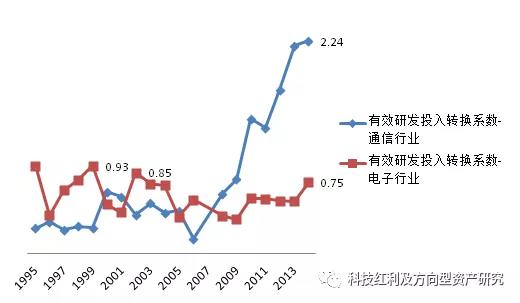
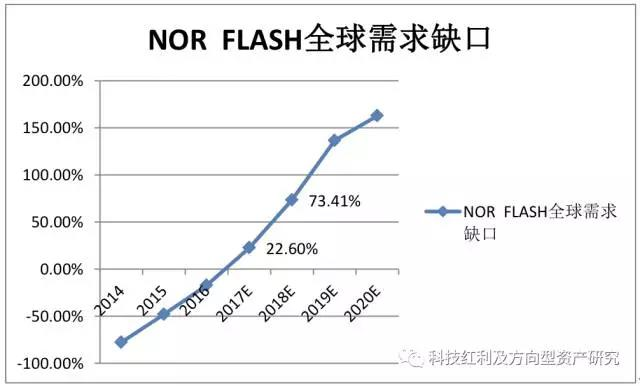
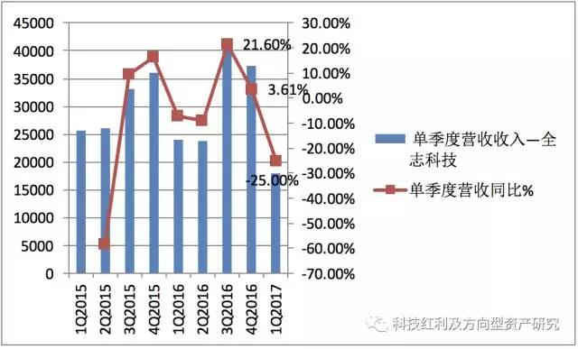
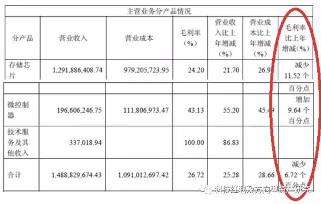
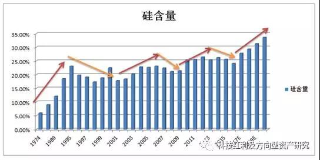
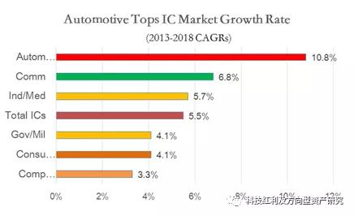
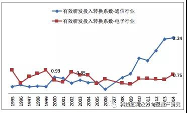
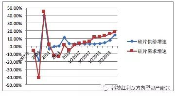
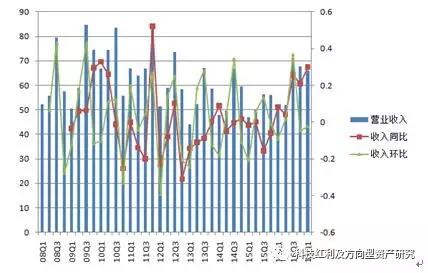
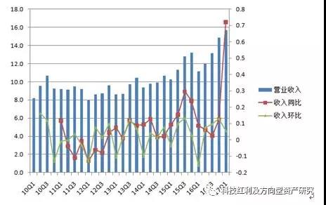

中国半导体产业的思考

《随笔：中国半导体产业的思考》系列报告，是一个独立自主、完整、开放、兼容的对产业之研究思想、研究方法的思考，也是**对于全球和中国半导体产业发展历史、现状、未来的总结、归纳、分析和趋势预判等的综合体现**。

随笔的研究思想来源于”科技红利”，有效研发投入、研发转换系数、压强系数、科技企业扩张的路径等等都体现于《科技红利大时代》。
<!-- TOC -->

- [【1】本轮涨价开启8年一遇的景气周期](#1本轮涨价开启8年一遇的景气周期)
    - [1、第一张图：半导体硅片需求和供给的2016-2017年剪刀差](#1第一张图半导体硅片需求和供给的2016-2017年剪刀差)
    - [2、第二张图：半导体硅片价格2016年筑底回升](#2第二张图半导体硅片价格2016年筑底回升)
    - [3、硅片涨价初期为啥晶圆制造前端环节最先受益，2009-2011年的半导体小阳春启示](#3硅片涨价初期为啥晶圆制造前端环节最先受益2009-2011年的半导体小阳春启示)
    - [4、涨价！开启行业8年一遇的景气周期](#4涨价开启行业8年一遇的景气周期)
- [【2】涨价谁最受益?谁受损?](#2涨价谁最受益谁受损)
    - [1、国家战略：中国大陆12寸半导体晶圆大扩张，刺激硅片需求和供给2016-2017剪刀差开口持续扩大](#1国家战略中国大陆12寸半导体晶圆大扩张刺激硅片需求和供给2016-2017剪刀差开口持续扩大)
    - [2、回答投资者几个提问，为啥2017年投资半导体前端制造环节，2018年投资后端制造?](#2回答投资者几个提问为啥2017年投资半导体前端制造环节2018年投资后端制造)
    - [3、半导体硅片涨价受益品种传导路径](#3半导体硅片涨价受益品种传导路径)
    - [4、半导体硅片涨价受益品种，看好存储器、晶圆前端制造、易耗品，回避消费级芯片](#4半导体硅片涨价受益品种看好存储器晶圆前端制造易耗品回避消费级芯片)
- [【3】存储器是涨价最大赢家](#3存储器是涨价最大赢家)
- [【4】买在当下！兆易创新！](#4买在当下兆易创新)
- [【5】痛则通之！2017年最确定的投资机会就是存储器](#5痛则通之2017年最确定的投资机会就是存储器)
- [【6】布局一季报](#6布局一季报)
- [【7】涨价！趋势的力量](#7涨价趋势的力量)
- [【8】涨价趋势第一弹，兆易创新年报全面解析，超预期，亮点多多](#8涨价趋势第一弹兆易创新年报全面解析超预期亮点多多)
- [【9】半导体Super Cycle和硅含量提升驱使 涨价浪潮蔓延 从存储器到被动元器件](#9半导体super-cycle和硅含量提升驱使-涨价浪潮蔓延-从存储器到被动元器件)
- [【10】从蓝思科技到兆易创新](#10从蓝思科技到兆易创新)
- [【11】兆易创新龙抬头、全球存储Q1全面超产业预期！](#11兆易创新龙抬头全球存储q1全面超产业预期)
- [【12】数据！数据！半导体super cycle Q2继续高歌猛进](#12数据数据半导体super-cycle-q2继续高歌猛进)
- [【13】Q2旺季准备期=硅片缺口创历史+存储芯片配销模式延续](#13q2旺季准备期硅片缺口创历史存储芯片配销模式延续)
- [【14】面对涨价：兆易创新>旺宏>华邦电](#14面对涨价兆易创新旺宏华邦电)
- [【15】两岸最夯细分产业-NOR FLASH，供需缺口继续加速放大](#15两岸最夯细分产业-nor-flash供需缺口继续加速放大)
- [【16】下一个方向！2017-2020年第四次全球半导体硅含量提升](#16下一个方向2017-2020年第四次全球半导体硅含量提升)
- [【17】全球半导体格局大变迁 存储器或将取代逻辑 占比全球第一](#17全球半导体格局大变迁-存储器或将取代逻辑-占比全球第一)
- [【18】预付款+配给制度，剪刀差缺口到2020年](#18预付款配给制度剪刀差缺口到2020年)
- [【19】传导图，势不可挡](#19传导图势不可挡)
- [【20】2018年存储高景气持续，编码型存储器>DRAM>NAND](#202018年存储高景气持续编码型存储器dramnand)
    - [【21】超级周期 愈演愈烈](#21超级周期-愈演愈烈)
    - [【22】18Q1存储淡季不淡，编码型与DRAM全年续旺可期](#2218q1存储淡季不淡编码型与dram全年续旺可期)
    - [【23】物联网爆发之核芯——MCU 存储模块（1）](#23物联网爆发之核芯mcu-存储模块1)
    - [【24】物联网爆发之核芯——MCU+存储模块（2）](#24物联网爆发之核芯mcu存储模块2)
    - [【25】18Q1季报进一步瞻显随笔核心逻辑](#2518q1季报进一步瞻显随笔核心逻辑)
    - [【26】第二次大投入快速推进](#26第二次大投入快速推进)
    - [【27】中国芯的黄金买点](#27中国芯的黄金买点)
    - [【28】NOR FLASH传统市场之V型反转（1）](#28nor-flash传统市场之v型反转1)
    - [【29】NOR FLASH传统市场之V型反转（2）](#29nor-flash传统市场之v型反转2)
    - [【30】台湾省产业分析 存储器Vs消费级  晶圆前端Vs后端](#30台湾省产业分析-存储器vs消费级--晶圆前端vs后端)
    - [【31】亚马逊介入交换机，网络变革Vs新赛道](#31亚马逊介入交换机网络变革vs新赛道)
    - [【32】物联网之智能零售0-1崛起](#32物联网之智能零售0-1崛起)
    - [【33】中国大陆是主推力，存储器芯片是主抓手](#33中国大陆是主推力存储器芯片是主抓手)
    - [【34】物联网之最大应用领域之一智慧工厂的崛起](#34物联网之最大应用领域之一智慧工厂的崛起)
    - [【35】寻找中国芯之细分龙头](#35寻找中国芯之细分龙头)
    - [【36】18Q2存储器淡季不淡，Super Cycle进行时](#3618q2存储器淡季不淡super-cycle进行时)
    - [【37】AI提升生态圈之硅含量](#37ai提升生态圈之硅含量)
    - [【38】现金流与硅周期](#38现金流与硅周期)
    - [【39】科技立国之道，以正视听](#39科技立国之道以正视听)
    - [【40】AI芯片群雄逐鹿](#40ai芯片群雄逐鹿)
    - [【41】中国大陆成为全球半导体市场的主导力量](#41中国大陆成为全球半导体市场的主导力量)
    - [【42】一场长达十五年的赛跑](#42一场长达十五年的赛跑)
    - [【43】回避消费级进入深水区，中国大陆公司逆势增长显著](#43回避消费级进入深水区中国大陆公司逆势增长显著)
    - [【44】存储器-国之重器重在空间巨大与安全危机，静待国产三箭齐发](#44存储器-国之重器重在空间巨大与安全危机静待国产三箭齐发)
    - [【45】第四次硅周期+硅片剪刀差，存储器话语权提升成为新周期抓手](#45第四次硅周期硅片剪刀差存储器话语权提升成为新周期抓手)
    - [【46】摩尔定律失效 寡头垄断，DRAM厂商迎来惜售涨价的超景气市况](#46摩尔定律失效-寡头垄断dram厂商迎来惜售涨价的超景气市况)
    - [【47】云计算+AI驱动DRAM之主力，智能驾驶+手机为持续成长护航](#47云计算ai驱动dram之主力智能驾驶手机为持续成长护航)
    - [【48】破局15万亿](#48破局15万亿)
    - [【1】](#1)
    - [【50】最坏的时间已过，Q2环比改善，下半年反转](#50最坏的时间已过q2环比改善下半年反转)
    - [【51】唯有中国市场方是全球芯片的源动力](#51唯有中国市场方是全球芯片的源动力)
    - [【1】](#1-1)
    - [【1】](#1-2)
    - [【1】](#1-3)
    - [【1】](#1-4)
    - [【1】](#1-5)
    - [【1】](#1-6)
    - [【1】](#1-7)
    - [【1】](#1-8)
    - [【1】](#1-9)
    - [【1】](#1-10)
    - [【1】](#1-11)
    - [【1】](#1-12)
    - [【1】](#1-13)
    - [【1】](#1-14)
    - [【1】](#1-15)
    - [【1】](#1-16)
    - [引用说明](#引用说明)

<!-- /TOC -->

# 【1】本轮涨价开启8年一遇的景气周期

关于中国半导体产业的发展，我们的独立研究的思考一直都未停止，在此以随笔的形式和大家进行分享。关于本轮半导体涨价核心原因，我们全市场独家提出了“硅片需求和供给2016-2017年剪刀差”，本轮涨价将开启至少是行业8年一遇的景气周期。
 
正文：
## 1、第一张图：半导体硅片需求和供给的2016-2017年剪刀差
本轮半导体硅片涨价的最核心的因子是什么？
第一张图是，半导体硅片需求和供给增速2016-2017年剪刀差形成：
1）2008-2011年，全球半导体硅片需求和供给的关系基本是同方向运行，这是半导体行业景气时期
2）2012-2013年，需求和供给是反向关系，呈现的是供给不断上行，需求不断下行。
3）2013-2015年，需求和供给同方向运行，这是一个短暂的行业小周期。
4）2016年，需求和供给曲线，自从2008年以来，第一次出现剪刀差。这就是2017年以来半导体硅片涨价的核心因子。

 

**半导体硅片需求和供给剪刀差一旦形成，我们认为涨价将至少将贯穿一年以上！**

半导体硅片需求和供给的关系，以本人目前的学习和工作经历，个人很难追溯2008年以前行业所发生的具体情况。当硅片2017年1月份第一次涨价的时候，我们能够敏感的察觉这是行业及其特殊的情况，是因为硅片涨价很久没有出现了，在以往学习和工作的成长经历的记忆中，似乎硅片一直都在降价。所以我们在1月份的科技红利大时代系列报告中，我们提出半导体行业三个要素：涨价、汽车、快速提升压强系数。
即使提出了半导体行业涨价的要素，但是针对硅片涨价的及其特殊情况，我犹豫了，这种犹豫更多是出于研究工作的严谨性、审慎性原则，我们不能够拍脑袋的去吹大炮。当然，我们也可以依据行业的新闻事件，去总结涨价原因的123等等，作为毕业于微电子学专业、华为研发出身，我更倾向于找到问题的真正本质。还好，此刻我们找到了硅片需求和供给关系2016-2017年剪刀差图，可以自豪的说，这一定是我们独家特制。
本人曾经为大基金做过全球半导体行业的深度分析，清楚的知道目前中国半导体集成电路行业已经是中国科技不得不寻求突破的“上甘岭”，我们希望通过自己的积极分享，特别是科技红利思想，能够为中国科技研究做一点有意义的事情。
 
## 2、第二张图：半导体硅片价格2016年筑底回升

第二张图，硅片平均价格趋势，2008-2009年价格在1.397—1.401， 2005年的最低点0.691，我们认为2017年3季度硅片价格有可能回归到1附近，2018年有可能回到2007-2008年的峰值区间。

我们认为硅片价格会回到2007-2008年的峰值水平，最关键原因在于国家大基金为代表的中国资本在半导体12寸晶圆领域的大投资，这是国家战略，而全球大规模硅片生产产能又基本垄断在日本等国外巨头手里，在上海新昇半导体没有批量出货之前，涨价将不可避免。
在硅片平均价格趋势图中，我们认为，硅片持续涨价，含无疑问最受益的就是硅片厂商，目前中国大陆的上海新昇半导体（上海新阳）预计2017年能够实现小批量供给。
 
## 3、硅片涨价初期为啥晶圆制造前端环节最先受益，2009-2011年的半导体小阳春启示

2009—2011年随着硅片需求和供给的提升，使得硅片价格指数企稳上行，带来了一波半导体行业的小阳春。

2009—2011年苹果开启智能手机的时代，进而带动半导体行业景气回升，使得半导体硅片需求和供给呈现明显的扩张，半导体硅片价格从0.992提升到1.095,。
 
结合半导体板块收入和业绩，2009-2010年因为下游智能手机需求拉动，半导体硅片需求和供给快速回升，使得半导体硅片价格企稳回升，同期A股半导体板块单季度收入和净利润同比下滑增速从2009年一季度的-28.27%、-141.76%，缓慢回升到2009年2季度的-12.39%、-40.76%。
当三季度硅片价格再次回升，半导体板块2009年三季度，收入下滑增速缩小到-3.35%，而三季度的净利润增速转正为18.26%。到2009年第四季度，板块收入同比增速转正并大幅度体现了行业景气需求，增速达到61.13%，四季度净利润同比增速达到275.11%。

2010-2011年，半导体硅片价格从1.035进一步涨价到1.095，这也是半导体板块收入和净利润增速保持高速增长的时期。这一时期A股有许多大牛股来自半导体板块，比如当年的封测龙头华天科技。

2011年后，半导体硅片价格无法持续上行，回落到2012年的0.963的时候，2011年半导体板块收入和净利润增速下滑，并在2011年三季度，净利润同比增速由正转负，-20.20%，2011年四季度，半导体板块收入同比增速由正转负，-21.61%，净利润下滑增速扩大到-60.35%。

2009-2011年，因为半导体硅片需求和供给的景气回升，使得硅片价格企稳回升，造就了2009-2011年A股半导体板块的小阳春。半导体板块典型的行业强周期特征，这种强周期特征从根本上而言，就是来自半导体硅片需求和供给的关系，并体现在半导体硅片价格指数。
 
投资半导体板块，必须清楚的理解半导体行业的自身属性。当硅片涨价传导到半导体晶圆制造环节中，前端和后端都会受益，但是受益的时间和路径程度不一。我们以2010年的半导体后端制造环节的封测龙头华天科技进行说明。

2009-2011年，我们分季度对比华天科技和半导体板块的收入同比，在2009—2010年，硅片价格指数开始企稳回升的时期，华天科技的收入同比表现强于板块，在2010-2011年，硅片价格指数上行到高点后，相比较半导体板块，华天科技的收入呈现明显快速下滑。

净利润同比看，华天科技和半导体板块同比基本比较符合，作为当时的封测龙头，2009-2010年，公司强烈受益于半导体硅片价格指数的回升，同样也非常敏感于硅片价格指数的回落。

在半导体硅片价格的价格上涨，当硅片涨价传导到半导体晶圆制造环节中，前端和后端都会受益，但是受益的时间和路径程度不一。我们认为，在涨价的初期，硅片涨价最先传导到前端制造环节，再依次传导到后端制造的封装和测试环节。
下图是华天科技2009年1月份-2011年4月份的股价走势（周线）：

我们可以清晰看到，2009年1-3月，股价跟随着当时硅片涨价有一波小幅度上扬，在3-10月，股价基本处于盘整，直到10月后股价开始拉升，也就是2009年4季度公司业绩开始释放出来。

2009年10月股价一路上行到2011年1月的最高点，2011年1季度公司收入14.69%，净利润同比3.05%。半导体硅片涨价所带来的行业小阳春基本完全消化，公司业绩拐点出现，随后股价一路下行。

还需要进一步说明的，2017年下游智能手机需求和2009-2011年智能手机才开始的情况不一样。
我们认为在2017年半导体晶圆前端制造环节最为受益，2018年后端封测制造环节才会开始充分受益。
 
## 4、涨价！开启行业8年一遇的景气周期

涨价！涨价！涨价！2017年最大的问题不仅仅是需求，更是因为没有库存。和2009-2011年的小阳春比较，本轮硅片的需求和供给关系2016-2017年剪刀差带来的半导体行业涨价浪潮，至少是8年一遇的景气行情。  

2016-2017年半导体硅片价格有望回升到1附近，2018年有望回升到2007-2008年的峰值水平1.4附近（1.397—1.401）。

驱动硅片价格上行的驱动力就是半导体硅片需求和供给2016-2017年剪刀差的形成。

# 【2】涨价谁最受益?谁受损?

关于中国半导体产业的发展，我们的独立研究的思考一直都未停止，在此我们和大家分享我们的理解，关于涨价谁会受益？谁会受损？
中国大陆新增12寸晶圆产能的扩张刺激硅片需求和供给2016-2017年剪刀差的持续扩张，半导体硅片涨价对半导体晶圆的价格传导，引发行业晶圆产能降阶抢夺，我们本节分析了半导体硅片涨价受益品种的路径传导图，我们看好存储器、晶圆前端制造、易耗品，回避消费级芯片。
 
正文：
 
## 1、国家战略：中国大陆12寸半导体晶圆大扩张，刺激硅片需求和供给2016-2017剪刀差开口持续扩大

根据半导体硅片需求和供给2016-2017剪刀差图，在2015-2016年，全球硅片产能进行整合保持平稳供给，并没有出现明显的供给收缩，但是在中国国家大基金为代表的国家战略下，12寸晶圆厂大规模建设，形成了对12寸硅片的新增需求，在2016年四季度开始形成硅片供给和需求的剪刀差。
中国大陆目前12寸产能在31万片/月，主要集中海外巨头手里，大陆本土产商中芯国际12寸产能仅占比10%不到。

2017-2018年中国大陆预计新增12寸产能89.5万片/月，是现有产能的288%。其中大陆产商，武汉新芯、长江存储、合肥长鑫、晋华集成、中芯国际等合计产能是75.5万片/月，占比2017-2018年新增产能的84.3%。

2018-2019年中国大陆预计新增12寸产能22万片/月。

预计，2017-2018年中国大陆12寸晶圆产能超过1400万片每年，2018-2019年预计超过1700万片每年。

在上海新昇半导体2018年下半年形成大规模出货之前，全球硅片产能供给是平稳的。中国大陆12寸半导体晶圆激增的产能直接刺激12寸半导体硅片的需求，我们预计半导体硅片需求和供给2016-2017年剪刀差开口在2017-2018年将加快扩大，随着2018年年底上海新昇半导体大规模产能的释放，半导体硅片的供给增速才有追平需求增速的可能。

## 2、回答投资者几个提问，为啥2017年投资半导体前端制造环节，2018年投资后端制造?

前文说了，当硅片涨价传导到半导体晶圆制造环节中，前端和后端都会受益，但是受益的时间和路径程度不一。我们认为，根据硅片需求和供给2016-2017年剪刀差，2017年硅片价格预计在0.797—0.917区间逐步上行，半导体前端在这一时期是最为充分受益的。当硅片价格在1.0-1.1以上，半导体后端制造环节才会受益。按照目前硅片价格趋势看，最快在2017年4季度，最迟在2018年3月，硅片价格会上行到1.0以上。也就是说，半导体封测制造厂商的投资布局最快在2017年四季度，最迟在2018年1季度。

前文谈到2017年半导体晶圆前端制造环节最为受益于硅片涨价，2018年才是后端制造环节充分受益，请大家先记住这个观点，如果有兴趣的朋友，可以参考上图2009-2011年硅片涨价从0.991反弹到1.096，回朔2010-2011年的A股半导体小阳春，比如当时的封测龙头华天科技股价走势（周线）：

2009年前三个季度，因为业绩没有体现硅片涨价趋势所带来的行业景气，股价盘整了将近10个月，到10月第一周股价1.97元开始启动，一路上涨到2011年2月的7.14元。如果从业绩角度看，2009年第四季度开始释放业绩，驱动股价上行。

或许简单粗暴的说，当台积电等晶圆代工产商，在面临原材料成本硅片不断涨价的趋势下，您觉得它会如何将不断上涨的成本进行转嫁？全球半导体前端制造环节有几家公司？后端制造又有多少家？产业议价能力一样吗？后端封测产商，能够提前先于台积电、中芯国际等前端产商而分享涨价的景气吗？除非后端封测产商，它的工艺制程是当时全球领先，并且稀缺的制程。
 
在上文论述中，有朋友问，为啥选择华天科技而不是长电科技？说明一下，因为2009-2011年长电科技并不出众，还只是一个乡镇企业，研发、生产、资金实力存在瓶颈，所以当时市场选择华天科技作为龙头。
还有朋友问，为啥华天科技和半导体板块指数收入和业绩同步，为啥现在就不是同步？因为2009-2011年，A股市场半导体板块，没有芯片设计公司，没有前段环节制造，现在电子化学品龙头上海新阳，是在2011年7月上市的。所以，当时半导体板块指数应该相当于后端制造指数。
 
## 3、半导体硅片涨价受益品种传导路径

本节部分，我们重点探讨硅片、晶圆前端制造环节，什么品种最为受益。后端制造环节我们后面有缘再讨论。请参考下图：硅片涨价受益品种路径传导

1）半导体硅片涨价传导金属硅涨价
中国大陆2017-2019年12寸晶圆的大规模建设，刺激了2016年12月硅片厂商第一次涨价预期，2017年2月传导到硅片上游，带动硅片原材料金属硅的涨价。

2）半导体硅片涨价传导到半导体前端晶圆制造环节
2016年三季度开始，3D NAND大容量存储器高阶规格升级造成涨价，引发了对台积电等12寸晶圆厂产能开始出现抢夺，12寸晶圆厂产能的饱和又正反馈使得3D NAND存储器价格具有进一步持续上行的条件。请记住，2016年硅片第一次涨价的时候，晶圆厂还没有开始涨价。直到2017年2月12寸硅片第二次涨价，12寸晶圆厂才开始提出涨价。也就是说，2017年硅片厂商第二次涨价+晶圆厂的第一次涨价，开始加剧硅片供给和需求2016-2017年剪刀差的开口扩大。
2017年2月11号，台积电股东大会上确认半导体晶圆开始涨价格。2017年1季度全球半导体晶圆合约价平均涨幅约达10%，20纳米以下先进制程的半导体晶圆更是直接大涨10美元。
 
3）硅片涨价引发半导体晶圆制造的降阶抢夺产能
12寸晶圆涨价使得许多IC芯片厂商开始降阶，回归8寸规格，而8寸晶圆目前主要是FLASH和指纹识别，真正导致8寸晶圆供需关系失衡主要是通用型芯片NOR FLASH涨价引发的晶圆产能抢夺。智能手机采用OLED屏幕刺激NOR FLASH新增需求的形成，出现第一次涨价。进一步刺激NOR FLASH持续涨价是美光等产商退出市场，使得下游终端手机厂商开始进行供应链的新的抢夺，截止到2017年3月，AMOLED用途的NOR FLASH涨价超过30%。我们认为NOR FLASH的涨价将伴随硅片整个涨价周期，持续到2018年，虽然有许多人会说，智能手机的AMOLED所带来的需求只有几个亿美金而已，对于企业又能够带来多少EPS？但是，请记住，硅片需求和供给关系的2016-2017年剪刀差，新增量需求的丁点变量，对于剪刀差开口的扩大，不是简单的线性关系！因为AMOLED形成需求和供给关系构成一个新的完整全闭环。
8寸晶圆产能在NOR两次涨价以及新增需求刺激，使得部分8寸芯片厂商开始再次降阶6寸，并且在6寸规格形成晶圆前端环节的涨价传导环节的终点闭环，倒逼着原来占据6寸产能的LED 驱动IC芯片开始在3月进行提价。
 
本轮硅片涨价，不是2009-2011年的小阳春，它真正本质原因在于硅片需求和供给关系2016-2017年剪刀差形成。本轮硅片涨价所引发整个半导体产业链意义深远，很难去估量对行业所带来的巨变，因为这个剪刀差形成的时间周期从2008年以来，酝酿时间长达8年，并且从硅片涨价到传导半导体晶圆厂，从12寸蔓延到6寸，时间周期仅有3个月，剪刀差的开口扩张速率上行迅猛。
 
## 4、半导体硅片涨价受益品种，看好存储器、晶圆前端制造、易耗品，回避消费级芯片

本轮半导体硅片需求和供给关系2016-2017年剪刀差，所引发的行业涨价最受益的品种依次为：

1）NOR FLASH存储器芯片设计产商：受益于需求周期+涨价周期+新增晶圆产能建设周期

需求周期，智能手机AMOLED新增需求和供给形成完整全闭环，并且贯穿2017-2018年整个涨价周期；存储器产商从消费级市场切入汽车+工业级市场，构成第二个新增需求和供给的全闭环，汽车市场非常像2009-2010年智能手机开始普及的时候。

涨价周期，硅片涨价引发的晶圆产能紧张进而涨价，使得存储器缺货紧张，并形成涨价需求。同时晶圆制造成本的涨价可以传导消费级芯片厂商和终端手机厂商，涨价周期贯穿于本轮硅片涨价周期。

2017年1季度NOR FLASH连续调涨，首次涨幅超15%；DRAM与NAND FLASH涨价更早，自16年Q2开始， 16年平均合约价累计涨幅超过50%；“2017年DRAM协议价已经突破了近18个月新高，17年仅1个月4Gb DDR4涨价18%；17一季度， DRAM与NAND FLASH再次涨价10%。
新增产能建设周期，大陆12寸晶圆大规模扩张，2017-2018年预计产能新增89.5万片每月，其中三大存储器产商：长江存储、合肥长鑫、福建晋华合计产能占比75%。新增存储器产能，非常有利于存储器芯片设计产商的成本转嫁，以及需求扩张。
受益标的：兆易创新、台湾旺宏、华邦等。
 
2）12寸硅片产商：受益于需求周期+涨价周期+新增晶圆产能建设周期
需求周期，大陆12寸晶圆产能大扩张，使得需求和供给闭环。
涨价周期，12寸晶圆产能紧张造成12寸硅片涨价，12寸晶圆产能紧张引发半导体晶圆降阶8寸，8寸降阶6寸，进一步诱发8寸/6寸半导体硅片的涨价传导。我们预计最迟2017年2季度，8寸硅片涨价。涨价周期形成完整闭环。
新增晶圆产能建设周期，涨价周期预计结束于2018年上海新昇大规模化生产，以及中国大陆12寸晶圆大规模扩张结束，涨价幅度取决于中国大陆12寸晶圆建设周期的进度。
收益标的：上海新阳（上海新昇），台湾环球晶圆等
 
3）半导体晶圆代工厂商：受益于涨价周期+新增晶圆产能建设周期
需求周期，汽车、工业级以及NOR FLASH新增需求还处于需求提升时期，还没有完成进入到类似智能终端需求大爆发的时期，所以需求和供给没有形成完整闭环，半闭环。
涨价周期，原材料硅片涨价的成本传导，12寸晶圆涨价，并通过晶圆产能降阶抢夺，引发8寸/6寸晶圆涨价。
新增晶圆产能建设周期，涨价周期结束于中国大陆12寸晶圆大规模扩张结束，涨价幅度取决于下游终端市场需求。
受益标的：中芯国际、台积电等。
 
4）硅片制造/晶圆前端制造所需的易耗品，比如光刻胶等电子化学品：受益于新增晶圆产能建设周期
涨价周期，晶圆涨价引发易耗品需求提升的涨价可能预期。
新增产能建设周期，形成新增需求，并且需求和供给形成闭环，涨价周期和需求周期同步，预计结束于大陆12寸晶圆厂大规模扩张结束。
受益标的：上海新阳、南大光电（北京科华）等。
 
5）硅片和晶圆制造环节相关设备和配套：新增晶硅片/圆产能建设周期
受益于新增产能扩张形成的需求周期，结束于大陆12寸晶圆厂大规模扩张结束。受益标的：北方华创、菲利华等。
 
6）LED 驱动IC：
LED芯片涨价能够覆盖驱动IC涨价，对冲6寸晶圆制造成本提升。涨价周期时间取决于LED芯片涨价，因为没有需求周期，个人预计涨价时间不会超过2017年。受益标的：士兰微等。
 
本轮涨价特别注意受损品种：各类消费级芯片厂商，理由两个：  
第一，晶圆制造成本上行无法有效传导下游终端手机厂商，无法形成有效完整闭环。  
第二，通用型芯片比如NOR FLASH涨价将进一步侵蚀利润。  
满足这两个条件的芯片厂商，提请投资者注意回避。  

# 【3】存储器是涨价最大赢家

上一节我们探讨了中国大陆新增12寸晶圆产能的扩张刺激硅片需求和供给2016-2017年剪刀差的持续扩张，半导体硅片涨价对半导体晶圆的价格传导，引发行业晶圆产能降阶抢夺，重点分析了半导体硅片涨价受益品种的路径传导图，我们看好存储器、晶圆前端制造、易耗品，回避消费级芯片。

评判本轮涨价品种谁是最大赢家，需要从需求周期、涨价周期和中国大陆12寸晶圆新增产能建设周期进行综合评估。在半导体涨价引发的行业机会中，存储器、晶圆前段制造、电子化学易耗品、包括设备都会受益，但是我们认为，在受益涨价周期和新增12寸晶圆产能建设周期的同时，更重要的是考察受益品种的新增量需求周期，特别是能够满足需求和供给完整全闭环的需求周期，其更具有穿越周期的生命力，毕竟涨价周期和大陆12寸晶圆新增产能建设周期是有周期结束的一天。满足这个的条件的是NOR FLASH存储器芯片。

正文：

NOR FLASH存储器景气受益将贯穿2017-2018年整个涨价周期；硅片涨价引发的晶圆制造成本可以传导消费级芯片厂商和终端手机厂商，涨价周期贯穿于本轮硅片涨价周期，涨价幅度取决于AMOLED以及汽车市场的新增量需求缺口。
上一节谈到，存储器受益于本轮半导体涨价的需求周期有两个，第一个是AMOLED智能手机新增需求和供给形成完整全闭环，并且贯穿2017-2018年整个涨价周期；NORFLASH存储器产商从消费级市场切入汽车+工业级市场，构成第二个新增需求和供给的全闭环，汽车市场非常像2009-2010年智能手机开始普及的时候。本节部分我们先重点探讨第一个需求和供给全闭环：AMOLED智能手机所带来的NOR  FLASH新增量需求周期，后面我们有时间再探讨第二个全闭环：汽车+工业级市场所带来的新增量需求。
 
## 1、供给端分析1：全球NOR  FLASH存储器供给处于历史最低水位

在过去五年全球NOR FLASH一直在进行产能收缩，全球NOR FLASH产能维持在43-45亿颗。2015-2016年处于历史最低水位区间，2016年3季度，根据台湾华邦预计，2017年NOR Flash市场供不应求的情况仍然严重，扣除重复下单的情况，估计市场缺口约20%。

中国大陆NOR FLASH龙头兆易创新，过去三年产能在5.4—8.05亿颗，逐年上升，占比全球市场份额从11.24%提高到18.51%。

分产品类型看，低容量的NORFLASH（包括1/2/4/8/16/32Mb）产能，过去五年呈现不同程度的下滑趋势：
1Mb产品，复合下滑增速-18.1%；2Mb产品复合下滑-8.3%；4Mb复合下滑-9.2%；8Mb产品复合下滑-11.2%；16Mb复合下滑-14.1%；32Mb产品复合下滑-7.7%。

过去五年，高容量产品（包括64M/128M/256M/512M/1G/2G）产能呈现小幅的提升：64Mb复合增速0.7%；128Mb产品复合增速5.6%；256Mb产品复合增速5.3%；512M复合增速5.5%；1Gb复合增速3.7%。

总体而言，全球NOR  FLASH产能在历史最低水位，特别是低容量的NOR FLASH（包括1/2/4/8/16/32Mb）全球产能只有13.75亿颗，只有2010年产能的51%。

## 2、供给端分析2：美光退出加剧全球NOR  FLASH市场供给再次收缩
美光占据全球NOR FLASH份额在20%，近期已经对其主要客户发出明确的退出NOR市场的通知，倒逼原有下游终端客户厂商加快调整供应链，我们预计华为等国内终端手机厂商在二季度就必须做出新的选择。

美光的退出将直接导致2017-2018年全球NOR  FLASH产能供给大比例收缩，导致全球需求和供给的缺口持续扩大。
 
## 3、需求端分析1： AMOLED智能手机引发8M和16M NOR FLASH需求缺口扩张，2017-2018年需求缺口在22%、73%

上一节谈到，存储器受益于本轮半导体涨价的需求周期有两个，第一个是智能手机AMOLED新增需求和供给形成完整全闭环，并且贯穿2017-2018年整个涨价周期；存储器产商从消费级市场切入汽车+工业级市场，构成第二个新增需求和供给的全闭环，汽车市场非常像2009-2010年智能手机开始普及的时候。本节部分我们重点探讨AMOLED所带来的NOR  FLASH新增量需求周期，后面我们探讨汽车+工业级市场所带来的新增量需求。

新增量需求是我们在研究科技行业的时候最为关注的变量因子。根据HIS、Witsview报告，2016-2017年AMLOED手机占比21%、28%的渗透率计算，预计三星2017 年出货 4.8 亿片 AMOLED 智能手机，至少需求 4.8 亿颗 NOR FLASH。我们预计到2018年，随着AMOLED智能手机渗透率持续提升，预计需求6.8 亿颗 NOR FLASH。到2020年，预计全球因为AMOLED智能手机带来的NOR FLASH新增量需求在13.7亿颗每年。

根据Witsview报告，NOR Flash 应用在 AMOLED 面板上的功能，主要是来记忆状态跟补偿 AMOLED 的电流、亮度，因为AMOLED 面板中的蓝色光会随着使用时间的增加而逐步分解消退，因此要才有 NOR Flash以维持 AMOLED 的持续性。在 Full HD（全高清）的机种中，需要用 8Mbit 的 NOR Flash 来进行记忆， QHD（1/4高清）的机种，要用到 16Mbit NOR Flash 产品。
据此我们进一步分析全球8Mb和16MbNOR FLASH产能情况，因为8M和16M主要采用的是90nm制程，全球产能就更加稀缺。
AMOLED智能手机预计带来的8M和16M NORFLASH新增量需求的缺口在2017-2020年将持续扩张，根据我们测算，2017年全球新增的NOR需求还有22%的产能缺口，这和近期台湾NOR FLASH大厂华邦公司预计的20%是符合的。
按照目前全球半导体晶圆制造产能紧张的情况，根据我们测算公式，2017年需求还有22%的产能缺口，那么2018年，全球需求缺口将扩大到73%以上。我们预计到2020年，8M和16M  NOR  FLASH全球需求的产能缺口持续扩大化。

## 4、需求端分析2：三星包圆现有全球产能，本土龙头兆易创新最为受益

8M NOR FLASH全球产能在1.5—1.8亿颗/每年，并且过去三年逐年下滑-15%，兆易创新目前具有的8MNOR FLASH过去三年预计0.5—0.8亿颗/每年，占比全球产能在33-42%。

16M NOR FLASH全球产能在3.42—4.59亿颗/每年，过去三年逐年下滑增速-15%，兆易创新具有的16MNOR FLASH过去三年预计0.5—0.7亿颗/每年，占比全球产能在13-16%。

8M和16M全球产能合计，预计在4.7-5.7亿颗/每年，兆易创新合计预计在0.97—1.34亿颗/每年，兆易创新占比全球比例在20-25%。

8M和16M NOR FLASH新增量需求缺口扩张，使得三星的4.8亿颗新增AMOLED需求基本包圆现有产能，这就是三星从2016年三季度开始抢占

8M和16M NOR FLASH全球产能的原因所在，新增的需求刺激稀缺的全球产能，第一次涨价达到15%，两次涨价涨幅超过30%。本土产商兆易创新占据8M和16M NOR FLASH全球产能的20-25%，将直接受益存储器芯片行业新增需求周期引发的涨价浪潮。
 
## 5、NOR FLASH存储器芯片是AMOLED智能手机的标配品

AMOLED属于电流型发光器件，由于它自发光的特性，与LCD相比，AMOLED具有高对比度、超轻薄、可弯曲等诸多优点。但是亮度均匀性和残像仍然是它目前面临的两个主要难题，要解决这两个问题，除了工艺的改善，就只能采用补偿技术。而智能手机用AMOLED自身随着点亮时间的增加，亮度逐渐衰减，这个问题在工艺上难于完全克服，所以在电路设计上必须通过各种补偿技术来解决。
AMOLED的补偿方法可以分为内部补偿和外部补偿两大类。内部补偿是指在像素内部利用TFT构建的子电路进行补偿的方法，内部补偿的像素结构和驱动方式都较复杂，补偿效果并不明显并且补偿范围偏小，难以解决残像问题。外部补偿通过外部的驱动电路或设备感知像素的电学或光学特性然后进行补偿的方法。外部补偿的方式具有像素结构简单，驱动速度快和补偿范围大的优点，因而外部补偿方法广泛应用于AMOLED手机、TV等。

智能手机应用AMOLED最常见的外部补偿方式是电学补偿，即通过像素内部的TFT将驱动管的I-V特性以及OLED器件的I-V特性读取到外部感应电路，计算需要补偿的驱动电压值并反馈给驱动面板的芯片从而实现补偿。

Column readout作用是监测 TFT I-V 特性变化和均匀性，监测AMOLED均匀性和老化，Imageprocessing LSI作用是根据监测结果计算补偿量，并将补偿量和初始数据整合输出给Data Driver，其中所有数据和补偿量都依据于NOR FLASH交互完成。
NOR FLASH是AMOLED智能手机的必须标配品。
 
为什么国家大基金丁文武先生说“巨大的市场需求是存储器芯片发展的最大动力”？为什么说存储器芯片设计正处于最好的投资时期？读者可能有疑惑为什么市场空间更大的DRAM和NAND  FLASH没有在此分析，请看续文，存储器芯片是中国半导体集成电路产业的痛点。

# 【4】买在当下！兆易创新！

买在当下!这是我们本节的主题，周末的时候小编接到许多朋友电话询问兆易创新，小编只有一句话，兆易创新！买在当下！

本来本节部分主要是想探讨中国半导体产业痛点的问题，因为许多朋友都询问兆易创新，小编只是一个人，很难一一回复，在此我们提前将兆易创新估值和业绩比较，和各位朋友进行分享。关于兆易创新的价值分析，许多朋友也拿着市场上的分析报告问小编，问怎么看，客观说，这挺为难的小编的。小编认为每一个研究员都有自己的判断，具体到兆易创新，有的朋友认为价值210元，有的朋友认为价值237元，都没有关系，关键是研究员的判读只要是建立在独立思考、独立分析的基础上，它就有价值。

也有很多朋友指出小编的文章文字不通顺、还有错别字，图表也不精致，非常谢谢朋友们的细心，小编后面一定努力提高自己做PPT制图能力。熟悉小编的朋友应该知道，小编只是一个人，独立去思考、独立做研究，无论是《科技红利大时代系列》报告，还是我们《中国半导体产业思考：随笔系列》报告，小编都是自己亲力亲为，不假手于他人，只是希望能够将自己独立思考和研究的思想，原滋原味的和朋友们进行分享。

如同《科技红利大时代系列》报告，我们从2016年12月14号开始进行分享，坚定告诉朋友们，从科技红利研究方法出发，消费类电子大白马未来三年到五年迈向千亿市值空间，通过科技红利分析方法，小编告诉朋友们手机平板显示行业第三个2年生命周期的行业景气到来。2017年1月市场开年调仓引发的版块调整，我们坚定的告诉朋友们，春节之前一定是最好的买点，在市场最底部的时候，我们坚定朋友们买入蓝思科技、立讯精密、歌尔股份、信维通信、欧菲光等消费类电子大白马，也坚定提示了环旭电子、合力泰等消费类电子、劲胜精密、联得装备等柔性设备黑马的投资机会。
我们认为2017年TMT科技行业最大的投资机会就在半导体集成电路芯片，半导体集成电路芯片行业最确定的投资机会就在存储器芯片，中国独家唯一的全品类存储器芯片设计龙头，兆易创新！买在当下！

半导体集成电路芯片行业的投资机会，我们认为具有十年的生命周期，远超过智能手机所带来的消费类电子的投资机会。

正文：

本节部分我们重点将朋友们最关心的兆易创新估值和业绩分析进行说明，包括 ISSI 公司在内，兆易创新的具体的成长扩张路径、科技红利方法分析比较等等，我们后续会逐一展开说明。
我们采取横向整体估值、纵向分业务估值对兆易创新进行分析。
 
## 1、国之重器，价值几何—横向整体估值比较：新兆易创新是最便宜的芯片设计公司

我们选取2015-2016年收入在10-30亿规模的电子公司进行估值横向比较，芯片设计公司选择汇顶科技、全志科技；消费类电子选取信维通信。通过横向比较，综合评估兆易创新的估值是贵了？还是便宜了？

根据我们科技红利的分析，预计兆易创新（不考虑ISSI收购）2016-2018年收入规模是16.5亿元、22.4亿元、33.7亿元，按照目前205亿市值计算，2017-2018年对应的PS是9.4、6.8，2018年PS估值低于汇顶科技的8.2倍、和全志科技的PS估值6.6倍相近。

预计兆易创新（不考虑ISSI收购）2016-2018年净利润规模是1.9亿元、3.6亿元、5.6亿元，对应2017-2018年的PE估值是57.3倍、36.5倍，和同类芯片公司比较，2018年PS估值和汇顶科技35.6倍相近，低于全志科技的41.3倍。

兆易创新，2017-2018年的PE、PS估值和同类芯片设计公司比较，估值并非处于明显的估值溢价，综合情况低于市场其他芯片设计公司估值水平。 

从收入规模进行分析新兆易创新（包括ISSI）的估值水平：  

新兆易创新（包括ISSI）预计2015-2018年收入规模是31.2亿、36.8亿、71.8亿、92.9亿。对应市值，按照收购配套融资最大4000万股新增股本计算，目前对应市值在287亿元，2016-2018年对应的PS估值是7.8倍、4.0倍、3.1倍，明显低于同类型芯片设计公司PS估值水平，汇顶科技2016-2018年PS估值是16.1/11/8.2倍，全志科技2016-2018年PS估值是10.4/8.2/6.6倍。**如果选取汇顶科技和全志科技的2017-2018年PS平均估值PS是9.6/7.4倍，2017年新兆易创新市值应该在531.32亿—689.28亿元，2018年新兆易创新市值空间在高看891.84亿元。**

我们选取收入规模相近的消费类白马信维通信进行比较，新兆易创新和信维通信进行PS估值比较，2017-2018年估值相近，**目前新兆易创新的备考市值是287亿，信维通信的市值是340亿，两者市值相差20%**。作为稀缺芯片设计龙头公司，2017-2018年新兆易创新的PS估值4.0/3.1倍，明显低于信维通信的PS估值7.9/5.2倍。即使我们不考虑芯片设计公司的稀缺性，**我们不严谨的参考信维通信的PS估值水平，对兆易创新进行评估，2017年给与兆易创新PS估值7.9倍，那么市值应该在567.22亿元**。
 
从净利润规模进行分析新兆易创新（包括ISSI）的估值水平：  

预计，新兆易创新2016-2018年净利润是2.6亿元、6.6亿元、10亿元，按照备考287亿市值计算，新**兆易创新2017-2018年PE估值是43.7倍、28.6倍**。汇顶科技2017-2018年PE估值是44.4/35.6倍，低于汇顶科技PE估值，全志科技2017-2018年PE估值是**58.6/41.3倍**，明显低于全志科技PE估值。如果我们选取汇顶科技和全志科技2017-2018年的平均估值PE是38.5倍/51.5倍，不考虑存储器芯片设计龙头的溢价，2017-2018年新兆易创新的市值最低应该在385亿—515亿。
 
半导体芯片设计将是未来五年A股TMT科技行业成长性最好的细分领域，从科技红利分析角度，有效研发投入和有效研发产值都将体现出未来高速成长的扩张性，这种高成长性我们更倾向采用PS估值。即使不考虑半导体行业8年第一次景气大年的涨价逻辑，**目前兆易创新综合估值并没有充分体现作为半导体芯片设计龙头的行业地位，新兆易创新是A股最便宜的芯片设计公司，合理市值预计在531—689亿元，2018年最高市值在892亿元，对应合理股价在379.28元—492.14元**。
 
## 2、国之重器，价值几何—纵向分业务估值比较：兆易创新+ISSI分业务收入预测和分步估值

### 2.1、兆易创新（不考虑ISSI）各项业务收入预测和分步估值

我们将兆易创新（不考虑ISSI）各项业务拆分，纵向分别进行预测。  
根据2016年中报，公司总体收入规模增长了34%，其中存储芯片业务同比增长了27%，晶圆业务同比增长了19%，MCU业务同比增长了160%。考虑2016年三季度行业景气开始回升，我们预计2016年总体收入规模16.4亿元，同比增长38%。

2017年考虑因为硅片涨价引发的晶圆产能紧张，以及企业库存紧张惜售的情况，我们下调存储芯片增速为20%，下调晶圆产品增速为15%，MCU产品公司依旧表现高速成长性，这得益于32位MCU取代8位和16位产品渗透率快速提升的行业景气。预计2017年总体收入在22.4亿元。

2018年随着硅片涨价回归到1.0附近，半导体晶圆产能紧张趋于缓解，以及公司库存释放，2018年存储器芯片增长恢复30%增速，晶圆产品恢复25%增速，32位MCU产品充分受益行业渗透率提升的景气周期。我们预计2018年公司总体收入33.7亿元。
 
我们重点分析MCU产品，通过A股相关MCU业务公司进行横向比较：

**兆易创新的MCU业务主要是32位MCU，公司研发了中国本土第一个32位MCU，主要客户市场是工业级和消费级市场。中颖电子、朗科智能、和而泰三家公司主要业务MCU智能控制器，应用市场主要是家电，其产品结构主要是8位、16位为主。**
即使我们不考虑兆易创新MCU作为行业龙头溢价，如果只是考虑2017年收入相近原则进行估值，那么兆易创新MCU业务估值在75亿，如果参考三家公司平均PS估值7.3倍，那么兆易创新MCU业务估值是46亿。
如果我们给与兆易创新MCU行业龙头估值溢价，以及未来三年32位MCU取代8位和16位的渗透率快速提升所带来的高速增长的成长性，给与20%的行业平均估值溢价，那么MCU业务估值区间在55亿—90亿元。
 
扣去MCU业务，考察兆易创新储存器芯片业务（存储芯片+晶圆产品）的业务估值。公司是A股独家存储器芯片设计产商、是中国大陆NOR FLASH存储器芯片设计龙头，市场份额第一。A股并没有类似业务直接的对标标的可以进行比较。我们选取目前A股三家芯片设计公司进行比较：汇顶科技，中国本土指纹识别芯片龙头、全志科技专注音视频编解码芯片设计、富瀚微侧重安防市场视频监控芯片。

如果我们按照收入规模相当原则进行比较，我们可以认为兆易创新（扣除MCU）后的存储器业务估值应该等同于全志科技，考虑中国芯片进口2307亿美金，存储器占比30%，将近700亿美金的国产化替代空间，同时考虑存储器涨价的行业景气大年，我们给与存储器芯片设计龙头估值溢价30-50%，那么兆易创新存储器芯片业务部门估值在169亿—195亿。
 
综上所述，**我们分步法测算兆易创新（不考虑ISSI）存储器业务和MCU业务估值，预计估值在220亿—285亿**。

### 2.2、收购标的ISSI估值分析

市场总是将ISSI称之为中国的赛普拉斯，我们觉得非常不合适，因为两家公司在业务转型上差异很大，我们更倾向于称呼赛普莱斯是中国的ISSI。

即使我们将ISSI公司同类业务可对标公司为赛普拉斯半导体，但是两家业务结构方面仍有差距。2015年ISSI被中国财团私有化后，业务积极调整，采取压强原则聚焦“核心技术护城河延伸—汽车级存储器”，以ADAS为抓手，全面从消费级市场切入汽车和工业市场。目前ISSI产品90%来自嵌入式产品，汽车和工业市场占比超过80%，其中汽车占比超过55%，工业级占比25%，医疗占比10%，消费级市场占比只有10%，2015-2016年整体经营情况良好于赛普拉斯。

赛普拉斯战略转型启动迟缓，汽车+工业级市场占比原来只有30%，2016年通过收购博通IOT物联网部门，2016年，汽车+工业级市场占比提升到51%，其中汽车业务占比是31%，工业级占比是20%，2015-2016年处于亏损状态， 2017年预计有望实现盈利。目前赛普拉斯市值是321亿，2017-2018年美股PE估值是66倍、60.4倍。

如果我们参考赛普拉斯估值，**考虑ISSI公司被中国资本收购后，有望充分受益于中国半导体集成电路国产化进口替代的浪潮，以及结合A股估值相对于美股溢价。同时考虑2017-2018年给与ISSI公司PE估值66/60倍，那么ISSI估值在291亿—320亿**。
 
## 3、新兆易创新，中国独家唯一全品类存储器芯片设计龙头，国之重器，价值几何

综合以上估值分析方法，我们进一步衡量收购ISSI整合后的新兆易创新，作为中国独家唯一的全品类存储器芯片设计龙头，国之重器，价值几何：

兆易创新（不包括ISSI）的存储器芯片业务，我们给与169亿—195亿估值，参考对标是消费级芯片厂商全志科技的市值130亿，估值溢价。MCU业务，我们给与估值区间是55亿—90亿，参考对标是家电智能控制器MCU厂商中颖电子的市值75亿，估值溢价。兆易创新（不包括ISSI）合计估值区间是：224亿—285亿。

ISSI公司，考虑公司充分受益于中国半导体集成电路国产化进口替代的浪潮，我们给与估值291亿—320亿，参考对标是美股赛普拉斯的市值321亿。

不考虑协同性，仅仅将兆易创新+ISSI，估值区间在515亿—605亿。如果我们考虑收购ISSI整合后的新兆易创新，作为目前中国独家唯一全品类存储器芯片设计龙头，以及集成电路芯片的国家战略，并且充分考虑，硅片需求和供给关系2016-2017年剪刀差所引发的半导体涨价浪潮，我们给与新兆易创新618亿—907亿元市值空间，我们预计2017-2018年，新兆易创新将开启千亿市值扩张路径。
  
下一节，我们继续讨论为什么国家大基金丁文武先生说“巨大的市场需求是存储器芯片发展的最大动力”？为什么说存储器芯片设计正处于最好的投资时期？读者可能有疑惑为什么市场空间更大的DRAM和NAND  FLASH没有在此分析，请看续文，存储器芯片是中国半导体集成电路产业的痛点。 

# 【5】痛则通之！2017年最确定的投资机会就是存储器

什么国家大基金丁文武先生说“巨大的市场需求是存储器芯片发展的最大动力”？为什么说存储器芯片设计正处于最好的投资时期？为什么存储器芯片是中国半导体集成电路产业的痛点。本文中我们将采用“科技红利”分析方法进行探讨，半导体集成电路芯片行业“有效研发投入”，2017—2020年将提高5-10倍，这将诞生许多大牛股，朋友们要展开想象力，这是半导体集成电路芯片行业的十年投资生命周期，如果这时候不重视半导体集成电路芯片行业，基本上就算放弃可未来三年五年中国科技股十倍牛股的机会。
 
正文：
 
## 1、半导体集成电路芯片是中国科技产业的“上甘岭”

阅读过我们《科技红利大时代系列》报告的朋友，对于下面这张图应该不会陌生。我们根据新产品研发投入提取“有效研发投入”这一指标，针对通信行业和电子行业进行说明，中国科技企业如何从“工程师红利/工程师红利陷进”跨越到“科技红利”。

在《科技红利大时代系列》报告中，我们谈到通信行业能够跨越“工程师红利陷进”，进入“科技红利”的关键要素是“有效研发投入转换系数”。
“有效研发转换系数”，它是综合考虑行业整体科研投入、专利，高素质教育等数据进行二次算法处理的一个数值。“有效研发转换系数”，也是我们在《科技红利大时代》中认为电子大白马未来3-5年收入规模突破300-500亿元，市值突破千亿规模的信心。

再回到“有效研发投入”这张图，我们可以看到非常清楚，半导体集成电路芯片行业的“有效研发投入”非常低，长时间内几乎没有增长。从本质而言，半导体集成电路芯片的“有效研发投入”是电子行业“有效研发投入转换系数”的最关键要素。

我们将半导体集成电路芯片行业和电子行业的“有效研发投入”进行比较：在1997—2000年，2013—2016年，半导体集成电路芯片和电子行业的“有效研发投入”呈现明显关联关系，这两个时期是中国半导体集成电路芯片产业的两次大投入时期，2013—2016年这一时期，相信不用说大家都很清楚，是国家大基金为代表的中国半导体集成电路领域大扩张。那么1995-2000年的大投入时期，是中国半导体历史上赫赫有名、为中国军工、航天航空半导体建功立勋的“九零工程”。这段历史对于资本市场许多人来说，是陌生的，我们后文会简单探讨。

半导体集成电路芯片行业的“有效研发投入”决定了中国电子科技行业“有效研发投入”，半导体集成电路芯片领域的突破，将直接决定中国电子科技领域“有效研发投入转换系数”的突破。不仅如此，半导体集成电路芯片行业还决定了通信行业能否再上一个新台阶。可以说，半导体集成电路芯片行业是中国科技产业不得不寻求突破的“上甘岭”！
我们需要强调的是，2013—2016年半导体集成电路芯片领域的大投入，才仅仅是大扩张的序章而已，这一次的大投入将远超当年的“九零工程”，我们可以发挥想象力，2014年国家大基金成立而拉开中国半导体集成电路芯片领域第二次大投入序章，将使得“有效研发投入”快速提升，如果提升到电子和通信行业平均水平，那么半导体集成电路行业“有效研发投入”，2017—2020年，将提高5-10倍。这将诞生许多大牛股，朋友们要展开想象力，这是半导体集成电路芯片行业的十年投资生命周期，如果这时候不重视半导体集成电路芯片行业，基本上就算放弃可未来三年五年中国科技股十倍牛股的机会。
 
## 2、存储器是中国半导体集成电路芯片 “痛点”，2017年最确定的投资机会

中国半导体集成电路产值，从2014年3015亿元，增长到2016年的4335亿元，增长了43.7%，同期半导体集成电路进口金额在1.44万亿—1.51万亿（我们按照平均价6.65进行汇兑转换），同期只增长了4.3%。
中国半导体集成电路芯片的自主率非常低，过去三年只维持在20%水平。如果要做到自主率到40%以上，还要提高一倍的成长空间，那么中国半导体集成电路芯片国内产值至少要增加到1万亿以上。

2013-2016年，中国进口半导体存储器金额逐年提升，从2013年占比进口总金额比例的19.96%，提升到2016年占比30%，2016年进口半导体存储器超过680亿美金。2013-2016年，中国半导体集成电路进口金额保持平稳，四年时间下滑-1.8%，而半导体存储器，四年时间增长了47.5%，进口金额从461.7亿元，增长到681.3亿元美金。半导体存储器芯片是中国半导体集成电路的“痛点”。

下图韩国2009—2016年以来对华出口，以及对华出口半导体的情况。2016年，韩国对华出口半导体将近占比对华出口金额的60%，出口金额超过360亿美金，其中绝大部分主要是存储器芯片，占据中国进口存储器芯片680亿美金的52%。

韩国半导体月出口额在2016年7月以前，维持在40-55亿美金左右水平，不过自去年8月起开始大幅度提升，2017年1月份提高到64亿美元，2017年2月提高到65亿美金，同比增长了57%，金额连续第2个月创下历史新高纪录，其中最主要贡献是来自对华的出口。
从出口项目看，2月份韩国DRAM、NAND FLASH等存储器产品出口额达42亿美元、较去年同期增长超过80%，存储器芯片占据出口产品比例超过65%。从出口国别来看，韩国出口至中国的半导体金额达43亿美元、占总体出口比重高达近70%。
 
即使不考虑国家战略，单从经济利益看，每年超过680亿美金的存储器芯片进口，超过4500亿人民币的市场空间，难道我们就甘心将巨大蛋糕拱手让于他人？如果一旦萨德入韩，局势不可预期，存储器如果禁运对中国国防、科技行业的影响是不可估量的，就像当年“巴统组织”对中国国防和高科技领域的封锁一样。这不是危言耸听！

储存器就是一个国家科技战略的命脉，2015年国内紫光集团230亿美元收购美国企业Micron被否，侧面证明美国对存储信息安全的重视程度（Micron是美国本土唯一的存储芯片公司）。从国家战略、内生需求及安全层面出发，存储核心芯片国家战略势在必行。

**国家大基金总经理丁文武先生表示，大基金接下来需要关注三大问题，第一位就是存储器战略。关于中国存储器芯片战略，丁文武先生表示“巨大的市场需求是存储器发展的最大动力，信息安全和产业安全则是实施存储器战略的需求，中国必须发展自己的存储器，也有这个能力，否则永远依赖于人、受制于人。”**
 
**超过每年680亿美金，4500亿人民币**的国内需求市场空间，使得存储器芯片是目前行业最确定的投资机会，以华为终端公司为例，**2016年华为**从韩国采购存储器等半导体产品金额**超过310亿人民币**，存储器芯片最大的市场需求就是国产化。
本轮硅片需求和供给关系2016-2017年剪刀差带来的半导体行业涨价浪潮，至少是8年一遇的景气大年。特别是NOR FLASH存储器，AMOLED带来的NOR FLASH新增量需求和供给形成完整全闭环，硅片涨价引发的晶圆制造成本可以传导消费级芯片厂商和终端手机厂商，涨价潮可以贯穿2017-2018年整个涨价周期。我们认为2017年最确定的投资机会就是存储器芯片！
 
## 3、痛则通之！回溯半导体集成电路芯片第一次大投入的“九零工程”的投资启示

有些人会说，中国在科技领域的国家战略只有象征意义，不具有多少的经济效益，小编觉得说这句话的人是根本不懂中国科技行业发展的历史和意义。当我们今天为华为崛起于全球通信领域欢呼的时候，才能理解2008年党中央将3G通信列入“举国体制十六个重大项目”的意义，当我们今天为阿里巴巴的电商、腾讯的移动互联网时代欢呼的时候，才能理解2010年制定“宽带中国战略”的意义。
我们相信在三年五年之后，我们重新回顾考察中国半导体集成电路芯片、电子制造、通信行业的时候，才能够清晰而深刻的理解2014年国家大基金成立拉开第二次大投入序幕，半导体集成电路十三五规划的重大意义和深远影响。而这些，我们不得不回溯历史上1990—2000年的第一次大投入的“九零工程”。

“九零工程”由“九零八”和“九零九”等系列子工程构成，具体项目请见下表：

半导体集成电路芯片是科技领域的基石！通过“九零工程”中国建立了自己的6寸、8寸硅片和晶圆产线，初步实现半导体集成电路的自主化，对国防军工的意义是重大的，资本市场对于“九零工程”是陌生而遥远，过于抽象。那么，我们可以说的具体一点，神舟飞船等2000年至今以来一系列的国家重大工程项目就是“九零工程”的具体贡献的体现。
我们今天许多耳熟能详的A股半导体公司，我们今天看到许多上市/借壳上市的军工芯片公司，都是在“九零工程”的第一次大投入中开始建设的。
 
1995—2004年，我们可以清晰看到，在半导体集成电路芯片产业第一次大投入的“九零工程”中，“有效研发投入”几乎是从零开始，但是直接有效的刺激了电子、通信行业的“有效研发投入”的快速提升。从另一个角度看，在半导体集成电路领域的投入100元，至少将直接带动相关联的下游行业400-500元的产值，这个经验是匹配于我们“科技红利”的“有效研发投入”这一指标的测算。

90年代的“九零工程”对于半导体集成电路芯片行业自身的影响不仅意义深远，同样经济效益是显著的。熟悉《科技红利大时代系列》报告的朋友，应该清楚，我们认为“有效研发投入产值”的提升将带来收入规模的扩张。我们看到，随着“九零工程”开展，1995—2000年半导体集成电路芯片行业的“有效研发投入产值”提升了200%，2004年随着“九零工程”项目全部完成，2000—2004年行业的“有效研发投入产值”再次提升了253%。

体现在同期上市公司业绩收入：1995—2004年，上市公司整体收入半导体板块增长了13.6倍，分区间看，在1995—2000年大投入时期，收入规模增长了6.31倍，2000—2004年，投入产能释放后，收入规模增长了99.56%。

体现在同期上市公司业绩净利润：1995—2004年，上市公司整体净利润增长了328%，分区间看，在1995—2000年大投入时期，净利润规模增长了305.9%，2000—2004年，投入产能释放后，净利润规模增长了5.51%。

买在当下，参考1995—2004年“九零工程”第一次半导体集成电路芯片行业的大投入，我们认为2017-2020年最确定的投资机会就在当下。用资本市场理解就是**买在投入期，卖在释放期**！

我们用“科技红利”指标叠加上市公司板块业绩会看得更加清晰：
**“有效研发投入产值”和上市公司收入规模增长，正向强相关关系**。

## 4、痛则通之！2014年国家大基金成立开启的第二次大投入序章

### 4.1、投入力度之大，范围之广

2014 年 9 月 24 号，国家大基金成立是具有标志性意义的，我们统计了 2014—2016 年三年以来，中央和各省市合计预期投入的金额规模超过 4650 亿人民币，而 2016 年中国国内半导体集成电路产值也才4300亿，第二次大投入的力度远超过当年的第一次大投入。

本轮大投入参与范围之广，也不是第一次可以相比较的，从中央到地方政府，到全社会各个企业，就如同今天许多上市公司张口闭嘴，言必称集成电路芯片，否则你都不好意思出去见人。
 
### 4.2、科技红利分析第二次大投入，为何就在当下！

我们采用“科技红利”分析方法看第二次大投入，2004年之后，到2014年，中国半导体集成电路芯片行业的“有效研发投入”基本是“零增长”，体现在“有效研发投入产值”上，是快速下滑。而2004—2014年这十年时间，也正是中国半导体集成电路芯片进口快速提升的时期，芯片的进口超过石油，每年2200-2300亿美金进口额，折合人民币是1.5万亿。

2004—2014年的十年时间，中国半导体集成电路芯片产业几乎是“零增长”的“有效研发投入”，不仅严重制约了产业的发展，也严重制约了中国电子制造、通信行业的进一步发展。这一切在2014年得到了改变，国家大基金成立后，2014—2016年，中国半导体集成电路产业开始大比例“有效研发投入”，由2014年的系数1.25，提升到5.63，提升了3.5倍，期间“有效研发投入产值”增长了1.26倍。已经呈现明显的“科技红利”扩张趋势。这一时期，中国国内半导体集成电路产值从3015亿元提升到4335亿元，增长了43.7%。可以说，第二次大投入所初步取得的经济效益是有目共睹的。
 
2014年大基金成立拉开中国半导体集成电路领域的大投入，我们在前面随笔2中有过论述，第二次大投入针对12寸半导体晶圆的大扩张，无论是战略意义还是经济利益，都将超过1995—2004年针对6寸、8寸的第一次大投入。并且第二次大投入，其主攻重点的方向就是存储器芯片，这一中国半导体集成电路芯片产业的最大痛点！

2017-2018年中国大陆预计新增12寸产能89.5万片/月，是现有产能31万片/月的288%。其中大陆产商，武汉新芯、长江存储、合肥长鑫、晋华集成、中芯国际等合计产能是75.5万片/月，占比2017-2018年新增产能的84.3%。

其中中国三大存储器产商，合肥长鑫、长江存储、晋华集成，合计产能是48.5万片/月，占比新增产能的54.2%。

可以说，2017—2020年半导体集成电路芯片领域最大的、最确定的投资机会就是存储器芯片。
 
### 4.3、第二次大投入是党中央十年布局的厚积薄发

中国半导体集成电路芯片领域的2014年开启的第二次大投入是党中央十年布局的厚积薄发，最关键的指标就是高素质的科技人才培养。
高素质科技人才的培养和积累在全球科技产业链中的重要性，在我们《科技红利大时代系列》报告中，我们专门进行了讲述。

回顾当年1999年高考大扩招，不禁感慨唏嘘。十年时间，在中国出生人口低潮的时期，中国政府不能不说是国手布局，通过持续十五年以来高考大扩招，不仅为中国科技行业储备了大量的基础人才，也为中国“工程师红利”向“科技红利”转型打下坚实的二次升级基础。2015年中国高等教育毕业生数量超过美国，这为未来下一阶段的全球科技行业竞争，以及科技行业全球产业链竞争占了先机。

2004年，中国本科招生人数从239万人迅速扩张到2015年的750万人。也正是这一年，2004年，中国加入WTO，也正是这一年，2004年，中国开启研究生招生的大扩招。

2004年，中国研究生毕业生数量是15万人左右，到2015年当年度研究生毕业数量达到55万人左右，研究生占比本科毕业生比例在7%左右。

依稀记得当年研究生扩招，似乎传言是为了解决本科生就业问题，十年后回首，却不尽然。**十年间，中国累计培养的研究生数量达到452万人**，这是中国科技创新，从“工程师红利”向“科技红利”转型的人才资源保证！

2004年中国理工类研究生数量是11.7万，占比研究生总数比例是78.12%，随着扩招，以及加入WTO后对于复合型人才的需求，理工类研究生占比比例维持在60%左右。

十年时间，452万研究生，如果我们按照一级学科电子科学与技术，二级学科微电子学与固体电子学进行预计，半导体集成电路芯片领域研究生占比10-15%，就是45.2—67.8万人，已经基本具备“科技红利”转型的人才基础，这也是中国半导体集成电路芯片产业开启2014—2024年十年大投入、大扩张的最关键生产力。
 
### 4.4、第二次大投入是半导体硅片需求和供给2016—2017年剪刀差的本质驱动力

1995—2004年“九零工程”为代表的中国半导体集成电路领域第一次大投入，实现了中国6寸、8寸硅片和晶圆的独立自主。
2014年国家大基金开启的中国半导体集成电路芯片领域的第二次大投入，重点针对12寸半导体硅片、晶圆国产化自主。这是本轮半导体涨价周期的最核心的本质要素，我们认为行业研究要从表象分析到本质，如果只是过度纠缠于涨价的表象，那是坐井观天。我们从终端下游需求分析，到半导体晶圆全球供需关系分析，进而分析半导体硅片全球需求和供给的关系，独家制作了“半导体硅片需求和供给2016—2017年剪刀差”图，这个剪刀差的形成，历时8年周期形成，它带来的至少是半导体行业8年一遇的景气，请朋友们记住，这一切都源自于2014年国家大基金成立所开启的中国半导体集成电路芯片领域的第二次大投入的序章，它对中国半导体行业，以及延伸中国电子科技制造、通信设备行业的影响将远超当年的第一次大投入的“九零工程”。
这是中国半导体集成电路芯片产业的“超白金时代”！

我们采用“科技红利”分析方法，重点探讨了，中国半导体集成电路芯片行业的“有效研发投入”决定了中国电子科技行业“有效研发投入”，半导体集成电路芯片领域的突破，进而直接决定中国电子科技领域“有效研发投入转换系数”的突破。不仅如此，半导体集成电路芯片行业还决定了通信行业能否再上一个新台阶。我们可以发挥想象力，2014年国家大基金成立而拉开中国半导体集成电路芯片领域第二次大投入序章，将使得“有效研发投入”快速提升，如果提升到电子和通信行业平均水平，那么半导体集成电路行业“有效研发投入”，2017—2020年，将提高5-10倍。这将诞生许多大牛股，朋友们要展开想象力，这是半导体集成电路芯片行业的十年投资生命周期，如果这时候不重视半导体集成电路芯片行业，基本上就算放弃可未来三年五年中国科技股十倍牛股的机会。
 
买在当下！半导体集成电路领域的投资就是买在投入期，卖在释放期。2017年科技行业最景气的投资机会就是半导体集成电路芯片，半导体集成电路芯片领域最大的、最确定性的投资机会就是存储器芯片！敬请您关注续文，布局一季报！

# 【6】布局一季报

数据！数据！本节重点探讨全球半导体产业链、存储器芯片的2017年1季度的行业景气情况，惊喜刚刚开始，布局一季报。

核心数据超过10-11年，8年景气超白金时代到来！全球一季度关键数据，如北美半导体设备厂商销售数据、全球半导体销售产值月度数据来看，半导体行业的景气度超过2008年最好的历史，全面超过了2010-2011年因为苹果为代表的智能手机所带来的行业小阳春！中国12寸晶圆厂的超大规模投入带来的半导体硅片供需剪刀差正在加速涨价！

涨价数据！存储已不可阻挡！自16年上涨50%以后，17Q1NAND涨价34%、DRAM涨价43%，缺口仍在持续扩大。而NOR  FLASH存储器芯片，不仅受益于半导体涨价周期、受益于中国大陆新增12寸晶圆产能建设周期，更重要是受益于AMOLED智能手机/双摄像头新增量需求构成的全闭环景气周期；后续涨价更值得期待！中国独家唯一的全品类存储器芯片设计龙头，兆易创新！买在当下！

公司数据！在我们跟踪到的台湾/美国率先披露的季度以及更为精准的月度数据，已清晰的看到行业景气带来的收入、利润、毛利率的全面景气加速！4月份开始A股进入年报和一季度报的披露期，看好存储器、晶圆前端制造、易耗品、设备等，回避消费级芯片。相关公司请参考我们随笔2中论述。

正文：

## 1、全球半导体产业2017年1季度的景气复苏周期有望超预期

中国半导体产业思考—随笔系列，和大家分享了我们独家观点“半导体硅片供给和需求2016-2017年剪刀差”是本轮半导体涨价的最核心要素，这一剪刀差的形成酝酿8年时间，至少将带来半导体行业8年一遇的景气大年，我们特别提醒朋友，本轮的涨价需要建构在中国半导体集成电路芯片产业2014年开启的第二次大投入的历史背景，无论投资规模之大、范围之广都将远超1990-2000年的“九零工程”。

布局一季报，全球半导体产业2017年1季度的景气复苏周期将有望超越市场的预期！

我们不选用市场最常见的半导体BB值去说明行业的景气情况，相信朋友们应该在许多报告都能够轻易找到。我们和大家分享我们所观察到的一些全球半导体产业的情况，希望能够为大家理解全球半导体产业的景气分析提供最直观的数据。
我们先观察，北美半导体设备厂商的月度的销售额情况：

2016年二季度开始，北美半导体设备厂商销售额首次出现月度收入的8-10%的正增长，2016年10/11月，北美半导体设备厂商月度销售额开始加速，增速提升到20%、25%。在2016年12月至2017年2月，这一增速开始出现井喷加速，2016年12月，北美半导体设备厂商月度销售额达到18.69亿美金，月度同比增速提升到38.51%，2017年2月份，月度销售额达到19.73亿美金，增速超过63.82%，连续两个月度增速超过50%以上的高增长。

这一增速是非常惊人的！2017年1/2月度的销售额，在历史看，已经超过2008年以来的最好的历史，也就是我们前文谈到的2010-2011年因为苹果为代表的智能手机所带来的行业小阳春的18.39亿美金的月度销售额。

如果我们拉长行业历史，2016年12月到2017年1/2月的月度销售额增速，已经接近了1990—2000年，这也是全球第一次科技股网络大泡沫时代。

1990-2000年的第一次科技股网络大泡沫时代，北美半导体设备厂商月度销售额的井喷在1995-2000年，需要再次提醒朋友们的是，这一时期，正是中国半导体集成电路芯片产业第一次大投入的“九零工程”，这就是我们在随笔系列5中对中国半导体集成电路产业的“九零工程”进行重点探讨的理由。

1990-2000年全球第一次科技股网络大泡沫时代，它的形成原因，相信大家并没有过多的分歧，大家更多是对泡沫破裂的原因各有自己的理解，有人会说，泡沫破裂源自美国证监会对于华尔街分析师虚假、欺骗的惩戒；也有如互联网女王曾在美国国会检讨时，自述的因为年轻而被上市公司忽悠；也有人说因为华尔街通过将贝尔公司一分为七家独立上市，这种极度的贪婪也预示着泡沫破裂的到来。我们的理解是，这些都是表象，并不是本质的核心要素，作为研究员，更应该透过股价去看清楚行业的本质。半导体产业是科技股的基石！北美半导体设备厂商月度销售额的高点回落，或许才是1990-2000年全球第一次科技股网络大泡沫破裂的最本质原因。

2000年3月纳斯达克高点回落，同期北美半导体设备厂商销售额17.44亿美金，2000年10月，随着中国“九零工程”最后项目落地，北美半导体设备厂商销售额月度达到历史最高点25.73亿美金，2001—2003年平均月度销售额只有7-8亿美金，**请记住，第一次科技股网络泡沫破裂，您看到的全球半导体投资下滑只是结果的表象，真实的原因是，中国为迎接全球科技产业链转移、为国防军工、航天科技崛起的第一次大投入“九零工程”建设结束了。**

**2014年开启的中国半导体集成电路芯片产业第二次大投入，您认为对全球半导体产业会发生什么变化呢？2017年1/2月份的北美半导体设备厂商月度销售额井喷的增速，还不能够让您吃惊吗？请别忘了，中国半导体集成电路芯片产业第二次大投入真正建设完工，早则在2017年下半年—2018年上半年，晚则在2018年下半年—2019年上半年，这一轮8年难得一遇的“半导体硅片需求和供给2016-2017年剪刀差”所带来的景气，惊喜刚刚开始，布局一季报！**

2016年一季度，北美半导体设备厂商销售额是36.23亿美金，2017年1/2月合计销售额是38.23亿美金。已经超过2016年1季度的销售额。一季报，不值得令人期待吗？！

我们再看看第二组数据，全球半导体销售产值月度数据，2016年8月，全球半导体月度销售值达到280亿美金，同比转正为0.5%，略晚于北美半导体设备厂商月度销售额转正的2016年5月。2016年9/10/11月，月度同比增速维持在5-10%，12月开始超过两位数，达到12%，2017年1/2月，全球半导体月度销售额都超过300亿美金，保持15%以上的增速。

**我们保守预计2017年一季度全球半导体销售额将达到或者超过1000亿美金，超过2016年一季度的789亿美金，首次实现近年来的正增长。**

仁者见仁，结论或许有对错之分，但是独立研究和思考的思想，本质是没有对错的，中国半导体产业思考—随笔系列，小编并不将其定义为正式的报告，是希望以随笔的形式，开放性的和大家进行分享、共同讨论和共同学习，因为这是中国半导体集成电路芯片产业历史上的第二次大投入，因为这“半导体硅片需求和供给2016-2017年剪刀差”的形成历时8年，我们都是第一次经历全球半导体产业格局最大的变化，而这时中国半导体产业最好的超白金时代。

## 2、涨不停的存储器

我们认为2017年TMT科技行业最大的投资机会就在半导体集成电路芯片，半导体集成电路芯片行业最确定的投资机会就是NOR  FLASH存储器芯片。我们在随笔系列2/3/4/5中对于NOR FLASH的全球需求和供给进行大量的分析，本节我们重点探讨一下 NAND 和 DRAM 存储器芯片。

我们先看看 NAND FLASH，在随笔2中我们分析了 NAND 的涨价逻辑，因为智能手机存储器呈现 “ PC 化 ” 趋势，大容量高阶 NAND 取代低容量的低阶 NAND，对于目前智能手机而言，这属于存量替代和升级，只能构建需求和供给的**半闭环**。

我们以典型产品 64Gb NAND  的现货平均价格和合约平均价格进行分析：现货价格和合约价格可以简单理解为这是反映短期和远期的供需情况。

2016年8/9月，64Gb  NAND的合约平均价格是2.32美金，现货平均价格是2.909/2.911美金，现货/合约平均价格的剪刀差缺口超过25%，到2017年1月25号，现货价格达到3.156美金，相比较2016年8月月度环比增长 **8.49%**，合约平均价格月度环比增长了**28.44%**。这充分反映了产业对于64Gb NAND远期的供需剪刀差缺口的极度担忧，这使得产业开始在现货市场以高于当月合约价格的价格开始进行抢货和囤货。

2017年2月24号，现货价格提高到3.536美金，月度环比1月份增长了 12.04%。到2017年3月31号，现货平均价格达到4.142美金，相比较1月的价格，增长了**31.24%**。而2017年1季度现货/合约平均价格的剪刀差缺口维持在8-10%，呈上行趋势。整个2017年一季度NAND涨价上涨了**33.65%**。

在半导体晶圆制造，特别是前端制造环节，没有达到降阶抢夺产能，形成新的平衡以前，NAND  FLASH的涨价不会结束。

我们再看看DRAM的情况，我们以典型产品DDR3 4Gb 512Mx8 1600MHz的合约价格进行分析：

DRAM在2017年6月开始出现月度环比正增长，从12.5美金增长到13.25美金。2016年10月合约价格开始大提价，达到17.5美金，月度环比增长了**20.69%**。2017年1月份，第二次大提价，达到24美金，月度环比增长 **33%**，目前DRAM的合约平均价格超过25.7美金。2017年1季度，DRAM的合约平均价格从18美金增长到3月的25.7美金，一季度涨价增长了 **43%**。

而NOR  FLASH存储器芯片，不仅受益于半导体涨价周期、受益于中国大陆新增12寸晶圆产能建设周期，更重要是受益于AMOLED智能手机/双摄像头新增量需求构成的**全闭环**景气周期。中国独家唯一的全品类存储器芯片设计龙头，兆易创新！买在当下！

## 3、海外映射—中国台湾半导体前后端/存储器产业

中国台湾地区半导体和存储器市场构成一个比较完整的闭环体系，并且台湾上市公司有披露月度数据，这对于我们透过台湾产业，提前去感受全球和中国大陆地区的一季度的情况有帮助的。

我们在随笔系列中，我们观点鲜明指出，当硅片涨价传导到半导体晶圆制造环节中，前端和后端都会受益，但是受益的时间和路径程度不一，前端制造环节相比较后端封测环节，受益的弹性更大。

2016年5月，台湾半导体前端制造环节的月度营收同比首次出现正正增长，2016年7月，后端封测环节才出现正增长。
2016年下半年，前端制造环节月度营收同比增长区间在 **20-40%**，而后端封测环节的增长区间只有 **2-15%** 。

前端制造环节，2017年1月月度营收同比增长**7.46%**，2月月度营收同比增长**19.21%**；后端封测环节，2017年1月月度营收同比增长6.79%，2月月度营收同比增长13.31%。从上图可以清晰看到，2017年1季度，台湾地区的半导体前后端营收同比应该会令人惊喜，这也是台湾地区半导体板块持续大涨的缘由。

买股票买的不仅是行业的景气，更重要的是，谁才是弹性最大。
我们再看看台湾地区半导体存储器产业的月度营收同比趋势：

2016年9月，台湾存储器厂商首次实现月度营收同比正增长，晚于半导体前端制造环节板块的2016年5月。为什么会晚于，请参考我们随笔2中的半导体涨价传导图，这里不进行赘述。

2017年1月份，台湾存储器产业月度营收同比正增长**4.98%**，2月同比正增长**24.39%**，如果累计营收看，2016年全年，台湾存储器累计营收同比增长是下滑-3.79%，下滑大幅度收窄。2017年1/2月累计，同比实现正增长13.77%。

参考半导体涨价传导图以及前文随笔系列关于存储器的讨论，2017年2月开始，随着半导体存储器的涨价，特别是NOR  FLASH存储器需求和供给产能缺口的扩大化，台湾地区存储器产商的营收同比开始加速，超过半导体前端制造和后端封测。

中国台湾地区的半导体前后端产业和存储器的月度营收情况，非常有助于我们提前感受半导体前后端产业，特别是存储器产业的“春江水暖鸭先知”的行业景气热情。同时也是我们随笔系列所讨论的一系列问题的侧面佐证。

## 4、海外映射—中国台湾存储器上市公司

这里我们不再讨论台积电等半导体制造公司的情况，因为其本身就是台湾半导体板块的权重股，我们在此重点探讨2017年半导体集成电路芯片领域最大的、最确定性的投资机会的存储器芯片上市公司，从微观层面去感受全球存储器产业的景气热度、弹性。

旺宏，2017年2月营收是20.14亿新台币，超过2016年同期的16.29亿元，同比增长**23.7%**。2017年1月和2月营收合计为41.99亿元，远超过2016年同期33.12亿元，同比增加**26.8%**。

华邦电，2017年2月合并营收33.51亿元新台币，同比增长4.6%。累计2017年前2个月的营收为新台币67.73亿元，比2016年同期成长**1.7%**。华邦电营收不如旺宏显著的主要原因是去年收购新唐科技合并报表所致。

我们再看看台湾二线公司南亚科，南亚科技2017年2月营收是39.7亿元新台币，同比增长了**18.87%**。2017年1月和2月累计营收是80.37亿元，同比2016年同期增长了**13.25%**。

## 5、海外映射—美光科技，最新财报，涨价带来的业绩弹性，好到爆

美股美光科技，产品线涵盖DRAM、NOR  FLASH、NAND FLASH等等，3月底已经披露了2017第二季度财报，对于全球存储器产业具有很强的指导性。

单季度看，收入实现46.48亿美金，同比增长**58.42%**，收入增速较2017年第一季度财报的18.51%大幅度提速，环比增长**17.08%**。

净利润，2017年第一季度和第二季度，连续两个季度实现净利润扭亏为盈，2017年第二季度财报，单季度净利润**8.98亿美金**。毛利率达到 **36.66%**，净利润率达到 **19.23%** ，均创近年历史新高。

美光所披露最新财报，已经很充分的展现了存储器芯片行业的景气，特别是涨价所带来的业绩弹性，好到爆。

许多朋友询问关于存储器涨价的业绩弹性测算，出于研究的严谨性、合规性，我们暂时不方便披露，有兴趣的朋友可以私下进行交流、探讨。敬请见谅。

4月份开始A股进入年报和一季度报的披露期，买在当下！随笔系列中，我们清晰表明我们的观点，看好存储器、晶圆前端制造、易耗品、设备等，回避消费级芯片。相关公司请参考我们随笔2中论述。

2017年科技行业最景气的投资机会就是半导体集成电路芯片，半导体集成电路芯片领域最大的、最确定性的投资机会就是存储器芯片！国之重器，兆易创新，买在当下。

一季度还有可以关注半导体分立器件龙头杨杰科技，具体分析请参考我们《科技红利大时代系列5—稳中求胜，爆发在即》。

# 【7】涨价！趋势的力量

涨价！涨价！涨价！半导体存储器涨价引发的趋势的力量，进而带来的业绩弹性的力量！随笔系列中，我们一直告诉大家的是，2017年半导体涨价中，受益最大、最确定的投资机会就是存储器，存储器领域最具有弹性的就是NOR FLASH。买入存储器，买入NOR FLASH存储器，回避消费级。

本节，我们重点探讨半导体存储器涨价所形成的趋势的力量，如何影响着半导体板块以及上市公司。
凡事具有两面性，半导体存储器涨价的趋势的力量既有受益的公司，比如三星公司和美光科技，受益于半导体存储器涨价，业绩及其具有弹性，好到爆。同样的，也有一些消费级公司受损于半导体存储器涨价。
投资买的就是行业景气，行业景气就是趋势，趋势的力量不可逆！我们通过对比分析台湾消费级芯片板块、全志科技、汇顶科技、创维数字、力源信息等公司，探讨了半导体存储器涨价所形成的趋势的力量，趋势的力量不可逆，我们的观点更加清晰而坚定，2017年科技行业最景气的投资机会就是半导体集成电路芯片，半导体集成电路芯片领域最大的、最确定性的投资机会就是存储器芯片！买入存储器、买入NOR  FLASH！国之重器，兆易创新，买在当下！

全球存储器龙头展现巨大业绩弹性，兆易创新，中国唯一全品类存储器国家战略龙头，买在当下！
1）三星电子预计在2017年1月至3月的第一财季内可能实现利润9.9万亿韩元（87.6亿美元），同比增长48%，超出分析师预期。
2）美光公司3月23日发布了2017财年Q2财报，当季营收46.5亿美元，环比增长17%，同比暴涨了58%，毛利率也回升到36.7%新高，净利润达到了8.94亿美元，而去年同期净亏损9700万美元。充分展现了存储器涨价带来的业绩弹性，好到爆。
3）全球半导体行业数据突破十年来最高峰，超过2010年苹果带动智能手机需求的半导体小阳春，十年最好景气度开启，随着“全球硅片需求和供给2016-2017年剪刀差”加速，还将持续大超预期！
4）兆易创新作为国家存储器战略平台，是国内唯一的全品类存储器龙头，充分受益于半导体大景气周期！主业NOR FLASH需求加速，充分受益于AMOLED 、摄像头模组化产业释放，汽车电子、物联网加速，预期2017年全球行业供给缺口20%，2018年将达到70%，价格持续高涨，随着旺季到来，涨价趋势将持续加速，预期全年保守涨价60%以上，将至少持续到2018年底；公司MCU自主研发，进展迅速，每年翻番，产品升级，毛利率提升；收购ISSI汽车电子占比60%以上，作为DRAM平台承担国家存储突破尖兵！大幅低估，买在当下！

正文：

## 1、半导体存储器涨价，趋势的力量逐步发酵！

上节中，我们和大家探讨了全球半导体1/2月的情况，以及中国台湾地区半导体前端/后端环节、存储器板块的景气反转趋势，我们观点坚定清晰：买入存储器、回避消费级芯片。
本轮半导体涨价最大赢家就是存储器，存储器涨价所引发的趋势力量，已经开始在 A 股逐步发酵体现：  

全志科技，消费级芯片设计公司，披露2017年1季度业绩预告，**收入下滑25%，净利润首季亏损500-900万元**，大幅度低于去年同期的净利润3899万元，主要原因是**显示屏和存储器等原材料价格上涨，以及下游需求受到抑制**。

创维数字，消费级整机厂商，数字机顶盒厂商，**2017年1季度收入整体保持稳定**，但是**净利润同比下滑83.13%—76.39%**， 主要原因是**存储器大幅度涨价，侵蚀利润**。

力源信息，芯片和元器件分销商/代理商，业绩大幅度上修，2月18号原先预计业绩增速是预增**83.79%—110.05%**，4月7号公司修正一季度业绩预告为425.11%—451.37%。主要原因：1）**半导体**及电子元器件产业链产能及**供求关系大周期**自**一季度**开始进入一个**新的景气度上升通道**，上游芯片原厂在过去一两年中持续加紧并购整合，**产能在不断优化后**供应链**出现供应不足**及**延期交货**等**短缺情况**，具有原厂授权代理资质的分销商能得到较充足的供应保障，整体分销商市场格局向授权代理商集中的趋势显现。2）由于供应链紧张致使下游缺乏供应链保障的小型制造商的订单向有稳定供应链保障的大型制造商客户集中，整体行业中大型制造商客户的景气度明显提升，基于以上原因，力源本部、深圳鼎芯、武汉帕太的经营业绩都出现超预期增长。

**半导体涨价，趋势的力量不可逆转！**

本轮半导体涨价本质要素在于“全球硅片需求和供给2016-2017年剪刀差”的形成，这一剪刀差形成历时8年，其最直接的驱动力源自国家大基金为代表的中国大陆对半导体集成电路芯片领域的第二次大投入，这一次大投入对全球半导体产业的影响远超1990-2000年第一次大投入的“九零工程”。
在随笔6中，我们分析2017年1/2月最新的北美半导体设备厂商销售额数据以及全球最新的半导体销售数据等，目前全球行业景气已经超过2008年以来最好水平，并且我们预计在2020年以前，景气将直接超越2000年的第一次历史最好水平。随笔6中，我们还分析了中国台湾地区半导体前端/后端制造板块，以及台湾存储器板块的行业景气的反转趋势，充分体现了我们在随笔2中分析的，半导体涨价受益品种传导图路径。
我们观点坚定清晰，本轮涨价看好存储器、晶圆前端制造、易耗品、设备等，回避消费级芯片！本轮涨价，结合考虑半导体硅片涨价周期、中国大陆12寸晶圆大投入周期以及AMOLED智能手机带来的新增量需求和供给的**全闭环**，全闭环才能够构成涨价的持续度，**NOR FLASH存储器是最大赢家**。

## 2、半导体存储器涨价，趋势的力量：买入存储器，买入NOR  FLASH，回避消费级

### 2.1、中国台湾地区，消费级芯片板块VS存储器芯片板块

因为中国台湾地区的半导体产业形成比较完整的全产业链闭环，其行业分析对中国大陆乃至全球产业是具有较好的指导性。
本节，我们重点分析，中国台湾地区消费级芯片设计公司、存储器芯片设计公司的月度累计收入同比情况：2016年1月—2017年2月

上图中，我们清晰看到，以月度累计收入同比曲线，台湾消费级芯片设计板块，月度累计收入同比在2017年开始出现断崖式下跌，而存储器芯片板块，在2016年四季度开始，出现加速上行，特别是在2017年1/2月份，呈现井喷趋势，如果我们回顾一下随笔6，这一趋势和北美半导体设备厂商每月销售额增长趋势是契合的。

2017年以来，台湾消费级芯片板块，月度累计收入同比增速从2016年的15-20%区间，直接断崖到负增长，而存储器芯片板块的井喷增速，那么又是从什么时候开始的呢？
我们进一步拆分为当月的月度同比，半导体涨价所引发的，趋势的力量就更加明显了！

2016年9月，当月，台湾消费级芯片板块和存储器芯片板块，出现了趋势反转的拐点。当月，**消费级芯片板块的当月月度收入同比从21.1%断崖下调到2016年10月的3.2%**，而**存储器芯片板块，当月收入同比从2016年8月的下滑-3.49%，直接跃升到9月的当月同比增长为12.4%**。

台湾消费级芯片板块当月月度收入同比，2016年最高增速是8月的当月同比增速19.7%，一路下跌到2017年，如果我们回顾随笔6中，2016-2017年的半导体存储器涨价的趋势，时间上是契合的。

下图：我们可以清晰看到，**每一次存储器涨价，台湾消费级芯片板块当月收入同比就是直接快速下挫**。

2016年**9月，当DRAM开始月度环比涨价20%**，台湾消费级芯片当月收入同比从**21.1%第一次断崖下跌到3.2%**，当2016年**12月NAND** 价格月度环比**涨价12%** ，台湾消费级芯片板块当月收入同比增速**从7.6%直接变为负增长-9.9%，第二次断崖下挫**。

我们需要强调的是，NOR FLASH在存储器中是唯一的一个，具备了需求和供给全闭环的存储器子类，我们测算，其全球供需缺口，**2017年是22%，2018年是73%**，这一数据和台湾NOR FLASH存储器大厂旺宏、华邦电的对外说法是相互印证。

2017年一季度以来，NOR FLASH存储器涨价30%，产业保守预计全年涨价超过60%，至少将直接持续到2018年。涨价刚刚开始呢。具体NOR FLASH相关分析请参考我们随笔系列1-6。

**2017年1季度开始，随着NOR FLASH存储器涨价逐步发酵，我们认为消费级芯片板块的收入同比下滑增速将面临更巨大的压力。**

投资买的就是行业景气，行业景气就是趋势，趋势的力量不可逆！2017年半导体板块最大、最确定的投资机会就是存储器，存储器领域最具有弹性的就是NOR FLASH。

### 2.2、全志科技1季度亏损VS存储器涨价

全志科技，消费级芯片设计公司，披露2017年1季度业绩预告，收入下滑25%，净利润首季亏损500-900万元，大幅度低于去年同期的净利润3899万元，**主要原因是显示屏和存储器等原材料价格上涨**，以及下游需求受到抑制。

上图，单季度收入同比增长趋势，我们可以清晰看到，从2016年3季度开始，公司收入增速呈现断崖下跌，从3季度的收入同比增长21.6%下滑到2017年1季度的负增长-25%。

下图是净利润的单季度同比趋势，半导体涨价所形成的趋势的力量体现非常明显。

2016年3季度，收入同比增速21.6%，净利润同比增速达到104.7%，但是，2016年4季度，收入同比增速仅为3.61%的时候，净利润同比增速出现断崖，负增长-64.87%。使得公司2016年第一期股权激励无法行权而废止，虽然公司年报披露计提奖金等费用因素等等。但是存储器涨价的趋势的力量结束了吗。2017年1季度公司收入同比下滑，负增长-25%，净利润出现上市以来的首季亏损，500-900万元，同比下滑负增长。

我们将全志科技和台湾消费级芯片板块进行比较，更能够加深理解，本轮半导体存储器涨价，对于消费级市场的利润侵蚀。从2016年三季度开始，全志科技的单季度营收同比增速基本和台湾消费级芯片的单季度收入同比增速，同趋势、等比例运动，呈现快速断崖下滑。

2016年3季度，全志科技收入同比增速21.6%，台湾-消费级芯片单季度同比增速是16.89%，随着下半年半导体存储器涨价，2016年四季度，全志科技收入同比断崖仅为3.6%，而同期台湾-消费级芯片板块单季度收入同比增速也快速下滑到仅有2.2%。

我们拆解全志科技的成本构成，成本中将近69%比例来自晶圆，26%的成本是封装和测试，5%的成本是原材料。根据公司公告，也就是说小小的存储器对于净利润的侵蚀是非常大的。

半导体存储器涨价所形成的趋势的力量不可逆，也**不要轻易的幻想趋势的力量会在短时间内终结**。我们能够告诉大家的是，买入存储器，买入NOR FLASH存储器，回避消费级。

### 2.3、汇顶科技2016年毛利率从57%下滑到47%，下滑10.73个百分点，为何？兆易创新是公司前五大供应商，占比7.6%

汇顶科技，指纹识别龙头，消费级芯片设计公司。客观的说，2016年公司年报披露的收入和净利润都非常好，唯一让人困惑的就是毛利率，公司毛利率**从57%下滑到47%，下滑了10.73个百分点**。

根据2016年年报“报告期内，综合毛利相比上期减少了10.37%，主要系触控产品市场日趋成熟、饱和导致售价略有下降，且成本较高的指纹产品份额提升，摊薄了毛利空间。”
我们将公司2012-2016年以来，收入和成本的同比增速进行比较，可以看到2016年营收收入同比增速在175.04%，但是营收成本同比增速是244.94%，收入和成本的**反剪刀差开口扩张**。

我们将收入和成本，单季度进行拆分，在2016年三季度的时候，收入同比增速**263.17%**，成本同比增速快速提升到 **417.51%**。四季度的时候，收入同比增速在147.35%，成本增速在193.13%。整体看，**2016年下半年，公司成本增速超过收入增速**。

参考我们随笔系列中，半导体存储器涨价以及台湾半导体相关板块等数据，2016年三季度，也正是本轮半导体涨价开始的时间。

我们将公司成本进行拆解分析，公司原材料占比成本52%，封装测试占比45%。

原材料中主要是晶圆，其中包含公司采购存储器芯片半成品，比如**兆易创新**。单独看兆易创新，是汇顶科技**第五大供应商，占比7.64%**，虽然兆易创新占比汇顶科技整体采购比例并不算太高，但是半导体存储器涨价直接侵蚀的是公司的利润。

### 2.4、创维数字一季度业绩下滑VS存储器涨价

创维数字，消费级整机，数字机顶盒厂商，公司披露2017年一季度预报，公司盈利2500万元—3500万元，相比较去年一季度同期的净利润1.48亿元，**同比下滑83.13%–76.39%**。

主要原因：

1）2017年一季度，在没有去年同期海外市场如印度大规模整转而销售出货大幅增加的情况下，报告期**营业收入基本保持稳定，市场覆盖率与市场占有率进一步提升。**
2）但由于**原材料存储芯片**DDR3、EMMC FLASH 全球范围内**大幅涨价**且供应**极其紧张**，致使成本上升、毛利率下跌，净利润同比大幅下降。

创维数字的一季度预告，很清晰的说清楚两个情况，第一是存储器**大幅**涨价，第二是全球供给**极其**紧张。所描述的全球存储器的现状，这和我们随笔一系列文章所探讨的情况是一致的。

创维数字中，成本构成如下，我们可以看到，**包括存储器在内的芯片占比成本比例在17%**，绝对占比并不是非常高，但是半导体存储器涨价所形成的趋势的力量，就是这么厉害。

本轮半导体涨价本质要素在于“全球硅片需求和供给2016-2017年剪刀差”的形成，这一剪刀差形成历时8年，所带来的半导体行业景气至少是8年一遇的。
许多朋友建议我们将A股相关受损于半导体涨价的相关上市公司进行分析、提前披露，为投资者进行排雷。客观的说，这是一个很大的工作量，需要对企业的成本和经营模式等进行分析，目前无论是科技红利大时代系列，还是中国半导体思考—随笔系列，都是本人一个人独立完成，精力有限，并且这里是A股，不能够，也不合适进行这项工作，敬请见谅。
我们能够做的就是，将我们对中国半导体产业的独立思考，提前给您进行分享和汇报，我们能够做的，就是告诉您，买入存储器、买入NOR FLASH，回避消费级，这是8年难得一遇的行业景气。半导体存储器，这是新金山，卖水者也能够挣大钱。

## 3、半导体存储器涨价，趋势的力量：力源信息，卖水者也能够挣大钱

力源信息，半导体芯片和电子元器件的代理商/分销商，再次上调2017年1季度业绩增速。

1）业绩大幅度上修预增；公司在**2017年2月18日**披露的《2017年一季度业绩预告》中预计：业绩预增，**上升83.79%-110.05%**（预计盈利：1400万元-1600万元）。

2）**2017年4月7号**，修正，2017年1季度净利润达到4000-4200万元，**业绩预增为425.11%-451.37%**。

3）一季度源于**公司内生的增长**预计实现净利润区间为**1750-1850万元，同比增长130%-143%**；考虑一季度南京飞腾并入的业绩影响，力源本部、深圳鼎芯、南京飞腾净利润由前次业绩预告净利润区间为1400-1600万元，调整为2200-2300万元，同比增长189%-202%。

4）2017年3月，公司完成对武汉帕太电子科技有限公司100%股权的收购，相关资产在2017年3月6日过户完成并开始并入公司合并报表，武汉帕太预计一季度实现净利润为6300-6500万元，同比增长66-72%，自3月6日开始并入公司合并报表，预计一季度可以并入合并报表的净利润约为1800-1900万元。力源本部、深圳鼎芯、南京飞腾、武汉帕太合并修正后的净利润区间为4000-4200万元，同比增长425.11%-451.37%。

5）本报告期预计非经常性损益为-1.29万元，上年同期非经常性损益对公司净利润的影响金额为13.06万元，扣除以上非经常性损益的影响，本报告期净利润预计较上年同期上升425.28%-451.54%

2017年一季度，单季度的净利润看，力源信息本部内生净利润是历史最好的。2016年最好季度的净利润在1400万元多，不足1500万元，2017年本部净利润达到1750-180万元。

公司再次上调2017年1季度业绩的原因：

1）半导体及电子元器件产业链产能及**供求关系大周期**自**一季度**开始进入一个**新的景气度上升通道**，上游芯片原厂在过去一两年中持续加紧并购整合，产能在不断优化后**供应链**出现**供应不足**及**延期交货**等**短缺**情况，具有原厂授权代理资质的分销商能得到较充足的供应保障，整体分销商市场格局向授权代理商集中的趋势显现。

2）由于供应链紧张，致使下游缺乏供应链保障的**小型制造商的订单**向有稳定供应链保障的**大型制造商客户**集中，整体行业中大型制造商客户的景气度明显提升，基于以上原因，力源本部、深圳鼎芯、武汉帕太的经营业绩都出现超预期增长。

力源信息所预告的一季度情况，关于行业新的景气、供给紧张、缺货等，关于分销商行业竞争格局变迁，其实就是上游芯片大厂的全球竞争格局等等，契合于我们随笔系列所探讨的问题。
我们在此将力源信息的一季报预告进行说明，主要是通过芯片代理商/分销商的景气情况，让朋友们更直观的感受，这难得的8年一遇的半导体景气大年。

**特别说明的是，并不是所有的芯片和电子元器件分销商都受益于本轮半导体涨价，需要看其代理和分销的芯片和元器件类型。**

当然，本轮半导体涨价的龙头就是存储器，弹性最大就是NOR FLASH。

## 4、半导体存储器涨价，趋势的力量：半导体涨价传导图之易耗品、设备

根据随笔2的半导体涨价传导图，我们依次看好的半导体硅片涨价传导受益品种是：存储器、晶圆前端制造、易耗品，设备，回避消费级芯片。
存储器我们已经做了许多的讨论，A股没有晶圆前端上市公司，这里简单分析一下，易耗品（上海新阳、南大光电）；半导体设备相关公司，包括晶盛机电、北方华创，目前在12寸产线设备全球替代能力尚弱，但在光伏级别订单较好，我们将在一季报发布之后做相关跟踪。

1）上海新阳：
2017年1季度预告，净利润在1700—1900万元，同比增长5.11% - 17.48%。似乎有些增速不高，但是2016年1季度是高基数增长，我们单季度看，从2016年2季度开始，公司净利润增速开始出现上行趋势，2016年二季度净利润同比增速是下滑-23.96%，三季度下滑收缩为-4.07%，到四季度，业绩开始大幅度提升到177.52%，2017年1季度净利润1700-1900万元，单季度净利润是最高的。

如果单季度净利润环比增速看，2017年1季度环比2016年四季度，业绩环比增速在36.9%—53.02%。

2）南大光电（北京科华）：

2017年1季度预计盈利245—260万元，同比增长275.36%—298.35%。业绩增长的原因：第一，公司控股子公司全椒南大光电材料有限公司产品高纯磷烷、砷烷实现了销售，同比亏损下降； 第二，公司MO源产品销售量和销售额同比上升，期间费用同比下降，因此业绩同比有所增加。

我们拆分公司2015—2016年以来的单季度收入情况，2016年4季度公司营收超过3000万元，接近2015年以来最好的单季度收入3100万元的水平。
从2016年单季度看，4季度收入同比转正，增速为9.6%，环比增速40.1%。

4月份开始A股进入年报和一季度报的披露期，买在当下！随笔系列中，我们清晰表明我们的观点，看好存储器、晶圆前端制造、易耗品、设备等，回避消费级芯片。相关公司请参考我们随笔2中论述。
我们通过对比分析台湾消费级芯片板块、全志科技、汇顶科技、创维数字、力源信息等公司，探讨了半导体存储器涨价所形成的趋势的力量，趋势的力量不可逆，我们的观点更加清晰而坚定，2017年科技行业最景气的投资机会就是半导体集成电路芯片，半导体集成电路芯片领域最大的、最确定性的投资机会就是存储器芯片！买入存储器、买入NOR  FLASH！国之重器，兆易创新，买在当下！

# 【8】涨价趋势第一弹，兆易创新年报全面解析，超预期，亮点多多

兆易创新发布2016年年报，超预期，亮点多多。敬请您阅读本节，我们一一为您详细分析，收入端、成本端、新产品等等。特别说明，这是一份处于涨价前夕的经典报告，对于2017年具有指导意义，也有利于深窥产业界面对涨价体现出来的点滴细节亮点。

正文：

## 1、收入端分析

## 1.1、收入端同比：2016年连续多季度超越行业表现，4季度营收创历史最好水平，2017年有望开年更上一层楼，预计高增长44-57%

2016年公司收入端实现营收14.88亿元，分季度看，连续多个季度营收超越行业表现，2016年单4季度营收创历史最好水平。
2016年分季度，连续不断实现收入的**同比、环比**，保持**两位数的双正增长**，2016年4季度实现收入**4.4**亿元，创**历史最好水平**。

我们以台湾地区存储器板块、台湾存储器龙头公司旺宏为参照进行说明，兆易创新为何超越行业表现：

我们可以清晰看到，2016年1季度台湾地区存储器板块收入端增速下滑超过-20%以上，旺宏1季度收入端增速是8.08%，兆易创新1季度实现收入端同比增速是25.48%。

到2016年3季度，台湾地区存储器板块收入端增速下滑收窄到-0.57%，旺宏3季度实现收入端增速是25.58%，兆易创新3季度实现收入端增速是16.21%。

2016年4季度，台湾地区存储器板块实现收入正增长在8.75%，旺宏4季度收入端同比增速是20.84%，兆易创新4季度实现收入端同比增速在21.76%。

**2016年整体看，兆易创新收入端的扩张性是优异于台湾旺宏和台湾地区存储器行业的表现。**

2017年，兆易创新有望实现开年的更上一层楼。
2016年9月，台湾存储器厂商首次实现月度营收同比正增长，2016年全年，行业整体收入端累计营收同比增长是下滑-3.79%，下滑大幅度收窄。
2017年1月份，台湾存储器产业月度营收同比正增长**4.98%**，2月同比正增长**24.39%**，累计营收看，2017年1/2月累计，同比实现正增长13.77%。

 
我们预计，2017年1季度，台湾地区存储器板块有望延续1/2月份的景气，实现1季度收入同比增速在18%以上或者更高。旺宏公司有望实现2017年1季度收入端同比增速在29.96%。
我们根据产业链情况，兆易创新2017年1季度的销售、产能分布情况，好于2016年的4季度。但是业绩测算趋向最保守预计，兆易创新，2017年1季度我们暂时维持在2016年4季度的出货量水平，那么2017年1季度，兆易创新收入端同比增速将超过44.17%。2017年全年收入有望更上一层楼，高增长！

## 1.2、收入端环比：保持稳定两位增速，抵御全球晶圆产能紧张能力强，2017年1季度有望实现收入增速将超过44.17%－57.01%

我们在随笔系列中谈到，本轮半导体涨价，其中一个很重要的行业表现就是缺货，产能及其紧张，特别是2016年下半年，全球半导体硅片开始酝酿第一次涨价中，许多存储器芯片公司是措手不及，而一些消费级公司确实雪上加霜。

分季度看，2016年3、4季度，台湾地区存储器板块收入环比增速从10.08%，降低到6.22%，台湾旺宏3/4季度的收入环比增速从36.88%，直接下滑为负增长-4.6%。而兆易创新，2016年2/3/4季度，保持收入端环比增速在两位数，在12-14%区间。

2016年全年，兆易创新在应对全球半导体产业8年一遇的格局变迁中，公司的经营是值得称赞的。

我们预计，2017年1季度环比2016年4季度，全球存储器行业产能依旧非常紧张，旺宏的收入端环比增速预计略好于2016年4季度，但仍是负增长-2.31%，只是环比下滑收窄。台湾地区存储器板块，2017年1季度收入端环比增速将从6.22%进一步降低到2%不到。根据我们产业链观察，我们预计兆易创新2017年1季度环比2016年4季度收入端仍将保持两位数的正增长。

收入端环比增长保持稳定，不仅体现了公司管理层抵御全球产能极度紧张的应对策略，稳定的收入端环比增速，更加能够体现为高增长的业绩。**我们预计2017年1季度，兆易创新收入端同比增速将同比增速在44.17-57.01%区间**。

考察季度环比，兆易创新实现了两位数增长，比台湾地区存储器板块的个位数环比增速、旺宏的负增长，兆易创新也是表现优异，因为季度收入环比增长趋势涉及库存和缺货等产能紧张的关键要素，我们后面再进行详细讨论。

## 2、成本端分析

## 2.1、存货：涨价大周期，库存和存货才是生命线，才能最大化受益于涨价

随笔1、2文中，我们独家分享了“全球半导体硅片需求和供给2016-2017年剪刀差”才是本轮半导体涨价的核心要素，认为，硅片价格将在2017-2018年持续上行，预计2017年价格上涨幅度至少在26.5%，2018年价格上涨幅度至少在32.1%。
在半导体涨价大周期中，随着硅片和晶圆价格的持续上行，芯片设计公司的库存和存货构成了企业经营的生命线，只有充足的存货，才能最大化的受益于涨价浪潮，以及晶圆成本上行的冲击。

对于半导体存储器而言，NOR  FLASH的因为其除了受益于半导体硅片/晶圆涨价传导周期、中国大陆12寸晶圆大投入建设周期，更直接受益于AMOLED智能手机新增需求和供给的全闭环周期。NOR FLASH才是本轮涨价的最大赢家，在随笔中我们测算过全球NOR FLASH需求缺口，2017年缺口在22.6%，2018年缺口是73.41%。NOR FLASH涨价生命周期会持续更长久，并且NOR FLASH全球价格上涨幅度是最大的，2017年首季涨价超过15%，目前上涨30%，预计2017年涨价幅度找过60%，并且至少持续到2018年。

2016年，兆易创新，**存货值超过4.06亿元，增长幅度超过85.09%**。存货占比营收收入比例达到**27.32%，这是过去5年历史最高水平**。

在涨价周期中，存货对于企业业绩的弹性的贡献，相信炒大宗商品的朋友体会最深。2016年财报中，公司对于存货又是如何解释的呢，“**存货增幅和未来销售增长保持一致**”。
我们回朔过去5年的财报，抛开2012年异常点，我们发现，**公司当年度存货的同比增速，基本匹配于下一年度营收收入同比增长趋势**。2016年存货增长85.09%，对于2017年的营收收入，您期待吗。

特别强调的是，2012-2016年，存储器还是处于降价周期中，供给大于需求，具体可以参考我们随笔系列中全球NOR FLASH需求和供给的测算。2017年1月开始，NOR FLASH开始的涨价周期，收入和业绩的弹性又会如何？是否会如同美光科技，好到爆。
注意：2012-2013年，公司开始经历科技红利第一次转型，我们后续对公司进行科技红利方法分析。这里暂不讨论。

## 2.2、存货：隐藏的新产品，很劲爆，这是大超预期的亮点，预计2017年NAND实现量产化并销售

在公司年报中，4.06亿元的存货，主要是原材料和库存商品，原材料占比库存超过50%，两者合计占比库存比例超过80%。

但是在公司存货中，确隐藏着公司的新产品，根据公司披露，“**2016年公司新产品开拓市场，销售幅度增长3533%，备货量增加9912万元**。”这个新产品又会是什么呢？

这个新产品我们认为很有可能是NAND FLASH，相信读过“国之重器”的朋友们应该记得，其中我们分析了公司如何快速提升“压强系数”的三个手段，第二个手段就是新产品NAND。在“国之重器”中，我们认为，NAND应该在2020年才能够实现量产化，并构成未来三年公司收入扩张的战略纵深。

但是2016年，NAND的进展大幅度超出我们的预期，NAND Flash实现**38nm**工艺技术产品**成功量产**，24nm产品研发验证进度稳步进行，**加快产品量产并推出更大到32Gb的产品**，可进一步扩大产品的完整度和应用方案，为客户提供更宽泛的解决方案。我们预计2017年NAND FLASH有望实现量产化并销售。2016年年末就有9912万元的新产品存货，这对于2017年公司的收入和业绩的贡献将是非常值得期待的。

## 2.3、现金流：经营性现金流净额下滑，在存货中，涨价周期中，货比钱值钱

2016年公司经营性现金流净额为**8361万元，同比下滑-62%**，乍一看，非常不好，因为我们过去分析财报的时候总觉得企业的经营性现金流上升才是企业经营良好的体现。根据年报表述，“经营性现金流净额下滑主要是因为存货的增长……..”。等

我们再次特别强调，在存储器**上涨周期中，货比钱还值钱**！

NOR FLASH存储器2017年首季涨价15%，目前涨幅超过30%，预计全年涨价超过60%。半导体硅片、晶圆持续涨价预期下，您是屯着货还是拿着现金，结论是不言而喻的。

从2016年开始，兆易创新大比例提高了原材料库存占比，从**42.29%**提高到2016年**50.49%**，进一步反映了公司积极应对2017年即将开启的行业涨价潮。库存商品占比从40%下滑到31.28%，反映了公司产品的市场竞争力和行业需求景气。开玩笑的说，如果能够2016年下半年提前预判到2017年即将到来的NOR FLASH涨价，那么宁愿少出货，降低销售收入，库存商品就是可变现的现金。

总体而言，传统意义上高企的库存比例会挤占公司的现金流，对于企业的经营活动是不利的；但面对2008年以来的首次硅片涨价浪潮，库存的高企提前应对，我们对于，兆易创新的2016年库存应对给予满分评价、甚至超满意评价。

为什么说是超满意评价？从**兆易创新提前意识到了涨价的可能，我们可以大胆进一步分析，兆易创新可能就是此轮涨价的发起者**。我们来看看，直接竞争对手旺宏的库存情况。

2016年以前库存与收入趋势相同，属于库存的合理管控。但2016年营收出现15.28%增长的情况下，公司库存缺出现了24.07%的大幅下降。从财务上，我们可以看到旺宏并没有意识到NOR产品涨价周期的来临，或者说面对涨价他比较“被动”。

下图，我们再分拆旺宏的库存结构，就更为清晰的看到，旺宏尚未意识到晶圆等原材料可能到来的涨价周期，因此原材料备货尚不如2014年，或者说对于8年未涨价的硅片涨价公司显然没有预见到；也就能解释为什么公司**股价**从2016年年底才开始上涨，且涨幅在**2017年1个季度上涨了约260%**！

**对比完竞争对手旺宏的库存管理情况，我们对于兆易创新的库存管理是不是应该有超满意的评价呢？！**

## 2.4、产能抢夺战：谁有产能，谁就掌控涨价周期的话语权，2016年晶圆厂产能保证金同比增长184%

半导体存储器涨价周期中，谁拥有晶圆厂产能，谁就能够在涨价周期中掌控话语权，最大受益涨价所带来的业绩弹性。

在随笔系列中，我们和大家分享，兆易创新最大化受益于全球半导体存储器涨价，他是龙头，在AMOLED智能手机新增量需求的8M和16M规格，公司具有全球25%的产能。充足的产能使得公司2017年业绩能够更加具有弹性。

在过去和大家分享交流中，大家对于涨价带来的业绩弹性并无异议，但是大家最困惑的就是兆易创新有多少产能，过去我们只能根据产业链的交流情况，让大家宽心，并不能够给大家于具体的数字。

但是现在，我们可以具体化了：**2016年，公司对半导体晶圆厂，支付的“晶圆厂产能保证金”，同比增长184%**，而2014/2015年在存储器降价周期中，保证金同比下滑-10%、-18%。

**当年度晶圆厂产能保证金对于公司未来几年的收入扩张具有很强的先导意义**： 

2011-2015年期间，公司的晶圆厂产能保证金增长了**1.45**倍，公司收入从3.2亿元增长到11.88亿元，收入规模扩张了**2.69**倍。

在这一期间，晶圆厂产能保证金大幅度提高是在2012-2013年，经历了2014-2015年保证金的同比负增长之后，2016年再次大幅度提升晶圆厂产能保证金，这不仅仅是涨价周期中产能的抢夺，也是科技红利转型中新产品提升“压强系数”的保证和信心。

每一次晶圆厂产能保证金的大幅度提高，带来的是三年收入规模的快速扩张，通过下图，我们清晰看到，2012/2013年的保证金大幅度提高后，公司2013-2016年收入规模增长了88.75%，从7.88亿元扩张到14.88亿元。

2016年保证金的再次大幅度提高，对于未来三年2017—2020年公司的扩张，您期待吗！

芯片设计公司，其扩张模式，成长路径，有别于传统的TMT科技股，最好的分析方法就是采用科技红利分析方法，熟悉本人科技红利大时代系列报告的朋友们，应该对于科技红利方法并不陌生。这一部分，我们后续的随笔中会通过科技红利的分析方法进行分析。到时候敬请您的关注。
一句话，在涨价周期中，对于兆易创新的产能保证，请宽心，**2016年年报体现的库存和产能只是涨价周期的第一弹而已**。

## 3、毛利率分析

### 3.1、毛利率，年报表述形式的误导！

年报出来，电话被打爆了，投资者都问说毛利率低了10多个百分点怎么回事？没道理呀，将模型进行导入，发现其实只是年报表述形式的误导。
公司的表述：

**2016年公司综合毛利率26.72%，2015年毛利率是28.65%，只是降低了1.93个百分点，公司财报里面描述的“减少6.72个百分点”，这种说法是不对的。这6.72个百分点是通过2016年综合毛利率除于2015年的毛利率获得的。**

这和我们在随笔7中分析汇顶科技，“**汇顶科技毛利率，从2015年的57%下滑到2016年的47%，下滑10.73个百分点**”，这种表述上的差别造成的歧义是天壤之别。

我们看看公司招股说明书，毛利率波动的正确的表述方式：

**2015年综合毛利率28.64%，增长了3.43个百分点，2014年毛利率是25.22%，是通过28.63%-25.22%，减法获得的，不是除法获得的！**

### 3.2、毛利率，回归正确的表述

毛利率正确表述如下：  
2016年公司综合毛利率，26.72%，相比较2015年的28.65%，下降1.93个百分点；**并不是减少了6.72个百分点**！  
其中，存储芯片毛利率，24.20%，相比较2015年的27.36%，下降3.15个百分点；**并不是减少了11.52个百分点**！  
微控制器MCU毛利率，43.13%，相比较2015年的39.34%，增加了3.79个百分点；**并不是增加了9.64个百分点**！  

具体计算见下表：

### 3.3、毛利率，并不是低于预期，更应该欣喜乐见

**我们不认为，2016年的毛利率26.72%低于预期；反而是公司应对成本上升中，已经表现出毛利率弹性的表现。也就是说，毛利率VS晶圆成本波动的敏感性体现在了营收收入-成本剪刀差VS毛利率波动中，在涨价预期率先反应的的情况下，毛利率变现情况远好于成本带来的波动，对于2017年即将展现出来的毛利率向上高弹性是具有指导意义的。**

见下表：2016年公司营业成本同比增长了28.67%，而营收收入同比增长了25.25%，2011-2016年以来，这是营业成本同比增速首次超过**营收收入同比增速，这里构成的是营收收入—营收成本剪刀差**是3.42%，也就是3.42个百分点。

营业收入—营业成本的剪刀差和毛利率波动趋势比较：也就是毛利率的敏感性

2016年，营业收入—营业成本的剪刀差是下滑-3.42个百分点，综合毛利率波动是下滑-1.95个百分点。分产品看，存储芯片的毛利率波动趋势，下滑-3.15个百分点。

综合毛利率波动趋势和分产品—存储芯片毛利率波动趋势都是低于收入—成本的剪刀差。这是很好的表现！！！

毛利率的波动情况，我们应该动态分析，而不是静态的思维固化。

如果半导体行业处于正常的情况，毛利率下滑，那势必要正常理解！但是面对涨价前夕的一个季度，种种迹象，我们要贴切产业动态分析！挖掘产业真实状况，甚至于给予产业指导意见，是我写随笔的初衷，不仅仅是为投资者带来投资收益。

但是，“全球硅片需求和供给2016-2017年剪刀差”，历时8年形成，2016年4季度，全球三大半导体硅片厂商开始酝酿长达8年的硅片第一次涨价，首次涨价就是10%。并且快速对半导体晶圆整个产业链进行传导。这是产业大格局的变迁。

如前文分析，兆易创新面临这种全球半导体产业大格局变迁时代，为了抢夺极度紧张的产能，为了掌控涨价周期的话语权，向半导体晶圆厂所支付的晶圆产能保证金同比增长了184%，存货超过4.06亿元，同比增长了85.09%。

我觉得2016年综合毛利率有所下滑，那是更加欣喜的乐见！

2017年1月以来的涨价30%，以及全年的至少涨价60%，如果时光能够回头，我们贪婪的觉得2016年公司的产能、存货应对策略更应该激进！这1.95个百分点的毛利率下降，相比较2017年的涨价大周期，涨价都是利润呀，这点毛利率算啥呀！！！

这就是我们在分析毛利率之前，必须先和朋友讲清楚成本端的情况，包括库存、存货、晶圆保证金等等的原因。

## 4、超预期的新产品布局，NAND FLASH、合肥工程

### 4.1、亮点一：预计新产品NAND FLASH有望在2017年量产化并实现销售收入，VS日本东芝？

2016年公司存货达到4.06亿元，同比增长85%，其中2016年公司新产品开拓市场，销售幅度增长3533%，备货量增加9912万元。
2016年，NAND的进展大幅度超出我们的预期，NAND Flash实现**38nm工艺**技术产品**成功量产**，24nm产品研发验证进度稳步进行，**加快产品量产并推出更大到32Gb的产品**，可进一步扩大产品的完整度和应用方案，为客户提供更宽泛的解决方案。我们预计2017年NAND FLASH有望实现量产化并销售。2016年年报其中隐藏的9912万元新产品存货，这对于2017年公司的收入和业绩的贡献是不言而喻的。

IPO公告募投项目显示：“公司NAND总投资20,358.52 万元，其中工程费用3,749.40 万元，工程建设及其他费用11,659.12 万元，预备费750.00 万元，铺底流动资金4,200.00 万元。**预计项目年均可实现营业收入25289.11 万元**、利润总额3213.81 万元、**净利润2569.87 万元**、内部收益率20.13%、投资回收期为5.22 年、投资利润率为12.62%。”

**显然2016年即实现NAND存储器量产已经远超市场乃至公司计划！公司最好的季度营收为4.4亿元，新品存货一期就达到了9912万，占单季度收入20%水平；可以预见是新品竞争优势与市场空间、市场接受度都是惊人的好，充分体现了NAND存储器国产化的爆发力。我们仅做谨慎的年化预测，NAND产品收入17年实现4亿销售收入，预计新增净利润将超过5000万元！（注意：这不在我们预计的17年3.6亿兆易本部利润的预测模型中）**

公司的NAND存储器新产品，我们可以再进一步大胆假设，小心求证，考虑**日本东芝**的出售，兆易创新的NAND会不会引发**产业的格局变化**呢？？因为全球产业链的竞争是“竞合”的关系。

### 4.2、亮点一：合肥工程，VS合肥长鑫？

根据2016年年报披露的在建工程，合肥工程，合肥格易集成电路设计基地开始启动，预算金额在1.24亿元，2016年通过**自筹资金**，工程累计投入1867万元，占比预算在**14.95%**。相对于公司2016年8月上市，合肥工程的动作是非常快的。

随笔系列中，我们谈到，目前中国大陆12寸晶圆建设的大投入时期，规模远超过当年第一次大投入的“九零工程”，并且这次大投入的重心就是存储器。

合肥长鑫，则是中国大陆三大存储器的重装兵团， 根据公开信息，合肥长鑫系合肥市产业投资控股（集团）有限公司100%控股公司，其实际控制人为合肥市人民政府国有资产监督管理委员会。项目投资**494亿元**，投入**12寸**半导体存储器芯片(DRAM)生产，采用19nm生产工艺，产能为150万片/年(**125K片/月**)。

兆易创新2016年12月的公告，“公司与合肥长鑫及其相关方就该项目**表达了初步合作意向，目前处于初期接触阶段**。”

合肥工程2016年已近通过公司**自筹资金开展**（并没有动用募投资金），工程的进展是超我们和市场的预期，这或将是2017年公司最大的超预期变量。

## 5、业绩，超市场预期

公司2016年年报，实现收入是14.88亿元，wind上最新的机构预测是14.15—14.99亿元，符合市场预测区间上限。符合市场预期。

归属上市公司净利润是1.76亿元，好于wind上2017年3月份机构预测，Wind上机构预测的2016年净利润是1.54—1.72亿元区间。超市场预期。

**公司IPO招股书对于16年年度预测为：营收13.8-14.5亿元，净利润1.3-1.74亿元**。2016年年报的收入和净利润，双双超公司原先16年预测。

综上，2016的年报，收入和净利润是超市场预期的。

科技红利分析方法是本人自定义的一套算法体系，通过自定义“有效研发投入”、“有效研发投入产值”等一系列指标，评估科技企业研发投入上的“压强原则”，测算“压强系数”，综合评估科技企业的科技红利实力，并依旧此对未来三年的收入扩张、净利润弹性进行预测。

**通过2016年年报的初步分析，我们对于原先预测的2017-2018年更加有信心**，因为在2016年的预测中，**测算出公司处于科技红利的压强系数导入期**，通过2016年年报，新产品，NAND、合肥工程，库存、存货等等，这极大解决并固化了一直疑而为决的关键问题。
后面我们将对兆易创新进行科技红利分析，并更新我们的2017-2019年业绩预测。敬请您的关注。

一句话，兆易创新2016年年报，超预期亮点多多。**2016年年报体现的库存和产能，这只是涨价趋势的第一弹，半导体存储器涨价所带来的业绩弹性会逐步体现在2017年各个季报中**，我们将更清晰的看到，如同美光科技一般，业绩好到爆的弹性趋势。
半导体存储器涨价所形成的趋势的力量，趋势的力量不可逆，我们的观点更加清晰而坚定，2017年科技行业最景气的投资机会就是半导体集成电路芯片，半导体集成电路芯片领域最大的、最确定性的投资机会就是存储器芯片！买入存储器、买入NOR  FLASH！国之重器，兆易创新，买在当下！

# 【9】半导体Super Cycle和硅含量提升驱使 涨价浪潮蔓延 从存储器到被动元器件

涨价潮蔓延，从存储器到被动元器件，半导体Super Cycle和硅含量提升共振。

在半导体硅片可能涨价之时，我们在和朋友交流的时候，曾经谈到一个观点，2017年半导体行业三个要素“涨价、汽车、快速提升压强系数”，我们当时曾经还做了一个大胆的预测，“如果半导体硅片涨价能够传导到半导体晶圆，并且大面积蔓延到存储器等芯片等领域，那么半导体行业将面临一个超级周期的景气（Super Cycle），在这个Super Cycle的影响下，甚至，我们在今年的某一个时间可以看到，包括片式电容器、片式电阻器等被动元器件也会跟着涨价”。当时许多朋友对于这个假设结论存在很大分歧和异议。
在本周，台湾国巨、风华高科等被动元器件产商纷纷提价，似乎验证了我们当初的大胆假设，周末许多朋友问，为什么半导体涨价和被动元器件涨价有什么关联？
我们花了很大精力进行计算，寻找到了这个半导体Super Cycle的核心要素，就是“半导体硅片需求和供给2016-2017年剪刀差”，这个超级周期景气SuperCycle置于中国半导体集成电路芯片产业第二次大投入的历史背景下，就是中国半导体产业的超白金时代。这也是我们《中国半导体产业的思考：随笔系列》成文的主要原因。
关于被动元器件涨价，市场关于涨价的原因，有的从供给端、有的从原材料成本端、有的从苹果8下半年出货拉动需求、有的从日本厂商退出的全球产业链变化中进行分析，等等。我们认为，这些观点都可以解释短期的涨价，但是涨价的持续度，半导体涨价最终传导到被动元器件，最核心的要素在于“半导体SuperCycle周期下，硅含量的提升”，这驱使着半导体涨价传导，从存储器到被动元器件，涨价浪潮蔓延。
半导体超级周期Super Cycle受益标的一览表：

                            
正文：
 
## 1、七年的轮回，被动元器件终于涨价了， 这匹配着“半导体硅片需求和供给2016-2017年剪刀差”形成的超级周期SuperCycle的八年一遇

被动元器件主要是三大片式元器件，片式电容、片式电阻、片式电感，其中以片式电容器（MLCC：片式多层陶瓷电容器）需求量最大。

本轮被动元器件涨价，时间周期始于2016年四季度、首轮涨价爆发于2017年3-4月份。

2016年4季度，日本TDK宣布退出中低端的一般型片式电容器市场，要求客户另寻找供应商。行业转单效应从2017年1季度开始，2017年2-3月份，国巨、华新科的片式电容器产线开工率超过90%，，让原本淡季的一季度淡季不淡。

根据华新科公告，从3月底开始公司的片式电容器就已经涨价，这是**7年以来的首次涨价，4月19/20号**，国巨、风华高科等也出具了涨价通知，并且从片式电容器蔓延到片式电阻，被动元器件涨价之声一片。

被动元器件本轮涨价的7年轮回，这和“半导体超白金时代的超级周期Super Cycle”时间周期是一致的，就是我们随笔系列一致强调的“半导体硅片需求和供给2016-2017年剪刀差”，历时8年周期形成。
 
下图是我们随笔系列前文中，半导体硅片需求和供给2016-2017年剪刀差，以及硅片平均价格。这个本轮半导体超级周期Super Cycle的形成历时8年才成型。

我们测算，预计2017年1季度，电容器平均价格涨幅在**8.31%**。中国台湾地区的**国巨**公司**4月19日**针对旗下客户正式发出**涨价通知函**，预告新订单在片式电容器、片式电阻等0603以上尺寸的产品将进行价格调整，首轮涨价涉及约30%的产品规格进行调整，**平均涨幅约8%到10%**，远高于市场预期。这和我们的测算相符合。

下图是半导体硅片平均价格的波动幅度和电容器平均价格波动幅度的关系，两者强关联，2007-2017年这8年时间周期中，同方向共振。

**半导体超级周期Super Cycle的时间周期先于并影响着电容器景气的时间周期**。

在随笔前文中，我们谈到，过去二十年中，半导体产业最景气的时候，就是1995-2000年时期，而历史上被动元器件景气最高点是在1997-1999年。在更大周期上看，半导体行业的景气周期先于并影响着被动元器件的景气周期。
有兴趣的朋友，可以去和国内大厂，比如风华高科、潮州三环进行了解，1995-2000年，那段被动元器件的曾经美好时刻。
相信随笔系列的读者中一定有在电子行业工作20年以上的朋友，本轮涨价是否唤起了那段曾经记忆深处的美好时光呢。
 
## 2、被动元器件涨价的持续度在于，半导体超级周期Super Cycle下的“硅含量”提升

成本端：涨价的表层诱因  
2017年历时7年的被动元器件涨价，表层原因在于成本端的上涨，包括原材料、运输、包装等等。
片式电容器大部分采用的是贱金属电极（BME），**内部电极主要采用是金属镍，外部端头电极主要是铜**。2016年下半年以来，原材料：铜线、锡、铁帽、组分棒、油漆以及包装纸箱等产品出现不同程度的涨幅。以铜价为例：铜价从2016年下半年以来持续走高，全球最大铜矿智利铜矿的罢工事件则起到直接催化作用。最新数据显示铜价为45500元每吨，较2016年均值36000元每吨涨幅达**25%**以上，而相关铜制原料涨幅基本保持一致。铝和锡等其他金属，2016-2017年累积涨幅**也超过50%**。
其他原材料呢，**PVC涨价60%、玻璃涨价40%，塑料涨价30%，铝材涨价30%，铁涨价30%，纸箱涨价30%，不锈钢暴涨40%，运费涨价35%**。

供给端：现货缺货助推涨价  
目前片式电容器MLCC全球市场份额如下，主要前三大厂商占据份额超过65%，行业集中度高。日本TDK份额10%左右。

TDK本次退出主要是退出中低端的一般型产品，造成的需求和供给缺口，我们预计在5-10%之间，那么市场预期下半年苹果8上市就能够造成涨价吗？对于苹果8的市场销量，我们暂且不做预估，但是全球智能手机的2017年销售量，在经历产业链1季度出货量预期下调之后，预计全年是不容乐观的。

那么造成现货缺货的最核心原因又是什么呢？半导体**硅含量**的提升！
 
半导体硅含量(Silicon Content)定义：半导体人的专有术语，它是一个平均值的概念，代表电子系统中半导体集成电路芯片总价值占系统设备价值的百分比，可用来衡量半导体的渗透率。
硅含量如果从下游需求分析，就是下游需求中半导体芯片的渗透率。

通过上图的半导体硅含量趋势图，我们可以清晰看到，从第一款半导体集成电路芯片发明以来，直接推动着信息技术发展，我们一共经历着**3个完整的发展周期，目前正在进入第4个发展周期**。

第一个周期，上个世纪70年代到90年代，全球半导体的硅含量从**6%提高到23.1%**，下游需求推动的力量是PC电脑、大型机等，随后进入衰退期。
第二个周期，2000年到2008年，全球半导体的硅含量从**17.3%提高到22.4%**，下游需求推动的力量是笔记本、无线2G/3G通讯等，随后进入衰退期。
第三个周期，2010年到2014年，全球半导体硅含量从**21.1%提高到26.4%**，下游需求推动的力量是智能手机为代表的移动互联网产品，随后进入衰退期。
目前我们即将进入第四个周期，这次硅含量的提升将突破**30—35%**，下游需求的推动力量是**汽车、工业、物联网、5G通讯等**。
 
电子并不复杂，也不难，我们过去总是听着大牌专家“玄而又玄”的所谓“创新周期”理论，究其根本，就是“半导体硅含量”的提升周期，请记住，这是半导体人的专业术语。半导体芯片是一切信息技术的基石！
 
## 3、全球半导体硅含量提升—汽车、新能源汽车

汽车将是全球半导体需求增长最快的市场，预计增速超过10%，远远超过消费类的4%的增速。

目前单车半导体的价值量在385美金，占比整车成本比例在30-35%，我们预计未来三年，有可能超过500-800美金，占比整车成本比例在40-50%以上。

如果我们参考新能源汽车，那么半导体硅含量提升就更加明显，新能源汽车相比较传统汽车，硅含量提升了2倍以上。

关于半导体在汽车领域和新能源汽车领域的使用量，可以参考我们《科技红利大时代系列报告》的《分立器件—稳中求胜爆发在即》、《半导体深度：寻找全球半导体产业链结构性投资机会》等报告。
 
日本厂商退出了一般型片式被动元器件市场，他们去哪里了呢？根据前文全球半导体硅含量趋势图，我们认为，日本被动元器件厂商将集中力量，全面切入汽车领域。

根据产业链的调研，日本厂商TDK、太阳诱电、村田等自2016年开始逐渐停产大尺寸中高容量的X5R(X7R)片式多层陶瓷电容器MLCC，将产能转向小尺寸、车规等高容量的MLCC。

消费类智能手机，目前需求被动元器件大概在500颗，其中片式电容需求200-250颗，片式电阻需求在150-200颗，片式电感需求在50-100颗。我们预计，汽车因为半导体硅含量提升，使得半导体芯片需求激增，被动元器件需求量预计超过5000颗，是智能手机的十倍。

正是因为半导体硅含量的提升，被动元器件在汽车领域的需求数量才会激增！
 
## 4、半导体超级周期SuperCycle的受益标的一览表

本轮半导体涨价核心要素在于“全球半导体硅片需求和供给2016-2017年剪刀差”的形成，置于中国半导体集成电路芯片产业第二次大投入的历史背景下，这个景气周期历时8年形成，是八年难得一遇的半导体超级周期Super Cycle，我们认为其最终影响将远超过1990-2000年的，中国半导体第一次大投入的“九零工程”，进而形成的全球半导体大景气，2014-2024年这是中国半导体的超白金时代的十年。

半导体景气的超级周期Super Cycle先于并影响着被动元器件的景气周期。全球半导体硅含量提升，驱使着本轮半导体涨价浪潮的蔓延，从存储器到被动元器件。

被动元器件的涨价进一步验证了这个超级周期Super Cycle的景气，两者关联的核心就是“半导体硅含量”提升。涨价，趋势的力量不可逆，也不要轻易断言涨价到头，本轮超级周期Super Cycle最受益的就是存储器，NOR FLASH存储器是最大赢家，作为中国独家唯一全品类存储器厂商的兆易创新是Super Cycle的景气龙头！

# 【10】从蓝思科技到兆易创新

从消费白马到半导体、从蓝思科技到兆易创新，半导体超级景气周期Super Cycle  
今天蓝思科技市值达到809亿元，朋友们问的最多的是，为什么蓝思科技那么强？1月份的深度报告《科技红利大时代—消费类电子大白马—看千亿市值》似乎即将达到，内在核心逻辑又是什么？为什么我们在消费类电子大白马之后，又和大家分享《中国半导体产业思考—随笔系列》，消费类电子和半导体又有何种内在联系？兆易创新就像1月份的蓝思科技一般，市场波动带来的是机会。等等。  

无论是《科技红利大时代系列》，还是《中国半导体产业思考—随笔系列》，我们分享对象有海内外朋友，国内外朋友所关注和关心的问题，都具有比较大的差异，这是很有意思的现象，所以本节随笔，我们将大家关心的问题，做一个简单的回复。

正文：

## 1、为什么苹果链龙头是蓝思科技？核心逻辑就是，科技红利！

科技红利思想，从2016年12月14号开始进行市场首次分享，持续到2017年1月15号，通过10余篇深度报告，将近20万字。我们在和国内外客户朋友交流中，发现国内外朋友关注的问题不一样，国内重视细节，重视苹果8的新增量亮点，重视出货量预期等等；国外重视成长路径，扩张路径，重视高增长的持续性和可复制性。
我们当时总结一句话，科技红利，全球视角，美股买苹果，港股买瑞声科技、A股买蓝思科技。1月份，我们当时还推荐了一个港股股票，通达集团。

那么为什么蓝思科技是A股苹果链的龙头呢？原因如下：

国内关注焦点：

第一，苹果8采用OLED屏幕刺激2.5D玻璃盖板以及苹果8双面玻璃，作为中国玻璃盖板龙头的蓝思科技最大化受益。
第二，苹果8采用OLED屏幕的数量占比从最初的占比比较小，到OLED屏幕预计使用量在7000-10000万部。

国内质疑：苹果8之后，消费手机没有持续创新，蓝思科技依靠什么获取成长。也即是成长持续性和可复制性问题。

国外关注焦点：

第一，在《科技红利大时代—消费电子白马—看千亿市值》报告中，最为关注，快速提高“压强系数”的三个路径“核心技术护城河延伸、制造具备智能化/柔性化、产品具有跨界能力”，特别是“核心技术护城河延伸”更为关注，并依此评估蓝思科技以及中国手机平板显示行业在全球的产业链竞争地位，而不仅仅只是看苹果供应链。

第二、关注产业链全球竞争，我们在《科技红利大白马》之后，推出了《科技红利—手机平板显示行业》报告，重点分析中国手机平板显示行业在全球产业链的竞争地位，和手机平板显示行业在全球产业链竞争地位持续上行趋势相比较，零组件行业在全球产业链竞争地位反而存在下行趋势，这是国外朋友更为重视蓝思科技的行业因素，全球产业链竞争地位。

第三，对于苹果采用OLED与否？预计多少量的规模？国外朋友并不过度重视，因为他们相信，只要技术具有大规模生产制造能力，苹果一定会大规模采用，只是时间早晚。他们更加倾向手机平板显示行业的景气周期趋势，支撑行业景气周期的要素。在《科技红利大时代—手机平板显示—第三个两年生命景气周期》，重点论述了手机平板显示行业的，目前正处于第三个两年生命景气周期初期，论述了安卓手机在屏幕技术创新上提前1-2年于苹果手机，并且倒逼苹果手机屏幕创新，包括屏幕尺寸、新工艺技术等等。

第四，关于成长路径，也就是收入扩张路径，国外投资者更为看重的是科技红利中，有效研发投入、有效研发投入产值的计算，和国内投资者不同的是，他们并不会过度纠结于这两个指标是如何计算的，他们更加关心的是，这两个指标的“有效”是如何定义的。简单的说就是钱去哪了？我们如何区分上市公司真正合理的应用于投资者的钱，投资者的钱是否真正进入科技公司的科研活动。全球资本市场，永远不缺乏描绘美好钱景的上市公司，缺乏的是如何区别其中那些是讲故事，那些是做实事。

而这一切，都是科技红利思想的方法，有效研发投入、有效研发投入产值、提升压强系数。

我们曾经在《科技红利—海外电子巨头》重点分析了安费诺、泰科电子、港股瑞声科技、台湾的大立光等，如何实现千亿市值的扩张路径。

科技红利，全球视角，美股买苹果，港股买瑞声科技、A股买蓝思科技。苹果我们就不谈了，我们回顾看看当时，如何科技红利思想方法如何论述瑞声科技、蓝思科技。

瑞声科技：
《科技红利—海外电子巨头》中，“AAC是我们认为中国电子科技制造企业中，最具有“科技红利”思想的企业。也是我们最喜欢的一家公司！”

“瑞声科技AAC从2008年开始到2016年进入千亿市值高速扩张时期。收入规模从2008年的23亿元，增长到2015年的119亿元，增长了4.13倍。净利润规模从2008年的5.9亿元，增长到2015年的31亿美金，净利润规模增长了4.21倍。市值从2008年的42亿扩张到2015年的620亿，市值扩张了13.8倍。

瑞声科技AAC的千亿市值扩张路径主要来自，**PS和PE的双重扩张。PS和PE同步，PS领先于PE**。PE估值中枢在15-25X之前波动，PS估值中枢在4.5-7.5X之间波动。**我们认为，当PS领先于PE的时候，公司已经开始步入“科技红利”的阶段**。
公司核心竞争力在于通过“有效研发投入”和“有效研发投入产值”，**积极转型“科技红利”，依据科研投入的“压强原则”，积极培育新的技术、开发新产品，开拓新的市场，不断开发新产品满足客户需求**，进而大幅度提高“压强系数”，实现企业收入规模、净利润规模和千亿市值扩张路径。”

蓝思科技：
公司2015年上市，还没有形成完整一个市值扩张循环周期。2011-2015年，公司有效研发投入增长了345%，有效研发投入产值增长了64%。2013-2015年看，有效研发投入增长了113%，有效研发投入产值增长了9.87%。

我们认为公司的有效研发投入还远远不到天花板，同时有效研发投入产值还没有真正发挥出经济效益。我们悲观预计，2017-2018年，公司有效研发投入维持历史平均水平，有效研发投入产值预计增长50%。**按照历史电子白马的市值扩张路径，预计2017-2018年公司市值在825—1122亿元，按照目前市值计算，期间最大涨幅在103%。（标红文字，因为合规性原因，所以1月份的正式报告中我们删除了，但因为今天蓝思科技达到809亿市值，基本接近我们当时的测算，此刻可以把这句话复原。）**
在一月份分享交流中，许多朋友还要求笔者测算曾经的消费电子龙头歌尔股份，这里我们也一并回复朋友们。

歌尔股份：  
第一次市值扩张最快的时期是2008-2010年，有效研发投入增长了1.22倍，有效研发投入产值增长了25%，市值扩张了6.32倍。  
第二次市值扩张是2012-2015年，有效研发投入增长了98.4%，有效研发投入产值增长了7.12%，市值扩张了65.5%。  

很典型的可以看出，有效研发投入对于市值扩张有很强的先导性。

为什么认为2017-2020将是第三个市值扩张的时期？

2014-2016年，市值扩张了9.89%，因为2016年的有效研发投入、有效研发投入产值我们还没有准确数据，考虑2014-2015年的数据，2015年有效研发投入同比2014年增长了9.38%，有效研发投入产值确下滑了-6.49%。

我们考虑中性情况，如果2016年有效研发投入保持2014-2015年的平均水平，那么有效研发投入产值预计将10%。**大胆假设，小心求证，也就是说2017-2018年，我们认为公司市值理论上将达到580—635亿元，以目前现价市值计算，期间最大涨幅在54.9%。**

本节披露歌尔股份，因为今天它的市值537亿元，基本接近我们测算的区间下限。还有一些白马，也是朋友们要求进行测算的，因为合规原因，都没有进行披露，因为它们目前市值还没有达到测算的目标区间，也因为合规性，本节我们就不说明了，敬请见谅。

因为我是理工科出身，作为一个曾经的华为研发人，编程序、做模型是基本功，科技红利涉及算法和模型，我认为暂时还不适合进行披露，敬请朋友们见谅。

## 2、科技红利，如何关联了消费电子和半导体

《科技红利大时代系列》，无论是大白马、手机平板显示行业，还是全球产业链等，海外投资者最为关心的是，中国电子科技企业的全球竞争力和成长扩张如何能够持续和保持，并且支撑中国电子企业从过去最高市值500亿，看到千亿以上。

为了解决这个问题，这使得我们在《中国半导体产业思考—随笔系列》中，去尝试解决这个问题。而解决问题的方法，还是科技红利。

在《随笔5—痛者通之！2017年最确定的投资机会就是存储器》，我们用科技红利方法进行论述：

**半导体集成电路芯片是中国科技产业的“上甘岭”**

阅读过我们《科技红利大时代系列》报告的朋友，对于下面这张图应该不会陌生。我们根据新产品研发投入提取“有效研发投入”这一指标，针对通信行业和电子行业进行说明，中国科技企业如何从“工程师红利/工程师红利陷进”跨越到“科技红利”。

在《科技红利大时代系列》报告中，我们谈到通信行业能够跨越“工程师红利陷进”，进入“科技红利”的关键要素是“有效研发投入转换系数”。

“有效研发转换系数”，它是综合考虑行业整体科研投入、专利，高素质教育等数据进行二次算法处理的一个数值。“有效研发转换系数”，也是我们在《科技红利大时代》中认为电子大白马未来3-5年收入规模突破300-500亿元，市值突破千亿规模的信心。

再回到“有效研发投入”这张图，我们可以看到非常清楚，半导体集成电路芯片行业的“有效研发投入”非常低，长时间内几乎没有增长。从本质而言，半导体集成电路芯片的“有效研发投入”是电子行业“有效研发投入转换系数”的最关键要素。

我们将半导体集成电路芯片行业和电子行业的“有效研发投入”进行比较：在1997—2000年，2013—2016年，半导体集成电路芯片和电子行业的“有效研发投入”呈现明显关联关系，这两个时期是中国半导体集成电路芯片产业的两次大投入时期，2013—2016年这一时期，相信不用说大家都很清楚，是国家大基金为代表的中国半导体集成电路领域大扩张。那么1995-2000年的大投入时期，是中国半导体历史上赫赫有名、为中国军工、航天航空半导体建功立勋的“九零工程”。这段历史对于资本市场许多人来说，是陌生的，我们后文会简单探讨。

半导体集成电路芯片行业的“有效研发投入”决定了中国电子科技行业“有效研发投入”，半导体集成电路芯片领域的突破，将直接决定中国电子科技领域“有效研发投入转换系数”的突破。不仅如此，半导体集成电路芯片行业还决定了通信行业能否再上一个新台阶。可以说，半导体集成电路芯片行业是中国科技产业不得不寻求突破的“上甘岭”！

我们需要强调的是，2013—2016年半导体集成电路芯片领域的大投入，才仅仅是大扩张的序章而已，这一次的大投入将远超当年的“九零工程”，我们可以发挥想象力，2014年国家大基金成立而拉开中国半导体集成电路芯片领域第二次大投入序章，将使得“有效研发投入”快速提升，如果提升到电子和通信行业平均水平，那么半导体集成电路行业“有效研发投入”，2017—2020年，将提高5-10倍。这将诞生许多大牛股，朋友们要展开想象力，这是半导体集成电路芯片行业的十年投资生命周期，如果这时候不重视半导体集成电路芯片行业，基本上就算放弃可未来三年五年中国科技股十倍牛股的机会。

半导体是信息技术的基石！它决定了一个国家科技的基础。所以，我们在分享《科技红利大时代系列》之后，我们和大家进一步分享《中国半导体产业思考—随笔系列》，用科技红利方法去进一步论证《科技红利—大白马千亿市值》的逻辑。

## 3、苹果8是消费电子变革的基石，蓝思科技之于显示、兆易创新之于存储

我们可以看到，A股苹果链的龙头毫无疑问就是蓝思科技，苹果8三大新增量亮点是：AMOLED屏幕、3D Sensing、NOR FLASH存储器。

为什么是蓝思科技？通过下面的成本对比图可以清晰看到：

蓝思科技获得投资者青睐，如果从苹果8创新的角度看：

第一，AMOLED显示屏是新产品创新，刺激2.5D玻璃盖板，并且双面玻璃盖板。有量又有价。蓝思科技最受益。  
第二，软板，因为双电芯以及更精细的结构设计，需求软板数量增加，有量，但价格趋势下行。  
第三，指纹识别，有技术创新，但是随着3D Sensing成熟和普及，市场存有担忧会被取代。  
第四，存储器，涨价！存储器涨价是2017年半导体行业的最大的投资机会。  
第五，3D Sensing，新增量  
第六，NOR FLASH存储器，新增量，并且伴生AMOLED显示屏的标配品。  

苹果8的创新，毫无疑问，最确定就是蓝思科技。汇顶科技，或许股价下行包含市场对于技术被取代的担忧，这里我们不认为这是全部定论，阅读过随笔系列的朋友，应该能够明白笔者所表述的意思。NAND存储器，A股没有标的。3D Sensing，可以参考我们《科技红利大时代—3D Sensing摄像头引领智能机最大创新 IR VCSEL模组成为重中之重》报告。NOR FLASH存储器，A股标的就是兆易创新。

我们认为兆易创新也是苹果8最受益标的之一。因为根据中国台湾地区集微网报道“去年，兆易更是跻身苹果的Nor Flash供应商，在Macbook Air、Macbook Pro等产品的SSD硬盘中，都含有一颗兆易的NorFlash芯片。”

我们在《随笔3—NOR FLASH存储器是涨价最大赢家》中论述，AMOLED智能手机为啥标配NOR FLASH：

**NOR FLASH存储器芯片是AMOLED智能手机的标配品**

AMOLED属于电流型发光器件，由于它自发光的特性，与LCD相比，AMOLED具有高对比度、超轻薄、可弯曲等诸多优点。但是亮度均匀性和残像仍然是它目前面临的两个主要难题，要解决这两个问题，除了工艺的改善，就只能采用补偿技术。而智能手机用AMOLED自身随着点亮时间的增加，亮度逐渐衰减，这个问题在工艺上难于完全克服，所以在电路设计上必须通过各种补偿技术来解决。

AMOLED的补偿方法可以分为内部补偿和外部补偿两大类。内部补偿是指在像素内部利用TFT构建的子电路进行补偿的方法，内部补偿的像素结构和驱动方式都较复杂，补偿效果并不明显并且补偿范围偏小，难以解决残像问题。外部补偿通过外部的驱动电路或设备感知像素的电学或光学特性然后进行补偿的方法。外部补偿的方式具有像素结构简单，驱动速度快和补偿范围大的优点，因而外部补偿方法广泛应用于AMOLED手机、TV等。

智能手机应用AMOLED最常见的外部补偿方式是电学补偿，即通过像素内部的TFT将驱动管的I-V特性以及OLED器件的I-V特性读取到外部感应电路，计算需要补偿的驱动电压值并反馈给驱动面板的芯片从而实现补偿。

Column readout作用是监测 TFT I-V 特性变化和均匀性，监测AMOLED均匀性和老化，Image processing LSI作用是根据监测结果计算补偿量，并将补偿量和初始数据整合输出给Data Driver，其中所有数据和补偿量都依据于NOR FLASH交互完成。

NOR  FLASH是AMOLED智能手机的必须标配品。

我们在《随笔3—NOR FLASH存储器是涨价最大赢家》中论述，NOR FLASH存储器2017年产能缺口在22%，2018年预计在70%。

**其中：需求端分析2：三星包圆现有全球产能，本土龙头兆易创新最为受益**

8M和16M全球产能合计，预计在4.7-5.7亿颗/每年，兆易创新合计预计在0.97—1.34亿颗/每年，兆易创新占比全球比例在20-25%。

8M和16M NOR FLASH新增量需求缺口扩张，使得三星的4.8亿颗新增AMOLED需求基本包圆现有产能，这就是三星从2016年三季度开始抢占8M和16M NOR FLASH全球产能的原因所在，新增的需求刺激稀缺的全球产能，第一次涨价达到15%，两次涨价涨幅超过30%。本土产商兆易创新占据8M和16M NOR FLASH全球产能的20-25%，将直接受益存储器芯片行业新增需求周期引发的涨价浪潮。

## 4、附：硅片涨价杂音——随笔系列的最核心要素“半导体硅片需求和供给2016-2017年剪刀差” 之跟踪

半导体硅片需求和供给2016-2017年剪刀差，这是历时8年周期形成，虽然有媒体有些杂音，但是很快就被全球第三大硅片大厂台湾环球晶元反驳，我们还需看到占据全球90%以上份额的前三大半导体硅片厂，已经达成初步价格联盟的现状。

半导体硅片需求和供给2016-2017年剪刀差，我们更加需要置于中国半导体集成电路芯片产业第二次大投入的历时背景。如果我们不理解第一次大投入的“九零工程”对于全球半导体景气和中国半导体产业的意义，那么我们很难充分理解2014年开始的第二次大投入。这是半导体产业的超级景气周期Super Cycle，这是中国半导体产业的超白金时代。

这是《随笔1—本轮涨价开启8年一遇的景气周期》中，我们分享的一张图，这里事2017-2018年半导体硅片涨价的趋势图。

这是《随笔2—本涨价谁受益？谁受损？》中，我们分享的一张图，半导体硅片需求和供给增速的趋势图。

我们暂时没有完整披露所有全部分析数据，是因为这是我们独家制作，这是我们基于中国半导体的独立思考。随笔对于半导体产业的理解、分析，各种预测数据，我是很信心的，相信随笔是经得起考验的。
随笔系列中，我们分析了NOR FLASH全球供需情况，供需缺口等等数据，如果关注随笔的朋友们，一定知道这些是得到了台湾存储器大厂的验证。
关于半导体硅片的供需分析、涨价等关键数据，后面我们在合适的时候，会独立成文进行论述。我们可以先看看近日，环球晶元对于产业的理解，和随笔所披露的关键数据是否符合。

**附新闻稿**：

环球晶圆：半导体硅晶圆H2需求比H1旺 供货愈来愈吃紧
2017/04/25 - DIGITIMES 黄女瑛／台北

半导体硅晶圆厂环球晶圆24日召开记者会时针对近日市场传出下半年半导体硅晶圆需求减缓，价格涨幅恐远不如预期的传闻提出说明，副总经理李崇伟表示，目前订单能见度到年底，而且下半年吃紧度较上半年高，主因需求持续成长，但供给维持不变， 平均看来仍是逐季涨5~10%，预估缺情况直至2018年底。

中美晶旗下半导体硅晶圆厂环球晶圆在全球产能都满载，李崇伟表示，唯一只有丹麦厂因为产品特殊正在进行产能改造而未满，目前几乎到了各尺寸半导体硅晶圆均缺货的情况，由于持续供不应求，客户端其实均要求能签定2~4年的供货合约，但环球晶圆只承诺主要客户承诺到2017年底的供货量，但是，价格无法硬性锁定，不过，从下半年比上半年缺货的情况来看， 以主流的12吋为例，平均逐季涨5~10%的情况维持不变，下半年恐怕涨幅会高于上半年。 据了解，由于全球半导体新产能陆续开出，尤其以大陆市场为最，因此，诸多国际分析机构不断调高需求面未来的成长幅度，但是，供给面则倾向维持现况，因硅晶圆端从2008年后受到不景气影响，报价一路下跌至2016 年达到历史底点，一直到2017年明显反弹，但是，供给端考虑到过往长期亏损及即使报价调升价格仍未触动主流业者进行扩产， 除了利用现有产能以去瓶颈方式提升产出外，目前均无具体的扩产计划，这包括龙头厂日本信越、胜高、环球晶、德国Silitronic、被南韩SK海力士(SK Hynix)购并的LG Siltron等，这几家市占率达全球90%以上。 由于市场传出下半年报价涨幅恐仅有10%，不如预期的30%，李崇伟指出，价格涨幅难以明确界定，但是，需求与报价走势没有不如预期的情况。

若从目前与客户端的互动来看，缺货情况没有减缓，而且下半年吃紧度高于上半年，在价格走势上更是各家厂的不同需求尺寸各有不同，报价也均不同。 若就环球晶的情况来看，供货恐怕随着需求不断的增加而愈来愈吃紧，尤其到2018年诸多大陆潜在客户新产能成功开出，将会更为明显，所以，客户端绑货迫切度增加，但是，环球供货承诺只敢给到2017年底，随后再视客户新产能开出情况进行调整。 李崇伟补充，若从数个具代表性的客户端新产能均能顺利开出的情况来预估，到2018年底供需缺口将拉大至10~20%，在供给端因过往亏损过多，目前报价仍未触动其扩产，甚至可能缺货缺到2020年。 实际上半导体硅晶圆只占半导体代工业者总生产成本的5%左右，所以，业者均欣然接受涨价，但，较为担忧的是货源不足的问题。

我们需要强调的是：4月份占据全球90%以上的硅片大厂，或许将达成价格联盟，因为涨价幅度看着每个季度并不大，但是将完全可控于海外三大硅片厂商。这是我深深担忧的：这或许将会大概率导致5月份开始，半导体芯片产业会出现更大的分化格局。买入存储器，回避消费级，我们预计，NOR FLASH存储器，在后面产能抢夺战中，会更加紧张，而反之，某些消费级，收入会持续同步下滑。

我们会在合适的时候，对于硅片的相关的关键数据进行详细分析，能够让产业和投资者更加清晰的看到这个历时8年形成的剪刀差，所带来的半导体超级景气周期Super Cycle。敬请您关注我们后续随笔。
笔者对于2017年晶圆厂存储器产能抢夺战更多的是深深的担忧，就如同海外三大硅片大厂，结成硅片涨价同盟，控制涨价幅度，形成有序、有持续度的涨价，最大化分享这一轮的超级景气周期Super Cycle。

因为剪刀差的形成，这一轮超级景气周期，不是2011-2012年的小阳春，笔者认为这一轮超级景气周期之后，或许产业将会形成新的格局分化，只有长跑者，才能够基业长青。就像做投资一般，最大化获取十倍牛股受益的策略方法有许多，首要条件是有足够耐心。

笔者认为本轮超级景气周期之后，全球半导体，特别是存储器领域全球格局将会出现大的格局变化，展望全球半导体产业发展，就是一部存储器争霸的历时。中国2014年开启的半导体集成电路芯片领域的第二次大投入，主战场就在存储器，如何借助这一次涨价的浪潮，达成国家的战略才是最重要的。后面，笔者会在随笔中为大家进一步分析中国存储战略。敬请您关注。

再次感谢《科技红利》和《中国半导体产业思考—随笔》的朋友，因为你们许多的问题，对于笔者有着很好的启发性。随笔的许多读者，笔者并不认识，问过笔者最多的问题：

第一，笔者的教育和工作背景，笔者学的专业是微电子学与固体电子学，在华为做过研发，后面进入资本市场做电子行业研究员。
第二，有没有相关半导体科普读物推荐。笔者建议，如果想轻松，就阅读《浪潮之巅》。如果想深度理解半导体产业的前生后世，可以阅读《硅谷之光》，这是对笔者科技红利思想形成影响最大的一本书。

最后，我们附上**半导体超级周期Super Cycle的受益标的一览表**

本轮半导体涨价核心要素在于“全球半导体硅片需求和供给2016-2017年剪刀差”的形成，置于中国半导体集成电路芯片产业第二次大投入的历史背景下，这个景气周期历时8年形成，是八年难得一遇的半导体超级周期Super Cycle，我们认为其最终影响将远超过1990-2000年的，中国半导体第一次大投入的“九零工程”，进而形成的全球半导体大景气，2014-2024年这是中国半导体的超白金时代的十年。

半导体景气的超级周期Super Cycle先于并影响着被动元器件的景气周期。全球半导体硅含量提升，驱使着本轮半导体涨价浪潮的蔓延，从存储器到被动元器件。

涨价，趋势的力量不可逆，本轮超级周期Super Cycle最受益的就是存储器，NOR FLASH存储器是最大赢家，作为中国独家唯一全品类存储器厂商的兆易创新是Super Cycle的景气龙头！

# 【11】兆易创新龙抬头、全球存储Q1全面超产业预期！

**全球存储Q1全面超越产业预期！ 惜售涨价+配销模式=存储器景气超出产业预期！**

兆易创新一季报公司营收+盈利能力双升喇叭口迅速打开，迎接科技股最美妙成长阶段！

4月存储芯片大厂均发布了1季度的经营财报，我们分析了韩国的三星、海力士；美国的美光；台湾的旺宏、华邦电、南亚科；六家公司1季度财报。可以总结为两个关键词：**惜售涨价、配销模式**。

**涨价超出产业界预期，务必重视此轮涨价的景气高度与持续度！在各家厂商纷纷创出历史季度新高的财报**的背景下，我们发现，本轮涨价在十年来的景气高度是需要重点关注的。1）**旺宏就在NOR FLASH的表述中，用到了“配售模式”来形容市场现有的供需格局**，在市场经济发展到今天配售模式已经很模糊了，大致形容的是物质匮乏的计划经济时代情况。实际上在淡季就出现此种状况，确实有些出乎我的意料。2）“**惜售涨价**”，这个关键词是我在看完所有存储器报表之后的感觉，在以往的涨价周期中，量一般都会紧跟价格；但本轮价格上涨之后，17Q1量反而与价格产生了背离。**惜售涨价意味着，此轮涨价周期的启动之迅猛已经超出产业界的预期**。至于涨价的本质因素，我已经在半导体随笔开篇第一章直击本质——“关于本轮半导体涨价核心原因，我们全市场独家提出了“硅片需求和供给2016-2017年剪刀差”，本轮涨价将开启至少是行业8年一遇的景气周期。”

产业界确实对于本轮景气高度有些措手不及，也意味着本轮景气走势将沿着我所预期的路线在走。**半导体8年一遇的景气周期才刚上路！**

此外，我们在随笔第二篇《涨价谁最受益?谁受损?》中，提示风险“分析了半导体硅片涨价受益品种的路径传导图后，我们**看好存储器、晶圆前端制造、易耗品，设备、回避消费级芯片**”。在17Q1即使看似一片景气的存储行业，与消费级芯片相关的公司也出现了风险，如华邦电的利基型DRAM、南亚科的消费型/利基型DRAM、美光的消费级NAND产品等。

**强调结论：半导体存储器涨价引发的趋势的力量，进而带来的业绩弹性的力量！随笔系列中，我们一直告诉大家的是，2017年半导体涨价中，受益最大、最确定的投资机会就是存储器，存储器领域最具有弹性的就是NOR FLASH。买入存储器，买入NOR FLASH存储器，回避消费级。**

根据公司公告，修正后，兆易创新收购ISSI增加股本3128万股，总股本为1.31亿股，我们预计兆易创新（本部）+ISSI合并收入，2017-2019年，有望实现收入规模分别为45.4亿元、57.8亿元、81.8亿元。2017-2019年，有望实现净利润规模分别为7.85亿元、13.1亿元、18.5亿元。预计EPS分别是5.98元、10.05元、14.13元，参考4月28号的收盘价198元，**2017-2018年PE分别是33.1、19.7倍。**

**图表：17Q1全球主要存储器厂商量价季度变动统计：配销模式+惜售涨价**

注：美光NAND消费级占比50%，抵消了涨价趋势

正文：

## 1、兆易创新靓丽一季报，大超预期，二阶导开始扩张

兆易创新2017年一季报，大超市场和我们的预期，收入和净利润同比双提升，二阶导开始扩张。  

**收入实现连续5个季度的同比和环比双增长，连续两个季度收入突破4亿，再次创历史最好水平。**  

**2017年一季度，公司实现收入超过4.52亿元，同比大增46.75%，环比提升2.73%**。公司保持着连续四个季度的收入同比环比双增长。并且，连续两个季度实现单季度收入规模突破4亿元，再创历史季度收入最好水平。

**2017年一季度，兆易创新实现净利润6948万元，同比大增94.2%，环比大幅度增长118.42%。**

**毛利率和净利润率创出历史最好水平**

**2017年1季度，公司毛利率达到29.76%，净利润率达到15.36%，创出历史最好水平。**

**兆易创新一季报高增长超越行业整体表现，2017年全年收入有望更上一层楼，突破24亿元。**

随笔8中，我们根据公司2016年年报和行业整体情况，进行大胆预测，兆易创新有望超越行业表现。

我们预计，2017年1季度，台湾地区存储器板块有望延续1/2月份的景气，实现1季度收入同比增速在18%以上或者更高。我们按照业绩测算趋向最保守预计，兆易创新，2017年1季度收入端同比增速将超过44.17%，2017年一季报收入同比增速超过我们预期，2017年全年收入有望更上一层楼，突破22亿元。

**靓丽的一季报，来自公司对于超级景气周期Super Cycle的库存、产能抢夺战和新产品策略，二阶导扩张刚开始**。  

2016年下半年开始，针对即将到来的超级景气周期，公司在库存、产能抢夺策略、新产品策略等先于市场。  

2017年1季度，公司存货3.99亿元，基本和2016年持平，存货占比收入延续2016年高增长趋势，从2016年的27.32%提高到2017年1季度的88.34%。**涨价周期，货比钱值钱**！  

晶圆厂产能保证金2016年同比大增184%，半导体存储器涨价周期中，谁拥有晶圆厂产能，谁就能够在涨价周期中掌控话语权，最大受益涨价所带来的业绩弹性。在AMOLED智能手机新增量需求的8M和16M规格，公司具有全球25-30%的产能。充足的产能使得公司2017年业绩能够更加具有弹性。

兆易创新在本轮超级景气周期中，无论是库存、晶圆厂产能保证金还是新产品策略，都先于行业友商，具体可以参考我们随笔8的详细讨论。

## 2、惜售涨价+配销模式，超景气周期Super Cycle大大超出产业和市场的预期

4月存储芯片大厂均发布了1季度的经营财报，我们分析了韩国的三星、海力士；美国的美光；台湾的旺宏、华邦电、南亚科；六家公司1季度财报。**可以总结为两个关键词：惜售涨价、配售模式**。

**涨价超出产业界预期，务必重视此轮涨价的景气高度与持续度！在各家厂商纷纷创出历史季度新高的财报**的背景下，我们发现，本轮涨价在十年来的景气高度是需要重点关注的。

1）旺宏就在NOR FLASH的表述中，用到了“配售模式”来形容市场现有的供需格局，在市场经济发展到今天配售模式已经很模糊了，大致形容的是物质匮乏的计划经济时代情况。实际上在淡季就出现此种状况，确实有些出乎我的意料。

2）“惜售涨价”，这个关键词是我在看完所有存储器报表之后的感觉，在以往的涨价周期中，量一般都会紧跟价格；但本轮价格上涨之后，17Q1量反而与价格产生了背离。惜售涨价意味着，此轮涨价周期的启动之迅猛已经超出产业界的预期。

至于涨价的本质因素，我已经在半导体随笔开篇第一章直击本质——“关于本轮半导体涨价核心原因，我们全市场独家提出了“硅片需求和供给2016-2017年剪刀差”，本轮涨价将开启至少是行业8年一遇的景气周期。”产业界确实对于本轮景气高度有些措手不及，也意味着本轮景气走势将沿着我所预期的路线在走。**半导体8年一遇的景气周期才刚上路**！

**图表：17Q1全球主要存储器厂商量价季度变动统计：配销模式+惜售涨价**

注：美光NAND消费级占比50%，抵消了涨价趋势

下面我们一一进行分析，通过海外同行业公司一季报分析，感受一下超级景气周期的力量，趋势的力量！

### 2.1、台湾旺宏：NOR FLASH进入配售模式 ，下游需求全面爆发

17Q1单季度看，收入实现66.10亿新台币，同比增长30%，收入增长开口逐季度放大，收入增速较2017年第一季度财报的8%大幅度提速；即使受一季度淡季影响，环比仅下滑2%。季度收入已接近10-11年历史最高值66.8-66.9亿的十年高峰。

公司表示：

1）NOR产品方面，几乎每个应用领域、产品容量需求都在增加；因需求强劲及供给有限，NOR的销售处于配销模式、价格呈现上涨趋势。
2）SLC NAND，因需求强劲及供给不足，价格呈现上涨趋势。
图：旺宏收入季度情况

净利润，自2016年下半年开始连续三个季度实现净利润扭亏为盈；2017年1季度财报，单季度净利润2.03亿新台币；毛利率27.5%，同比大幅增长11.9个百分点；环比受制于非内因的汇率因素，下滑4.5个百分点。

图：旺宏盈利季度情况

旺宏营运展望：我们节选公司交流的重要信息

1）汇率影响：Q1毛利率降低 单季EPS 0.06元；

旺宏的产品结构分析，第一季Nand Flash占比重11%、Nor flash占比重58%、ROM占23%、代工占8%。

以三大产品线来看，第一季因大客户任天堂的游戏新机Switch推升ROM出货大量成长，且采用的是高density的产品，据媒体报导，Switch销售佳，未来将看游戏软件的销售状况来支撑ROM需求，在制程方面，目前ROM 45纳米以下的占营收72%。

2）**Nor flash供不应求：为配销状况，价格续涨**；

Nor flash部分，旺宏在去年第四季时单季达到全球市占率为25%，为全球第一，今年可望会成为全年市占率第一。**Nor flash目前处于配销模式，交期已延长至16周，价格持续上涨，涨幅胜第一季**，几乎每个应用需求都在增加。

至于旺宏在Nor flash应用分布，网络通信占30%、消费性电子占29%、电脑占22%、汽车电子占12%、其它占7%。另外，新兴应用如AMOLED，另外，IoT的需求多且客户群分散，其中看好医疗应用，将会跟渠道合作。
3）SLC Nand 强烈供不应求；
而在SLC NAND，目前因强劲需求，供给不足，缺货严重，BB值为1.9。应用主要是网通(STB为主)占58%、消费性(TV)占32%、其它占10%。

4）ROM Q2为传统淡季；下半年会更佳；
5）今年资本支出为30亿元，增12吋产能以及8吋厂75纳米倍增；
旺宏今年资本支出为30亿元，主要用来增加12吋厂多400片的产能，以及将8吋厂的75纳米的产量倍增。依未来旺宏产能配置，6吋厂主要代工为主，8吋厂(主要以Nor flash生产为主)产能共4.5万片，包括3.5万片是Nor flash以及低密度的ROM，12吋厂月产能约2万片，可生产ROM/Nor/NAND，年底会扩为2万零400片/月。

### 2.2、台湾华邦电：NOR FLASH应用需求全拉动，17年将持续大涨

17Q1单季度看，收入实现104亿新台币，同比增长3%；其中内存收入82亿新台币，同比持平，环比下滑5%。营收因汇率不利及产能限制而微幅减少，但公司仍然实现了创1季度历史新高。
华邦电包括三类产品：包括利基型DRAM、行动记忆体(Mobile DRAM)、以及快闪记忆体(Flash Memory)。
利基型DRAM，收入环比下降11%，同比下降14%。受产能调整影响，部分产能重新分配给闪存产品-NOR Flash为主；此外来自电视机顶盒的需求减少。

行动记忆体(Mobile DRAM)，收入环比下降1%，同比增长22%。手持装置及显示器应用的需求提升。
快闪记忆体(Flash Memory)，收入环比上升4%，同比增长14%。来自于各种应用端的需求增加，尤其面板相关及手持装置等领域；终端装置的记忆体平均搭载量持续上升。

**华邦电预计：“2017年NOR FLASH供不应求的情况将持续推动价格上涨，各供应商产能增加有限，来自各应用的新需求与容量持续增加。2018年关注台湾与中国大陆同业的产能扩充情况。”**

图：华邦电存储芯片季度收入

图：华邦电存储芯片季度收入占比

2017年1季度财报，单季度内存营业毛利20.5亿新台币，同比下滑7.4%、环比下滑0.7%；毛利率25%，同比下滑2个百分点，环比上升1个百分点。公司盈利能力主要受产品结构的影响，其中消费级利基型记忆体占公司产品接近50%，涨价的影响因素得到比较大的抵消。

图：华邦电存储芯片毛利率季度变动

公司投资交流信息：
1）营收因为汇率原因、产能限制而微幅减少
2）汇率影响毛利率
3）营运稳定归因于平均售价上涨、优化产品组合及成本改善。2017年价格持续上涨。

### 2.3、台湾南亚科：DRAM惜售涨价，汽车上升/消费级下滑

产品结构优化，汽车上升、消费级下滑。17Q1单季度看，收入实现122.31亿新台币，同比增长18%，环比增长1%。消费级DRAM占比下滑，公司消费型&利基型DRAM产品17Q1占收入比重62%，较16年下降了4.7个百分点。汽车与工业产品占比持续提升，由14年的4.5%提升至17Q1的8-9%。

图：南亚科收入季度情况

图：南亚科产品应用占比情况

**惜售涨价趋势显著。DRAM均价季度增加20.1%，位元销售量季度减少14.4%。南亚科预计全年位元销售量较2016年将小幅下滑，全年惜售涨价的趋势将持续。**

**惜售涨价带来毛利率大幅提升，盈利显著**！17Q1毛利率40.1%，环比增加9.1个百分点，同比增加7.4个百分点；公司自13年实现产品线量产扭亏以来的季度最高毛利率48.6%，预计有望突破毛利率历史高位。17Q1实现净利润32.75亿新台币（加上汇率影响的5.75亿元，实际净利润38.5亿新台币），同比增长82%、环比增长71%。晶圆涨价带动的价格弹性显现，17Q1，均价上涨增加毛利率11.6%，而位元成本上涨减少的毛利率仅为2%，硅片涨价的带动作用将决定次轮涨价周期将创十年最长景气。

图：南亚科盈利季度变动情况

公司交流重要信息：  
1）受益于DRAM销售价格较上季大涨超过2成，第一季平均毛利率季增9.1个百分点达40.1%，是7个季度以来再度站回40%以上，归属母公司税后净利32.75亿元，每股净利1.19元，超市场预期。南亚科总经理李培瑛表示，第二季价格可望续涨，第三季展望乐观。

2）南亚科去年12月投资美光私募股57,780,138股，每股投资价格为17.29美元，交易总金额约新台币314.6亿。若以今年3月底美光股票收盘价28.9元计算，会计报表列备供出售金融资产累计未实现投资利益约新台币192亿，等于每股潜在获利高达7元，而第一季底每股净值亦提升至35.31元。

3）第一季度营收季增1.1%达122.31亿元，虽然位元出货量季减14.4%，但平均销售价格较上季大涨20.2％，至于新台币升值影响约1.1%。第一季平均毛利率受益于价格大涨及成本降低，大幅回升至40.1%，营业利益季增49.9%达38.53亿元，与去年同期相较大增46.3%。

4）南亚科今年资本开支达343亿。李培瑛表示，董事会日前已通过20nm第三期资本支出，金额不超过198.4亿元为上限，20nm总资本支出预算达557.4亿元。南亚科20nm已于1月正式试生产，第三季初可望有小批量出货，今年底月投片量可达3万片，预估明年上半年再提升至3.8万片，加计30nm的3万片月产能，总月产能将达6.8万片规模。

### 2.4、韩国海力士：十年间第一次出现惜售涨价

海力士收入持续创历史新高！17Q1实现收入6.29万亿韩元，同比增长72%，环比增长17%，继16Q4旺季创历史新高之后，在淡季再创历史新高，且较旺季增长幅度达到17%！

需求旺盛，其中，DRAM主要驱动因素来自于PC与服务器的强劲需求—大数据；NAND需求主要来自于手机与SSD部分—手机PC化。

图：海力士收入季度情况

需求与涨价共振，盈利大爆发、创历史！净利润， 2017Q1，单季度为1.90万亿韩元，同比增长324%、环比增长16.6%；毛利率53%，同比提升16个百分点，环比提升8个百分点；净利润率30%，同比提升18个百分点，环比持平。

图：海力士盈利季度变动

**十年来第一次出现惜售涨价！我们统计了海力士十年来的DRAM与NAND量价季度变动情况发现，17Q1是第一次出现惜售涨价的趋势**，可以理解为高景气远超出公司预期或垄断厂商有意而为之；但不论是那种意图，可以得出明确的结论的是次轮涨价周期的景气将超过十年来任何一次的景气周期。我们预计，17年1季度惜售涨价趋势非常明显，开启至少2年以上的存储器涨价周期。

图：海力士DRAM芯片量价季度变动情况，十年第一次惜售涨价

图：海力士NAND芯片量价季度变动情况，十年第一次惜售涨价

### 2.5、韩国三星：供需紧张持续2017年全年

三星半导体收入持续创新高！17Q1实现收入15.66万亿韩元，同比增长72%，环比增长5%；在淡季继续创下历史新高！实现营业利润6.31万亿韩元，同比增长140%、环比增长27%；营业利润率达创历史的40%，较之前的历史最高点10Q3的32%高出8个百分点。
供需紧张持续全年，需求在于大数据/手机PC化！17Q1，供需格局依然非常紧张，供给上不来；需求方面，DRAM高端产品大卖，包括高密度服务器DRAM/LPDDR4X——大数据需求！公司预计，17Q2高密度服务器需求持续，高密度产品在手机的应用将加码，这与我们判断需求在于大数据与手机PC的逻辑一致，将具有很强的需求持续性。公司业绩2017年需求增长在服务器与手机，全年供需将持续紧张。

图：三星半导体收入季度情况

图：三星半导体盈利季度情况

### 2.6、美国美光： DRAM惜售涨价，NAND受制于消费级拖累

美光收入淡季创历史季度新高！17Q1实现收入46.48亿美元，同比增长58%，环比增长17%；在淡季创下历史新高！
DRAM惜售涨价！与海力士类似，DRAM产品在十年中第一出现了惜售涨价现象。DRAM产品占公司应收比重超过60%，DRAM惜售涨价带来的业绩弹性是公司在淡季创下收入历史季度新高的驱动力。

图：美光收入季度情况

图：美光DRAM芯片量价季度变动情况，十年第一次惜售涨价

美光盈利情况尚未创历史新高，在于消费级NAND拖累！17Q1实现净利润8.94亿美元，去年同期亏损，环比增长397%，展现出很强的爆发力；但在收入创下季度历史新高的背景下，净利润较历史高点仍有距离，主要原因在于NAND产品结构较差。

我们一直强调回避消费级芯片，美光非易失性存储器占收入比重30%，其中消费级存储芯片2016年占50%，2017Q1该领域市况不佳影响仍然占据非易失性存储收入比重的40%。美光在消费级芯片一栏包括内存卡、USB及组件等。

表现在量价关系上，美光NAND均价自15Q2以来季度仍然是环比下降趋势，17Q1环比降幅达6%。图：美光盈利季度情况

图：美光NAND芯片量价季度变动情况，价格表现一般

图：美光产品结构中NAND消费级占比达到一半，大幅影响了其NAND的盈利

**我们需要警惕由于“全球半导体硅片需求和供给2016-2017年剪刀差”形成的超级景气周期，所带来的产业链传导路径的通畅程度，今年的半导体行业一边是火焰、一边是冰洋！**

## 3、库存印证惜售涨价，高景气超出产业界预判，兆易创新领先行业应对

我们进一步分析全球主要存储器厂商的库存情况：

图：兆易创新库存增速大幅度超过收入增速

图：旺宏库存增速远低于收入增速，库存略有回升

图：华邦电库存增速远低于收入增速，库存尚处下滑

图：南亚科库存增速远低于收入增速，库存尚处下滑

图：海力士库存下滑，收入暴增

图：美光库存与收入剪刀差也已出现

我们再次特别强调，在存储器**上涨周期中，货比钱还值钱**！

NOR FLASH存储器2017年首季涨价15%，目前涨幅超过30%，预计全年涨价超过60%。超级景气周期Super Cycle下，库存是业绩弹性的保证。

从2016年开始，兆易创新大比例提高了原材料库存占比，从42.29%提高到2016年50.49%，进一步反映了公司积极应对2017年即将开启的行业涨价潮。库存商品占比从40%下滑到31.28%，反映了公司产品的市场竞争力和行业需求景气。开玩笑的说，如果能够2016年下半年提前预判到2017年即将到来的NOR FLASH涨价，那么宁愿少出货，降低销售收入，库存商品就是可变现的现金。

总体而言，传统意义上高企的库存比例会挤占公司的现金流，对于企业的经营活动是不利的；但面对2008年以来历时8年形成的“半导体硅片需求和供给2016-2017年剪刀差”这一超级景气周期，库存的高企提前应对，我们对于兆易创新的2016年库存应对给予满分评价、甚至超满意评价。因为这将最大化的受益于行业的超级景气。

## 4、兆易创新，业绩弹性，趋势的力量，上调2017年业绩

2017年一季报的大超市场预期，充分论证了我们《中国半导体产业思考—随笔系列》的逻辑，公司收入和净利润的二阶导扩张刚开始，特别是根据2016年年报的新产品披露，2017年公司新产品有望实现规模化销售。我们认为兆易创新2017年收入有望达22亿元，未来三年，收入有望突破50亿元以上。

表：兆易创新（本部）分类业务收入预测

**根据2017年1季报，公司毛利率创历史新高，达到29.76%，净利润率创历史新高，超过15.36%**。我们预计2017年全年毛利率会持续上行，超过33.4%；我们预计2017年公司净利润率会超过20%。我们预计，兆易创新（本部）2017—2019年有望实现EPS为4.87/8.78/12.85元，参考目前股价198元，2017—2018年PE分别为40.7、22.56倍。

收购标的ISSI，有两点需要说明：

1）根据公司第一次公告预案的承诺净利润，2017-2019年分别是2.99亿元、4.42亿元、5.72亿元，这并没有包含本轮半导体超级景气周期的弹性。
2）根据第二次公布的草案，ISSI的2016年收入和净利润超市场预期。2016年前三季度，ISSI收入是15.7亿元，净利润是7549万元。2016年全年实现收入21.3亿元，净利润超过1.4亿元，相当于2016年第四个季度的净利润就超过6500万元，业绩拐点非常明显。
根据公司公告，修正后，公司收购ISSI增加股本3128万股，总股本为1.31亿股，我们预计兆易创新（本部）+ISSI合并收入，2017-2019年，有望实现收入规模分别为45.4亿元、57.8亿元、81.8亿元。2017-2019年，有望实现净利润规模分别为7.85亿元、13.1亿元、18.5亿元。预计EPS分别是5.98元、10.05元、14.13元，参考4月28号的收盘价198元，**2017-2018年PE分别是33.1、19.7倍**。

**兆易创新和ISSI的盈利预测，并没有充分包含涨价的预期。**
**NOR 存储器涨价VS 半导体晶圆成本上涨，业绩敏感性分析**：

公司2017年一季报部分反映了NOR 存储器涨价VS 半导体晶圆成本上涨，所带来的毛利率提升，对业绩弹性的影响。

根据随笔系列报告，AMOLED智能手机使得2017年NOR FLASH存储器全球需求缺口在22%，2018年缺口在70%以上。2017年1月份半导体晶圆成本提升在5-10%，预计全年晶圆成本上涨在15-20%区间，2017年1月，NOR存储器涨价幅度在15%，3月涨价幅度超过30%，预计2017年全年涨价幅度超过60%。我们谨慎预计，2017年业绩弹性至少在141.54%—163.85%。
随着下半年苹果8的上市，AMOLED智能手机放量讲进一步刺激NOR FLASH存储器需求缺口扩张，涨价幅度全年大概率超过60%。兆易创新占据全球AMOLED所需求的8M和16M规格的NOR存储器的25-30%产能，公司业绩弹性是极其具有想象力的。兆易创新是最受益的苹果8标的之一。

## 5、涨价浪潮蔓延，从存储器到被动元器件

4月份被动元器件厂商开始纷纷提价，证明了《随笔系列》对于本轮“半导体硅片需求和供给2016-2017年剪刀差”所形成超级景气周期Super Cycle的假设，从存储器到被动元器件，涨价浪潮蔓延。

表：相关公司一览表

4月份，被动元器件厂商纷纷开始提价，被动元器件的涨价进一步验证了这个超级周期Super Cycle的景气，两者关联的核心就是“半导体硅含量”提升。涨价，趋势的力量不可逆，也不要轻易断言涨价到头，从存储器到被动元器件，涨价浪潮蔓延，主要受益公司有：

存储器：**兆易创新（中国独家唯一全品类存储器芯片厂商）**、紫光国芯（长江存储）；

易耗品：上海新阳（参股半导体硅片国内龙头上海新昇、电子化学易耗品）、江化微（湿电子化学品龙头）、南大光电（参股光刻胶国内龙头北京科华，MO源龙头）、飞凯材料（国内紫外固化光纤光缆涂覆材料龙头）；  
分立器件：扬杰科技（国内分立器件龙头）、捷捷微电；  
先进封装：晶方科技、华天科技、长电科技；  
被动元器件：风华高科（MLCC国内龙头）、洁美科技（主要产品纸质载带，主要应用于被动元器件的封装）；  
分销商：力源信息（芯片和元器件分销）、深圳华强（被动元器件分销）、英唐智控（收购标的主要是存储器分销）；  

本轮超级周期Super Cycle最受益的就是存储器，NOR FLASH存储器是最大赢家，作为中国独家唯一全品类存储器厂商的兆易创新是Super Cycle的景气龙头！  

# 【12】数据！数据！半导体super cycle Q2继续高歌猛进

半导体super cycle二季度继续高歌猛进，全球硅片联盟提前形成导致硅片涨价或将延续至2020年，作为推进本次半导体大周期的核心本质驱动因素，全球半导体硅片供需剪刀差缺口持续放大，行业超景气度持续性及力度将大超预期！
我们在《随笔11：中国半导体产业的思考：兆易创新龙抬头、全球存储Q1全面超产业预期》分析了全球主要存储器厂商Q1经营财报的盛况，可以总结为可以总结为两个关键词：惜售涨价、配销模式。本篇我们结合外围行业数据与公司财报数据，匹配我们的半导体行业与公司模型，进一步用数据的方式验证模型的正确度，并由此给予未来行业高景气度判断的指导！作为工科出身的科技分析师，坚信数据才是长期投资最可信任的伙伴！“惜售涨价、配销模式”即是产业感受，产能的巨大缺口才是本轮高景气刚起步的数据基石！

数据1——供需缺口17年各季加速扩大！17Q2存储器超级周期景气加速，NOR FLASH存储器需求缺口在30-40%，Q2涨价有望超过Q1。1）供给端下滑严重，苹果IPHONE 8 AMOLED智能手机标配8M 和16M规格的NOR FLASH存储器全球产能（包含宣布退出NOR市场的美光）长期处于历史低水位区间。2）需求端最大驱动力来自于苹果引领的手机变革，NOR FLASH是AMOLED智能手机的必须标配品。未来三年全球需求激增180%，复合增速超过40%。3）Q2 NOR FLASH存储器需求缺口在30-40%，Q2涨价幅度超过Q1。根据台湾大厂旺宏、华邦电等法说会信息，验证我们数据判断，并预计全年缺口达20%。而根据随笔系列测算：2017年预计需求缺口在22.6%，2018年预计需求缺口在73.41%，数据匹配！

数据2——产能与库存战略保证涨价高弹性！全年产能无忧、弹性保证！兆易创新产能和库存战略，充分受益于行业需求景气和涨价周期。1）公司维持均衡的产能分配战略。全球半导体超级周期，公司做好完美的产能应对，战略调整中芯国际产能、提升迅速，凭借中芯国际等大厂的“深厚的战略合作伙伴关系”，确保全年乃至未来数年的产能需求扩充；预计全年所需12寸晶圆片同比增长31.94%。2）晶圆厂产能保证金和库存战略，先手布局。2016年末晶圆保证金同比增长180%以上，17Q1依旧维持在高位区间；2017年1季度，公司的晶圆厂产能保证金相比较2016年第4季度，环比增长了129%。2016年末库存超过4亿元，同比大增85%，17Q1公司库存依旧在3.99亿元。

数据3——硅片联盟提前形成导致硅片涨价或将延续至2020年！全球硅片大厂达成一致协议， “全球半导体硅片需求和供给2016-2017年剪刀差”的喇叭口进一步扩大化，持续度从2018年或延续到2020年。台湾环球晶圆披露信息显示，2018年缺口将扩大到10-20%，甚至缺口或将持续到2020年。（原先说法是，2017年供需缺口是3—5%，2018年缺口是7—8%）4月份占据全球90%以上的硅片大厂，或许将达成价格联盟，因为涨价幅度看着每个季度并不大，但是未来两年的硅片供给和价格将完全可控于海外三大硅片厂商。关于半导体硅片需求和供给的缺口和价格涨幅趋势，目前行业的说法是有超出随笔讨论的预期的；我们暂维持涨价至2019年，观察点为中国硅片产能释放，虽然我们也并不乐观。

数据4——全球与台湾17Q1行业数据均大超预期！1）17Q1北美半导体设备厂商销售和全球半导体销售，创2009年以来历史新高；无论是北美半导体设备厂商销售额，还是全球半导体销售额，所体现的行业景气，超过当年2010—2011年的半导体小阳春，显示强劲的超级周期的景气。2）中国台湾半导体产业17Q1数据，进一步验证随笔逻辑：买入存储器、晶圆前端制造、易耗品、设备，回避消费，NOR FLASH存储器是最大赢家。

数据5——全面数据分析17Q1 A股半导体产业链，存储器VS 消费级/封测/易耗品/设备/分立器件，再次验证随笔逻辑！从收入同环比、净利润同环比、毛利率和净利润率等关键指标比较，A股半导体各个子版块所展示的行业景气是符合随笔的预判，半导体各个子版块行业景气依次：存储器、易耗品、分立器件、封装测试、设备和配套、消费级芯片设计。
“惜售涨价，配销模式”是产业的感性认识，数据才是指导长期投资的基石！我们通过全面的数据分析与模型验证，得出结论判断：本轮超级周期Super Cycle最受益的就是存储器，NOR FLASH存储器是最大赢家，作为中国独家唯一全品类存储器厂商的兆易创新是Super Cycle的景气龙头！重点关注：兆易创新、多喜爱、长川科技、扬杰科技、上海新阳等公司。

正文：

## 1、展望二季度，存储器超级周期景气加速，NOR FLASH存储器需求缺口在30-40%，二季度涨价有望超过1季度

苹果IPHONE 8 AMOLED智能手机标配规格NOR FLASH存储器，长期全球产能处于历史低水位
供给端下滑严重！苹果IPHOEN 8 AMOELD智能手机标配8M 和16M规格的NOR FLASH存储器全球产能（包含宣布退出NOR市场的美光），长期处于历史低水位区间。

需求端最大驱动力来自苹果引领的手机变革：NOR FLASH 存储器是苹果8 AMOLED智能手机最受益标的之一
AMOLED属于电流型发光器件，,具有高对比度、超轻薄、可弯曲等诸多优点。但是目前面临两个主要难题：亮度均匀性和残像。要解决这两个问题，要么改善工艺，要么采用补偿技术。AMOLED智能手机自身随着点亮时间的增加，亮度逐渐衰减，这个问题在工艺上难于完全克服，所以在电路设计上必须通过各种补偿技术来解决。
智能手机应用AMOLED最常见的外部补偿方式是电学补偿，即通过像素内部的TFT将驱动管的I-V特性以及OLED器件的I-V特性读取到外部感应电路，计算需要补偿的驱动电压值并反馈给驱动面板的芯片从而实现补偿。

Column readout作用是监测 TFT I-V 特性变化和均匀性，监测AMOLED均匀性和老化，Image processing LSI作用是根据监测结果计算补偿量，并将补偿量和初始数据整合输出给Data Driver，其中所有数据和补偿量都依据于NOR FLASH交互完成，NOR FLASH同时还主要用于存储补偿系数和初始数据的引导程序。
NOR  FLASH是AMOLED智能手机的必须标配品。
苹果8 AMOLED智能手机刺激NOR FLASH存储器，未来三年全球需求激增180%，复合增速超过40%
苹果8 AMOLED智能手机采用NOR FLASH主要应用于进行亮度均匀性和残像的外部补偿，NOR是AMOLED的标配品。我们预计随着AMOLED智能手机渗透率的提升，未来三年，NOR FLASH存储器需求将激增180%，未来三年NOR FLASH存储器需求的复合增速超过40%。

一季度产能扩张难见成效，二季度NOR FLASH存储器需求缺口在30-40%
目前全球NOR FLASH存储器产能主要集中在台湾地区和大陆的兆易创新。我们考察台湾地区的产能和需求缺口情况，如下图：

我们清楚看到，NOR FLASH存储器的产能因为长期处于历史低水位，供给难于有效扩张，我们考察2016—2017年1季度的情况，产能有效扩张在3月份，达到10%左右，但是随着苹果8 AMOLED智能手机引发的NOR FLASH的需求快速提升，需求缺口依旧在30—40%。
需求缺口刺激NOR FLASH二季度有望再次涨价，涨价幅度超过1季度
根据台湾大厂旺宏、华邦电等说法释放了“二季度 NOR FLASH会持续大涨价，并且涨幅超过1季度”的涨价预期，台湾大厂法人预估“今年NOR FLASH存储器缺口高达20%，比DRAM和NAND FLASH还严重，今年涨价相当明确，并且集中在第2季度和第3季度备货，其中2季度涨价幅度至少高达20%”。
根据随笔系列测算：2017年预计需求缺口在22.6%，2018年预计需求缺口在73.41%。如下图：

三星AMOLED包圆现有全球产能，大陆龙头兆易创新最为受益
苹果8 AMOLED智能手机所标配规格8M和16M全球产能合计，预计在4.7-5.7亿颗/每年，兆易创新合计预计在0.97—1.34亿颗/每年，兆易创新占比全球比例在20-25%。

8M和16M NOR FLASH新增量需求缺口扩张，使得三星的4.8亿颗新增AMOLED需求基本包圆现有产能，这就是三星从2016年三季度开始抢占8M和16M NOR FLASH全球产能的原因所在，新增的需求刺激稀缺的全球产能，第一次涨价达到15%，两次涨价涨幅超过30%。本土产商兆易创新占据8M和16M NOR FLASH全球产能的20-25%，将最为受益于苹果8 AMOLED智能手机。需求缺口的扩张，使得二季度全球NOR FLASH涨价仍将强化，预计涨幅将超过1季度。

## 2、兆易创新产能和库存战略，全年产能无忧，充分受益于行业需求景气和涨价周期

中芯国际、武汉新芯、华润微电子，均衡的晶圆厂产能分配战略，确保产能全年无忧
公司晶圆产能主要供应商是中芯国际、武汉新芯、华润微电子，前五大晶圆产能供应商占比公司供应链采购比重逐年下降，从2013年最高的87.39%下滑到2016年67.76%。前五大晶圆厂能供应商占比比重降低，有利于单一大供应商供货的风险。

公司在三家供应商中根据市场需求灵活配置产能，供应商格局稳定。公司2013—2015年，前三大晶圆厂产能供应商从过去单一大客户，逐渐降低到均衡比例，一直为中芯国际、武汉新芯、华润微电子。2016年，公司提升了武汉新芯的占比，仍维持均衡的产能分配战略；2017年全球半导体迎来超级周期，公司做好的完美的产能应对，一方面提升晶圆预定金，一方面战略调整晶圆供应商，公司战略调整中芯国际产能、迅速提升，预期二季度开始中芯国际将成为第一大供应商、并将长期保证产能增长、公司与中芯国际长期战略合作，有利于公司确保全年乃至未来数年的产能需求扩充。

中芯国际等大厂的“深厚的战略合作伙伴关系”，公司全年产能无忧，预计全年所需12寸晶圆片同比增长31.94%。
公司和中芯国际，有着长期良好和深厚的关系！“公司与中芯国际合作多年，已经建立起了深厚的战略合作伙伴关系！”。当前NOR FLASH存储器行业需求景气爆发，进而带来的极其紧张的需求缺口，最终引发行业12寸晶圆片产能抢夺战。在面临当前复杂多变的新形势下，公司和中芯国际等国内大厂的良好关系，有望锁定主要产能，我们预计中芯国际等战略合作伙伴的产能扩充将从二季度开始，公司全年产能无忧。
我们根据公司相关公开信息，我们测算了2016年1季度—2017年1季度以来的产能分配情况，如下图。2016年1季度，公司平均月度所需求12寸晶圆片在4500片/月以上，到2016年第4季度，平均月度需求12寸晶圆片在6500—7000片/月以上。
2017年1季度，我们测算公司平均月度所需求12寸晶圆片在7000片/月左右，考虑二季度全球NOR产能抢夺战的激烈，我们保守预计公司在2017年2季度平均月度需求12寸晶圆片微幅扩张。预计在第3季度开始，公司产能会逐步释放。我们保守预计到2017年第4季度，公司平均月度所需求12寸晶圆片在8000—9000片/月区间。

我们根据公开信息，测算，2013—2016年期间，公司所需求的12寸晶圆片逐年上升，从2013年的30000片/年以上，增加到2016年将近70000片/年左右。我们保守测算，2017年公司所需求的12寸晶圆片超过90000片/年以上，预计同比增长31.94%。

晶圆厂产能保证金和库存战略，先手布局
公司在2016年第4季度开始，提前应对即将到来的半导体产业超级景气周期Super Cycle，晶圆厂产能保证金同比增长180%以上。2017年1季度，晶圆厂产能保证金保持依旧维持在高位区间，一方面说明公司积极应对行业的超级景气周期，另外一方面也说明二季度开始全球产能的极其紧张。如下图所示：

单季度看，我们会更加清晰的看到公司在产能抢夺的先手优势。我们重点将2016年第三季度以来，晶圆厂产能保证金变化趋势，如下图：
2016年第4季度，全球半导体“12寸硅片需求和供给2016-2017年剪刀差”开始发酵，公司积极应对，相应的晶圆厂产能保证金，环比第3季度大幅度提高了930%，2017年1季度，公司的晶圆厂产能保证金维持在高位区间，相比较2016年第4季度，环比增长了129%。

面对半导体超级景气周期，公司一方面通过晶圆厂产能保证金锁定主要产能，另外一方面公告库存积极备战。2016年全年库存超过4亿元，同比大增85%，2017年一季度，公司库存依旧在3.99亿元，1季度存货占比收入比重超过88%。积极应对NOR FLASH需求井喷所引发的需求缺口，进而引爆全球产能抢夺战的紧张局面。

关于公司库存等，详细论述请参考随笔8/11。
兆易创新产能和库存战略，充分受益于行业需求景气和涨价周期，业绩高增长可期
公司超预期的一季报，初步显示了趋势的力量第一弹。NOR FLASH存储器行业需求井喷，引发需求产能缺口，叠加超级景气周期的涨价因素，这就是趋势。公司产能、库存战略，将充分受益于行业需求景气和涨价周期，业绩高增长可期。
我们预计2017—2018年，兆易创新本部，收入将超过21.9亿元、31.9亿元。

我们预计，兆易创新本部2017—2019年，EPS将达到4.87元、8.77元、12.83元，以收盘价190元计算，预计2017—2019年PE估值是39.04/21.66/14.81倍。

根据公司公告，修正后，公司收购ISSI增加股本3128万股，总股本为1.31亿股，我们预计兆易创新（本部）+ISSI合并收入，2017-2019年，有望实现收入规模分别为45.4亿元、57.8亿元、81.8亿元。2017-2019年，有望实现净利润规模分别为7.85亿元、13.1亿元、18.5亿元。预计EPS分别是5.98元、10.05元、14.13元，参考收盘价190元计算，2017-2018年PE分别是31.75、18.91倍。

## 3、全球硅片大厂达成一致协议， “全球半导体硅片需求和供给2016-2017年剪刀差”的喇叭口进一步扩大化，持续度从2018年或延续到2020年

全球12寸半导体硅片需求和供给2016-2017年剪刀差，历时8年所形成的超级景气周期，它决定了半导体行业景气周期的力度、持续度。北美半导体设备厂商销售额和全球半导体销售额，创出2009年以来的历史新高，彰显的行业景气甚至超过了2010—2011年的半导体小阳春，这是苹果智能手机为代表的移动互联网时代。
2010—2011年的半导体行业小阳春论述，请参考我们《随笔系列1—2》。

4月，占据全球90%以上12寸半导体硅片的日本和台湾地区等大厂，达成一致协议，对于全球半导体硅片供需、价格进行指导，我们结合4月25号台湾环球晶圆的说法会披露信息，总结关键内容如下：
1）2017年下半年逐季度，平均涨幅至少在5-10%。
2）下半年产能扩张有限，需求缺口紧张，下半年12寸半导体硅片涨幅会高于上半年。
3）晶圆厂客户均要求能签定2~4年的供货合约，但环球晶圆等大厂只承诺主要客户2017年的供货量，同时价格无法硬性锁定。
4）全球半导体硅片供需缺口，在目前现有产能扩张趋势下，2018年缺口将扩大到10-20%，甚至缺口或将持续到2020年。注：原先说法是，2017年供需缺口是3—5%，2018年缺口是7—8%。
下图是海外统计的，全球主要硅片大厂份额占比：前三大分别是日本信越、日本胜高、台湾环球晶圆。

我们需要强调的是：4月份占据全球90%以上的硅片大厂，或许将达成价格联盟，因为涨价幅度看着每个季度并不大，但是未来两年的硅片供给和价格将完全可控于海外三大硅片厂商。这是我们深深担忧的。这或许将会大概率导致5月份或者6月份开始，全球半导体芯片产业会出现更大的分化格局。我们预计，存储器，特别是NOR FLASH存储器，随着NOR行业需求井喷，在后面产能抢夺战中，会更加紧张，涨价上涨会更加激进。而反之，某些消费级，会持续受损并且下行趋势更加明显。
在随笔1中，我们谈到2016-2017年半导体硅片价格有望回升到1附近（0.917—1.009），2018年有望回升到2007-2008年的峰值水平1.4附近（1.397—1.401）。如下图：在最初随笔1中，根据我们测算，12寸半导体硅片价格涨幅，2017年上半年涨幅在14.3%，下半年涨幅在20.9%。这是匹配于全球硅片大厂的说法。但是，根据海外硅片大厂的说法，2018年的需求缺口扩大化，或许2018年价格将大概率会超出1.4的历史峰值水平。

下图是最初随笔2中披露的，全球12寸半导体硅片需求和供给缺口图：

如果我们将硅片需求增速—供给增速，计算需求缺口如下图：2017年需求缺口逐季度扩张，预计在2017年四季度达到8.45%。预计2018年前三个季度，需求缺口维持高位在8—9%，预计在2018年四季度需求缺口回落在3—4%区间。
随笔系列中，此处需求缺口的计算主要是基于中国第二次半导体集成电路芯片领域的12寸晶圆厂大投入的建设规模、周期等，以及结合中国自主的12寸半导体硅片厂上海新昇半导体的建设周期进行估算。我们认为，大陆本土12寸硅片供给释放，最快预计在2018年四季度进行，虽然我们对此并不乐观。

关于半导体硅片需求和供给的缺口和价格涨幅趋势，目前行业的说法是基本匹配于随笔的探讨。但是，超出我们预期的是，2018年需求缺口10—20%，甚至会延续到2020年，这是超出我们预期的，这进一步加剧我们的担忧，从5月份或者6月份，存储器，特别是NOR FLASH存储器，在后面产能抢夺战中，会更加紧张，涨价上涨会更加激进。

## 4、2017年1季度，北美半导体设备厂商销售和全球半导体销售，创2009年以来历史新高

2017年3月，北美半导体设备厂商销售额突破20.26亿美金，同比增长69.17%，创2001年以来的历史新高，这是十六年间的月度历史最高水平，北美半导体设备厂商销售额连续三个月同比增长超过50%。

从季度看，2017年1季度，北美半导体设备厂商销售额突破58.5亿美金，单季度同比增长61.69%，连续两个季度突破50亿美金大关，创了2009年以来的历史最好水平。

2017年3月，全球半导体销售额超过309亿美金，同比增长18.1%，连续6个月销售额超过300亿美金，同比增速连续4个月保持两位数的增长。

从季度看，2017年1季度，全球半导体销售额突破926美金，连续两个季度突破900亿美金，创2009年的历史新高。

无论是北美半导体设备厂商销售额，还是全球半导体销售额，所体现的行业景气，超过当年2010—2011年的半导体小阳春，显示强劲的超级周期的景气。

## 5、中国台湾半导体产业2017年1季度情况，进一步验证随笔逻辑

在随笔系列中，我们认为：本轮“半导体硅片需求和供给2016—2017年剪刀差”喇叭口扩张，历时8年形成的超级景气周期，买入存储器、晶圆前端制造、易耗品、设备，回避消费，NOR FLASH存储器是最大赢家。
2017年1季度，中国台湾地区半导体产业的情况，进一步验证随笔的逻辑。
中国台湾地区存储器和消费级1季度情况：
2017年1季度，台湾地区存储器厂商连续三个季度实现同比收入正增长，并且2017年2/3月连续两个月的月度收入增长超过20%以上。1季度，台湾地区存储器厂商同比收入增速将近20%。

我们进一步观察中国台湾地区存储器厂商和消费级的情况：
2017年1季度，中国台湾地区消费厂商收入依旧低迷，维持在1-2%在同比增速，远远低于存储器厂商将近20%的收入增速。

如果观察月度收入情况，两者之间的分化就更加明显，存储器厂商月度收入增速持续上行，连续两个月保持20%以上的增速，而消费级厂商月度收入增速从2016年二季度的高点30%持续下行到负增长。

1季度，台湾地区半导体前端制造环节和后端封测环节情况：
下图，我们可以看到，前端制造环节，2/3月份收入保持两位数增速，分别是19%、15%。后端封测环节，2/3月份收入同比增速分别是13%、1.4%。
随笔系列中，我们谈到，本轮超级景气周期，前端和后端都会受益，但是根据“传导图”，前端受益会更大。

通过观察中国台湾地区半导体产业2017年1季度的情况，进一步验证随笔的逻辑：买入存储器、晶圆前端制造、易耗品、设备，回避消费，NOR FLASH存储器是最大赢家。

## 6、A股半导体板块一季度分析，存储器VS 消费级/封测/易耗品/设备/分立器件，再次验证随笔逻辑

根据随笔，我们将A股相关半导体上市公司半分为两大类：半导体集成电路板块、半导体分立器件板块。其中，半导体集成电路板块主要包括：存储器、芯片设计（消费级）、封装测试、易耗品、设备和配套。

存储器芯片：主要是兆易创新，A股独家，大陆存储器龙头。
芯片设计：侧重消费级等相关公司，扣除兆易创新（存储器）、艾派克（并表非经常损益使得2017年1季度波动异常）。
封装测试：主要是半导体封装测试相关公司，扣除三安光电（LED）。
易耗品：主要是电子化学品以及硅晶锭等易耗品相关公司；因为A股没有半导体晶圆前端制造环节上市公司，易耗品板块亦可以部分反映大陆半导体晶圆前端制造环节景气度。
设备和配套：主要是半导体相关的设备公司以及设备配套、施工等相关公司；可以部分反映大陆半导体集成电路芯片产业第二次大投入的建设周期，侧重12寸晶圆厂。
分立器件：主要是半导体分立器件、功率器件等相关公司，不包括三安光电（LED）。
1）单季度收入同比和环比
如下表，2016—2017年1季度以来，半导体板块各个子版块单季度收入同比和环比情况：

半导体分立器件，2017年1季度收入同比33.5%，收入同比逐季呈现稳步扩张，收入环比下滑-12.97%，分季度看，17年1季度收入环比下滑趋势略微缩窄，这主要受到新能源汽车板块景气波动影响。
消费级芯片设计，2017年1季度，收入同比下滑-4.18%，这是过去几年分季度首次1季度的同比下滑，同时1季度收入环比下滑扩大，达到-43.55%，远超过2016年1季度的收入环比下滑-28.64%。和台湾半导体产业消费级板块比较看，下滑趋势更加的明显。
封装测试，2017年1季度，收入依旧同比高增长，达到49.79%，但是和2016年上半年比较，增速收敛明显，环比趋势看，1季度收入环比下滑-9.35%，和2016年1季度比较，环比下滑收敛，2016年分季度看，收入环比增速不断下行，收入扩张收敛明显。和台湾半导体产业后端封装测试板块比较，比较一致。
易耗品，2017年1季度，收入同比增长5.39%，虽然增速不高，但是拐点趋势明显，1季度的收入环比实现15%的增长，同时逆转2016年第3/4季度连续两个季度的收入环比下滑，环比增速由负转正。
设备和配套，2017年1季度，收入同比增长29.19%，延续2016年第4季度的收入扩张趋势，这也充分反映了半导体设备和配套板块景气先行的特征，先于半导体晶圆制造和封装测试板块行业景气的特征。1季度收入环比增速下滑-60.41%，2016年分季度以来，1季度收入环比下滑扩大。主要是因为，A股相关半导体设备和配套，主要是侧重低端环节，更多和后端封测环节相关，子版块很难充分受益于目前中国大陆12寸半导体晶圆厂建设的需求景气。
存储器—兆易创新，1季度收入同比大增46.61%，环比2.71%，2016—2017年分季度，连续多个季度实现收入同比和环比正增长。特别是1季度，存储器行业景气的收入和业绩双喇叭口扩张更加明显，特别是随着苹果8 AMOLED智能手机所带来的行业景气，NOR FLASH存储器更为明显的反映了需求景气和涨价所带来的业绩弹性。

2017年1季度，从收入同环比比较，A股半导体各个子版块行业景气依次：存储器、易耗品、分立器件、封装测试、设备和配套、消费级芯片设计。

2）单季度净利润同比和环比
如下表，2016—2017年1季度以来，半导体板块各个子版块单季度净利润同比和环比情况：

半导体分立器件，2017年1季度实现净利润同比高增长在49.2%，分季度看，2016年第3/4季度净利润同比增速扩张收敛，1季度收入环比略微下滑-3.11%，逐季度比较，净利润环比下滑趋势收敛。结合收入同比趋势，分立器件板块更加明显体现子版块受到新能源汽车景气的影响。
消费级芯片设计，2017年1季度，净利润同比下滑-36.34%，和收入趋势一样，过去几年中，首季出现下滑负增长，并且净利润同比下滑增速，远远超过收入同比下滑的-4.18%。1季度净利润环比看，下滑-61.22%，相比较2016年1季度，环比下滑的-15.1%，2017年1季度净利润环比下滑趋势扩张。结合收入的同比趋势，A股消费级芯片，2017年1季度子版块的低迷更加明显。
封装测试，2017年1季度，净利润同比增长57.15%，依旧在高增长趋势，分季度环比看，净利润环比扩张收敛明显，快速下行。和收入的同比环比下行趋势一致。
易耗品，2017年1季度，净利润同比增长5.93%，和收入的同比增速5.39%相近。但是净利润拐点趋势更加明显，1季度净利润环比大增达到85.83%，超过2016年1季度的环比增速82.66%，同时逆转2016年第3/4季度，连续两个季度的净利润环比下滑趋势。
设备和配套，2017年1季度，净利润同比增速保持高增长趋势，达到53.62%，但是环比增长为负增长，下滑-63.77%。分季度看，子版块行业需求景气，呈现逐季度扩张收敛。结合收入的同比和环比趋势，充分反映子版块景气先行的特征。
存储器—兆易创新，2017年1季度，净利润同比大增94.2%，环比增长118.39%，虽然我们在随笔系列中，从全球存储器产业链对于对于公司1季度业绩有一定的预判，但是2017年1季度报的高速增长仍大大超出市场和我们的预期。

2017年1季度，从净利润同环比比较，A股半导体各个子版块行业业绩弹性依次：存储器、易耗品、分立器件、封装测试、设备和配套、消费级芯片设计。

3）单季度毛利率和净利润率趋势比较
如下表，2016—2017年1季度以来，半导体板块各个子版块单季度毛利率和净利润率情况：

半导体分立器件，2017年1季度，毛利率33.87%，相比较2016年1季度毛利率26.89%，以及2016年第4季度毛利率27.21%，毛利率提升非常明显。1季度净利润率达到16.49%，，也是大幅度超过2016年同期的1季度10.28%以及第4季度的10.44%。毛利率和净利润率提升非常明显。
消费级芯片设计，2017年1季度，毛利率45.11%，和2016年1季度的45.10%相近，相比较2016年第4季度的43.73%，略微提高。净利润率，1季度是11.06%，和2016年同期的11.20%相近，和去年第4季度的14.55%比较，环比下滑明显。
封装测试，2017年1季度，毛利率23.02%，和去年第4季度的23.62%比较，出现一定程度下滑，但是同比2016年1季度的21.21%，毛利率有一定程度的提升。，从净利润率看，1季度达到7.89%，相比较2016年1季度和4季度，提升明显。
易耗品，2017年1季度，毛利率达到33.71%，环比低于2016年第4季度的35.29%，略高于2016年1季度的33.12%。从净利润率看，1季度达到11.03%，高于2016年1季度的9.24%，显著高于2016年第4季度的1.98%。净利润率环比提升明显。
设备和配套，2017年1季度，毛利率达到36.57%，略低于2016年1季度的38.79%，环比低于2016年第4季度的37.32%。1季度净利润率达到11.36%，略高于2016年1季度同期的10.96%，低于2016年第4季度的13.3%。毛利率同比环比下滑。
存储器—兆易创新，2017年1季度，毛利率达到29.76%，相比较2016年第4季度25.23%，提升明显。净利润率达到15.40%，高于2016年第4季度的6.53%。因为公司去年年中上市，虽然没有具体2016年1季度的毛利率数据，但是从公司过去历年毛利率看，2017年1季度毛利率29.76%是历年的新高。关于兆易创新毛利率和净利润率的具体论述请参考《随笔11》。

2017年1季度，从毛利率和净利润率比较，A股半导体各个子版块行业需求景气和业绩弹性依次：存储器、分立器件、封装测试、易耗品、设备和配套、消费级芯片设计。

综上所述，我们通过2017年1季度，从收入同环比、净利润同环比、毛利率和净利润率等关键指标比较，A股半导体各个子版块所展示的行业景气是符合随笔的预判，半导体各个子版块行业景气依次：存储器、易耗品、分立器件、封装测试、设备和配套、消费级芯片设计。
2017年1季度的情况，进一步验证随笔的逻辑：买入存储器、晶圆前端制造、易耗品、设备，回避消费，NOR FLASH存储器是最大赢家。
分立器件，我们在《科技红利大时代系列5—分立器件—稳重求胜 爆发在即》有专门的具体论述，感兴趣的朋友请阅读指正。

## 7、A股相关半导体上市公司一季报一览表

我们将A股半导体相关典型公司，按照随笔子版块划分，一季报情况如下：

## 8、半导体Super Cycle和硅含量提升驱使，从存储器到被动元器件，涨价浪潮蔓延

半导体超级景气周期相关收益公司一览表：

4月份，被动元器件厂商纷纷开始提价，被动元器件的涨价进一步验证了这个超级周期Super Cycle的景气，如果半导体硅片涨价能够传导到半导体晶圆，并且大面积蔓延到存储器等芯片等领域，那么半导体行业将面临一个超级周期的景气（Super Cycle），在这个Super Cycle的影响下，甚至，我们在今年的某一个时间可以看到，包括片式电容器、片式电阻器等被动元器件也会跟着涨价。
两者关联的核心就是“半导体硅含量”提升。涨价，趋势的力量不可逆，也不要轻易断言涨价到头，从存储器到被动元器件，涨价浪潮蔓延，主要受益公司有：
1）存储器：
兆易创新（中国独家唯一的全品类存储器厂商，中国本土存储器芯片龙头。NOR FLASH存储器是中国市场第一，预计今年实现NAND FLASH量产。收购ISSI构筑全品类存储器产品线）、紫光国芯（公司是中国石英晶体元器件行业第一家上市公司，专业从事研发、生产、销售石英晶体频率器件及石英晶体光学器件。入股长江存储。）、国科微（拟IPO，主业是广播电视芯片和物联网智能监控芯片，募投：高性能存储芯片的研发，聚焦于固态硬盘控制器芯片）。
2）易耗品：
上海新阳（参股中国大陆唯一的12寸硅片厂商，上海新昇；半导体晶圆和封测环节电子化学品，国产龙头。公主要产品包括引线脚表面处理电子化学品和晶圆镀铜、清洗电子化学品，可广泛应用于半导体制造、封装领域。公司产品主要基于电子清洗和电子电镀核心技术的化学品）、江化微（湿电子化学品龙头，公司主要从事超净高纯试剂、光刻胶及光刻胶配套试剂等专用湿电子化学品的研发、生产和销售业务，是目前国内规模最大、品种最齐全、配套性最强的湿电子化学品专业服务提供商之一。主要适用于平板显示、半导体及LED、光伏太阳能以及硅片、锂电池、光磁等电子元器件微细加工的清洗、光刻、显影、蚀刻、去膜、掺杂等制造工艺过程）、南大光电（参股光刻胶国内龙头北京科华，MO源龙头）、飞凯材料（国内紫外固化光纤光缆涂覆材料龙头）。
3）分立器件：
扬杰科技（国内分立器件龙头）、捷捷微电（是国内生产“方片式”单、双向可控硅最早及品种最齐全的厂家之一）。
4）先进封装：晶方科技、华天科技、长电科技。
5）设备配套：
长川科技（主业是集成电路测试设备，重点产品是测试机和分选机。国内测试设备龙头）、北方华创、菲利华、太极实业。
6）被动元器件：风华高科（MLCC国内龙头）、洁美科技（主要产品纸质载带，主要应用于被动元器件的封装）。其他相关元器件产商，艾华集团、顺络电子、麦捷科技、三环集团等也可以关注。
7）分销商：力源信息（芯片和元器件分销）、韦尔股份（将近67%业务来自分销业务，侧重被动元器件；37%业务来自分立器件芯片设计，侧重TVS、电源管理IC和MOSFET）、深圳华强（被动元器件分销）、英唐智控（收购标的主要是存储器分销）。
8）芯片+应用：
多喜爱（硬蛋合资，打造国内智能硬件平台，和科通芯城合作，进行人工智能AI+传统产业的应用深度扩展。科通芯城是中国第一大芯片和元器件分销商。硬蛋科技是中国最大的智能硬件创新创业平台，提供以智能硬件供应链为核心的服务，帮助把创意变成产品，致力打造一个全球最大的智能硬件产业生态系统。目前硬蛋科技已经建立了智能汽车生态、智能家居生态、大健康医疗生态、机器人生态和材料生态等五大生态。控股子公司多喜爱信息更名前海硬蛋，开展智能硬件领域拓展。）、润欣科技（射频和通讯芯片分销商，和瑞声科技开展射频芯片领域深度开发合作）。
本轮超级周期Super Cycle最受益的就是存储器，NOR FLASH存储器是最大赢家，作为中国独家唯一全品类存储器厂商的兆易创新是Super Cycle的景气龙头！重点关注：兆易创新、多喜爱、长川科技、扬杰科技、上海新阳等公司。

# 【13】Q2旺季准备期=硅片缺口创历史+存储芯片配销模式延续
# 【14】面对涨价：兆易创新>旺宏>华邦电
# 【15】两岸最夯细分产业-NOR FLASH，供需缺口继续加速放大
# 【16】下一个方向！2017-2020年第四次全球半导体硅含量提升
# 【17】全球半导体格局大变迁 存储器或将取代逻辑 占比全球第一
# 【18】预付款+配给制度，剪刀差缺口到2020年
# 【19】传导图，势不可挡
# 【20】2018年存储高景气持续，编码型存储器>DRAM>NAND
## 【21】超级周期 愈演愈烈
## 【22】18Q1存储淡季不淡，编码型与DRAM全年续旺可期
## 【23】物联网爆发之核芯——MCU 存储模块（1）
## 【24】物联网爆发之核芯——MCU+存储模块（2）
## 【25】18Q1季报进一步瞻显随笔核心逻辑
## 【26】第二次大投入快速推进
## 【27】中国芯的黄金买点
## 【28】NOR FLASH传统市场之V型反转（1）
## 【29】NOR FLASH传统市场之V型反转（2）
## 【30】台湾省产业分析 存储器Vs消费级  晶圆前端Vs后端
## 【31】亚马逊介入交换机，网络变革Vs新赛道
## 【32】物联网之智能零售0-1崛起
## 【33】中国大陆是主推力，存储器芯片是主抓手
## 【34】物联网之最大应用领域之一智慧工厂的崛起
## 【35】寻找中国芯之细分龙头
## 【36】18Q2存储器淡季不淡，Super Cycle进行时
## 【37】AI提升生态圈之硅含量
## 【38】现金流与硅周期
## 【39】科技立国之道，以正视听
## 【40】AI芯片群雄逐鹿
## 【41】中国大陆成为全球半导体市场的主导力量
## 【42】一场长达十五年的赛跑
## 【43】回避消费级进入深水区，中国大陆公司逆势增长显著
## 【44】存储器-国之重器重在空间巨大与安全危机，静待国产三箭齐发
## 【45】第四次硅周期+硅片剪刀差，存储器话语权提升成为新周期抓手
## 【46】摩尔定律失效 寡头垄断，DRAM厂商迎来惜售涨价的超景气市况
## 【47】云计算+AI驱动DRAM之主力，智能驾驶+手机为持续成长护航
## 【48】破局15万亿
## 【1】
## 【50】最坏的时间已过，Q2环比改善，下半年反转
## 【51】唯有中国市场方是全球芯片的源动力
## 【1】
## 【1】
## 【1】
## 【1】
## 【1】
## 【1】
## 【1】
## 【1】
## 【1】
## 【1】
## 【1】
## 【1】
## 【1】
## 【1】
## 【1】
## 【1】

## 引用说明

注1：本文部分图表引用于互联网、公司公告等

注2：本文相关专利说明引用于互联网以及国家相关专利机构等

注3：本文相关公司信息引用于互联网，外媒、公司公告等

注4：本文相关行业数据来自国家统计局、工信部等部委

