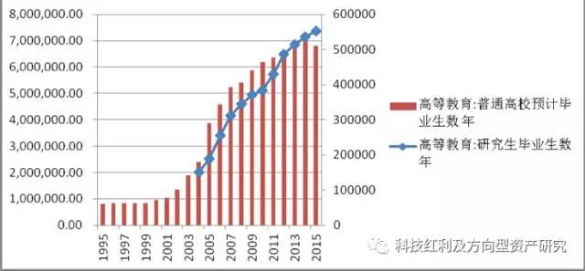

# 科技红利分析研究

本文作者：华创证券 科技TMT行业首席 郑震湘

## 电子白马-下一个五年 迎接千亿市值时代

科技红利重在科技创新带来的企业扩张，对于有效研发投入及有效研发产值的研究，能有效前瞻性判断企业成长方向、速度、空间，过去在我的很多成长股发掘、判断过程中都可以用的到，12年挖掘长信科技、13年到15年市场最底部独家推荐欣旺达，在市场争议时候最早看到公司的营收超预期，13年底部挖掘信维通信，从研发、业务扩张等路径在逐步兑现当时的判断，当时这两只公司挖掘是第一次采用科技红利分析方法的典型案例，只是当时我们采取低层次的研发红利进行分析，还没有完全形成完整的科技红利思想。而今天在回顾过去持续挖掘逻辑和成长路径，科技红利研究方法的感悟更加清晰及明显！在接下来新股发行加快，科技板块将迎来更多的优质公司，探讨消费电子产业的内在规律，从科技红利、压强原则转换率等探讨企业扩张、成长的内在规律可能对于我们产业研究来看更有价值。

**中国科技行业三大阶段，人口红利、资本红利、科技红利！通信行业在04年寒冬之后，苦练内功，进入了科技红利时代，电子行业“大而不强”，从有效研发投入、有效研发产出、压强系数关键指标来看，进入由“工程师红利”往科技红利的临界点，电子白马的科技创新、业务突破有望引领产业整体进入科技红利，电子行业就将迎来通信行业的几倍增长的美好时代！**

**龙头对比，电子白马成长空间还很大，以通信行业、家电行业做对比，电子前20的公司在营收、市值占比集中度还远远低于，营收占比通信、家电达到了90%左右，电子只有55%，而市值占比差距更大，家电、通信分别为63%、57%，电子只有23%，而无论研发投入、客户结构，强者恒强趋势明显，结合科技红利关键因素进入临界点以及电子白马在核心业务延伸、智能制造、产品跨界的综合能力提升，全球供应链竞争能力将大幅提升，电子白马千亿时代正很快走来！**

**从科技红利关键指标的判断以及近期市场回调**，一线白马重点关注，蓝思科技、欧菲光、信维通信、长盈精密、立讯精密、欧菲光、歌尔股份、环旭电子！
 
目录

1、中国科技行业站在科技红利时代拐点！  
1.1 中国科技行业三大阶段，人口红利、资本红利、科技红利！  
1.2 科技红利：科技创新型国家必经之路，拐点到来  
 
2、中国电子目前正处于“工程师红利陷阱”向“科技红利”转化的关键时期  
2.1 中国电子企业“大而不强”的本质  
2.2 他山之石：通信行业如何跨越“工程师红利陷阱”，实现“科技红利”  
2.3 “科技红利”和“工程师红利陷阱”的本质在于“有效研发投入转化系数”  
 
3、电子行业上市公司整体分析  
3.1 平板显示行业整体分析  
3.2 零部件行业整体分析  
 
4、中国电子行业未来3-5年有望出现千亿市值公司  
4.1 中国电子企业间的“混战”，更有利于提升全球产业链竞争地位  
4.2 中国电子行业未来3-5年有望出现千亿市值公司  
4.3 “压强原则”是实现“有效研发投入转化系数”的关键手段  
4.4 相关上市公司分析
 
正文：  

### 1、中国科技行业站在科技红利时代拐点！  

1.1 中国科技行业三大阶段，人口红利、资本红利、科技红利！

第一阶段：人口红利。主要是在1995-2002年左右，依靠劳动力的优势，开展来料加工，以电子基础元器件为主，成本优势是最重要考量指标，跟紧国产化大方向，比如元器件片式化、小型化，最早的一批电子元器件上市公司如风华高科等早期人口红利是其最重要竞争优势之一；

第二阶段：资本红利叠加工程师红利。 中国电子以家电元器件起步，逐步切入PC、智能手机等市场，在这过程中，全球资本扩张下的产业链重构，全球资源再分配对中国电子企业切入全球竞争起了关键作用，资本市场的高估值、包括人才、资金等资源优化配置对中国电子企业的崛起起了关键作用，在全球化产业链重构中，中国崛起了一批白马龙头，而在此期间，又叠加国内的工程师红利最好的十年，对电子行业崛起，核心竞争力提升起了很大作用，产能扩充、进入新客户，切入苹果等全球巨头核心产业链等是崛起的关键因素，国内上市公司如歌尔声学、立讯精密、欧菲光、信维通信、欣旺达等。

第三阶段，科技红利时代，持续的有效研发投入，科技创新带来新兴产业发展方向，拿到产业链的创新溢价！没有科技研发投入，就不能分享科技红利。最典型的公司即是华为持续研发投入，高效转换，引领全球通信行业。科技红利不等同于工程师红利，对于科技创新带来公司有效产值的提升是关键，也是公司维持核心竞争力的关键，也是突破工程师陷阱的关键！研发投入、转换效率及压强系数是突破科技红利的关键因素，前瞻性指标，后续我们将详细讨论！

1.2 科技红利：科技创新型国家必经之路，拐点到来

科技研发红利不仅仅是靠人力成本的工程师红利，核心在于人才，取决于两个基础条件及显性指标：教育投入和留学人员归国率，从海外创新型国家来看，4%的教育占GDP比重是临界点，培养国内优质人才的关键；而留学人员的回归比是海外优质人才输入的关键因素，国际黄金比例为2：1，即归国率2/3，国内随着经济及产业的发展，留学人员回归率大幅提升，从14年来看，将超过50%，这点我们从中关村及张江高科创业海归人数占比持续提升能清楚看到明显上升趋势！

1999年，高科大扩招，2004年研究生扩招，培养高素质新一代；2002年，理工科学生合计6.8万人，2014年理工生学生31万元。而2014年研究生毕业总数是55万，超过一半以上是理工科学生。高素质的理工科研究生将是中国科技创新的践行者。

                          
海外高端人才回归，中国成为除美国之外科技论文作者净流入人数最多的国家。在1999年至2003年期间，中国的科技论文作者流出率大于流入率，但从2004年开始，这一趋势扭转过来，在2009年至2013年期间流入率高达90%。
