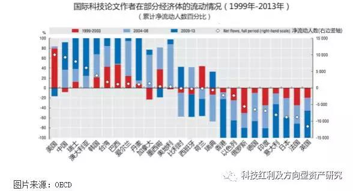
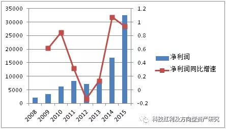
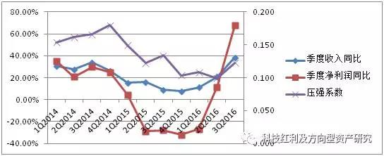
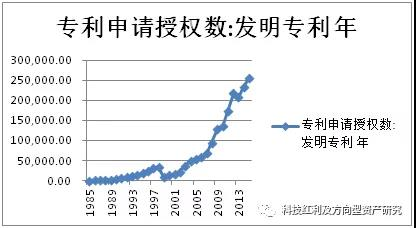
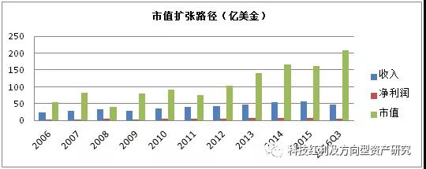

科技红利分析研究

本文作者：华创证券 科技TMT行业首席 郑震湘

<!-- TOC -->

- [【0】注出处](#0注出处)
- [【1】电子白马-下一个五年 迎接千亿市值时代](#1电子白马-下一个五年-迎接千亿市值时代)
    - [1、中国科技行业站在科技红利时代拐点！](#1中国科技行业站在科技红利时代拐点)
        - [1.1 中国科技行业三大阶段，人口红利、资本红利、科技红利！](#11-中国科技行业三大阶段人口红利资本红利科技红利)
        - [1.2 科技红利：科技创新型国家必经之路，拐点到来](#12-科技红利科技创新型国家必经之路拐点到来)
    - [2、中国电子目前正处于“工程师红利陷阱”向“科技红利”转化的关键时期](#2中国电子目前正处于工程师红利陷阱向科技红利转化的关键时期)
        - [2.1 中国电子企业“大而不强”的本质](#21-中国电子企业大而不强的本质)
        - [2.2 他山之石：通信行业如何跨越“工程师红利陷阱”，实现“科技红利”](#22-他山之石通信行业如何跨越工程师红利陷阱实现科技红利)
        - [2.3 “科技红利”和“工程师红利陷阱”的本质在于“有效研发投入转化系数”](#23-科技红利和工程师红利陷阱的本质在于有效研发投入转化系数)
    - [3、电子行业上市公司整体分析](#3电子行业上市公司整体分析)
        - [3.1 平板显示行业整体分析](#31-平板显示行业整体分析)
        - [3.2 零部件行业整体分析](#32-零部件行业整体分析)
    - [4、中国电子行业年有望出现千亿市值公司](#4中国电子行业年有望出现千亿市值公司)
        - [4.1 中国电子企业间的“混战”，更有利于提升全球产业链竞争地位](#41-中国电子企业间的混战更有利于提升全球产业链竞争地位)
        - [4.2 中国电子行业有望出现千亿市值公司](#42-中国电子行业有望出现千亿市值公司)
        - [4.3 “压强原则”是实现“有效研发投入转化系数”的关键手段](#43-压强原则是实现有效研发投入转化系数的关键手段)
        - [4.4 相关上市公司分析](#44-相关上市公司分析)
            - [4.4.1蓝思科技](#441蓝思科技)
            - [4.4.2 欧菲光](#442-欧菲光)
            - [4.4.4信维通信](#444信维通信)
            - [4.4.5长盈精密](#445长盈精密)
            - [4.4.6立讯精密](#446立讯精密)
            - [4.4.6歌尔股份](#446歌尔股份)
            - [3.4.5环旭电子](#345环旭电子)
- [【2】手机平板显示-第三个2年生命周期的行业景气大年](#2手机平板显示-第三个2年生命周期的行业景气大年)
    - [1、智能手机仍是电子制造企业“科技红利”转型的主战场](#1智能手机仍是电子制造企业科技红利转型的主战场)
        - [1.1 产业链转移趋势悄然进行下，“科技红利”思想驱使中国企业更具有主动性、扩张性、创新性](#11-产业链转移趋势悄然进行下科技红利思想驱使中国企业更具有主动性扩张性创新性)
            - [1.1.1 中国电子行业总体产值有望井喷](#111-中国电子行业总体产值有望井喷)
            - [1.1.2 全球产业链转移在悄然进行](#112-全球产业链转移在悄然进行)
        - [1.2 未来3-5年包括中国电子企业在内全球电子制造竞争更加激烈](#12-未来3-5年包括中国电子企业在内全球电子制造竞争更加激烈)
            - [1.2.1 中国电子制造业参与全球电子产业链竞争度](#121-中国电子制造业参与全球电子产业链竞争度)
            - [1.2.2 “科技红利”转型关键时期的行业趋势和核心竞争力要求](#122-科技红利转型关键时期的行业趋势和核心竞争力要求)
    - [2、平板显示行业投资价值分析](#2平板显示行业投资价值分析)
        - [2.1 行业的两年生命周期规律驱动行业产值从千亿到万亿](#21-行业的两年生命周期规律驱动行业产值从千亿到万亿)
            - [2.1.1 移动互联网时代下平板显示行业满足“类摩尔定律”](#211-移动互联网时代下平板显示行业满足类摩尔定律)
            - [2.1.2 两年生命周期规律驱动行业迈入万亿产值时代](#212-两年生命周期规律驱动行业迈入万亿产值时代)
        - [2.3 手机平板显示的技术变革，撬动万亿存量市场](#23-手机平板显示的技术变革撬动万亿存量市场)
            - [2.3.1 类摩尔定律下的“两年生命周期”预示2017-2018年将是行业大年](#231-类摩尔定律下的两年生命周期预示2017-2018年将是行业大年)
            - [2.3.2 行业旗手-非苹果行业旗手有望倒逼苹果2017-2018年进行升级](#232-行业旗手-非苹果行业旗手有望倒逼苹果2017-2018年进行升级)
            - [2.3.3 OLED屏？2.5D/3D玻璃？双面玻璃？撬动万亿存量市场](#233-oled屏25d3d玻璃双面玻璃撬动万亿存量市场)
    - [3、中国2.5D/3D玻璃行业分析](#3中国25d3d玻璃行业分析)
        - [3.1 专利分析](#31-专利分析)
    - [4、3D玻璃相关上市公司分析](#43d玻璃相关上市公司分析)
        - [4.1 蓝思科技](#41-蓝思科技)
        - [4.2 欧菲光](#42-欧菲光)
        - [4.3 合力泰](#43-合力泰)
        - [4.4 智诚光学（胜利精密）](#44-智诚光学胜利精密)
- [【3】全球产业链竞争的思考-科技红利思想才是科技行业和企业研究的王道](#3全球产业链竞争的思考-科技红利思想才是科技行业和企业研究的王道)
    - [1、全球产业链的竞争不在未来，已经在当下](#1全球产业链的竞争不在未来已经在当下)
        - [1.1 中国大陆消费类电子产业链趋势分析](#11-中国大陆消费类电子产业链趋势分析)
        - [1.2 中国零组件行业，似危实机](#12-中国零组件行业似危实机)
        - [1.3 中国手机平板显示行业，霸主已现](#13-中国手机平板显示行业霸主已现)
    - [2、全球产业链的竞争是综合国力的竞争](#2全球产业链的竞争是综合国力的竞争)
        - [2.1 彭博2015年50大创新国家排名](#21-彭博2015年50大创新国家排名)
    - [2.2 中国专利大跃进：连续五年全球申请受理第一、第一个年度突破百万申请受理量的国家，中国专利受理全球占比第一](#22-中国专利大跃进连续五年全球申请受理第一第一个年度突破百万申请受理量的国家中国专利受理全球占比第一)
        - [2.3 中美印在全球科技行业人才资源的竞争](#23-中美印在全球科技行业人才资源的竞争)
        - [2.4 中国高素质人才十年磨一剑，只待“科技红利大时代”转型](#24-中国高素质人才十年磨一剑只待科技红利大时代转型)
        - [2.5 不是美国，是印度：印度电子和IT工业发展](#25-不是美国是印度印度电子和it工业发展)
- [【4】他山之石-国外巨头看中国电子白马的扩张路径](#4他山之石-国外巨头看中国电子白马的扩张路径)
    - [1、他山之石—海外电子巨头的千亿市值扩张路径分析](#1他山之石海外电子巨头的千亿市值扩张路径分析)
        - [1.1 安费诺APH：PS和PE的双重扩张](#11-安费诺aphps和pe的双重扩张)
        - [1.2 泰科电子TEL：获取业绩增长的PE（PEG）扩张](#12-泰科电子tel获取业绩增长的pepeg扩张)
        - [1.3 瑞声科技AAC：具备“科技红利”思想的企业，PS和PE双重扩张](#13-瑞声科技aac具备科技红利思想的企业ps和pe双重扩张)
        - [1.4 大立光：具备“科技红利”思想的企业， PS和PE双重扩张](#14-大立光具备科技红利思想的企业-ps和pe双重扩张)
    - [2、典型白马千亿市值扩张路径](#2典型白马千亿市值扩张路径)
        - [2.1 蓝思科技](#21-蓝思科技)
        - [2.2 立讯精密](#22-立讯精密)
        - [2.3 欧菲光](#23-欧菲光)
        - [2.4 歌尔股份：](#24-歌尔股份)
        - [2.5 欣旺达：](#25-欣旺达)
- [【5】半导体分立器件-稳重求胜 爆发在即](#5半导体分立器件-稳重求胜-爆发在即)
- [1、半导体分立器件格局稳定 汽车应用占比最大](#1半导体分立器件格局稳定-汽车应用占比最大)
    - [1.1 半导体市场属细分领域 行业格局稳定](#11-半导体市场属细分领域-行业格局稳定)
        - [1.2 汽车等高端市场是半导体分立器件驱动的主引擎](#12-汽车等高端市场是半导体分立器件驱动的主引擎)
        - [1.3 供给侧格局稳定 8寸线为主力产线](#13-供给侧格局稳定-8寸线为主力产线)
    - [2、中国分立器件先于集成电路具备全球竞争能力](#2中国分立器件先于集成电路具备全球竞争能力)
        - [2.1 分立器件出口已持续超过进口 且产品结构在不断优化](#21-分立器件出口已持续超过进口-且产品结构在不断优化)
        - [2.2 微观结构上 竞争留下来的企业已具备王者之气](#22-微观结构上-竞争留下来的企业已具备王者之气)
        - [2.3 国家扶持将为分立器件全球竞争力增添资本动力](#23-国家扶持将为分立器件全球竞争力增添资本动力)
    - [3、稳定格局下供给侧的变动2017年国内公司迎来良机](#3稳定格局下供给侧的变动2017年国内公司迎来良机)
    - [4、半导体分立器件进入燃爆节奏：汽车-新能汽车-智能汽车](#4半导体分立器件进入燃爆节奏汽车-新能汽车-智能汽车)
        - [4.1 半导体分立器件进入燃爆节奏：传统汽车-新能源汽车](#41-半导体分立器件进入燃爆节奏传统汽车-新能源汽车)
        - [4.2 半导体分立器件进入燃爆节奏：汽车-智能汽车](#42-半导体分立器件进入燃爆节奏汽车-智能汽车)
        - [4.3 分立器件汽车领域出现超级并购 将成为压强系数导入的关键](#43-分立器件汽车领域出现超级并购-将成为压强系数导入的关键)
    - [5、材料变革支撑行业长久健康之路-SiC与GaN](#5材料变革支撑行业长久健康之路-sic与gan)
    - [6、主流企业处于压强系数导入关键期 汽车产品将成为决定方向](#6主流企业处于压强系数导入关键期-汽车产品将成为决定方向)
        - [6.1 扬杰科技：重点布局汽车/新能源汽车新品已开始量产](#61-扬杰科技重点布局汽车新能源汽车新品已开始量产)
        - [6.2 华微电子：老牌龙头积极转型 获批汽车体系认证](#62-华微电子老牌龙头积极转型-获批汽车体系认证)
        - [6.3 苏州固锝：国内最大二极管生产企业 推进智能产品/汽车产品市占率](#63-苏州固锝国内最大二极管生产企业-推进智能产品汽车产品市占率)
        - [6.4 台基股份：大功率半导体器件领导者 主要应用于钢铁冶金领域](#64-台基股份大功率半导体器件领导者-主要应用于钢铁冶金领域)

<!-- /TOC -->

# 【0】注出处

注1：本文部分图表引用于互联网、公司公告等
注2：本文相关专利说明引用于互联网以及国家相关专利机构等
注3：本文相关公司信息引用于互联网，外媒、公司公告等
注4:本文相关行业数据来自国家统计局、工信部等部委

# 【1】电子白马-下一个五年 迎接千亿市值时代

科技红利重在科技创新带来的企业扩张，对于有效研发投入及有效研发产值的研究，能有效前瞻性判断企业成长方向、速度、空间，过去在我的很多成长股发掘、判断过程中都可以用的到，12年挖掘长信科技、13年到15年市场最底部独家推荐欣旺达，在市场争议时候最早看到公司的营收超预期，13年底部挖掘信维通信，从研发、业务扩张等路径在逐步兑现当时的判断，当时这两只公司挖掘是第一次采用科技红利分析方法的典型案例，只是当时我们采取低层次的研发红利进行分析，还没有完全形成完整的科技红利思想。而今天在回顾过去持续挖掘逻辑和成长路径，科技红利研究方法的感悟更加清晰及明显！在接下来新股发行加快，科技板块将迎来更多的优质公司，探讨消费电子产业的内在规律，从科技红利、压强原则转换率等探讨企业扩张、成长的内在规律可能对于我们产业研究来看更有价值。

**中国科技行业三大阶段，人口红利、资本红利、科技红利！通信行业在04年寒冬之后，苦练内功，进入了科技红利时代，电子行业“大而不强”，从有效研发投入、有效研发产出、压强系数关键指标来看，进入由“工程师红利”往科技红利的临界点，电子白马的科技创新、业务突破有望引领产业整体进入科技红利，电子行业就将迎来通信行业的几倍增长的美好时代！**

**龙头对比，电子白马成长空间还很大，以通信行业、家电行业做对比，电子前20的公司在营收、市值占比集中度还远远低于，营收占比通信、家电达到了90%左右，电子只有55%，而市值占比差距更大，家电、通信分别为63%、57%，电子只有23%，而无论研发投入、客户结构，强者恒强趋势明显，结合科技红利关键因素进入临界点以及电子白马在核心业务延伸、智能制造、产品跨界的综合能力提升，全球供应链竞争能力将大幅提升，电子白马千亿时代正很快走来！**

**从科技红利关键指标的判断以及近期市场回调**，一线白马重点关注，蓝思科技、欧菲光、信维通信、长盈精密、立讯精密、欧菲光、歌尔股份、环旭电子！
 
目录

1、中国科技行业站在科技红利时代拐点！  
1.1 中国科技行业三大阶段，人口红利、资本红利、科技红利！  
1.2 科技红利：科技创新型国家必经之路，拐点到来  
 
2、中国电子目前正处于“工程师红利陷阱”向“科技红利”转化的关键时期  
2.1 中国电子企业“大而不强”的本质  
2.2 他山之石：通信行业如何跨越“工程师红利陷阱”，实现“科技红利”  
2.3 “科技红利”和“工程师红利陷阱”的本质在于“有效研发投入转化系数”  
 
3、电子行业上市公司整体分析  
3.1 平板显示行业整体分析  
3.2 零部件行业整体分析  
 
4、中国电子行业未来3-5年有望出现千亿市值公司  
4.1 中国电子企业间的“混战”，更有利于提升全球产业链竞争地位  
4.2 中国电子行业未来3-5年有望出现千亿市值公司  
4.3 “压强原则”是实现“有效研发投入转化系数”的关键手段  
4.4 相关上市公司分析
 
正文：  

## 1、中国科技行业站在科技红利时代拐点！  

### 1.1 中国科技行业三大阶段，人口红利、资本红利、科技红利！

第一阶段：**人口红利**。主要是在1995-2002年左右，依靠劳动力的优势，开展来料加工，以电子基础元器件为主，成本优势是最重要考量指标，跟紧国产化大方向，比如元器件片式化、小型化，**最早的一批电子元器件上市公司如风华高科**等早期人口红利是其最重要竞争优势之一；

第二阶段：**资本红利叠加工程师红利**。 中国电子以家电元器件起步，逐步切入PC、智能手机等市场，在这过程中，**全球资本扩张下的产业链重构，全球资源再分配对中国电子企业切入全球竞争起了关键作用，资本市场的高估值、包括人才、资金等资源优化配置对中国电子企业的崛起起了关键作用**，在全球化产业链重构中，中国崛起了一批白马龙头，而在此期间，又叠加国内的工程师红利最好的十年，对电子行业崛起，核心竞争力提升起了很大作用，产能扩充、进入新客户，切入苹果等全球巨头核心产业链等是崛起的关键因素，国内上市公司如歌尔声学、立讯精密、欧菲光、信维通信、欣旺达等。

第三阶段，**科技红利时代**，持续的有效研发投入，科技创新带来新兴产业发展方向，拿到产业链的创新溢价！没有科技研发投入，就不能分享科技红利。最典型的公司即是华为持续研发投入，高效转换，引领全球通信行业。**科技红利不等同于工程师红利，对于科技创新带来公司有效产值的提升是关键，也是公司维持核心竞争力的关键，也是突破工程师陷阱的关键！研发投入、转换效率及压强系数是突破科技红利的关键因素，前瞻性指标**，后续我们将详细讨论！

### 1.2 科技红利：科技创新型国家必经之路，拐点到来

科技研发红利不仅仅是靠人力成本的工程师红利，核心在于**人才，取决于两个基础条件及显性指标：教育投入和留学人员归国率，从海外创新型国家来看，4%的教育占GDP比重是临界点，培养国内优质人才的关键；而留学人员的回归比是海外优质人才输入的关键因素，国际黄金比例为2：1，即归国率2/3，国内随着经济及产业的发展，留学人员回归率大幅提升，从14年来看，将超过50%，这点我们从中关村及张江高科创业海归人数占比持续提升能清楚看到明显上升趋势！**

1999年，高科大扩招，**2004年研究生扩招**，培养高素质新一代；2002年，理工科学生合计6.8万人，2014年理工生学生31万元。而2014年研究生毕业总数是55万，超过一半以上是理工科学生。高素质的理工科研究生将是中国科技创新的践行者。

                          
海外高端人才回归，中国成为除美国之外科技论文作者净流入人数最多的国家。在1999年至2003年期间，中国的科技论文作者流出率大于流入率，但从2004年开始，这一趋势扭转过来，在2009年至2013年期间流入率高达90%。

**国家产业政策对科技创新扶持，其本质就是R&D/GDP，中国R&D，占比GDP**，2000年1%，2013年突破2%，而美日德等发达国际，这一比重都超过2%以上。中国十三五规划目标，2020年，R&D/GDP比重达到2.5%，而参考美国、日本、韩国的新兴产业政策崛起，国家的R&D/GDP比重2.5%是个很有意思的临界点，美国1995年达到2.51%，克林顿政府的新兴产业革命带动互联网革命，出现了谷歌、亚马逊等一批互联网龙头，而往前看，日本1987年达到2.53%，日本80年代全球称霸的电子产品行业，如索尼等，也是日本的电子行业崛起，也促使美国的互联网革命，继续保持科技创新的领军者。德国1981年达到2.52%，德国汽车行业崛起，迄今依然是全球龙头。

下面我们将就科技红利在具体行业的体现做详细分析！  

## 2、中国电子目前正处于“工程师红利陷阱”向“科技红利”转化的关键时期

### 2.1 中国电子企业“大而不强”的本质

中国电子零部件制造经历20年的高速发展，依托家电、PC、智能手机等庞大的存量市场，充分分享了“工程师红利”。

第一个阶段：**1995-2002年左右，依靠劳动力的优势**，开展来料加工，中国电子行业达到百亿市场规模。

第二个阶段：**2003-2008年，随着加入世贸，在全球化驱使下**，中国制造充分发挥自身竞争力，行业规模突破万亿规模，这一阶段行业驱动力主要来自家电和PC。

第三个阶段：**2009-至今，中国电子制造行业产值实现翻番，在这一阶段，出现许多优秀的电子行业上市公司，而最主要的行业驱动力是智能手机为代表的智能终端。**

中国电子零部件制造的20年时间，中国企业投入的电子研发投入，增长了将近9.9倍，行业规模扩张了93.8倍，似乎充分显示了中国“工程师红利”的力量。

但是，如果我们从有效研发投入产出进行分析：1995年至今，有效研发投入增长了3.35倍，而有效研发产出增长了3.69倍。

这两组数据综合分析，似乎反映了中国电子制造在全球的核心竞争力地位，“大而不强”。

为什么呢？分析如下：

1995-2004年，有效研发投入增加2.38倍，有效研发投入产值增加4.61倍，这是行业核心竞争力体现，比如，家电和电脑零部件。这可以定义为“工程师红利”。

2004-至今，有效研发投入增加了28%，有效研发投入产出缺下滑了16%。这十年,还能够简单认为“工程师红利”吗？

这十年间，具体细分：

2004-2010年，有效研发投入增加了9%，有效研发投入产值确下滑了-22%。

2010-2014年，有效研发投入增加了17.9%，而有效研发投入产出增加了8.2%，这是苹果为代表智能终端带来的结构性机会。

回顾一下资本市场，2010年，我们似乎不再关注家电和PC零部件企业，热情全在“苹果链”。这就是过去十年电子的结构化。
 
### 2.2 他山之石：通信行业如何跨越“工程师红利陷阱”，实现“科技红利”

我们曾经分析过中国通信、电子等相关科技行业，几乎所有行业都存在这一个背离时期，我们定于为“工程师红利陷阱”。

熟悉我们的朋友都知道，我们曾经分析通信行业：

2004-2008年，通信行业经历了“行业冬天”，虽然有效研发投入依旧保持增长14%，但是却不具备有效性，有效研发投入产值呈现背离，出现下滑超过50%。2008年后，华为为代表的中国企业最终充分展现“科技红利”的力量，突破“工程师红利陷阱”，2008-2014年，通信行业有效研发投入增加1.31倍，有效研发投入产出增加了1.42倍。

中国通信行业一举突破“工程师红利/工程师红利陷阱”切入到“科技红利”最关键的要素在于“有效研发投入转换系数”。
 
### 2.3 “科技红利”和“工程师红利陷阱”的本质在于“有效研发投入转化系数”

2004-2010年，中国电子制造处于明显“工程师红利陷阱”，但通过持续有效研发投入，抓住苹果为代表智能手机的渗透率快速提升，2010-2014年，试图努力走出“工程师红利陷阱”，但是如果中国电子企业依旧维持过去研发模式和经营模式，并没有真正改变电子行业的本质，有可能会陷入“工程师红利的陷阱循环”，中国电子企业必须依靠科技红利方可实现真正的科技创新。

科技红利和工程师红利的本质区别在于“有效研发投入转换系数”。

中国电子制造目前正处于突破“工程师红利陷阱”，向“科技红利”转型的临界点，进一步海阔天空。

电子行业要突破转型零界点，有许多手段方式，最快的就是产业链并，这里我们需要清醒一点，并购是最快，但不能完全说是最有效的唯一手段，无论何种手段，最关键在于聚焦有效研发投入的“压强原则”，后面我们会进一步论述。

## 3、电子行业上市公司整体分析

### 3.1 平板显示行业整体分析

我们选取电子行业上市公司中最具有代表性的平板显示行业和零部件行业进行分析，通过对上市的整体公司的成长情况进一步分析，进一步的阐述“工程师红利”和“工程师红利陷阱”。

 平板显示行业，呈现明显的周期性特征：
 “工程师红利”最美妙的时刻，在中国加入世贸之后，2004-2008年，随着家电行业和PC行业的中国制造化提升，呈现收入和净利润双升的明显趋势，并在2006-2007年达到顶峰。同时毛利率和ROE达到最好的历史水平。
 但是在2010-2015年期间，收入增速维持在40-20%区间，但是净利润呈现大幅度波动性。2010-2011，直接驱动力苹果手机，典型代表莱宝高科。2013年，驱动力是国产智能机，典型代表欧菲光、长信科技。

参考ROE和毛利率，更加清楚看到，2006-2010年，ROE仍维持两位数 15-20%，但是2015年，整个行业ROE相比较2010年大幅度下滑了2.6倍。

通过平板显示行业分析，我们可以清晰看到，行业呈现一种投资驱动扩张的特征，这种特征掩盖了行业的真正本质“工程师红利陷阱”，比如，2010-2011年的大牛股莱宝高科，之后陷入长达数年的产能调整。比如，2011-2012年苦练内功的欧菲光，换取了2013-2014年的光彩夺目。

平板显示行业这种进一步海阔天空，退一步万丈悬崖，使得资本市场聚焦于，企业必须选对技术路线，大客户战略等问题。但是这些问题都没有触及问题的本质，这个本质就是科技红利。

2010-2016年季度看，显示行业需要进行更深层次的研发投入，才可以走出“工程师红利陷阱”。

### 3.2 零部件行业整体分析

零部件件行业，起步于中国加入世贸，2004-2008年，随着中国家电制造的兴起，在2004-2005年达到巅峰，ROE从原来的个位数5-6%提升到25-26%。这一时期是典型的“工程师红利”。

2010-2015年期间，随着智能终端渗透率的提升，虽然收入仍保持20-25%的增长幅度，但是净利润呈现明显下滑，从2011年21%下滑到2015年的9%。毛利率从28%下滑到21%，下滑幅度达到33%，而ROE更是从22%下滑到7.8%，下滑幅度超过180%。和显示行业不一样的地方在于，零部件行业整体仍能够勉强维持“工程师红利”，其背后的深层次是电子零部件制造全球转向中国大陆的大背景趋势，中国零部件企业仍能够通过资本驱动去勉强分享“工程师红利”。

零部件行业季度看：行业整体成长仍能够维持，但是ROE趋势不断下滑。

我们回顾2010-2015年的苹果产业链，歌尔股份、德赛电池，通过08-09年介入苹果产业链，完成早期的研发投入，最终在2010-2012年充分分享了苹果所带来的“工程师红利”，但是，13-15年，整体看苹果终端产品更加丰富，类型更多，整体新产品迭代更快，却无法再次迎来最巅峰时刻的辉煌。

2012年，我们重点研究了欣旺达，不仅仅只是研究供应链，更深层次的从“科技红利”的角度去分析锂电池行业特征、技术趋势、工艺变革等，才有了全市场独家首推，在13-15年上半年，苹果链唯一一家表现最好的上市公司，并且从黑马蜕变为白马。

以上相关公司我们后面会进行重点分析。
 
## 4、中国电子行业年有望出现千亿市值公司

### 4.1 中国电子企业间的“混战”，更有利于提升全球产业链竞争地位

中国电子制造目前核心技术和产品趋势变化：

1）  “核心技术护城河的延伸”：原有单一核心技术向多种复合技术趋势的转变，比如光学、声学、通信技术、金属加工技术等等相互复合。  
2）  新零组件制造技术的智能化：高度集成化、模块化、自动化、柔性化。  
3）  “产品跨界”：相关企业在提升自身产品核心竞争力的同时，积极向相关产品领域进行渗透和延伸。  

全球产业链的两个猜想：  

1）  产业链是否会回流美国；  
2）  产业链向其他新兴市场转移的可能；  
 
我们认为A股电子近年可能会出现一批千亿市值的公司，不仅仅只是说明年苹果新产品带来的创新的机会，最关键的是：  

1）过去三年，中国电子企业都处于科技红利“苦炼内功”的阶段，前文谈到的“有效研发转换系数”，似乎比较清晰的反应了行业有突破趋势的迹象。从上市公司角度看，许多白马公司都在核心技术、核心产品进行横向、纵向的扩张，所有目的都是为了在“工程师红利/工程师红利陷阱”转型到“科技红利”的关键时期占先手，落子布局。

2）目前中国电子制造出现三个明显特征：核心技术衍生、制造智能化；产品跨界；许多A股白马公司出现了产品线、核心技术互相混战的局面。但我们认为，看待目前格局，不应该仅仅局限于中国电子企业之间的竞争，而是放到全球产业链竞争的角度进行分析，这三个明显的特征是有利于提升中国电子企业在全球产业链的整体竞争力。  
 
### 4.2 中国电子行业有望出现千亿市值公司

依据我们过去对于通信行业在内的多个行业进分析，当有效研发转换系数突破1以后，行业总产值在3-5年内会出现井喷。

2008年以来，中国电子行业有效研发投入转换系数虽然在0.5-0.8之间，但是趋势总体向好，如果能够形成有效突破，未来行业总产值将会出现井喷的可能。

2015年，A股电子板块收入规模前30上市公司占比所有电子上市公司数量的比例19%左右，不到20%的前30家上市公司营收收入占比全部上市公司总收入比例超过60%，明显的二八规律。

A股收入规模前30上市公司占比全行业产值比例仅为9.02%。

目前，A股上市公司营收收入和市值比较，并没有充分反映新形式下科技红利的“压强原则”重心，收入规模前20家上市公司占比所有电子上市公司收入比重50.72%，而市值占比21.54%；收入规模前30家上市公司占比所有电子上市公司收入比重60.84%，而市值占比是33.25%。

我们认为，未来3-5年，随着中国电子企业科技红利“压强原则”，随着有效研发投入转换系数有效突破，A股上市公司有望出现收入规模突破300-500亿元的，市值规模突破1000亿。

而我们横向比较进入科技红利的通信行业以及成熟的家电行业，行业集中度及市值占比都比电子行业要大很多，而从我们产业分析以及有效研发投入情况，电子前20家公司大于后续，从科技创新以及优质客户，电子白马将强者恒强，切入科技红利提升全球竞争力，市值占比将有望大幅提升！

### 4.3 “压强原则”是实现“有效研发投入转化系数”的关键手段
 
中国电子零组件制造，无论是平板显示行业，还是零部件行业，正处于“工程师红利陷阱”向“科技红利”转化的关键时期。电子行业从2000年以来，伴随着家电、PC、智能终端行业的快速发展，而不断壮大。但目前而言，虽然穿戴式、虚拟现实等新技术不断涌现，但是这些行业相比较家电、PC、智能终端，很难形成有效的整体突破，换言之，短时期内，我们无法找到一个可以媲美智能手机相近体量的行业，去满足于电子行业突破“工程师红利陷阱”。

哪些行业有可能是电子行业形成“科技红利”的新的蓝海，我们后面找机会和大家进行分享。这里，我们重点分析电子行业典型的白马公司。
 
中国电子制造行业，无论是技术和产品的三个趋势，还是全球产业链的两个猜想，都只能加剧中国企业快速从“工程师红利/工程师红利陷阱”转向“科技红利”。

2014-2015年中国电子相关上市公司研发费用投入从150亿元增加到225亿元，同比增长了49.5%。研发费用占比营收收入比例从4.0%提高到4.96%。

中国电子科技企业要实现“科技红利”，突破“工程师红利陷阱”，本质在于“有效研发投入转化系数”，而“压强原则”确是科技企业实现“有效研发投入转化系数”的关键手段。

### 4.4 相关上市公司分析

2000年以来，A股电子涌现许多大牛股，在转型“科技红利”的时期，叠加面临行业和全球产业链趋势以及变化，我们认为具备以下核心竞争力的企业将具备胜出的可能：

1）  核心技术具有衍生能力；
2）  制造能力具备智能化；
3）  产品具有跨界能力；
 
#### 4.4.1蓝思科技
上市之前，作为行业龙头公司，公司经历了上一轮“工程师红利”，上市之后经历了“工程师红利陷阱”，目前公司正处于“科技红利”的“压强原则”导入期。

1）2011-2013年公司处于“工程师红利”时期，同期，有效研发投入增长了1.09倍，有效研发投入产值增长了48.5%。同时期，收入增长了1.21倍，净利润增长了97.7%。这一时期，压强系数始终保持高位。

2）2013-2014年，公司整体处于“工程师红利陷阱”中，这一时期，有效研发投入增长了54.5%，而有效研发投入产值下滑了-19.5%。收入看，增长了29.8%，净利润下滑了41.1%。2014年压强系数出现历史以来的腰斩，下降了一半左右。

3）2014-2015年，乃至2016年，公司处于科技红利的“压强原则”导入时期，公司有效研发投入增长了1.12倍，有效研发投入产值仅仅增长9.87%。但是压强原则呈现小幅度上行趋势。
 
4）公司目前正处于转向“科技红利”的关键时期：2017年有望突破“工程师红利陷阱”，实现“科技红利”

2015/2016年以来，公司重点布局蓝宝石、精密陶瓷、3D曲面玻璃、生产自动化领域等。目前具备了成熟的蓝宝石长晶设备制造、蓝宝石生产、后段加工的全产业链生产制造能力，精密陶瓷设计、胚料制造、成品加工制造能力，以及3D曲面玻璃的批量生产能力，并逐步开始自动化设备在各工艺环节的导入。

2016年以来，公司的3D曲面玻璃生产工艺得到不断改进，部分关键工艺取得重要突破，对降低3D曲面玻璃的生产成本、提升良率具有重要意义。公司新获得专利授权53件，其中发明专利8件，新申请专利244件，其中发明专利50件。

2016年1季度，公司压强系数经历最低谷，从二季度开始逐步提升，三季度压强系数呈现明显拐头向上趋势，我们预判公司2017年科技红利的“压强原则”后半程，并有望2017-2018年进入“科技红利”分享期。

未来看点方向：

- 公司是全球玻璃盖板首屈一指，凭借连续多年在研发、设备投入的优势，行业领先优势明显，良率、工艺领先行业，受益苹果外观双面玻璃升级，再次迎来爆发性机会，扩大行业领先优势。主要客户包括苹果、三星等智能手机龙头公司，16年上半年两大客户的合计收入占比64%，其中苹果占比34%。15-16年间采用双玻璃方案的机型明显增多，仅16年发布的就有10几款，其中采用3D玻璃作为后盖板的达到5款，三星因为在oled的明显优势，推动3D玻璃的推广应用，预计随着苹果在3D玻璃的推广，将成为高端手机的主流配置，目前瓶颈除了3D玻璃自身的产能、良率等，oled产能瓶颈也是制约的重要因素，而随着2018年oled产能陆续投放，3D玻璃有望迎来大爆发，蓝思科技在3D玻璃研发、设备大幅领先行业，将充分受益；我们预计随着无线充电的普及，以及OLED屏幕的应用，双面玻璃设计有望成为主流方案，而3D玻璃亦有望突破量产瓶颈之后逐步放量。作为寡头垄断型产品，龙头公司将配合客户解决难题，压强原则使得公司未来有望显著受益17年的玻璃大年；预计从单面到双面，2D->2.5D->3D空间翻番，此外公司研发一代、储备一代、生产一代，在陶瓷、蓝宝石等领域也已完成产业布局。

- **玻璃行业的变革期，特别是3D玻璃，设备是核心、良率的提升是关键，研发的持续投入是驱动力！**从 2011 年至 2016 年上半年,公司研发支出占营收的比重持续增加,由 2.44%一路增至 12.02%，而有效研发投入持续提升，有效研发产值大幅增加，特别是15年开始公司研发集中突破，在16年下半年开始加快转换，预期17年转换速度将大幅提升。公司已经掌握了“3D 玻璃热弯成型技术”和“3D 玻璃热熔成型技术”以及生产基础,已具备量产 3D 曲面玻璃的能力,幵实现向小米、三星等客户供货。而a客户的3d玻璃调试测试中！从专利来看，已经完成了前瞻性布局，上市之前就参股了香港 3D 科技有限公司以及湖南三维玻璃科技有限公司,两家公司均涉及 3D 玻璃技术的研发、生产和销售。获得的94项专利中，涉及10多项自主研发的3D玻璃技术；14年自主研发完成2.5D/3D玻璃热弯成型技术和热熔成型技术，15年通过新的丝印技术大幅降低了3D产品的后期处理成本。公司已积累了3D玻璃相关的热弯、抛光、成型、镀膜等工艺技术，工艺难度远高于2.5D玻璃；有望在玻璃大年继续保持寡头竞争格局。

- **玻璃行业的研发实力重要体现在自动化能力提升，这也是蓝思科技的关键能力，董事长一直重视设备的投入，蓝思核心设备及工艺能力是公司长期以来保持核心竞争力的关键！提升智能制造水平，期待突破工程师红利陷阱。**公司在业内一直以定制化的智能制造成名，包括董事长在内对自动化精通，高度重视公司拥有完整的生产设备，自动化程度远高于其他竞争对手。自动化能力将使得公司在未来行业爆发之时，突破工程师红利的天花板，实现科技红利。并且在7月份公告出资6000万元合资设立蓝思智能机器人公司，积极尝试布局机器人产业，以实现机器人开发、零配件组装、机器人制造、机器人技术咨询、智能化技术研发等。实际上，公司在业内一直以定制化的智能制造成名，公司拥有完整的生产设备，自动化程度远高于其他竞争对手。自动化能力将使得公司在未来行业爆发之时，突破工程师红利的天花板，实现科技红利。

- **压强系数进入拐点，公司业务结构扩张趋势打开，而良率等将持续提升！**从财务报表上来看，受折旧、自动化改造影响和苹果销量下滑等影响，公司2016上半年营收及净利润下滑显著，2016年上半年完成定增，2016年q3毛利率、净利润等水平大幅提升，而研发、转换率水平将进入拐点将持续上升，反映到公司最明显的就是良率提升，压强系数预期四季度将突破拐点，进入营收、净利提升的最美妙阶段，在苹果十周年，预期苹果销量大幅提升，新技术切入，公司毛利率、净利率将大幅提升，企业迎来高速扩张趋势！

#### 4.4.2 欧菲光

公司触摸屏弯道超车，称为电子的一线白马，目前形成消费电子领域的光学&光电事业群+汽车电子领域智能汽车事业群，从15年开始新产品拓展加速。从科技红利角度看，公司上市以来2010-2014年一直高度受益于“工程师红利”，但最近14-15年“压强原则”并不明显，压强系数处于低位，使得公司同期处于“工程师红利陷阱”。

1）2010-2015年，工程师红利阶段，有效研发投入增加了6.47倍，有效研发投入产值增加了6.06倍。

第一阶段，2010-2012年，“工程师红利”的“压强原则”，有效研发投入增加了1.12倍，有效研发投入产值增加了0.72倍。明显的压强点是2010-2011年，公司有效研发投入增长了30%，有效研发投入产值增长了20%。从收入和净利润同比看，收入同比增长了101.43%，净利润同比下滑60.24%。此时刻，有效研发投入的压强系数呈现线性上行趋势，2012年迎来营收同比增加215%，净利润同比增加1450%。

2）2012-2014年，充分分享“工程师红利”，有效研发投入增加1.31倍，有效研发投入产值增加了2.14倍。收入和净利润同比增速看，收入增长3.95倍，净利润同比增长了1.12倍。这一阶段，压强系数出现震荡下行趋势。

3）2014-2015年，处于工程师红利末期。有效研发投入增加了52.3%,有效研发投入产值增加了30.5%，但是压强系数保持低位震荡。从收入和净利润趋势看，收入同比下滑-5.05%，净利润同比下滑-29.8%。

4）公司目前正处于转向“科技红利”的关键时期：需要进一步有效提高压强系数

2014-2015年，公司压强系数进一步下滑到公司上市以来底部区域。15-16年以来，公司积极推进光学光电子显示和智能汽车两大板块，目前智能汽车仍处于培育阶段。

公司的光学光电事业部分为三大板块：触控显示、光学和传感器。

触控产品线：垂直一体化，全方面布局液晶到OLED。从触控sensor延伸到盖板玻璃、全贴合、LCM模组，涵盖产业链上除了显示面板外的所有环节；在OLED领域，公司积极布局3D贴合、薄膜式触控方案、3D玻璃等。

光学产品线：重点发展双摄像头，双摄模组占据国内主导地位。单模组：当前公司8M以上中高端产品占比约75%；双摄模组：预计2016年下半年开始批量出货；2016年底形成有效产能3KK/月以上。

传感器产品线：指纹识别进入收获期，积极布局虹膜识别和人脸识别。目前以电容式方案为主，产能超20KK/月，位居全国第一；下一阶段将重点研究underglass超声波、全屏指纹识别。

虹膜识别和人脸识别：公司依托摄像头模组的硬件优势，结合3D成像算法开发出了基于双摄像头的人脸识别软件、硬件综合解决方案和基于红外摄像头的虹膜识别软件、硬件综合解决方案。

截止到2016年，公司在全球共申请2313项专利（包括国内专利1824项、海外专利489项），已获得授权1382项专利（包括已授权的1037项国内专利、已授权的345项海外专利），其中已授权的发明专利516项（国内发明186项，海外发明330项），已授权的实用新型专利866项（国内新型851项，海外新型15项）。

2016年三季度，压强系数依旧呈现低位震荡，公司需要进一步持续的有效提高“压强系数”，确保在新产品领域竞争力进一步提升。

未来看点总结：

欧菲光主要有两个事业群：消费电子领域的光学&光电事业群+汽车电子领域智能汽车事业群

公司光学光电事业群主要分为三个部分：

（1）触控显示：公司优势有触控显示全产业链技术储备、薄膜触控的核心技术，未来OLED趋势下仍保持较强优势；  
（2）光学：公司的技术积累+索尼华南厂整合，未来摄像头新客户、双摄产品有望带来巨大业绩弹性；  
（3）传感器：公司指纹识别、虹膜等技术储备，未来受益于渗透率的持续提升+技术升级（Underglass、全屏指纹方案等）  
公司汽车电子事业群主要分为三个板块：  
（1）HMI（Human Machine Interface），人车交互系统，主要产品是中控台和数字仪表；  
（2）ADAS传感器和系统，在布局产品包括车载Camera、毫米波雷达、倒车影像、360°环视等；  
（3）车身电子：以收购的华东汽电为基础，产品有雨光亮传感器、总线系统、能源管理等。  

- 触摸屏纵向开拓，oled的渗透率提升，有望打开film的新的成长空间。公司从2010年开始进入触摸屏产业，2013年即成为全球龙头，特别是在外挂式薄膜触控领域取得绝对的领先地位；目前产能约20KK/月。公司把握行业趋势，核心技术延伸，全球最先进产业技术比如TDDI带指纹识别的触摸屏、体感、压力触控等都将保持领先，随着OLED成为新的产业趋势，而可选的触控解决方案为oncell和film，而从未来模组整合趋势来看，film有望成为成为主流方向，a客户大概率选择film作为oled方案的触控解决方案，欧菲光在film的绝对优势有望打开新的成长空间。新客户，积极寻求所有最大下游空间的覆盖，争取切入新客户。新技术扩展，积极布局OLED。
  
- 从触摸屏到指纹识别，制造智能化能力体现。苹果引领指纹识别后，高端手机阵营成为公司是指纹识别领域国内布局最快的企业，从15年5月份开始出货，15年2000万颗，预计今年截至到3季度共出货约1.3亿颗；从出货开始即牢牢掌握行业龙头地位，最高市占率达到8成，供应链整合，与瑞典 FPC、美国新思(Synaptics)、国内汇顶等芯片供应商形成战略合作关系,作为最大的模组供应商，国内华为、小米等主力供应商。核心技术纵向上，公司在强化现有电容式的主流方案的同时，积极开发下一代under glass超声波方案、全屏指纹识别方案。
  
- 双摄像头模组预计将是明年最大的进攻点，iphone7 Plus进一步推进双摄像头成为高端手机标配。摄像头作为图像输入端口一直以来都是智能手机最重视的领域之一，而摄像头技术的提升结合整体软硬件解决方案的配合对手机在AR/VR、人工智能等方向创新也将起到重要作用！摄像头的技术创新将是未来三年的智能手机差异化微创新主要方向之一，像素增强、全景深拍摄、弱光拍摄和TOF技术的引入等都将是持续创新方向！公司从2012年开始布局摄像头模组，2015年出货达到全球第一，双摄像头单价提升以及在高端手机的普及将进一步提升公司的营收以及盈利能力。目前公司的双摄像头切入国内主要客户供应链，目前主要竞争对手为舜宇光学，而公司软件＋硬件的全面能力、智能制造能力以及触屏、指纹识别、摄像头形成的优质客户能力将有利于公司双摄业务的持续导入，形成17、18年的增长亮点。收购索尼华南工厂，切入大客户产业链，通过收购获得供应大客户前置摄像头的机会；未来如果能够继续通过收购具备双摄能力的索尼熊本工厂，那么将更加有利于快速提升压强系数。
  
- 积极投入汽车电子的研发，储备新的增长方向，汽车电子是我们持续看好的未来五年科技大方向，基于智能汽车带来的汽车电子增量成为消费类电子龙头的必争之地。2015年开始布局汽车电子与智能汽车领域，包括ADAS系统、人机交互、汽车电子和车联网；现有产品包括后视摄像头、高清环视系统、ADAS智能环视系统；压强原则使得公司进展依旧迅速，预计目前已拿到国内车厂的订单。公司研发立足高端，团队来自于传统优势企业，同时在上海、慕尼黑设立研发中心，利用车身电子等产品的取得核心整车厂的TR1资质，未来将持续导入ADAS传感器等新产品。

#### 4.4.4信维通信

中国电子民营企业蛇吞象的典型代表：通过收购一举提升压强系数。这是我们2012-2013年针对公司收购莱尔德第一次采用科技红利分析方法的典型案例，只是当时我们采取低层次的研发红利进行分析，还没有完全形成完整的科技红利思想。

1）2008-2010年，上市之前，起步于中国“华强北山寨”功能机市场，充分分享“工程师红利”，期间有效研发投入增长了112.29%，有效研发投入产值增长了51.26%，这一时期，收入增长了144.57%，净利润增长了161.98%，压强系数持续高位上行。充分体现这一时期中国电子制作企业的特征，只要有投入，能够制造产品，就能够获取收益。

2）2011-2013年，2011年公司首次上市，此时“中华酷联”为代表智能终端崛起，公司压强系数持续上行。2012年公司收购体量巨大的北京莱尔德，超高位的“压强系数”也使得公司经历两年的阵痛。期间，有效研发投入最高增长了114.75%，有效研发投入产值下滑-14.85%。从收入增速看，增长了116.15%，净利润出现首次巨大亏损，超过6000万元。公司通过收购，一举提高“压强系数”，这一时期，是公司工程师红利的“压强原则”导入时期。因为2012-2013年收购体量巨大，并且造成亏损，此时12-13年的亏损，构成一个压强点的奇异值。

3）2013-2015年，通过消化莱尔德，公司获取客户、技术专利等，在2014年就实现净利润扭亏为盈，业绩突破6300万元。这一时期，公司有效研发投入减少-54.38%，有效研发投入产值增长了30.66%，充分分享了“工程师红利”。从收入业绩看，收入增长了269.01%，净利润增长了437.39%。
如果我们从2011年上市第一个完整财报年开始计算，2011-2015年，公司有效研发投入减少了50.4%，有效研发投入产值增长了11.26%，2011-2015年，收入规模增长了6.97倍，净利润规模增长1.93倍。
 
4）公司目前正处于转向“科技红利”的关键时期：2017年寻找新的“压强原则”导入时期
收购莱尔德后，2014-2015年公司压强系数呈现上行趋势，如果公司要顺利跨过“工程师红利陷阱”，直接进入“科技红利”阶段，需要寻找新的“压强原则”导入时期。

2015年以来公司围绕射频技术核心积极对外延展扩张：  

公司收购了深圳亚力盛连接器剩余80%股权，使其成为公司的全资子公司，拓展了测试类连接器、汽车连接器等产品。

公司投资深圳艾利门特科技33%股权，成为第一大股东，布局金属陶瓷粉末注射成形领域，开发新兴的金属陶瓷材料的MIM制品，比如钨合金、钛合金、铝合金、陶瓷氧化锆等产品技术和市场。

公司控股了上海信维蓝沛，占其51%股权，涉及无线充电、超小型化的贴片式NFC天线、LTCC 加工技术及用于替代传统铁氧体的非晶和纳米晶磁性材料的研究与开发。

2015年公司共申请专利95项，其中发明专利44项；共获得专利授权56项。截至到2015年，公司共申请专利191项。

扣除13-14年奇异点因素，公司压强系数逐步提高，这主要来自于公司15年以来持续的收购，布局新技术和新产品。我们认为17-18年，公司有可能进入新一轮的科技红利“压强原则”导入期。

2016年以来，公司聚焦射频技术为核心，提升自身竞争力的同时；积极布局高性能射频连接器及为解决整机EMC/EMI的精密五金部件、LDS产品、音频产品及音/射频模组等，其中新材料天线零部件如NFC、无线充电、无线支付模组等新品已批量交货。

未来看点总结：

- 积极外延，提升压强系数。先后增资控股新材料供应商上海光线新材料（原信维蓝沛）、将连接器企业亚力盛纳入全资子公司、成为掌握MIM技术的艾利门特第一大股东、斥资3亿元加大声学投资，保持主业动力的同时扩展无线充电、NFC移动支付、声学业务以及连接器等多方面业务。相同客户的单体价值提升，将有效提升压强系数的同时，提升公司的成长性。
  
- 核心技术衍生，打造音射频一站式解决方案供应商。声学领域新的竞争格局给了公司进入该领域的发展机会，顺应音、射频相关技术演进趋势的变化，满足客户的多元化需求，为客户提供射频、音频及音射频一体化的服务。伴随客户实际需求的研发投入，重点围绕着客户的变化而进行前瞻性的改变，是提升有效转换效率的关键。我们认为，这将成为公司下一个成长周期的关键节点。

- 产品跨界，天线业务将迎来重大变革，公司研发投入处于领先水平。2020年5G将实现全球商用，届时5G射频模块单机价值量将提升几十倍，门槛也将大幅提升（包括阵列天线与新材料的应用）。公司布局的包括滤波器、功放、开关等高端射频前端器件业务将会成为新的收入利润点。

- 双激励落地，夯实最根本的驱动人才。1）股权激励方案授予限制性股票2000万股。公司于2016年9月曾发布限制性股票激励计划，于12月2日正式发布了股权激励草案，拟授予的限制性股票数量为2000万股，占草案公告时公司股本总额9.6亿股的2.082%。激励计划授予的激励对象总人数为241人，包括公司任职的董事、高级管理人员、中基层管理人员、核心技术人员等。 2）员工持股计划超预期自筹6.5亿。公司于12月2日发布了第一期员工持股计划，此次计划筹集资金总额上限为6.5亿元，参加本次持股计划的总人数不超过50人，其中公司董监高8人。

#### 4.4.5长盈精密

公司是国内金属件结构商龙头，收购广东方振切入防水部件领域，带来新的增量，并开拓下游汽车电子领域拓展，而公司的核心能力在于自动化设备，除了公司自身的天机、松庆外，公司董事长近年围绕自动化平台投资的数十家自动化及相关业务公司（此次方振也是公司最初投资的项目），围绕自动化研发及客户的联动作用对加强公司在原有能力，提升压强系数将有关键性作用，而如果自动化平台成型，成为智能化平台将有利于公司继续上一个新的台阶！
金属机壳持续高增长，公司目前自有及外协cnc近万台，良率行业顶尖水平，作为OPPO、Vivo、华为、小米等国产主流手机厂商的重要供应商之一，尤其是在OPPO第一供应商、Vivo第二供应商，盈利能力较强， 2017 年全球金属外壳出货量有望达到 15.2 亿部,渗透率达 48%;中国金属外壳出货量有望达 3 亿部,渗透率超过45%，17年OPPO、Vivo产能规划增速大幅增长，并且金属机壳单价有望提升，公司将份额、单价有望提升，“双面玻璃＋金属中框”方案渗透率提高，金属中框起到手机支撑和承载的核心作用，而金属中框材质由于硬度等需求，不锈钢或钛合金等硬质金属的需求有望提升，加工时间和难度加大，价格维持稳定甚至上升，金属机壳业务保持40％左右高增长。

收购广东方振，切入防水材料，净利率水平较高，提升压强系数。LSR(液态硅胶)作为新一代防水材料,市场爆发在即。与金属嵌件和塑料复合成型的特殊能力,使液态硅胶 LSR 作为防水硅胶结构首选材料。LSR 具有众多优势和特点,包括优异的电气绝缘性能、耐老化性能,机械强度高、弹性好、成型快速方便且安全卫生、产品可延伸性强等优点,可制成不同形态、不同用途的系列化、差别化产品。LSR(液态硅胶)市场空间上百亿，从目前来看，高端手机的防水成本在50％左右，公司收购广东方振切入新兴领域，业绩弹性巨大，切入a客户供应链体系，并有望结合公司的金属结构件优势，切入国产高端客户，进一步放量。

- 汽车电子业务切入下一个蓝海，智能汽车是我们看好的未来五年大科技方向，公司以自身精密加工、模具以及连接器行业的技术积累，积极切入新能源汽车和汽车电子相关供应链，昆山惠禾新能源将主要集中于充电枪、充电插座、高压线束和总成的开发，而公司以三电之间连接组件为产业方向，是公司原有业务能力拓展，汽车电子产品能力及渠道是关键，从公司未来产业方向布局来看，通过积极外延优质资源，提升自身实力及客户能力，进一步提升压强系数是关键。

- 智能制造能力是电子白马的核心能力，中国电子白马崛起，智能制造平台公司肯定会出来，具备极高战略价值！公司自动化能力突出，公司董事长近年围绕自动化平台投资的数十家自动化及相关业务公司，在智能制造，机器人等领域全产业链全面布局，将是长盈未来发展的重要支撑。公司自动化能力不仅是自身制造行业的杀手锏，提高良率达到技术水平，如果公司完成平台整合，进行自动化输出，对公司发展及平台将上一个新的台阶。2015年成立广东天机智能，业务涉足工业智能系统方案开发、设计;工业智能设备集成;机器人开发制造;工业智能设备开发制造;工业智能系统技术咨询及工程服务，研发能力突出，3D玻璃的热弯机开始送样，反映公司的产业反应能力及平台研发能力。2016 年携手量鼎资本成立 20 亿元产业并购基金，继续加大智能制造、智能装备领域的并购拓展，平台整合。，中国电子白马崛起，一定会出现智能制造平台公司，如何完成智能制造平台整合，将是长盈精密突破关键！

欣旺达

这是中国电子制造产业通过“弯道超车”提升行业竞争力的典型案例，我们从2012-2013年开始深度研究，2013-2015年上半年全市场首家、独家推荐。
1）2008-2010年，上市之前，公司有效研发投入增长了11.11%，有效研发投入产值增长了31.27%，期间，压强系数持续上行，从成长性看，收入增长了58.79%，净利润增长了197.96%。从受益于功能机直接为苹果3、亚马逊等高端客户供货，似的这一阶段具有科技红利得部分特征。

2）2010-2013年，上市之后，公司苹果供货资格被友商取代，重新开始进行新的工程师红利“压强原则”的导入，2012年是压强点。期间，有效研发投入增长了28.73%，有效研发投入产值增长了46.76%，同期压强系数保持稳定，收入增长了113.61%，净利润下滑-1.98%。这一时期，也是公司通过提升内部核心竞争力，抓住电子行业三个趋势中的“制造智能化”趋势，通过弯道超车，实现行业竞争力提升。

3）2013-2015年，公司开始进入工程师红利得释放，有效研发投入增长了146.41%，有效研发投入产值增长了123.70%，此期间，压强系数逐步提升，使得收入增长了193.71%，净利润增长了301.09%。
 
4）公司目前正处于转向“科技红利”的关键时期：2017-2018年需要进一步有效提高压强系数

过去两年，公司打造全新的“PPS”战略，在发展壮大现有锂离子电池产业链的基础上，通过内部培育投资、资本运作等多种途径，向VR、可穿戴设备、能源互联网、电动汽车动力总成、智能制造、检测服务等领域进行延伸和拓展。

2016年以来，公司在继续保持传统核心业务3C类锂离子电池模组快速发展的基础上，重点扩大动力电池与储能业务等产品的产能储备和研发投入。公司目前拥有和申报的专利共计189项，其中获得授权111项、申报专利78项。

2015年以来，公司压强系数达到阶段高点，2016年呈现下行震荡趋势，要警惕2017年压强系数震荡下行趋势的可能，未来两年公司需要进一步有效提高压强系数。

未来看点总结：  

- 我们一直强调电池是智能硬件的瓶颈，下一阶段双电芯+快充将继续提升产业链价值。我们预计，相较于传统的单电芯电池，手机电池单价将提升3-5成，并将大幅提升BMS以及Pack公司的附加值。公司凭借自动化设备能力及生产工艺切入a客户后，有望率先取得下一阶段产品的供应资格，提高压强系数。
  
- 公司有强大的自动化研发团队，也是公司切入a客户后在品种和份额持续提升的关键！自动化产线使用的设备大部分是自主研发的，在传动、控制、光学、测量等方面均有很强的实力，可实现3C类、动力类、储能类电池的生产及其他部分设备零部件的生产。现已有通过自动化设备及自动化整线的对外输出实现收益的增长。

- 动力电池及储能有望打开未来长期成长空间，也是公司接下来压强系数提升的关键。公司从2011年开始布局，至2015年公司已形成强大的研发团队，同时在客户资源、技术储备、生产工艺、自动化设备等方面已经初具规模。公司持续增加在相关技术、人才、产能、供应链资源等方面的投入，逐步形成公司的核心竞争力，树立公司的品牌形象，具备稳定可靠的生产能力。公司电动汽车类动力锂电池业务瞄准国内外新能源汽车行业标杆客户，有计划地逐步展开合作。目前与多家汽车客户均达成战略合作。2016年下半年博罗基地多条全自动Pack产线会陆续建成并投入使用。电动自行车领域，公司目前已拥有众多优质客户。公司储能业务从2015年开始陆续接到项目订单，行业爆发，公司将是第一梯队受益。

#### 4.4.6立讯精密
公司是比较典型的中国电子制造企业，几乎经历中国电子制造业各个发展阶段。
2009-2015年，处于完整的“工程师红利”阶段，期间有效研发投入增长了6.27倍，有效研发投入产值增长了1.13倍。

具体可以划分几个阶段：

1）2009-2011年，工程师红利，充分全球电子制造转移中国，直接受益于家电、PC等行业。有效研发投入增长了93.1%，有效研发投入产值增长了35.3%。期间，收入规模增长了3.37倍，净利润规模增长了2.46倍。压强系数保持线性上行趋势。

2）2011-2013,上市以来，公司处于压强原则导入时，11-12是压强点，有效研发投入增长了105%，有效研发投入产值增长11%，这一阶段，收入规模增长了79.67%，净利润增长了32.12%，压强系数处于高位区间震荡。

3）2014-2015年，整体保持工程师红利，有效研发投入增长了83%，有效研发投入产值增长了42%。期间压强系数处于高位稳定区间，使得这一阶段，收入规模增长了120.82%，净利润增长了217.42%，充分分享“工程师红利”。这期间，公司进行并购，这是短时期提高“压强系数”的有效手段。
 
4）公司目前正处于转向“科技红利”的关键时期：2017年必须持续保持高位“压强系数”
2011-2015年以来，压强系数呈现边际递减的可能趋势，这需要非常警惕，未来公司需要保持高位“压强系数”，重新上行趋势，才有可能跨越“工程师红利陷阱”，直接切入“科技红利”。

2015年以来，公司充分发挥在连接线、连接器等核心领域的优势地位，同时积极衍生为零组件整体方案解决商，不断强化在PC和智能手机领域的领先优势，也不断持续在汽车电子和通信进行新产品开拓。

2015公司新申请专利225项，取得专利授权185项，截至2015年底，公司在海内外共取得各项专利700余项。

2016年以来，公司智能手机领域竞争力持续提升，初步具备成为全球领先的互联解决方案提供商，在规模化制造和模组化生产领域优势显现。

需要特别注意的是，2016年1季度以来，公司“压强系数”呈现边际递减可能，公司2017-2018年必须保持高位“压强系数”。

未来看点总结：

- 核心技术延伸，无线充电是大趋势，公司提前布局，确定受益。公司判断，尽管无线充电目前还存在使用体验较差，标准不一的问题，从智能手机的发展趋势判断，无线化是大的发展方向，无线充电也必然成为一个确定性的趋势。公司目前是苹果手表无线充电发射端的唯一供应商以及接收端的主力供应商，在无线充电有完善的技术储备，可以提供苹果以及非苹果标准的无线充电模组/解决方案。公司无线充电得到苹果认可，彰显公司实力，无线充电行业爆发，公司确定性受益。
  
- 声学、马达、天线等新品不断，重回确定性增长轨道。公司传统业务为连接器，目前通过自研以及外延的方式，完善在3C领域的产品布局，在声学、马达、天线都已经有了产品储备，并且实现了出货。Iphone7取消3.5mm接口，采用双扬声器，声学升级成为智能机重要发展方向。公司控股苏州美特，声学实力大幅提升，未来声学方面极有可能获得大额订单。公司的天线和马达同样值得期待：公司的天线除了在3C领域应用之外，也有望切入到通讯领域；从普通马达到线性马达公司都有产品布局。公司判断在天线和马达业务很快就能释放业绩，成为公司业务的重要支撑。公司新品不断，布局完善，产品得到大客户认可，今后三年将迎来确定性增长。
  
- 除去海外的经营场地，目前公司在国内的约20个厂区的建筑面积累计相加约80万平方米，而目前公司在建的三大厂区（分别为东莞立讯厂区、苏州丰岛科技园、越南厂区）的规划建筑面积合计已超过了80万平方米，而三个厂区的建设周期最长的为3年，最短的为8个月，从这个数据对比上我们可以看到，公司将用三年左右的时间，再造一个立讯。
  
- 公司是行业内连接器龙头，客户资源优质，产品提前布局，通过自研及外延完善产品布局，新品（声学、天线、马达）已经得到客户认可，放量是大概率事件。
  
#### 4.4.6歌尔股份
从科技红利角度看，公司经历了“工程师红利”、“工程师红利陷阱”，目前处于转向“科技红利的关键时期”。

1）2008-2013年，公司处于“工程师红利”时期，具体可以分为两个阶段：

第一阶段，“工程师红利”的“压强原则”，2008-2010年，公司有效研发投入增长了122.3%，有效研发投入产值只是增长了25.47%。最明显的“压强点”是2009-2010年，公司有效研发投入增长了98.01%，有效研发投入产值增长了41.95%。从收入和净利润同比增速看，收入增长161%，净利润增长125%。此时刻，有效研发投入的压强系数呈现线性上行趋势。

第二阶段，充分分享“工程师红利”，2011-2013年，公司有效研发投入增长了-0.17%，有效研发投入产值增长了10.74%。期间，收入增长了146%，净利润增长了147%。此阶段，压强系数保持高位的稳定。

2）2013-2015年，公司处于“工程师红利陷阱”。期间，有效研发投入增长了49.9%，而有效研发投入产值却下滑，-4.29%。从收入和净利润同比增速看，收入增长35.9%，净利润却下滑-4.25%。这一阶段，压强系数呈现线性下行趋势。

3）公司目前正处于转向“科技红利”的关键时期：需要进一步保持压强系数
2015年，公司压强系数进一步下滑到公司上市以来底部区域。15-16年以来，公司积极转变，推进“智能音响、智能可穿戴、智能娱乐、智能家居”四大战略方向。进一步巩固公司在电声器件领域市场领先地位，在虚拟现实、无人机、机器人等新的产业能家居”四大战略方向稳步前行。进一步巩固公司在电声器件领域市场领先地位，在虚拟现实、无人机、机器人等新的产业领域不断取得进展，成功实现了公司虚拟现实产品量产，改变以往声学技术为主的研发模式，呈现出声学技术、光学技术、无线通信技术等多种技术复合趋势。

报告期内，公司共申请专利1,904项，其中发明专利743项；共获得专利授权1,111项，其中发明专利179项。截至本报告期末，公司共申请专利5,187项。

2016年三季度，压强系数初步呈现拐头向上趋势，这是2014年以来第二次出现，公司需要进一步持续保持目前的有效研发投入，确保在核心技术领域的竞争力，堤防2015年“压强系数”的二次拐头。

未来看点总结：

- 声学技术的提升空间。新机型iPhone7声学技术升级，增加防水功能以及立体声，喇叭单价合计预计提升50%左右；Lighting接口耳机上市，单价预计提升30%左右。预计明年大客户推出的新品手机中防水性能要求将持续提升，加之设计的模块化要求，产品单价将预计有望进一步提升；从新一代iPhone手机对于耳机的改动可以看到，声学元器件的重要程度，我们预计仍将在无线化、降噪和生理监测等方面持续投入研发。

- 新业务战略出具成形，从全球智能硬件创新来看，海外互联网巨头17年将陆续有新产品发布，具备供应链整合能力的ODM厂商与互联网巨头的战略合作是趋势，挖掘、落地需求，公司在高层、研发、生产过去三年持续投入，是目前A股市场真正受益VR产业爆发的企业：2012年开始公司便注重该领域，经过长期研发投入，已成为前几家大客户的独家供应商，也是国内客户的重要供应商。2016年开始VR放量显著，PS VR 和Oculus Rift出货拉动公司电子配件收入翻番。Sony PSVR 销量预计大超预期，公司独家供货的IHS 预计4季度预计出货可超过百万套。ODM是公司在VR领域主要研发模式，为客户在开拓市场的过程中解决问题，共同获取市场。包括光路的设计、眼球识别运动识别算法、可交互硬件软件的开发等均是公司研发聚焦的领域。AR方面，公司已经与大学研究院所开展合作，把光场设计、算法设计等领域的一流理论研究投入实践，目前亦是业内投入最大的公司之一。我们预计，明年VR业务将实现翻番以上的增长，同时预计其收入占比将超过3成。AI大趋势下，声学智能化升级，包括微软、亚马逊、谷歌、Facebook等AI巨头均为公司的客户，预计公司有望把握下游客户进军AI相关高端智能音响成品和模组业务的机会。
  
- 深挖MEMS制造能力。公司切入点是MEMS麦克风+压力传感器，再拓展到环境传感器以及其它细分领域。传感器领域是公司优势方向，但细分领域较多，未来不排除利用外延的方式跨越式发展；方向包括工业、医疗、汽车类等。
  
#### 3.4.5环旭电子

公司台资电子企业典型代表：

1）2008-2010年，上市之前，相比较2008年在大陆的高投入扩张，有效研发投入下滑-30.8%，有效研发投入产值下滑-27.05%。期间，收入下滑-4.35%，净利润增长了16.86倍。而这一时期，公司压强系数线性上行趋势，这使得公司充分分享了中国大陆“工程师红利”。

2）2011-2013年，随着上市，公司募投释放。这是公司“工程师红利”释放时期。具体分析看，2011年上市后，压强系数仍保持着上市之前的线性上行趋势，这也是公司压强原则导入时期，2012年，公司有效研发投入增长了27.12%，有效研发投入产值增长了12.28%。这一阶段收入增长了12.31%，净利润增长了24.89%。  

但是整体看，2011-2015年，公司处于“工程师红利陷阱”，期间，有效研发投入下滑-33.19%，有效研发投入产值下滑-53.76%。募投产能释放之后，2012年至今，压强系数呈现明显下行。

3）公司上市之后，特别是12年之后，压强系数持续下行，使得公司工程师红利“压强原则”并没有持续的导入时期。直到2015年，募投项目第三年完全释放，15年才开始进入小周期的工程师红利释放，这一时期，有效研发投入增长53.55%，有效研发投入产值增长55.09%，结合压强系数，公司确出现收入增长，利润下滑的背离，这最主要原因还是在于压强系数持续单边下行。
 
4）公司目前正处于转向“科技红利”的关键时期：2017年必须快速提高“压强系数”量级别
公司压强系数和相近类型的立讯精密比较，差距一个量级别，即使公司压强系数恢复历史以来高位，仍远远低于立讯精密。公司上市以来，持续强化在微小化系统模组的核心竞争力。要快速提高压强系数，必须采取科技红利的“压强原则”。

2016年1季度以来，公司压强系数逐步恢复提高，距离12年最好仍有提高的空间，但是公司如果要快速提高压强系数，强化竞争优势，不仅仅需要努力扩展微小化产品及整合产品的应用市场，更需要借助中国资本市场魅力，善用外延式的扩张。

未来看点总结：

SIP系统模组业务保持优势，市场前景广阔。电子产品轻薄短小是趋势，特别是在竞争加剧的现阶段，SIP模块化趋势将成为关键方向。公司在SIP产品上已经耕耘多年，具备成熟的技术、丰富的量产及供应链管理经验，拥有稳定的生产及经营团队，并可利用本身的技术能力与日月光的封装测试能力对客户提供最佳的整合方案。目前技术全球领先，是A公司iPhone和AppleWatch等产品的主要供应商。公司将在SIP系统模组领域，发挥压强原则，获取足够的业绩弹性。

汽车电子将成为新增驱动力。目前汽车营收比重低于10%，目标收入占比达到15-20%产品主要为控制板，包括LED车灯、雨刷、引擎的控制稳压器等，已切入国内合资零配件大厂；在传统汽车产品基础上，积极向车用资讯平台发展，预计2018年之前贡献收入。

做为全台资企业，有望通过外延方式快速提升压强系数。背靠日月光，有望受益半导体产能转移大趋势，通过外延的方式获得快速增长的可能；加之本身就是台资企业，未来的整合与融合不存在水土不服等问题，这将是公司相较于其他大陆公司的一大竞争优势。

# 【2】手机平板显示-第三个2年生命周期的行业景气大年

在《科技红利大时代1－迎接电子白马千亿市值时代》我们详细阐述了科技产业内在发展规律－科技红利，探讨了电子白马迎接千亿市值时代，目前电子行业正处于从“工程师红利/工程师红利陷阱”向“科技红利”转型的关键时期，有效研发转换系数一旦突破，电子行业总产值将可能出现井喷。

站在大家对全球产业链苹果会不会回流,产业链会不会向新兴国家转移讨论,大背景下，国内电子公司白马技术护城河延伸加速, 智能制造能力提升、产品交叉综合能力提升的产业背景下,有效研发投入逐步加强,全球竞争力、行业集中度将加强,一批白马公司的压强系数也进入了临界点,进一步切入科技红利是竞争力、市值提升的关键!

《科技红利大时代2-第三个2年生命周期的行业景气大年》探讨平板显示行业的重大两年周期性特点以及第三个生命周期启动带来的龙头投资机会！

移动互联网时代下平板显示行业满足“类摩尔定律”，每一次手机平板显示只要推出新产品，单价都非常高。每一次推出的新产品，手机平板显示的尺寸不断增大，从 2012 年以前最初的 3.5 寸，到 2014 年的 4.5 寸，再到如今的 5寸、5,3 寸。平板显示的技术升级和成本趋势，在智能手机为代表的移动互联网时代，呈现一种类摩尔定律的规律性。科技企业存在的最大意义在于，**能够把科技创新以最低成本、最快的速度去满足人民群众的物资和精神需求，而中国科技企业能够把这个存在的意义诠释得更加极致**。

两年生命周期规律驱动行业迈入万亿产值时代。平板显示行业不仅仅是资本驱动的周期性投资，更是2年生命周期的新技术、新产品创新所驱动，行业同样具有投资价值。2011-2015年，全行业收入规模从 4000 多亿增长到 1.2 万亿，增长了 1.65 倍，净利润规模增长了 2.37 倍，2013 年全行业收入规模首次超过万亿。

平板显示是中国电子制造参与全球竞争度最高的细分领域。中国平板显示行业参与全球竞争性是是最高，2013-2014 年的开启新产品的“第二个 2 年生命周期”，出口产值就稳定在 62-63%，止住了 2011-2012 年的第一次2年生命周期的递减趋势。2010-2015 年，平板显示行业整体收入规模增长1.65倍，出口产值规模增长了1.44倍，可以说，每年所有新增量都参与了全球市场竞争。

手机平板显示的技术变革，撬动万亿存量市场。类摩尔定律下的 “两年生命周期” 预示 2017-2018 年将是行业大年，即使不考虑 2.5D/3D 玻璃因素， 2016-2019 年将是接下来第三个2年生命周期，从这个角度看，2017-2018 年将是手机平板显示行业的关键年份，而 oled、2.5D/3D玻璃技术升级也进一步提升平板显示行业更新换代速度！

高端手机 “双玻璃＋中框” 有望成为标配，而行业进入新一轮两年大周期，龙头公司将充分受益，蓝思科技、欧菲光、合利泰、胜利精密等国内龙头在玻璃领域值得重点关注！

 
目录：
1、智能手机仍是电子制造企业“科技红利”转型的主战场
1.1 产业链转移趋势悄然进行下，“科技红利”思想驱使中国企业更具有主动性、扩张性、创新性
1.2 未来3-5年包括中国电子企业在内全球电子制造竞争更加激烈
2、平板显示行业投资价值分析
2.1 行业的两年生命周期规律驱动行业产值从千亿到万亿
2.2 平板显示是中国电子制造参与全球竞争度最高的细分领域
2.3 手机平板显示的技术变革，撬动万亿存量市场
3、中国2.5D/3D玻璃行业分析
3.1 专利分析
3.2 全球3D玻璃相关企业一览
4、3D玻璃相关上市公司分析
4.1 蓝思科技
4.2 欧菲光
4.3 合力泰
4.4 胜利精密（智诚光学）
  
 
正文：
## 1、智能手机仍是电子制造企业“科技红利”转型的主战场

### 1.1 产业链转移趋势悄然进行下，“科技红利”思想驱使中国企业更具有主动性、扩张性、创新性

#### 1.1.1 中国电子行业总体产值有望井喷

目前电子行业正处于从“工程师红利/工程师红利陷阱”向“科技红利”转型的关键时期，有效研发转换系数一旦突破，电子行业总产值将可能出现井喷。

我们这里重点探讨的是，电子制造领域，平板显示行业为什么有可能率先形成突破。
 
#### 1.1.2 全球产业链转移在悄然进行

智能手机仍是目前全球电子万亿级存量的需求市场：2015年全球智能手机出货量14.24亿部，中国出货量4.57亿部，占比全球产能的32.09%。

中国智能手机从占据全球半壁逐年下滑到30%出头，出货量占比全球最高是2013年的43.67%，占比最低的是2014年的31.25%，主要因为是，富士康深圳工厂搬迁到内陆地区，以及三星等部分产能向东南亚等新兴市场迁移。随着富士康郑州工厂等建成，以及国产智能手机华为、OPPO等再次崛起，出货量占比全球比重逐年提升，2016年Q3，中国出货量占比达到 38.43%。

2014年以来，中国智能手机出货量占比基本稳定在30-35%之间。短期看， 17-18年，这一比重将有可能上升到35-40%。考虑苹果印度工厂以及美国制造回流等因素，我们预计未来3-5年，中国市场出货量将保持在30-35%区间。

我们前文谈到两个猜想：产业链是否会回流美国；产业链向其他新兴市场转移的可能。中国智能手机出货量占比全球数据的趋势，似乎也预示这一猜想。
在科技红利大时代1中我们分析了平板显示行业、电子零部件行业以及白马公司，2013/14年以来，这些行业、白马公司基本都处于“工程师红利/工程师红利陷阱”向“科技红利”转型的关键时期。外部环境是，产业链的部分转移，如果中国电子企业依旧依靠以往成功的经验去获取全球产业链的附加价值，会变得更加困难。这也是我们提出必须依靠“科技红利”的指导思想。

和以往“工程师红利”本质区别在于，“科技红利”的“有效研发投入”更加具有主动性、扩张性、创新性。

### 1.2 未来3-5年包括中国电子企业在内全球电子制造竞争更加激烈

#### 1.2.1 中国电子制造业参与全球电子产业链竞争度

2015年以来，中国本土智能手机出现了令人欣喜的一面，增速从14年Q2的-10.9%逐季度提升，2015年Q2季度恢复正增长5.9%，2016年以来，基本保持两位数增长趋势。

抛开苹果产业链回流美国和向其他新兴市场转移的因素，华为、OPPO、ViVO等本土品牌的二次崛起，是中国电子科技企业在“科技红利”转型时期的基本盘。在这一时期，包括中国企业在内的全球电子制造业竞争将更加激烈。

中国电子制造行业最具有活力和产值规模最大的就是平板显示、零组件行业，全球竞争参与程度最高。

通过这组数据，特别是零组件数据，似乎再次印证我们前文所讨论的全球产业链转移趋势。许多人都把过去中国电子制造业出口下滑归咎于人民币升值的因素，但通过细分行业的出口比较，似乎不能够这么进行简单归因。

我们不否认人民币汇率的因素，包括 2016年人民币持续贬值将对于2017年出口形成直接刺激。但是，我们更倾向于从科技行业的本质驱动力对行业进行观察和分析。

2010-2015年，平板显示行业发生了什么，我们后文会进行讨论，为什么是平板显示行业。

关于零组件行业全球竞争分析，我们认为中国大陆电子零组件行业，特别是射频、声学、传感器、电池组件等，都有着自身核心竞争力，其全球产业链的竞争才刚刚开始，我们后面找机会再进行探讨，并不是说，中国电子零组件产业在全球产业链竞争中就没有机会。

#### 1.2.2 “科技红利”转型关键时期的行业趋势和核心竞争力要求

在激烈的竞争时期，在科技红利转型的关键时期，就如同在科技红利大时代1的报告中所谈及，我们认为中国电子制造目前技术和产品趋势变化：

第一，“核心技术护城河的延伸”：原有单一核心技术向多种技术复合趋势的转变，比如光学、声学、通信技术、金属加工技术等等复合。
第二，新零组件制造技术的智能化：高度集成化、模块化、自动化。
第三，“产品跨界”：相关企业在提升自身产品核心竞争力的同时，积极向相关产品领域进行渗透和延伸。
能够在科技红利转型中胜出的企业，必须具备三个核心竞争力：
1）  核心技术具有衍生能力；
2）  制造能力具备智能化；
3）  产品具有跨界能力；
 
## 2、平板显示行业投资价值分析

### 2.1 行业的两年生命周期规律驱动行业产值从千亿到万亿

中国电子制造业，目前仍无法找出一个可以和智能终端媲美，甚至是和家电、PC相等同体量的下游行业。
熟悉我们的朋友都知道，我们一直坚持认为：科技行业，成长源自主题。主题发展成为成长性行业需要具备两个先决条件：第一，万亿级别的存量市场；第二，行业旗手的出现。
 
#### 2.1.1 移动互联网时代下平板显示行业满足“类摩尔定律”

2010年以来，随着苹果智能手机开始普及，撬动全球步入移动互联网时代，平板显示行业开始同样出现了“类摩尔定律”，行业整体呈现2年的生命周期。
下图是智能手机平板显示的价格曲线图，我们可以看到每一次手机平板显示只要推出新产品，单价都非常高。每一次推出的新产品，手机平板显示的尺寸不断增大，从2012年以前最初的3.5寸，到2014年的4.5寸，再到如今的5寸、5,3寸。

但是随着量产化，普及化后，智能手机平板显示的均价将快速下降。并且是，尺寸越大，生产工艺水平越高的产品，在两年生命周期中降价幅度最大。

平板显示的技术升级和成本趋势，在智能手机为代表的移动互联网时代，呈现一种类摩尔定律的规律性。
 
或许许多人在问，降价幅度那么大，这个行业有价值吗，始终是资本扩张驱动的周期性产业，其投资价值不大，真的是如此吗。我们认为，降价到市场需求爆发的“价格临界点”将有望刺激市场规模的扩张，后文我们会进行探讨。
我们认为，科技企业存在的最大意义在于，能够把科技创新以最低成本、最快的速度去满足人民群众的物资和精神需求，而中国科技企业能够把这个存在的意义诠释得更加极致。
 
中国大陆的平板显示企业，积极进行新产品、新技术的投入和开发，并不是完全没有意义的。
2012年以前，整个行业收入增长32.6%，净利润下滑-6.27%。2012年3.5寸手机平板投入后，实现净利润的大幅度改善，2012-2013年，最高实现收入增速26.65%，净利润增长161.82%。
2014年，行业整体再次陷入低谷时期，因为3.5寸的巨大成功，使得更多企业具有投资新技术和新产品的动力，随着2014年4.5寸、5寸、5.3寸陆续投入，2015年行业整体盈利再次改善，只是这次改善的动能显著低于2012年的投入带来的边际改善。这种边际并不显著的原因，我们后面进一步讨论。

#### 2.1.2 两年生命周期规律驱动行业迈入万亿产值时代

平板显示行业每一次新技术和新产品都将带来新的变化，并且这种变化将有效提升行业整体的产值。

这种变化，主要是行业产值规模扩张。体现在两个方面：收入规模和净利润规模。2011-2015年，全行业收入规模从4000多亿增长到1.2万亿，增长了1.65倍，净利润规模增长了2.37倍，2013年全行业收入规模首次超过万亿。

2012-2014年，我们定义为“第一个2年生命周期”，收入规模增长了 41.2%，净利润规模增长了68.3%。2014-2016年我们定义为“第二个2年生命周期”，收入规模增长了17.8%，净利润规模增长了34.6%。

这就回答前文谈及的问题，平板显示行业不仅仅是资本驱动的周期性投资，更是2年生命周期的新技术、新产品创新所驱动，行业同样具有投资价值。
 
2.2 平板显示是中国电子制造参与全球竞争度最高的细分领域
中国平板显示行业参与全球竞争性是是最高，2013-2014年的开启新产品的“第二个2年生命周期”，出口产值就稳定在62-63%，止住了2011-2012年的第一次2年生命周期的递减趋势。

2010-2015年，平板显示行业整体收入规模增长1.65倍，出口产值规模增长了1.44倍，可以说，每年所有新增量都参与了全球市场竞争。

即使苹果印度工厂以及未来可能的制造回流，我们认为，中国的手机平板显示行业仍将是全球最具有核心竞争力的行业之一。

我们在看看电子零组件行业：2010年出口产值占比从50%以上逐年下滑，2015年甚至不足40%。

我们认为，相比较零组件行业，平板显示行业在全球产业链竞争地位，在“科技红利”转型的关键时期，我们愿意选择平板作为有可能实现“有效研发转换系数”突破的原因之一。
 
### 2.3 手机平板显示的技术变革，撬动万亿存量市场

#### 2.3.1 类摩尔定律下的“两年生命周期”预示2017-2018年将是行业大年

在分析2.5D/3D玻璃能否撬动平板显示行业万亿存量市场之前，我们需要回答前文提出的问题，为什么平板显示行业2014-2016年的“第二个2年生命周期”边际效应递减的原因。
 
2007年-2010年，平板显示行业从2.8寸扩大到3.5寸，用了3-4年时间。2010年，苹果智能手机开创了移动互联网时代，使得平板显示行业直接受到“类摩尔定律”摩的影响。2011-2012，代表3.5寸；2013-2014，代表尺寸4.5寸；2015-2016，代表尺寸5寸。2010年以来，平板显示呈现出“两年生命周期”的类摩尔定律特征。从生命周期规律看，2017年有可能突破5.5/6寸?

摩尔定律最大魅力在于，具有核心竞争力的企业只要能够先于市场突破摩尔定律，就能够获取超额利润。

2010年以前，手机行业主要是功能手机为主，2010年随着苹果智能手机全球大卖，传统功能手机平板直接变革到触摸屏平板，这是一个革命性的变化。
革命性产品的出现，带来的是一个全新的增量市场，所以2012-2014年行业整体收入、净利润呈现高速增长，相比较2010年以前，边际改善非常明显。
2014-2016，虽然行业整体受到两年生命周期的类摩尔定律的驱动，不断进行升级，但是相比较2010年触摸屏革命带来的2012-2014年第一次的2年生命周期，并不是革命性的变化，或者巨大的改良。这就是2014-2016年第二次生命周期边际效应不明显的主要原因。
 
**换言之，即使不考虑2.5D/3D玻璃因素， 2016-2019年将是接下来第三个2年生命周期，从这个角度看，2017-2018年将是手机平板显示行业的关键年份。**

手机平板显示行业而言，我们更加希望看到第三个或者未来的2年生命周期，能够像当年触摸屏革命一般带来第一次2年生命周期的显现机会，**客观而言，手机平板显示行业仅仅通过尺寸的扩张实现所谓类摩尔定律，是存在边际的**。这些年我们也在不断跟踪行业的技术革新趋势，似乎OLED技术?柔性技术等？构成第三个2年生命周期将成为可能。
 
#### 2.3.2 行业旗手-非苹果行业旗手有望倒逼苹果2017-2018年进行升级

前面我们说到：科技行业，成长源自主题，主题发展成为成长性行业第一个先决条件：万亿级别的存量市场。接下来我们讨论，第二个先决条件：行业旗手的问题。
 
我们印象中，始终认为，苹果是智能手机的行业旗手，但是仅仅看手机平板显示行业，情况并非如此。2010年，苹果是手机平板显示行业的旗手，2010年后，却是其他厂商成为手机平板显示行业的旗手。这是因为，苹果手机的强大，使得其他厂商只能在手机平板显示领域进行差异化竞争。
但是，非苹果厂商在手机平板显示领域的先行，也将驱动苹果后续产品的升级。比如2010-2012年，苹果还是以3.5寸规格为主，而其他厂商已采用4寸以上规格，这倒逼苹果在2012-2014年，开始升级采用4寸以上规格。

从两年生命时间周期看，苹果也应该在2017-2018年开始对手机平板显示进行规格升级。大胆假设，小心求证，我们预计苹果2017年将采用5/5.5/6寸规格为主？
如果是，结合前文的两年生命周期的摩尔定律，2017-2018年这个关键的年份，将可能是手机平板显示行业的大年。
 
2010年后，手机平板显示行业，我们认为行业旗手是三星，但是中国大陆的品牌厂商，基本保持和三星的同步趋势。

通过上图，我们回顾一下三星和华为智能手机的发展历程，也印证了2011年后，非苹果厂商的采取了在手机平板显示领域的单点突破，去获取部分超越类摩尔定律的产业附加价值。
所以，我们前文说到“华为、OPPO、ViVO等本土品牌的二次崛起，是中国电子科技企业在“科技红利”转型时期的基本盘。”这更是手机平板显示行业的“科技红利”转型的基本盘。
 
#### 2.3.3 OLED屏？2.5D/3D玻璃？双面玻璃？撬动万亿存量市场

前文谈到，我们并不认为，依靠尺寸扩张能够推动行业“2年生命周期”的技术推动进步，因为手机平板显示尺寸扩张是存在瓶颈的，我们前文探讨的是，从2010年以来，行业从3寸扩张到目前5/5.5/6寸这一趋势下所隐藏的“类摩尔定律”。

产业技术变革力量越大，行业总体收入才会出现跳跃式增长。下图中很清晰看到：

2003-2009年，行业总体收入规模从360亿不到，发展到2800亿左右的规模，低基数下增长了6.56倍，用了七年的时间。

2010智能手机兴起之后，一年时间，行业总体收入增长超过1倍，超过4500亿。到2013年，三年时间行业整体收入规模突破1万亿，2010-2013年3年时间全行业收入规模增长了2.67倍。

OLED屏对于产业链的机会是最大，因为变革的力量最大，具体的分析，请参考我们以往关于OLED的产业链分析报告，这里不再进行论述。
我们前面说了，2012-2014年是第一个两年生命周期，因为触摸屏是革命性变革，边际效应最明显。2014-2016年是第二个两年生命周期，期间行业驱动力主要来自两个：第一是手机平板显示的尺寸升级；第二是非苹果手机的技术升级。

关于OLED，根据产业链了解：如果充分利用OLED柔性显示的特性，与3D曲面玻璃进行柔性贴合从而实现侧边触控与显示功能的话，就需要配合3D曲面玻璃。如果设计的初衷是利用OLED屏节能、高亮等其他特性的话，则也可以配合2D或2.5D盖板玻璃使用。大胆假设，小心求证，结合我们前文的预判，苹果系列2017-2018年有望采用5.5/6寸OLED？

关于2.5D/3D，下图是其主要区别，关于3D，我们也可以下结论，无论是否采用OLED，3D玻璃都将对手机平板显示行业有着积极的正面作用。需要说明的是，最早采用3D玻璃工艺的手机厂商是诺基亚的7100系列，17-18年昔日王者诺基亚的回归，应该能够让产业链有所期待。

关于2.5D，和3D最大不同之处在于整个覆盖液晶面板的部分是平的，不会造成视觉差。，采用2.5D玻璃的手机，其弧面过渡自然，屏幕整体顺畅缓和，消去边缘玻璃棱角，使得机身中框棱角对手感的影响降到了最低，提高用户体验度。

2.5D/3D玻璃，和以往2D玻璃的差别，主要还是在制造环节上得工艺差别。这种制造工艺的差别我们后文会进行论述。
 
关于双面玻璃，我们认为主要原因在于：

第一，无线充电技术、5G等高频通信，无线频段越来越复杂，金属机壳屏蔽成为重大瓶颈，背板材料需要更换成非金属材料。以三星S7为例，采用了玻璃后壳，设计时就可以避免三段式设计，实现无线充电。

第二，目前能做手机外壳的非金属材料通常有：聚碳酸酯、玻璃、陶瓷、炭纤维。玻璃相比较其他材料而言，材质、手感及加工成形等特性最好，并且iPhone4用玻璃壳，证明该技术可行，我们认为非金属材料中最有可能率先突破的应用材料就是玻璃。

另外其他几种机壳材料：聚碳酸酯，不环保，功能机常用，已被淘汰；陶瓷，小米陶瓷手机今年第一次才有，但是产量不高；炭纤维，成本过高，目前暂无商业应用。

第三，随着柔性OLED的广泛应用，盖板玻璃需要配合做成3D形状，而背板玻璃基于握感和美观度的要求也需要升级至3D玻璃。
双面玻璃的采用，直接刺激2017-2018年手机平板显示行业量的突破。这又强化了2017-2018年是行业的大年这一逻辑。
 
## 3、中国2.5D/3D玻璃行业分析

### 3.1 专利分析

产业链对于2.5D/3D玻璃热情有两个原因：

第一，希望借助弯道实现超车，就像当年的TPK、莱宝高科、欧菲光，实现企业的跨越式发展。  

第二，2010年以来，行业2年生命周期的类摩尔定律，倒逼企业必须先于市场突破类摩尔定律，才能获取行业的超额利润。  
 
3D曲面盖板玻璃在智能手机上的使用，并不是由苹果最早开始的，而是由三星康宁的主要控股股东三星领先于行业在三星手机上普及推广开来。3D曲面盖板玻璃的原材料基板玻璃，也是由三星和三星康宁一起开发出来的，可以说三星和三星康宁才是目前智能手机3D曲面盖板玻璃产业链的标准制定者与实施方。

2.5D玻璃、3D玻璃的前期研发出现在2010年左右，随后专利数量稳步增加。2014年，随着2.5D玻璃在苹果、三星等主流手机上的推广应用，这时期，中国企业积极参与，使得该领域的专利申请量呈现迅猛增长，2015年更是达到23件，预计未来依然涨势强劲。

中投顾问发布的《2016-2020年中国3D玻璃行业深度调研及投资前景预测报告》显示：截止2016年6月，国内与2.5D玻璃、3D玻璃直接相关的发明专利申请约57件，排名前5位的申请人分别是东莞劲胜（10件）、蓝思科技（10件）、浙江星星瑞金（7）、洛阳新兆电子（7件）、美国康宁（7件）。

美国康宁作为手机盖板玻璃的龙头老大，除了垄断上游玻璃基板之外，其也提前对下游热压加工设备及方法进行了布局，充分展现出其强大的研发实力及前瞻性。国内3D玻璃企业相对分散，东莞劲胜、蓝思科技、浙江星星、洛阳新兆对3D玻璃热压成型、精雕加工、丝印、切割、模具制造等技术均有涉及。
 
我们简要分析几家重点公司3D玻璃工艺和专利：

1）美国康宁：关注3D玻璃的热压成型工艺、成套设备、模具制造等。特别是CN103732548A公开的制造系统是对热压法制备3D玻璃相关技术的高度集成。

2）蓝思科技：关注热压成型、抛光、丝印、模具制造等相关设备及工艺，比如研磨抛光设备、3D和异型玻璃热加工设备及模具、3D玻璃丝印网版设备等。

3）东莞劲胜：关注于手机玻璃精雕、压缩注塑成型、丝印、模具等技术。

4）浙江星星：关注于3D玻璃的热压成型、精雕加工、切割刀具、定位装置。

3.2 全球3D玻璃相关企业一览

全球涉及3D玻璃相关企业一览：

公司|简介
---|---
蓝思科技|全球玻璃盖板生产商龙头之一，已向三星、小米等供3D玻璃。2015年6月，蓝思科技3D曲面玻璃生产项目在榔梨生产基地（二期）建设，预计2016年投产。该项目年产3D曲面玻璃2700万片；面板规格：143.4×70.5mm，厚度：0.3～1.1mm。  
欧菲光|2002年，开始研发生产红外截止滤光片，四年时间成为全球最大的厂家；2008年进入触控系统领域，开始生产电阻式触摸屏，2010年布局电容式触摸屏，2013年至今出货量保持全球第一，是全球最大的智能手机触摸屏供应商；2012年进入影像系统领域，仅一年多时间就进入了国内第一阵营；2014年进入生物识别领域，仅半年时间就建成了中国最大的指纹识别模组工厂，率先在全球范围内完成了全产业链整合；积极布局3D玻璃加工，当前曲面屏产能为240万片/月。
智诚光学（胜利精密）|2.5D玻璃盖板产能为60~80K/天，预计到2017年3月产能将提高到200k~300k/天。除扩增2.5D产能，已完成3D玻璃盖板的技术开发。  
劲胜精密（华清光学）|生产手机玻璃盖板、触摸屏组件等产品，在今年6月份称，已具备3D玻璃技术，产品处于研发试制。  
科立视（华映科技）|高科技铝硅酸盐保护玻璃，一期已在2014年开始量产。二期的扩厂正在进行中，扩充3D成型及盖板玻璃与屏幕保护产品的加工产线。  
凯茂科技（春兴精工）|在2.5D、3D玻璃制造有较强的技术沉淀优势，2.5D玻璃已量产，3D玻璃正在开发。  
星星科技|已在3D曲面玻璃领域提前布局，多款手机3D盖板玻璃产品已经开始研发试产，3D手环盖板玻璃产品已经批量交货。  
比亚迪|作为三星的手机金属中框的重要供应商，布局手机3D玻璃具有天然优势。公司准备3D玻璃预计快一年了，预计未来一年会实现小批量量产。  
凯盛科技|年产2400万片2.5D手机保护盖板生产线，今年3月底如期建成，经过一个多月的安装调试，于5月17日正式投产。目前产能达到设计产能的80%，良率达到95%以上，已直接或间接为国内外知名手机品牌批量供货。  
长盈精密|主业CNC金属外观件一年出货量大约为5000万套。据产业链，公司也在低调布局3D玻璃产业。  
通达集团|关注和准备3D玻璃产业已经一年多了，是手机金属外壳制造业中布局最早的一家。据产业链，通达3D玻璃加工厂应该会在厦门落户。  
瑞声科技|正规划3D玻璃产能，计划在今年底前3D玻璃产能达50万件，明年增至200万件。  
信利光电|在关注手机3D玻璃盖板  
伯恩光学|全球最大的玻璃面板生产龙头之一  
富泰华|富士康的子公司。2015年9月份投资了约5000万元人民币，建设一条智能手机盖板玻璃制造工艺研发小型试验线，研发的工艺技术包括：激光开片+数控开片、数控磨边钻孔、研磨抛光、化学强化、清洗、油墨印刷、激光打标、AR/AS镀膜(物理气相沉积涂层)等；配套的设备有玻璃激光切割工艺开发、玻璃快速减薄工艺开发、CNC高速玻璃研磨开发、玻璃全自动印刷机开发等。  
正达光电|鸿海集团旗下，投入高科技玻璃精密加工领域近二十年，光电玻璃领域布局新一代高科技镀膜及3D成型玻璃技术，从切割、抛光、薄化、强化、精密镀膜以及3D成型。  
贵州星瑞安|集3D玻璃加工应用和GDF膜片整线研发、生产。引进韩国技术生产3D玻璃手机盖板和背板，目前公司700多台3D成理机、3D扫光机、UV印刷机和清洗机等设备。一期工程位于贵安综保区内,主要建设一条3D玻璃加工生产线和三条GDF整线生产线,形成年产1200万片手机盖板和背板、3600万片GDF膜片的生产能力；二期将建设独立的星瑞安科技工业园，建成九条3D玻璃加工生产线和三条贴屏生产线。两期工程全部完工后，可年产1.2亿片手机盖板和背板，以及其他3D玻璃加工产品,年产值将超过100亿元。  
瑞必达|2015年8月，瑞必达2.5D、3D玻璃产业园正式开工。11月30日，瑞必达发布股票发行认购公告称，公司拟以5.5元/股的价格，发行不超过6000万股人民币普通股，融资金额不超过3.3亿元；本次募资主要用于扩充公司2.5D、3D面板玻璃产能及补充流动资金。  
为百科技|公司位于湖南洞口县，设计规模日产100万片智能触控视窗玻璃，计划总投资20亿元，根据产业链，已开发多款3D曲面视窗盖板，拥有自主研发生产的全自动曲面抛光机20台，目前已具备日产2k3D曲面盖板的能力。  

## 4、3D玻璃相关上市公司分析  

以下具体公司分析请参考科技红利大时代1相关内容，以及请关注我们后续公司的深度报告。

### 4.1 蓝思科技

公司正在实施“3D曲面玻璃生产项目”，总投资16亿元，项目明年完全达产后可实现产能2700万片/年。主要投向玻璃热弯机及后段加工工序的关键设备，随着未来关键设备不断改进以及国产化，设备的资本支出的有望相应减少。
 
### 4.2 欧菲光

公司3D玻璃产品的研发在有序推进，暂未量产出货，公司不仅积极布局3D玻璃业务，同时曲面屏的全贴合业务已经具备量产能力。
 
### 4.3 合力泰

公司生产智能终端核心部件，横向布局在液晶显示模组、触控模组、摄像头模组、指纹识别模组，目前除指纹模组（2KK/月产能）以外，我们预计，其他都将在年底达到每月20KK的生产能力；纵向产业链布局盖板玻璃、FPC，新产品2.5D盖板玻璃、3D盖板玻璃,双摄像头模组以及布局电子纸生态链。

公司提供一站式采购，预计：今年整体配套能力1亿套，明年将达到2亿套的配套能力，远景规划到2018年整体配套能力达到3亿套，2020年达到5亿套。

2.5D和3D盖板玻璃： 2012年投建2D玻璃盖板产线，已实现2.5D盖板玻璃量产，3D盖板玻璃的送样。全资子公司台湾捷晖光学专门从事智能终端的各类盖板的生产和加工制作，2014年开始研发3D玻璃，技术成熟之后移植江西合力泰、扩大产能。

具备极强的成本控制与管理能力，在中低端的产品比拼中，依然保持了7%左右的整体净利率水平。以外售的玻璃盖板为例，公司2016年上半年毛利率为46.2%，同比增长25个百分点，较2015年全年增长14.7个百分点。目前外售比例仍然比较低，毛利率指标未必完全有效，但从一个角度体现了公司在盖板玻璃工艺的领先优势。我们预计，公司盖板玻璃2D良率超过8成，2.5D良率接近7成；并将为3D玻璃的直通良率突破奠定坚实的基础。

公司目前已具备20KK/月的整机相关盖板玻璃配套能力；并开始拓展3D玻璃领域，将视客户进展调整量产时间，预计明年将先期实现300K/月的产能。此外，公司将继续加强配套建设：拟增发、投资扩产用于建设年产1200万片智能终端触显一体化模组生产线及配套的曲面盖板玻璃生产线，主要产品包括用于智能穿戴设备、智能硬件、智能手机的触显一体化模组及配套使用的曲面盖板玻璃、2.5D/3D盖板玻璃。
 
### 4.4 智诚光学（胜利精密）

2010年公司成立，2011年开始为苏州三星供货，2014年被胜利精密并购完成上市后。胜利精密持有公司73%股权。2015年斥资10亿元成立合肥工厂，主要生产和研发2.5D和3D玻璃盖板，并于今年3月正式投产，目前已经获得联想和京东方的认证。

在3D玻璃盖板领域取得突破性进展，并于今年率先在国内实现量产，成为继蓝思和伯恩之后的第三家量产3D玻璃盖板的企业。智诚光学2.5D玻璃盖板产能为60~80K/天，预计到2017年3月产能将提高到200k~300k/天。除了扩增2.5D盖板产能外，智诚光学已经完成3D玻璃盖板的技术开发工作。

公司3D玻璃盖板热弯机设备主要来源于美国和韩国等国际知名设备厂商，据产业链，智诚光学采购了近50台最先进的热弯机，良率达到了七成以上。已经完成了全自动化CNC丝印量产化、incell盖板银浆印刷-FPC贴合量产化、CD纹技术量产化，以及2.5D玻璃盖板量产化，直通率超过了75%。其客户不仅包含今年的“明星品牌”步步高系企业，还涵盖了联想等国内品牌。

# 【3】全球产业链竞争的思考-科技红利思想才是科技行业和企业研究的王道

我们一直希望用科技红利的思想去研究中国科技行业，去分析中国科技企业的发展路径，我们一直坚信科技红利的思想才是科技行业和科技企业研究的王道。这是我们写科技红利大时代系列报告的主要原因。
消费类电子全球产业链的竞争已经发生，2013-2015年手机平板显示行业已经是全球最具有竞争力的细分领域，行业总体产值增长了17.7%，其中出口产值增长了18.2%，内销市场增长了17.1%，产业整体出口占比超过60%，2010-2015年，行业整体收入产值增长了1.65倍，其中出口产值增长了1.44倍，内销市场增长了2.11倍，基本上产业新增加产能都投放全球市场进行竞争。
2013-2015年零组件行业整体产值增长了11.8%，其中内销增长了24.9%，出口下滑-3.9%，产业整体出口占比下滑不足40%，零组件行业似危实机，但一批具备三个核心竞争力：核心技术具有衍生能力；制造能力具备智能化；产品具有跨界能力的电子白马公司之间的混战将最终提升中国电子科技制造企业在全球产业链的竞争地位。
全球产业链的竞争是是国家间综合科技实力的竞争，2015年中国专利申请连续五年第一，并且当年突破100万件，是全球第一个破百万件的国家，2003年的思科起诉华为专利侵权被视为中国科技企业的里程碑事件，掀开了中国发明专利申请的十年大跃进。
到2030年，全球拥有高等教育的25-34岁年轻人资源，中国将占比超过27%，印度占比预计23%，美国只有8%。全球毕业于STEM专业的高等教育毕业生资源，中国将超过35%，美国不足10%。
十年磨一剑，中国政府为了谋求中华民族复兴，高屋建瓴，1999年高考和2004年的研究生两次教育大扩招，使得中国在2015年具有高等教育的高素质人才超过750万人，首次超过美国。十年时间，中国累计培养了452万研究生，其中理工科研究生超过280万人，这使得当下中国积累了从“工程师红利/工程师红利陷阱”向“科技红利大时代”转型的人才基础。
全球产业链的竞争本质上取决于高素质的科技人才，而科技人才的基础来自于充沛的人口基数，19世纪，英法瓜分全球，需要人口基数在5000万左右；20世纪，美苏争霸，需要人口基数在2亿左右；21世纪呢？人口基数超过10亿的中国和印度，将决定未来全球产业链的竞争格局。
 
目录：
1、全球产业链竞争不在未来，已经在当下
1.1 中国大陆消费类电子产业链趋势分析
1.2 中国零组件行业，似危实机
1.3 中国手机平板显示行业，霸主已现
1.4 行业的混战更加有利于提升中国电子制造在全球产业链的竞争力
2、全球产业链竞争是综合国力的竞争
2.1 彭博2015年50大创新国家排名
2.2 中国专利大跃进：连续五年全球申请受理第一、第一个年度突破百万申请受理量的国家，中国专利受理全球占比第一
2.3 中美印在全球科技行业人才资源的竞争
2.4 中国高素质人才十年磨一剑，只待“科技红利大时代”转型
2.5 不是美国，是印度：印度电子和IT工业发展
 
正文：

## 1、全球产业链的竞争不在未来，已经在当下

### 1.1 中国大陆消费类电子产业链趋势分析
过去五年，中国大陆智能手机出货量占比全球产量在30-35%之间，而中国零组件行业出口占比在50-40%之间，手机平板显示行业出口占比在60-70%之间。
 

过去五年中，中国国产品牌经历两次崛起，一次是2011-2013年，当时主要是“中华酷联”为代表的千元智能机，一次是2014至今的，以华为、小米、OPPO、VIVO为代表，侧重中高端市场。但是，这两次国产品牌的崛起，平板显示和零组件行业的产业链趋势变化的情况却不相同。
在2011-2013年中国国产品牌第一次崛起的时候，随着国产品牌份额提升，平板显示和零组件的出口占比都出现一定程度的下滑，出口下滑部分产能都转移到国内市场。
2014-2015年，国产品牌发力中高端市场的第二次崛起，零组件和平板显示行业的出口情况却出现分化，手机平板显示行业出口占比反而止跌提升，零组件行业出口占比缺依旧下滑，产能持续转向国内市场。
从上图看，中国电子科技制造行业的全球竞争，已经在悄然发生，如果回顾过去五年产业投资趋势，我们可以清楚判断，更多竞争集中在中国大陆地区和其他新兴市场之间的竞争。具体到零组件行业、手机平板显示行业，其全球产业链的竞争状况又不尽然相同。
 
### 1.2 中国零组件行业，似危实机
下图为中国大陆零组件行业过去五年的总产值和出口情况：

 
2010-2015年，过去五年，零组件行业总体产值增长了69.6%，其中出口产值增长了23.3%，内销产值增长了122.8%；

 
而2010-2015年，出口占比从53.5%确下滑到38.9%，那么零组件增加的产值到哪里了呢？

2010-2013年，中国大陆国产品牌智能终端出货量9.27倍，相对应的零组件总产值增长了51.5%，突破万亿产值，其中内销增长了78.2%，出口增长了28.4%；这一阶段是中国零组件行业最美妙的时光。

2013-2015年，国产品牌发力中高端市场时期，国产品牌增长了8.03%，相对应的零组件总产值增长了11.8%，其中内销增长了24.9%，出口下滑-3.9%。这一时期，零组件行业整体蕴含两个情况：第一个是，行业整体出现产能过剩趋势，特别是国内中低端零组件，更为明显；第二个是，出口产值增长连续三年出现下滑，这一时期，也是以三星为代表的全球消费类电子产能向新兴市场转移的一个体现。这一时期，基本上是龙头公司瑞声声学、歌尔股份等脱颖而出。

如标题所言，我们认为，消费类电子全球产业链竞争，其实已经悄悄发生。但对于中国零组件行业，看似危机，其实也蕴含着科技红利的机会。零组件涉及细分行业众多，我们后续会陆续进行逐一分析。
 
### 1.3 中国手机平板显示行业，霸主已现

下图为中国大陆平板显示行业过去五年的总产值和出口情况：

 
2010-2015年，行业整体收入产值增长了1.65倍，其中出口产值增长了1.44倍，内销市场增长了2.11倍。基本上中国大陆地区手机平板显示行业的新增产值都完全参与了全球产业链的竞争。出口占比维持在60-70%之间。
那么2010-2013年为什么出口产值占比下滑呢？

2010-2013年，和零组件一样，充分分享国产品牌中低端“千元智能机”行业渗透率提高的景气趋势。国产品牌智能终端增长了9.27倍，平板显示行业总体产值增长了1.26倍，其中出口产值增长了1.06倍，内销产值增长了1.66倍。2013年，行业总产值突破万亿规模，因为内销市场的快速扩张，使得出口产值占比从68.1%，下滑到62.4%。这一时期，行业大白马蓝思科技、欧菲光等基本奠定行业霸主地位。

**2013-2015年，国产品牌增长8.04%，行业总体产值增长了17.7%，其中出口产值增长了18.2%，内销市场增长了17.1%。这说明三个问题，第一是，手机平板显示行业参与的是全球市场竞争，并且全球产业链竞争是其主要战场；第二是，国内市场还没有出现产能极度过剩的情况，2013-2015年依旧保持平均10%的增速扩张；第三是出口产值占比呈现稳步回升趋势。**

中国大陆的手机平板显示行业，我们认为，其参与全球产业链竞争的力度、强度是最大的，并且其核心竞争力在全球看，并不需要妄自菲薄。在个别细分领域，比如盖板玻璃，蓝思科技当之无愧的全球第一；比如中低端的薄膜触摸屏，欧菲光基本掌控绝对话语权。
 
1.4行业的混战更加有利于提升中国电子制造在全球产业链的竞争力

前面谈到，零组件行业是似危实机，并不是没有机会，我们认为中国大陆电子科技制造业之间的混战，更加有利于提高中国电子制造在全球产业链的竞争力。

在科技红利转型的关键时期，中国电子制造目前技术和产品趋势变化：

第一，“核心技术护城河的延伸”：原有单一核心技术向多种技术复合趋势的转变，比如光学、声学、通信技术、金属加工技术等等复合。

第二，新零组件制造技术的智能化：高度集成化、模块化、自动化、柔性化。

第三，“产品跨界”：相关企业在提升自身产品核心竞争力的同时，积极向相关产品领域进行渗透和延伸。

能够在科技红利转型中胜出的企业，必须具备三个核心竞争力：  
1）  核心技术具有衍生能力；  
2）  制造能力具备智能化；  
3）  产品具有跨界能力；  
 
下图所示，我们认为，有效研发转换系数一旦突破，那么行业总体产值未来3-5年将出现井喷的可能。

有效研发转换系数，它是综合考虑行业整体科研投入、专利，高素质教育等数据进行二次算法处理的一个数值。有效研发转换系数，也是我们认为电子大白马未来3-5年收入规模突破300-500亿元，市值突破千亿规模的信心。
2014-2015年中国电子相关上市公司研发费用投入从150亿元增加到225亿元，同比增长了49.5%。研发费用占比营收收入比例从4.0%提高到4.96%。

 
下一个五年，中国电子科技制造，一定会出现收入规模超过300-500亿元，市值超过千亿规模的企业，会是谁呢？这也是我们写科技红利大时代系列报告的主要原因，我们希望通过科技红利思想，对行业正本清源，思考中国科技行业、企业的发展路径。
 
## 2、全球产业链的竞争是综合国力的竞争

### 2.1 彭博2015年50大创新国家排名

Bloomberg发表2015年50大创新国家排行榜，以6 项指标作为基准：研究与发展占GDP 比重、制造业水平、高科技公司数量、高等教育人数、研究人员数量、专利数量，选出世界排名的前50名国家。

总排名由韩国拿下第一名，二、三名是日本、德国。

韩国在研发投入、高等教育和专利数量项目上夺冠。   
以下为六个项目中的前5名国家：  
研究与发展占GDP比重：韩国、以色列、芬兰、瑞典、日本  
制造业水平：瑞士、爱尔兰、新加坡、德国、澳大利亚  
高科技公司数量：美国、**中国**、日本、韩国、加拿大  
高等教育人数：韩国、俄罗斯、芬兰、以色列、乌克兰  
研究人员数量：芬兰、冰岛、丹麦、以色列、新加坡  
专利数量：韩国、日本、**中国**、美国、德国  

中国大陆总体排名虽然排名在22名，但是在专利、高校、科研等方面这几年处于快速追赶的阶段。
 
## 2.2 中国专利大跃进：连续五年全球申请受理第一、第一个年度突破百万申请受理量的国家，中国专利受理全球占比第一

2016年11月，世界知识产权组织WIPO公布2015年世界知识产权统计数据，中国合计受理101万1864项专利，主要集中在电气工程、计算机、半导体、测量仪器等，成为全球第一个突破专利受理突破百万的国家，并且连续五年位居第一。

2015年中国专利数量受理申请同比增长了18.7%，第一个突破百万的国家。美国减少了1.8%，日本减少了2.2%。
全球主要国家中，中国专利数量占比全球第一，超过三分之一。

 

中国改革开放30年以来，专利壁垒和专利保护是最多的国家，就以中国科技代表华为、中兴为例，几乎每数年就涉及海外知识产权专利官司。

2003年1月，思科正式起诉中国华为公司，这是中国科技企业走向世界的一个里程碑事件。

也正是于此，中国发明专利在2004-2015年出现大跃进趋势。

 
 
特别是十二五规划开始，积极推进战略新兴产业发明专利授权量。

### 2.3 中美印在全球科技行业人才资源的竞争

全球产业链竞争的核心资源是人，是高素质专业技能的人才。科技以人为本，不是一句空话。  
根据OECD的报告，**到2030年，全球拥有高等教育的25-34岁年轻人资源，中国将占比超过27%，印度占比预计23%，美国只有8%。**

 
科技行业，无论硬件/软件，还是互联网，关键人才来自于STEM。STEM专业主要是：科学、技术、工程、数学。

各个主要国家高等教育毕业生中毕业于STEM专业的比例，不尽相同。**中国比例最高，超过 40% （从小老师教育我们：学好数理化，走遍天下也不怕），印度是35%，美国只有 15%。**

根据OECD报告，2020-2030 年，**全球毕业于STEM专业的高等教育毕业生资源，中国将占据主要地位，2020年预计达到30%左右，2030年预计超过三分之一。**

通过上面几张图表，我们清晰看到，在全球人才资源版图中，无论是25-34岁拥有高等教育的年轻人，还是科技行业高素质人才占比，中国都远远超过美国。
 
美国过去一直信奉：把别人的人才变成自己的人才。不留余力从中国等国家吸引留学生，硅谷有一句戏言，IC 指的是，I是India，是智商，C 是 China，是计算，所以印度人做软件，中国人做硬件。
在1999年至2003年期间，中国的科技论文作者流出率大于流入率；
2004年，加入WTO后，中国开始悄然改变，特别是十二五规划开始，2009年至2013年期间技论文作者流入率高达90%。海外高端人才回归，中国成为除美国之外科技论文作者净流入人数最多的国家。

### 2.4 中国高素质人才十年磨一剑，只待“科技红利大时代”转型

大国崛起，本质依靠的还是高素质的人才。19世纪，英法瓜分全球，需要人口基数在 5000 万左右；20 世纪，美苏争霸，需要人口基数在 2 亿左右；21世纪呢？中国？印度？人口基数10亿？
高素质人才取决于充沛的人口基数！
 
2005年，美国高等教育毕业生数量超过500万人，中国是388万人，十年时间，中国高等教育毕业生数量超过美国，达到750万人。这一数字背后隐含着中国十年以来在科技领域的人才布局。

 
 
2000 年以后，中国当年度出生人口保持在 1500-1700 万之间，人口红利的消退使得中国大幅度提高高等教育的普及率。
1980 年当年出生人口 1839 万，我们按照18岁上大学进行计算，1997 年普通高等教育毕业生数量是 82.9 万，那么**1980年当年度出生人口中，高等教育普及率是4.51%**。到 2015 年，中国普通高等教育毕业生数量达到 750 万人，也就是说 1998 年当年度出生人口中**高等教育普及率达到53.57%**。

 
回顾当年1999年高考大扩招，不禁感慨唏嘘。十年时间，在中国出生人口低潮的时期，中国政府不能不说是国手布局，这15-16年以来高考大扩招，不仅为中国科技行业储备了大量的基础人才，也为中国“工程师红利”向“科技红利”转型打下坚实的二次升级基础。2015年中国高等教育毕业生数量超过美国，这为未来下一阶段的全球科技行业竞争，以及科技行业全球产业链竞争占了先机。

2004年，中国本科招生人数从239万人迅速扩张到2015年的750万人。也正是这一年，2004年，中国加入WTO，也正是这一年，2004年，中国开启研究生招生的大扩招。

2004年，中国研究生毕业生数量是15万人左右，到2015年当年度研究生毕业数量达到55万人左右，研究生占比本科毕业生比例在7%左右。

依稀记得当年研究生扩招，似乎传言是为了解决本科生就业问题，十年后回首，却不尽然。**十年间，中国累计培养的研究生数量达到452万人**，这是中国科技创新，从“工程师红利”向“科技红利”转型的人才资源保证！  
2004 年中国理工类研究生数量是 11.7 万，占比研究生总数比例是 78.12%，随着扩招，以及加入 WTO 后对于复合型人才的需求，理工类研究生占比比例维持在 60% 左右。

中国理工类研究生中，主要是工科学生为主，占比理工科研究生数量的将近八成。

 

**十年时间，中国理工科研究生累计培养超过280万人，这是中国开启科技红利转型的主力军。**前段时间我们为领导做汇报的时候，曾经玩笑说过，为什么这时候才是开始半导体集成电路的最好时期，因为，过去十年280万理工科研究生，只要有一半是信息技术相关的专业，那么半导体集成电路就有超过100万人的高素质专业技术人才，100万是开启中国“科技红利”转型的先决条件。

当代中国政府，为了谋求中华民族复兴，在关键时刻，两次大扩招，高屋建瓴，影响深远。
 
全球产业链竞争，本质就是国家间科技综合实力的竞争。科技以人为本，并不是一句口号。电子制造业回流美国也好，流向新兴市场也好，关键要素还是在于人。到2030年，全球拥有高等教育的25-34岁年轻人资源，中国将占比超过27%，美国只有8%。没有高素质的科技人才，谈何科技创新；没有充沛的高素质的科技人才资源库，产业回流只能是一句空话。
 
### 2.5 不是美国，是印度：印度电子和IT工业发展

市场过分关注电子产业链回流美国，我们反而觉得更应该重视印度  
强大的软件实力：  
2000年以来,印度电子和IT工业发展的复合增速在20%，十五年时间，印度电子和IT工业产值增长了12.56倍，其中出口产值增长了18.58倍。

印度电子和IT工业中，软件部分占比非常高，2000年，软件产值占比总产值比例将近55%，近年，这一比例将近80%。过去这十五年，软件总产值增长了18.68倍。

印度的电子和IT工业基本是外向型出口为主，2000年出口占比在48%，近年来，已经将近70%。

出口产值中，主要还是软件部分，软件出口产值过去十五年增长了20.59倍，近年，软件出口占比出口总产值的比例将近95%。

硬件实力虽然弱小，更值得重视：  
战略与信息电子，过去十五年复合增速18%，总产值增长了9.79倍。但是最近三年出现井喷的趋势。

消费类电子，过去15年复合增速在11%，连续10年保持增速在两位数。过去十五年，消费类电子产值增长了3.98倍。2010年以来复合增速超过15%。

  

工业类电子，过去十五年复合增速在18%，工业类电子产值增长了10.27倍。2010年以来复合增速超过20%。

 

 
计算机硬件，过去十五年复合增速在18%，计算机硬件总产值增长了6.47倍。

电子元器件，过去十五年复合增速在15%，总产值增长了6.64倍。

  

回顾历史的思考：富士康印度工厂会重蹈当年通信领域诺基亚西门子、爱立信的覆辙吗？还是引领印度电子科技制造力量的崛起？

2007年为了抗衡中国华为和中兴，海外通讯巨头特别是诺基亚西门子（当时CEO是印度籍苏立）等在印度设立工厂，争抢全球通讯话语权，使得印度通讯和宽带设备行业，在2007-2011年出现井喷，过去十五年复合增速在15%，总产值增长了3.73倍。但最近几年呈现断崖下滑，主要是和中国通信行业在全球崛起相关。

  

巨大中华，烽火普天下。全球产业链的竞争就是国家综合科技实力的竞争，全球产业链的话语权必须依靠自身综合科技实力去掌控。华为为代表的中国通信行业已经很好的诠释了“科技红利”转型的力量。

全球产业链竞争，无时不在，中国电子科技制造要做的就是，尽快跨越“工程师红利/工程师红利陷阱”，转型“科技红利”。

# 【4】他山之石-国外巨头看中国电子白马的扩张路径

在科技红利大时代系列报告中我们提出：未来三年到五年，中国电子行业将出现一批，收入规模超过300-500亿元收入，市值超过1000亿元的公司。许多人会问，这是不是放卫星，是不是拍脑袋的胡言乱语？在这里，我们将重点分析海外电子巨头，安费诺、泰科电子，以及中国的瑞声科技、中国台湾地区的大立光，分析他们市值扩展路径，希望他山之石，更好的理解中国大陆电子白马的扩张路径。

收入规模超过300-500亿元，市值超过1000亿，这句话包含两层含义，但又不可割裂：

第一，收入规模的天花板。电子行业产品种类繁多，“有效研发投入”和“有效研发投入产值”都是为了解决企业如何去实现收入规模扩张的问题。根据海外巨头的分析，我们认为电子科技制造企业收入规模的天花板在100-130亿美金，所以我们依据中国电子白马过去三年的研发投入的“压强原则”，计算“压强系数”，认为未来3-5年，电子白马的收入规模有望超过300-500亿元。

第二，千亿市值的扩张路径。市值的扩张路径包含着PS、PE（PEG）两层含义。PS它是企业收入规模扩张的直接反映，而PE则隐含了企业未来数年业绩增长的预期PEG。我们通过分析一批千亿市值的海外巨头，去诠释未来3-5年，中国电子白马千亿市值并不是不可企及的白日梦。
 
目录：
1、他山之石—海外电子巨头的千亿市值扩张路径分析
1.1 安费诺APH：PS和PE双重扩张
1.2 泰科电子TEL：获取业绩增长的PE（PEG）扩张
1.3 瑞声科技AAC：具备“科技红利”思想的企业，PS和PE双重扩张
1.4 大立光：具备“科技红利”思想的企业， PS和PE双重扩张
2、典型白马千亿市值扩张路径
2.1 蓝思科技
2.2 立讯精密
2.3 欧菲光
2.4 歌尔股份
  
 
正文：

## 1、他山之石—海外电子巨头的千亿市值扩张路径分析

### 1.1 安费诺APH：PS和PE的双重扩张

安费诺是在世界上最大的电子互联产品公司。公司设计、制造和销售电气，电子和光纤连接器，同轴和扁平电缆以及互连系统。公司产品的主要终端市场是通信和信息处理市场，包括有线电视，移动电话和数据通信和信息处理系统；航空航天和军事电子以及汽车，铁路等交通运输和工业应用。

APH在1997年上市，过去二十余年，股价从1.5上涨到69元，上涨了45倍，最新市值超过210亿美金。
     
  
                      
2006-2015年，十年时间，收入规模增长了1.25倍，净利润规模增长了1.78倍，市值扩张了1.98倍。2015年收入规模突破55亿美金，净利润在7.7亿美金，目前市值突破200亿美金。

  

  

市值扩张最快的时期：    
2011-2015年市值扩张最快，增长了1.14倍，但是收入增长了41.3%，净利润增长了45.2%  
2011年收入规模从39亿美金，净利润5亿美金，市值在39亿美金；2015年收入规模在55亿美金，这和人民币超过300亿元，净利润在7.7亿美金，市值在160亿美金。
 
  

公司市值扩张的驱动力：  
2011-2015年，PE/PS扩张基本完全同比，呈现上行趋势。最近五年，PE从15X提高到25X以上。PS从2X提高到3.5X。

  
 
而2011-2015年公司毛利率保持稳定，ROE出现递减趋势。

  

进一步考察公司的产品结构，公司过去五年不断通过新产品进入新的细分市场，保持综合毛利率的稳定性。

  

目前主要产品结构：

   

结论：  
安费诺APH从2011年开始到2016年进入千亿市值高速扩张时期。收入规模从2011年的39亿美金，增长到2015年的55亿美金，增长了41.3%。净利润规模从2011年的5亿美金，增长到2015年的7.7亿美金。市值从2011年的39亿美金扩张到2015年的160亿美金，市值扩张了1.14倍，2016年市值突破200亿美金。
安费诺APH的千亿市值扩张路径主要来自于PS和PE双重扩张。PS估值中枢从1-2X提高到2-3.5X；PE估值中枢从10-20X提高到15-25X。
公司核心竞争力在于通过“有效研发投入”和“有效研发投入产值”，丰富和改善产品结构，依据科研投入的“压强原则”，积极开发新产品，开拓新的市场，进而提高“压强系数”，实现企业收入规模和千亿市值扩张路径。
 
### 1.2 泰科电子TEL：获取业绩增长的PE（PEG）扩张
泰科电子有限公司是一家全球领先的电子组件、网络解决方案、特种产品及海底通讯系统供应商，设计制造的产品用于连接和保护触及生活各个方面的产品中的电源和数据流。公司的客户存在消费电子产品、能源和医疗保健、汽车、宇航和通信网络等领域。
TEL在2007年上市，过去十余年，股价从2009年最低价6.2元上涨到70元，上涨了10倍，最新市值超过250亿美金。
 
   

 
2007-2016年，十年时间，公司收入规模下滑-9.08%，净利润规模增长了321.8%，市值扩张了40.9%。2016年收入规模突破122亿美金，净利润在20亿美金，目前市值突破200亿美金。
很有意思的是，公司过去十年时间，收入规模一直保持在100-130亿美金之间，这是我目前在全球电子零组件行业所查询到的，收入规模最大的电子制造企业，所以我们在前文会下一个初步的定论，收入规模的天花板在100-130亿美金。

   

   

市值扩张最快的时期：
2009-2016年市值扩张最快，增长了1.43倍，其中收入增长了19.3%，净利润增长了148%
2009年收入规模从102亿美金，折合当时汇率计算，在600亿元人民币左右，净利润8亿美金，市值在102亿美金；2016年收入规模在122亿美金，净利润在20亿美金，市值在248亿美金。

   

市值扩张的驱动力：
2011-2015年，PE/PS扩张不同步，PE先于PS见顶。期间，PE一直在10X区间震荡，最高涨幅到17X；PS在1-2X之间扩张。

   

期间毛利率保持稳定，ROE处于高位。

    

进一步考察公司产品结构，十年不断进行调整，优化，聚焦三大业务，保持整体收入规模在100-120亿美金之间。

   

目前产品结构

   

结论：  
泰科电子TEL从2009年开始到2016年进入千亿市值高速扩张时期。收入规模从2009年的102亿美金，增长到2016年的122亿美金，增长了19.3%。净利润规模从2009年的8亿美金，增长到2016年的20亿美金，净利润规模增长了148%。市值从2009年的100亿美金扩张到2016年的250亿美金，市值扩张了1.44倍。
泰科电子TEL的千亿市值扩张路径主要来自，获取业绩增长的PE（PEG）扩张。PS和PE不同步，PE先于PS见顶。PE的估值中枢在10X附近震荡。
公司核心竞争力在于通过“有效研发投入”和“有效研发投入产值”，改善产品结构，依据科研投入的“压强原则”，积极开发新产品，开拓新的市场，进而提高“压强系数”，实现企业净利润规模和千亿市值扩张路径。
 
### 1.3 瑞声科技AAC：具备“科技红利”思想的企业，PS和PE双重扩张

公司是领先全球通信及消费电子市场的微型元器件全面解决方案供应商，主要从事生产及销售声学相关产品。公司的产品广泛应用于手提电话、平板电脑、笔记本电脑、LED电视、游戏控制器、电子书、MP3播放器、MP4播放器及众多其他类型的消费电子产品，产品种类涵盖移动通信、资讯科技、消费电子、家用电器、汽车及医疗仪器等行业。
AAC是我们认为中国电子科技制造企业中，最具有“科技红利”思想的企业。也是我们最喜欢的一家公司！
公司2008年内在香港上市，股价从2009年最低价1.85，上涨到超过90元，增长了48倍。最高市值超过1000亿港币，目前市值在830亿港币

   
 
2006-2015年，十年时间收入规模增长了5.5倍，净利润规模增长了4.4倍，市值增长了5.7倍。2016Q3收入规模突破98亿，净利润在36亿，预计全年，收入突破126亿元，目前市值突破830亿港币。

   

   

 
市值扩张最快时期：  
2008-2015年市值规模扩张最快，增长了13.83倍，但是收入规模增长了4.13倍，净利润规模增长了4.21倍。  
2008年收入规模从23亿元，净利润5.9亿元，市值在42亿；2015年收入规模在119亿元，净利润在31亿元，市值在620亿港币。

   

市值扩张驱动力分析：
2008-2015年，PE/PS同步，PS领先PE。PE估值中枢在15-25X之前波动，PS估值中枢在4.5-7.5X之间波动。

   

期间毛利率保持稳定，ROE处于高位。

   

考察公司产品结构，不断创新新产品：  
有意思的是，在2013年我们开始采用科技红利思想研究电子行的时候，发现AAC将天线和声学技术进行首次融合。  

   

目前产品结构

   

结论：  
瑞声科技AAC从2008年开始到2016年进入千亿市值高速扩张时期。收入规模从2008年的23亿元，增长到2015年的119亿元，增长了4.13倍。净利润规模从2008年的5.9亿元，增长到2015年的31亿美金，净利润规模增长了4.21倍。市值从2008年的42亿扩张到2015年的620亿，市值扩张了13.8倍。  
瑞声科技AAC的千亿市值扩张路径主要来自，PS和PE的双重扩张。PS和PE同步，PS领先于PE。PE估值中枢在15-25X之前波动，PS估值中枢在4.5-7.5X之间波动。  
公司核心竞争力在于通过“有效研发投入”和“有效研发投入产值”，积极转型“科技红利”，依据科研投入的“压强原则”，**积极培育新的技术、开发新产品，开拓新的市场，不断开发新产品满足客户需求**，进而大幅度提高“压强系数”，实现企业收入规模、净利润规模和千亿市值扩张路径。
 
### 1.4 大立光：具备“科技红利”思想的企业， PS和PE双重扩张

大立光电股份有限公司，创立于公元 1987 年，前身是 1980 年由林耀英先生创立的大根精密光学股份有限公司，并于 2002 年在台湾证券交易所挂牌上市，为一专业光学镜头设计及制造商。集团总部位于台中市南屯区精密机械园区，目前在台湾台中拥有四座工厂、 二座工厂位于中国大陆，为全球最大之手机镜头制造商。主要产品为：手机镜头、平板计算机镜头、笔记本电脑镜头。
 
公司在2002年上市，股价从2005年最低价1.2上涨到3980，上涨幅度超过3300倍。目前最新市值超过4800亿新台币，折合人民币超过1200亿人民币。

   

2006-2015年，十年时间，公司收入规模增长了6.6倍，净利润规模增长了4.9倍，市值规模增长了2.98倍。2016年市值将近5000亿新台币。

   
   
 
市值扩张最快的时期：
2008-2015年市值扩张最快，增长了10.53倍，但是收入增长了6.5倍，净利润增长了6.3倍
2008年收入规模从74亿，净利润31亿，市值在264亿新台币；2015年收入规模在558亿，净利润在229亿，市值超过3000亿。

   

市值扩张驱动力分析：
因为数据无法有效获取，我们只能获取2015、2016年的数据，PE/PS扩张同步。PE估值在14-15X，PS估值在6-6.5X。

  

期间，毛利率保持稳定上行趋势，ROE处于高位。

   

考察公司的产品结构：不断提高高端产品占比，提升毛利率，特别是10MP 以上的镜头出货量占比不断提升。

   

目前产品结构：

 

结论：
大立光从2008年开始到2016年进入千亿市值高速扩张时期。收入规模从2008年的74亿元新台币，增长到2015年的558亿元，增长了6.5倍。净利润规模从2008年的31亿元，增长到2015年的229亿，净利润规模增长了6.3倍。市值从2008年的264亿扩张到2015年的3000亿，市值扩张了10.53倍。  
大立光的千亿市值扩张路径主要来自，PS和PE的双重扩张。PS和PE同步。PE估值在14-15X，PS估值在6-6.5X。  
公司核心竞争力在于通过“有效研发投入”和“有效研发投入产值”，积极转型“科技红利”，**依据科研投入的“压强原则”，积极通过纵向扩展自身产品护城河**，不断开发新产品满足客户需求，进而大幅度提高“压强系数”，实现企业收入规模、净利润规模和千亿市值扩张路径。
 
## 2、典型白马千亿市值扩张路径

市场非常关心有效研发投入、有效研发投入产值如何和市值进行关联。
我们认为科技企业，首先要有研发投入，研发投入要求具有有效性，投入就会有产值，研发投入产值和研发的有效性直接相关。有效研发投入产值最终和收入、利润进行关联，上市公司市值扩张本质是来自于企业自身的收入和利润规模扩张。
我们选取市场非常关心典型白马进行分析：
### 2.1 蓝思科技

公司2015年上市，还没有形成完整一个市值扩张循环周期。2011-2015年，公司有效研发投入增长了345%，有效研发投入产值增长了64%。2013-2015年看，有效研发投入增长了113%，有效研发投入产值增长了9.87%。

   

我们认为公司的有效研发投入还远远不到天花板，同时有效研发投入产值还没有真正发挥出经济效益。我们预计，2017-2018年，公司有效研发投入维持历史平均水平，有效研发投入预计增长50-100%，有效研发投入产值预计增长50-60%。
 
### 2.2 立讯精密

2011-2013年是公司第一次市值扩张最快时期，效研发投入增长了104%，有效研发投入产值增长了11%，市值扩张了102%。  
2013-2015年是公司第二次市值扩张的最快时期，效研发投入增长了83.7%，有效研发投入产值增长了42.2%，市值扩张了120%。

   

2017-2018年公司预计需要提升“压强系数”，我们预计，公司2017-2019年依旧维持历史以来的扩张趋势，有效研发投入维持80-100%增长，那么有效研发投入产值预计将增长40-50%。
### 2.3 欧菲光

公司市值扩张最快的时期是2010-2013年，有效研发投入增长了1.21倍，有效研发投入产值增长了1.11倍，市值扩张了5.37倍。  
如果从2010-2015年进行计算，效研发投入增长了4.74倍，有效研发投入产值增长了4.88倍，市值扩张了8.11倍。  

   

但我们认为公司市值扩张还没有完全走完，原因在于：从2014-2015年观察，效研发投入增长了1.59倍，有效研发投入产值增长了1.79倍，市值扩张了43%。，如果从2014-2016年计算，市值扩张了95%。
我们预计，公司2017-2019年依旧维持历史以来的扩张趋势，有效研发投入维持100%增长，那么有效研发投入产值预计也将增长100-110%。
 
### 2.4 歌尔股份：

第一次市值扩张最快的时期是2008-2010年，有效研发投入增长了1.22倍，有效研发投入产值增长了25%，市值扩张了6.32倍。
第二次市值扩张是2012-2015年，有效研发投入增长了98.4%，有效研发投入产值增长了7.12%，市值扩张了65.5%。
很典型的可以看出，有效研发投入对于市值扩张有很强的先导性。

   

为什么认为2017-2020将是第三个市值扩张的时期？
2014-2016年，市值扩张了9.89%，因为2016年的有效研发投入、有效研发投入产值我们还没有准确数据，考虑2014-2015年的数据，2015年有效研发投入同比2014年增长了9.38%，有效研发投入产值确下滑了-6.49%。
我们预计，如果2017-2018年有效研发投入保持2014-2015年的平均水平，那么有效研发投入产值预计将10%，那么市值扩张预计增长60-70%。
 
### 2.5 欣旺达：
2013-2015年上半年我们开始在全市场独家、首家推荐，这一时期，也是公司市值扩张最快时期。有效研发投入增长了146%，有效研发投入产值增长了123%，市值扩张了241%。

   

# 【5】半导体分立器件-稳重求胜 爆发在即

从科技红利思想的角度看，选择半导体分立器件，主要原因几个：中国话语权提升、供给侧的涨价需求、新能源汽车/智能驾驶领域的放量需求、行业集中度等。

第一，中国半导体分立器件的全球话语权提升。2015年全球市场规模超过186亿美金，预计2018年全球市场超过200亿美金。全球增速保持在3-4%，而中国市场年化增速预计在10%以上。中国成为全球分立器件最大市场，预计中国行业整体产值超过100亿美金，2011-2015年的4年期间中国占比提升了约40个百分点。考察出口/进口金额，相比较集成电路的30%，中国半导体分立器件超过100%。半导体分立器件全球市场看中国。

第二，半导体分立器件长期看供给侧稳定，前十大产商占据全球50%以上的收入，稳定供给领域，由于长期供给处于稳定状态，当需求出现些许复苏之后，导致了价格出现比较明显的趋势性涨价。11月美国达尔科技的火灾或许将成为行业涨价的诱因。参考国内分立器件价格指数，涨价已经开始，特别是十二月份以来价格飙升，价格从89.39元直接涨价到100.94元，涨价幅度超过13%。

第三，全球半导体分立器件应用最大的领域是汽车，且高端厂商的占比均以汽车为主。全球功率半导体应用领域中，汽车占比达40%，其次是工业占比27%，消费电子13%；且汽车领域占比近年来持续上升。以高端厂商为例，汽车等高端应用占比均有较高比例，特别是NXP其汽车、Iot等领域占比达到了86%的收入份额。中国半导体分立器件较全球仍较低端，汽车占比15%。新能源汽车和智能驾驶将有望燃爆半导体分立器件，传统内燃机汽车单台分立器件用量仅71美金，而新能源汽车单台用量达到387美金，是传统汽车用量的5倍以上。

第四，行业集中度有望持续提升。2016年10月底，高通470亿美金收购NXP，这是半导体历史上最大的一次收购，预示全球行业整合进入新一轮竞争。相比较国外的垄断竞争，中国本土市场仍处于高度分散化，从收入占比来看，上市公司收入占国内总收入比重在3-4%之间，远低于全球稳定市场份额下的Top10占比超过50%。

展望2017-2018年，全球半导体分立器件，可以总结几个关键词：汽车、涨价、快速提升压强系数。
 
目录:
1、半导体分立器件格局稳定 汽车应用占比最大
2、中国分立器件先于集成电路具备全球竞争能力
3、稳定格局下供给侧的变动2017年国内公司迎来良机
4、半导体分立器件进入燃爆节奏：汽车-新能汽车-智能汽车
5、材料变革支撑行业长久健康之路-SiC与GaN
6、主流企业处于压强系数导入关键期 汽车产品将成为决定方向
 
 
正文:  
# 1、半导体分立器件格局稳定 汽车应用占比最大
## 1.1 半导体市场属细分领域 行业格局稳定

半导体分立器件行业属于半导体行业的细分行业。按照制造技术划分，具体细分为三大分支：1）以集成电路为核心的微电子技术，用以实现对信息的处理、存储与转换；2）以半导体分立器件为主导的电力电子技术，用以实现对电能的处理与变换；3）以光电子器件为主轴的光电子技术，用以实现半导体光—电子的转换效应。半导体分立器件作为介于电子整机行业以及上游原材料行业之间的中间产品，是半导体产业的基础及核心领域之一。半导体分立器件由于功能的明确性，其属于半导体市场的细分市场；全球半导体分立器件在半导体市场中占比约5-6%。
图1：半导体按制造技术分类
           
数据来源：招股书
 
图2：分立器件在全球半导体市场中占比约5-6%
       
数据来源：Gartner，WSTS，
 
虽然属细分市场，但由于具有很强的必需属性，全球市场规模将超过200亿美金。2015年全球分立器件收入规模约186亿美金，同比增下降7.7%；WSTS预计，未来三年将保持3-4%左右的增速，2018年市场规模超过200亿美金。中国市场较全球增长更快，除2008年的金融危机，年化增速在10%以上。
中国已成为全球最大的功率半导体器件市场，中国半导体分立器件收入占全球比重上升趋势明显。我们拟合了中国半导体分立器件收入占全球市场的比重图，由于涉及不同统计机构样本差异以及汇率等问题，不去考虑比重绝对值的情况，可以看到，国内占比在2011-2015年的4年期间中国占比提升了约40个百分点。
 
表1：全球分立器件收入规模及预测（单位：亿美元）

分立器件
半导体
分立器件占比
分立器件同比
半导体同比
2010
198.02
2983.15
6.6%
39.70%
31.80%
2011
213.87
2995.21
7.1%
8.0%
0.4%
2012
191.38
2915.62
6.6%
-10.5%
-2.7%
2013
182.01
3055.84
6.0%
-4.9%
4.8%
2014
201.7
3358.43
6.0%
10.8%
9.9%
2015
186.12
3351.68
5.6%
-7.7%
-0.2%
2016E
193.99
3349.53
5.8%
4.2%
-0.1%
2017E
199.52
3461.00
5.8%
2.9%
3.3%
2018E
206.03
3539.77
5.8%
3.3%
2.3%
来源：WSTS
 
图3：中国半导体分立器件收入规模及增速（单位：万元）

来源：WINDEDB
 
图4：中国半导体分立器件收入占全球比重上升趋势明显

来源：WINDEDB
注1：国内数据来自于国家统计局，全球数据来自于WSTS；存在统计样本差异的可能，具体的占比绝对值存在误差，但客观表明趋势。
注2：涉及到美元汇率，统一以6.3为汇率标准做换算。
 
全球半导体分立器件格局稳定，龙头均为海外大厂。全球前十大半导体分立器件厂商均为国外企业，且格局十分稳定。除开并购导致的份额变动外，前十大厂商的份额变动均未超过1个百分点。（注：2015年英飞凌收购IR）
 
表2：全球分立器件（功率）半导体格局稳定，龙头均为海外大厂

2014份额
2015份额
变动
1
英飞凌
9%
12%
3.1%
2
TI
10%
11%
0.7%
3
意法
6%
6%
-0.1%
4
美信
5%
5%
0.1%
5
高通
4%
4%
0.1%
6
安森美
4%
4%
0.0%
7
NXP
3%
4%
0.4%
8
仙童
4%
4%
-0.2%
9
瑞萨
4%
3%
-0.7%
10
凌特
3%
3%
0.0%

其他
46%
43%

来源：IHS
 
### 1.2 汽车等高端市场是半导体分立器件驱动的主引擎
全球半导体分立器件应用最大的领域是汽车，且高端厂商的占比均以汽车为主。全球功率半导体应用领域中，汽车占比达40%，其次是工业占比27%，消费电子13%；汽车领域占比近年来持续上升态势。以高端厂商为例，汽车等高端应用占比均有较高比例，特别是NXP其汽车、Iot等领域占比达到了86%的收入份额。
中国半导体分立器件较全球仍较低端，汽车占比15%。2014年中国分立器件应用最大的领域为计算机与外设，约30%；预计随着国内企业的研发与创新能力提升、以及产能转移带来的压强系数的快速加强，未来国内汽车等高端应用占比也将向全球市场靠拢。
 图5：全球应用领域                    

  图6：2014年中国应用领域

来源：Gartner，半导体照明网
 
图7：安森美半导体收入占比情况       

图8：NXP收入占比情况

来源：安森美，NXP
 
### 1.3 供给侧格局稳定 8寸线为主力产线
供给侧格局稳定，传统8寸线为主。我们统计了全球主要产线情况，主要以8寸生产设备为主；并没有随着集成电路追求极致的成本要求，向12寸甚至更大的产线扩充。分立器件领域拼不是单纯的成本把控，更要求企业通过现有的客户资源合理配置产品结构，以及创新性研发出更适合客户的高端产品类型。
 
图3：主要公司产线情况（以8寸为主）

小于6寸
6寸
8寸
12寸
仙童

3

富士电机
2
3
1

英飞凌

1
6
1
NXP

3
3

安森美
2
3
2

意法

3
2

东芝

2
2

来源：Gartner
 
## 2、中国分立器件先于集成电路具备全球竞争能力
### 2.1 分立器件出口已持续超过进口 且产品结构在不断优化
中国分立器件出口金额已持续超过进口金额，与之对应的集成电路领域出口/进口仅在30%附近徘徊。我们统计发现，中国在分立器件领域已经具备了全球竞争能力，至2008年开始（抛去金融危机影响）中国分立器件的出口金额已经连续8年超过进口；与之相对应的集成电路领域，虽然从2012年开始出口/进口金额有所提升，但仍维持在30%比例附近。我们的集成电路多数产品还很难在全球竞争中立足；最经典的一句推荐集成电路的话“我们每年进口的半导体金额比石油还多”。恰恰是在这种背景下，我们欣喜的发现，中国分立器件行业已经率先走到全球竞争的舞台。
在参与全球竞争的同时，国内分立器件的产品结构已在不断优化。我们测算，十年来国内的分立器件出口单价处于持续提升趋势；而进口单价缺一直相对稳定。预计随着企业压强系数的加强未来更多的高端产品将持续提升出口占比。

 图9：中国分立器件出口金额超过进口    

图10：中国集成电路出口金额低于进口

来源：中国半导体行业协会，海关总署
 
图11：中国半导体分立器件出口单价快速提升，进口单价走平

来源：中国半导体行业协会
 
### 2.2 微观结构上 竞争留下来的企业已具备王者之气

稳步经历洗牌期之后，国内留下具备竞争力的企业。经历2010年的洗牌期之后，国内的竞争格局与企业的竞争能力更为突出。我们认为，国内企业经历了红海拼杀之后，正在经历走向蓝海的过程。在此背景下，留下来的、具备竞争力的企业将享受行业成长与国内替代的双驱动。
A股相关公司等优秀企业毛利率水平已经接近全球龙头平均水平。我们以全球分立器件前5大企业的平均毛利率作为考核是否具备全球领先竞争力的标杆，我们发现，扬杰科技等作为国内优秀分立器件公司的代表，已经接近了全球领先水平。我们预计，随着有效研发投入的导入，压强系数提升将催生国内优秀企业尽快加入一线梯队。
 
图12：稳步经历洗牌期，留下具备竞争力的企业

来源：中国半导体行业协会
 
图13：中国公司已具备全球竞争力

来源：公告
 
国内集中度仍然较低，具备足够的成长爆发力。我们以A股4家公司为样品来观察国内优质半导体分立器件企业的微观情况。从收入占比来看，上市公司收入占国内总收入比重在3-4%之间，远低于全球稳定市场份额下的Top10占比超过50%。  
我们进一步拆分四家A股上市公司情况，虽然整体集中度未现提升，但明星企业已出现靓丽的财务指标。  
收入来看，华微电子仍是A股最大的分立器件公司，扬杰科技已从2009年的第四位跃升至第二位。除台基股份以外，其他三家公司均基本保持每年增长态势；其中以扬杰科技的增速最为显著，自2009年开始，公司增长均显著高于其他几家公司。  
净利润来看，扬杰科技增长趋势更为凶猛，已快速超过其他几家公司成为A股获利最高的分立器件龙头。从各年度增速来看，其增长维持在高位，稳定性亦体现了其卓越的竞争能力。其次，苏州固锝由于其产品拓展至传感器领域与光伏材料领域，也实现了盈利能力的一定提升。
 
图14：A股上市公司收入占国内总收入比重

来源：WIND
 
图15：A股公司收入情况                 
  
图16：A股公司收入同比情况

来源：WIND
 
图17：A股公司净利润情况            

 图18：A股公司净利润同比情况

来源：WIND
 
作为半导体分立器件高端产品的代表，国内亦全面参与到IGBT的研发、设计、生产以及系统集成等领域。
 
图19：国内已全面参与到IGBT产业链

来源：Yole
 
### 2.3 国家扶持将为分立器件全球竞争力增添资本动力

“十三五”产业规划要求：  
支持有特色工艺、有经济规模的8英寸生产线的发展；  
加强与整机产业的联动，以市场促进器件开发、以设计带动制造、推动“虚拟IDM”运行模式的发展；  
建设国家级半导体功率器件研发中心，实现从“材料-器件-晶圆-封装-应用”全产业链的研究开发；  
大力发展国产IGBT产业，促进SiC和GaN器件应用。  
 
## 3、稳定格局下供给侧的变动2017年国内公司迎来良机
2016年开始，供给侧导致的涨价似乎成为一种新常态。我们抛开由于政策强制去产能导致的周期品价格暴涨以外，实际上，在硬件领域出现了很多涨价潮，比如LCD面板、LED等等。究其原因在于，这些稳定供给领域，由于长期供给处于稳定状态，当需求出现些许复苏之后，导致了价格出现比较明显的趋势性涨价。我们认为，全球半导体分立器件由于其稳定的供给格局，也具备此轮涨价潮的可能性。
美国老牌分立器件大厂起火或将诱发此轮涨价潮。11月，美国达尔科技在美国的一工厂设备老化、起火，已被要求停产整改；目前该工厂已提交了维修计划，具体恢复时间不明确。公司预计将造成1000万美金的业绩亏损。由于其主要涉及的产品为通用料，或将导致全球二三极管的大缺货。
 
图20：达尔科技收入、净利润           

图21：达尔科技毛利率与ROE变动情况

来源：WIND
 
图22：达尔科技研发费用/收入比        

 
图23：达尔科技PE/PS估值变动情况

来源：WIND
注：剔除2016年PE极大值130X
 
A股优质公司在盈利能力、研发投入方面具备获取良机的条件。我们选择了A股公司中收入规模最大与增速最快的俩家公司和达尔科技进行对比发现，A股可比公司已经在研发投入、盈利能力方面具备了与达尔科技接近的水平。我们认为，国内优质公司有较大机会受益此轮供给端的变动。
 
图24：达尔科技与A股公司研发费用/收入比

 图25：达尔科技与A股公司毛利率

来源：WIND
 
图26：达尔科技与A股公司PE          

图27：达尔科技与A股公司PS

来源：WIND
 
从国内分立器件价格指数可以看到，涨价已经开始，特别是十二月份以来价格飙升，价格从89.39元直接涨价到100.94元，涨价幅度超过13%。我们不去期望供给侧导致涨价的持续度与幅度，但我们认为，良好的产业环境将带动国内公司在2017年迎来科技红利转型的良机。
 
图28：分立器件价格2016Q4开始回升   

 
 图29：周周期来看，此轮上涨启动迅猛

来源：华强北电子指数
 
## 4、半导体分立器件进入燃爆节奏：汽车-新能汽车-智能汽车

在前文讨论中，汽车是分立器件最大的应用领域（占比达到4成）；主要厂商均有瞄准这个高端领域。而汽车这一巨大的驱动引擎将从现在开始进入燃爆节奏，我们将分两部分讨论——在传统内燃机到新能源汽车升级，以及向智能汽车-无人驾驶汽车升级，分立器件行业具备强大爆发力。
 
### 4.1 半导体分立器件进入燃爆节奏：传统汽车-新能源汽车

传统内燃机到新能源汽车升级，单台分立器件价值量提升5倍以上。传统内燃机汽车单台分立器件用量仅71美金，而新能源汽车单台用量达到387美金，是传统汽车用量的5倍以上。如果从整台汽车半导体用量的角度去看，新能源汽车的用量也将会是传统汽车的2倍以上的增长。（此估算，还未包括充电桩的用量提升）
新能源车在半导体分立器件的主要增量，包括：充电器（桩）Chargers、变流器converters以及逆变器inverters。更加通俗的理解，由于新能源汽车是由直流电驱动，将涉及到很多地方交直流转换，这种转换其电压普遍高于消费电子与计算机领域，因此其产品的特性要求以及汽车的可靠性要求，使得新能源汽车半导体分立器件的用量与价值量有巨大的增加。
新能源汽车将在未来4年渗透率超过10%。以中国为例，在最近出台的《“十三五”国家战略性新兴产业发展规划》中，要求到2020年，国内年产销辆超过200万辆以上；形成满足电动汽车需求的充电基础设施体系。国家发改委印发的《电动汽车充电基础设施发展指南（2015-2020）》中规划，到2020年国内充换电站数量达到1.2万个，分散式充电桩超过480万个，未来五年国内新能源汽车充电桩（站)的直接市场规模有望达到1320亿元。全球来看，tesla2015年就已率先超过2.5万辆，规划今年销量8万辆；预计随着传统日德系厂商积极拓展新能源汽车领域，未来几年新能源汽车均将保持每年50%以上高速发展期。
 
图30：传统汽车升级为电动车分立器件与半导体合计单台用量变化

来源：英飞凌
 
图31：电动车主要的半导体功率器件用量增加示意图

来源：英飞凌
 
### 4.2 半导体分立器件进入燃爆节奏：汽车-智能汽车

汽车电子化催生半导体用量快速提升，智能驾驶将让此轮增长达到高潮。我们前面提到的汽车电子占分立器件比重达到4成，实则已经体现了汽车电子化的过程中分立器件的受益特点。但随着智能驾驶逐步走向商用，未来对半导体的需求将呈现爆发态势。

按照智能网联汽车技术路线图，中国实现汽车自动驾驶，共分为4个阶段：  
2016-2017年，实现驾驶辅助功能（DA），包括自适应巡航、自动紧急制动、车道保持、辅助泊车等；  
2018-2019年实现部分自动驾驶（PA），包括车道内自动驾驶、换道辅助、全自动泊车等；  
2020-2022年实现有条件自动驾驶（CA），包括高速公路自动驾驶、城郊公路自动驾驶、协同式队列行驶、交叉口通行辅助等；  
2025年乃至更长时间实现高度及完全自动驾驶（HA/FA），包括车路协同控制、市区自动驾驶和无人驾驶。  
智能驾驶电子元器件用量将随着智能驾驶等级提升，取得硬件上的标配。特别当智能驾驶进入2020年开始（Level 3），单台汽车半导体用量将提升4倍。
 
图32：智能驾驶各阶段具体电子元器件用量提升情况

来源：NXP
 
图33：汽车升级为智能驾驶之后单台半导体用量变化

来源：NXP
 
### 4.3 分立器件汽车领域出现超级并购 将成为压强系数导入的关键

2016年10月底，高通宣布以总价值约470亿美元，约合3190亿人民币，溢价11.5%的价格收购NXP全部股权，全部以现金支付。这将是半导体历史上最大一次收购，交易预计在2017年底完成。

NXP是目前全球汽车半导体龙头公司，市场份额达到14.3%。而高通在收购之前在汽车半导体的收入比例微乎其微，高通此次大幅度溢价并以超高现金的收购，明确了其未来将汽车电子放在最高产品级别的战略。

我们在《科技红利大时代系列报告》中提到，并购是快速提升压强系数的方法之一，既然明确了汽车是未来分立器件领域的燃爆点，我们可以大胆预测未来汽车分立器件领域可能会有一波并购潮的出现。而中国企业由于有国家半导体产业基金的资本扶持，将有望成为这轮并购潮的主角之一。
 
图34：全球汽车半导体Top4与份额

来源：Gartner
 
图35：NXP已拥有汽车电子领域系统级的应用
 

来源：NXP
 
## 5、材料变革支撑行业长久健康之路-SiC与GaN

材料变革将是半导体分立器件突破“摩尔定律”的钥匙。相对于以硅（Si）、锗（Ge）等材料为主的第一代半导体，以碳化硅（SiC）等材料为代表的第三代半导体因其宽禁带、高饱和漂移速度、高临界击穿电场等优异的性能而受到行业关注，成为新型的半导体材料，并率先在功率器件等领域开始逐步替代第一代半导体。新能源汽车、轨道交通、智能电网和电压转换等需要大量大功率电源转换装置的领域将成为第三代半导体的主战场。
主要有三大优势：
开关损耗的降低，提高效率和频率
高功率密度，器件体积小型化
可显著减小散热器的体积和成本
 
图36：半导体分立器件未来的材料方向SiC与GaN

来源：Infineon
 
图37：SiC与GaN材料体积远小于Si  

图38：SiC与GaN材料相对于Si的优势

来源：EPC，Oak Ridge National Laboratory
 
SiC与GaN功率半导体器件将迎来第二轮高速研发成果转化期。全球新材料功率半导体器件的有效研发投入转化系数在2009年开始快速提升，我们预计未来5年新材料功率半导体器件将迎来高速增长期。SiC功率半导体器件2015年全球市场规模约2.15亿美元，预计未来5年年化增速超过20%；GaN功率半导体器件2015年全球市场规模约1700万美元，预计未来5年年化增速将超过80%。
 
图39： SiC与GaN功率器件将迎来第二轮高速研发成果转化期

来源：Yole
 
图40：GaN功率器件市场规模             

图41：SiC功率器件市场规模

来源：Yole                              
 
## 6、主流企业处于压强系数导入关键期 汽车产品将成为决定方向

在前文的讨论中，我们已经提到：中国已成为全球最大的功率半导体器件市场，中国半导体分立器件收入占全球比重上升趋势明显。国内占全球半导体分立器件比重在2011-2015年的4年期间提升了约40个百分点。

半导体分立器件A股主要上市公司，在行业机会到来之时，是否已具备燃爆条件。

市值上来看，四家公司均在100亿以下，对应全球1200亿的市场规模符合“深水养大鱼”的成长逻辑。并且，国内公司具备市场需求优势，本土企业的进口替代优势将使得成长更为快速。

主流企业处于压强系数导入关键期。研发上来看，1）除台基股份以外，其他三家公司均在研发投入的绝对金额上保持高额度投入。2）从2011年开始，四家公司均在研发费用占收入比重上保持稳定持续投入，苏州固锝的年均投入占比略低于其他三家公司。
 
图43：A股公司市值对比         

图44：A股公司研发费用对比

来源：WIND
 
图45：A股公司研发费用/收入对比
 
来源：WIND
 
### 6.1 扬杰科技：重点布局汽车/新能源汽车新品已开始量产

公司主营产品为各类分立器件芯片、功率二极管、整流桥、大功率模块、DFN/QFN产品等，产品广泛应用于汽车电子、LED照明、太阳能光伏、通讯电源、智能电网、白色家电、逆变器等诸多领域。公司是国内少数集芯片设计制造、器件封装测试、终端销售与服务等纵向产业链为一体的规模企业（虚拟IDM），已在诸多新兴细分市场具有领先的市场地位及较高的市场占有率。

截至2016年年中，公司共获得国家专利154项，其中发明专利25项。推进“高端制造、研发创新、替代进口”的发展战略，加大对汽车电子芯片制造、SiC晶圆制造和集成电路封装等领域的投入，重点布局新能源汽车、充电站（桩）、移动便携式终端等高端市场。

新品方面，成功研制出碳化硅肖特基二极管、氮化硅钝化GPP芯片、光伏模块等新产品；同时，公司正在积极推进第三代宽禁带半导体项目的研发及产业化，该项目已被列为2015年江苏省战略性新兴产业项目。1）汽车电子用雪崩二极管芯片等新品已在批量生产中；目前汽车电子芯片的销售收入占比4%。

2）推进第三代宽禁带半导体项目的研发及产业化，已通过投资国宇电子与国内唯一实现SiC量产的55所深度合作。目前SiC肖特基二极管产品已送样试用， SiC芯片处于流片阶段，将为后续大功率模块的研发垫定扎实的基础。定增1.5亿投入SiC 芯片、器件研发及产业化建设项目，预计17年将对公司业绩产生一定贡献。（SiC功率半导体目前主要应用于新能源汽车、充电桩等电源管理器中）
公司全面导入自动化，引进了分立式器件全自动生产线和集成电路封装（DFN、QFN）自动化生产线。随着生产自动化程度逐步提高以及新技术的应用，产品的多样性及封装形式的多样性优势进一步凸显。目前，公司正在重点开发电动汽车、充电桩、工业变频器、太阳能微型逆变器等行业的品牌客户，将进一步提升公司在细分市场的竞争力与占有率。
借助资本力量，快速提升压强系数。根据年报披露，公司将更加积极和系统化地规划公司外延式增长路径，适时、有针对性地对半导体行业优秀企业进行并购、重组，稳步提升公司的整体规模和经济效益，实现“成为全球杰出的半导体企业”的战略目标。
 
### 6.2 华微电子：老牌龙头积极转型 获批汽车体系认证

公司连续五十余年致力于半导体分立器件行业，已建立从高端二极管、单双向可控硅、VDMOS到第六代IGBT，国内最齐全、最具竞争力的功率半导体器件产品体系，正逐步由单一器件供应商向整体解决方案供应商转变。

拥有4英寸、5英寸与6英寸等多条功率半导体晶圆生产线，各尺寸晶圆生产能力400余万片/年，封装资源60亿只/年，处于国内同行业的领先地位。
加大研发投入，深度研发TRENCH工艺平台为基础的IGBT、SBD、VDMOS高端功率分立器件产品，实现主要产品的系列化：1）IGBT产品团队重点推进第六代IGBT以及MOS产品的系列化工作；2）高端二极管团队重点推进TRENCH SBD、FRD产品的系列化工作；3）双极产品团队重点推进中高端应用SCR、放电管产品的系列化工作；4）进一步推进模块技术向高端应用领域拓展，重点突破中、大型模块的应用，实现公司技术推广由芯片向模块延伸，由单一产品向解决方案延伸。

已通过TS16949体系认证（质量管理体系－汽车行业生产件与相关服务件的组织实施ISO9001：2008的特殊要求），标志着公司质量管理体系又迈上一个新的台阶，为公司进军汽车领域奠定了基础。
 
### 6.3 苏州固锝：国内最大二极管生产企业 推进智能产品/汽车产品市占率

公司是国内最大的二极管生产企业，目标世界第一；最具特色的SiP/QFN及MEMS封装。在二极管制造能力方面公司具有世界水平，其芯片两千多种规格的核心技术掌握在公司手中。抓住国家“02专项”基金项目的建设、投产、量产及新产品的利润增长点，带动公司从芯片设计、芯片制造到封装的全力水平提升，推进智能产品和汽车产品市场占有率，成为半导体行业世界第一集团军主力。

截至2016年年中公司共申请专利达263项。其中国内外发明专利164项，具有完整的技术开发平台专利群。2016年上半年公司被评为“2016年中国半导体行业功率器件五强企业”。

具备ISO9001、ISO14000、OHSAS18000、TS16949、QC080000、ISO27001质量认证体系，其中，TS16949体系认证是质量管理体系－汽车行业生产件与相关服务件的组织实施ISO9001：2008的特殊要求。

新品方面：公司已经完成新节能型表面贴装项目，利用公司自有的节能型芯片和高密度引线框绿色封装专利技术，结合自动化封装工艺制作低功耗、低成本，薄型、高效、高品质的二极管产品。目前，该项目已经有24条全自动线在量产，产品广泛应用的智能手机、汽车、家电、仪器仪表、节能LED灯、平板电脑、及通讯等领域； 2016年完成新产品E91、E93、iSGA、eSGD、MSMC、MDF、SMBF、DFNA的开发，以满足汽车电子、智能化TV、穿戴设备、宽带终端以及云计算等市场的需求。
 
### 6.4 台基股份：大功率半导体器件领导者 主要应用于钢铁冶金领域

台基股份主导产品为晶闸管、半导体模块等功率半导体器件及组件，在电力电子行业--大功率半导体器件细分领域的综合实力、器件产能和销售规模位居国内同业前列。公司器件产能200万只以上，是中国最具规模的功率半导体器件生产企业之一。产品广泛应用于钢铁冶炼、电机驱动、大功率电源、输变配电、轨道交通、电焊机、新能源等行业和领域。其中，钢铁冶金16年中期占比达57%。

公司在中频感应加热领域保持领先地位，在电机节能与控制领域占有一定份额。钢铁熔炼设备龙头企业的大功率半导体器件订单有所增多，高压6500V晶闸管增量明显，巩固了公司在中频感应加热领域的主导地位。

通过持续技术创新，培育新的增长点。加快高端和新型电力电子器件的研发和市场化；研发焊接模块关键技术和IGBT封装技术；延展中小功率品种和规模，增强市场的覆盖面和产品的辐射面；跟踪和研发SiC（碳化硅）和GaN（氮化镓）宽禁带半导体材料和器件技术。新品方面：公司持续进行的研发项目主要有7.5KV高压器件、高压快速晶闸管、焊接模块和IGBT模块、ETO（新型高压场控可关断晶闸管器件）、大功率脉冲功率器件、高压模块等。

开拓新市场，开发新客户。重点是国内高端客户、重点工程、军工应用、海外市场等高端领域。

